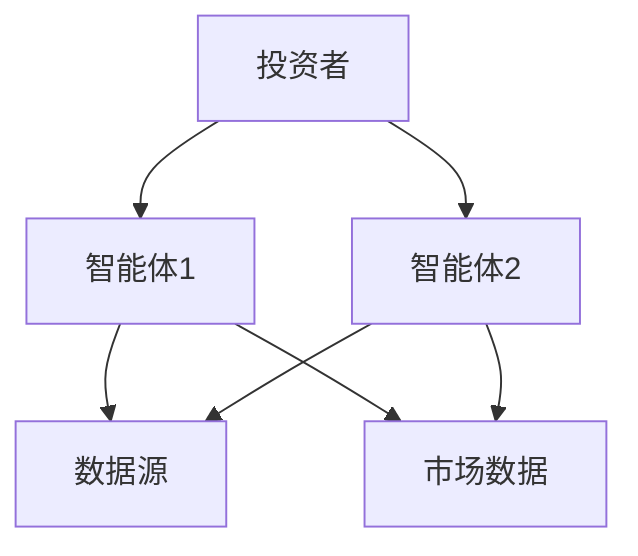
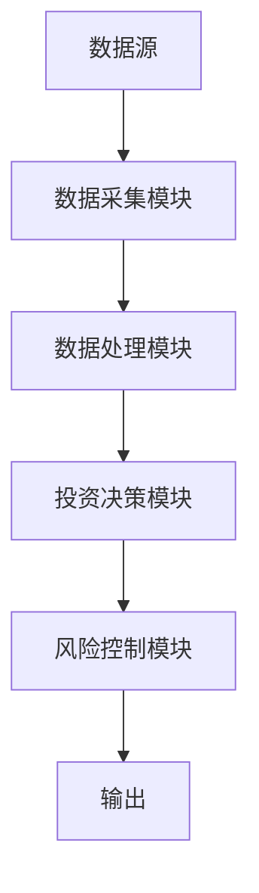
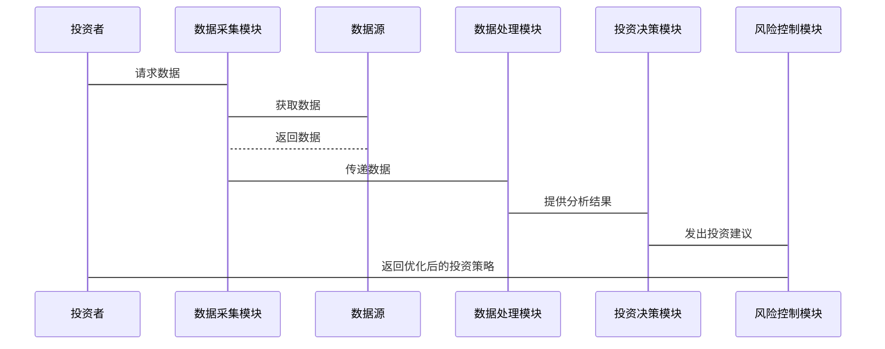

                 


```markdown
# AI多智能体如何优化价值投资的长期股东回报策略

> 关键词：AI多智能体，价值投资，长期股东回报，投资策略，AI优化

> 摘要：本文探讨了如何利用AI多智能体技术优化价值投资策略，以提升长期股东回报。通过分析多智能体系统的核心原理、价值投资的分析框架以及AI在投资决策中的应用，提出了基于多智能体的优化算法和系统架构设计。结合实际案例，展示了如何通过AI技术实现投资策略的智能化和高效化。

---

## 第一部分: AI多智能体与价值投资的背景介绍

### 第1章: 问题背景与问题描述

#### 1.1 问题背景
- 传统价值投资依赖于人工分析和经验判断，存在效率低、决策滞后等问题。
- 随着金融市场数据的爆炸式增长，传统方法难以处理海量信息。
- AI技术的快速发展为金融投资带来了新的可能性。

#### 1.2 问题描述
- 价值投资的核心在于发现被低估的股票，但需要综合分析财务数据、市场趋势和行业动态。
- 长期股东回报的优化需要动态调整投资组合，以应对市场变化。
- AI多智能体系统能够通过协作和分工，提高数据处理效率和决策准确性。

#### 1.3 问题解决与边界
- AI多智能体系统通过分工协作，优化投资决策过程。
- 边界：仅限于价值投资策略的优化，不涵盖其他投资方法。

#### 1.4 核心概念与组成
- 多智能体系统：分布式智能、协作机制、通信与协调。
- 价值投资：财务指标分析、行业趋势分析、公司基本面评估。

---

## 第二部分: AI多智能体与价值投资的核心概念

### 第2章: AI多智能体系统原理

#### 2.1 多智能体系统的核心原理
- 分布式智能：多个智能体协同工作，提高整体效率。
- 协作机制：通过任务分配和信息共享，实现目标一致性。
- 通信与协调：智能体之间的信息传递和协同决策。

#### 2.2 价值投资的分析框架
- 财务指标分析：如市盈率、市净率等。
- 行业趋势分析：如行业周期、政策影响。
- 公司基本面评估：如盈利能力、管理团队等。

#### 2.3 AI多智能体与价值投资的联系
- 数据处理：多智能体系统高效处理大量数据。
- 投资决策：多智能体协作优化投资组合。
- 风险控制：多智能体实时监控市场风险。

### 第3章: AI多智能体与价值投资的核心要素

#### 3.1 AI多智能体的实体关系图


#### 3.2 价值投资的关键要素
- 财务数据：如收入、利润、资产负债表。
- 市场数据：如股价、成交量、市场指数。
- 公司信息：如管理层、公司新闻、行业报告。

#### 3.3 长期股东回报的优化目标
- 最大化投资组合收益。
- 控制投资风险。
- 提高投资决策的效率。

---

## 第三部分: AI多智能体优化价值投资的算法原理

### 第4章: 基于多智能体的优化算法

#### 4.1 多智能体协作算法
- 分工协作：每个智能体负责不同的任务。
- 信息共享：通过通信模块共享数据和决策。
- 协调机制：通过协商和调整实现目标一致。

#### 4.2 强化学习算法
- Q-learning算法：通过状态、动作和奖励优化决策。
- 算法公式：
  ```
  Q(s, a) = Q(s, a) + α [r + γ max Q(s', a') - Q(s, a)]
  ```
  其中，α是学习率，γ是折扣因子。

#### 4.3 博弈论模型
- 纳什均衡：通过博弈论优化投资组合。
- 竞争与合作：多智能体在市场中的博弈行为。

### 第5章: 算法实现与案例分析

#### 5.1 多智能体协作算法的实现
- Python代码示例：
  ```python
  import numpy as np

  class Agent:
      def __init__(self, id):
          self.id = id
          self.state = None
          self.action = None

      def receive_info(self, info):
          self.state = info

      def decide_action(self):
          # 简单示例：随机选择动作
          self.action = np.random.choice(['buy', 'sell', 'hold'])

  # 创建多个智能体
  agents = [Agent(i) for i in range(5)]
  
  # 模拟数据传递
  for agent in agents:
      agent.receive_info({'price': 100, 'volume': 200})
      agent.decide_action()
  ```

#### 5.2 案例分析
- 案例背景：某公司股票分析。
- 数据处理：多智能体分别分析财务数据、市场数据、公司信息。
- 决策过程：通过协作优化投资策略。
- 结果展示：投资组合的收益和风险对比。

---

## 第四部分: 系统分析与架构设计

### 第6章: 系统功能设计

#### 6.1 系统功能模块
- 数据采集模块：从多个数据源获取信息。
- 数据处理模块：清洗、转换和分析数据。
- 投资决策模块：基于多智能体算法生成投资策略。
- 风险控制模块：实时监控和调整投资组合。

#### 6.2 系统功能流程
- 从数据采集到投资决策的完整流程。
- 每个模块的功能说明和交互关系。

### 第7章: 系统架构设计

#### 7.1 系统架构图


#### 7.2 系统交互图


---

## 第五部分: 项目实战与总结

### 第8章: 项目实战

#### 8.1 环境安装
- 安装Python、NumPy、Scikit-learn等依赖库。
- 安装多智能体协作框架（如Multi-Agent Framework）。

#### 8.2 核心代码实现
- 多智能体协作的Python代码实现。
- 强化学习算法的具体实现。

#### 8.3 案例分析与解读
- 实际案例：某公司股票的投资决策过程。
- 代码实现：展示如何通过多智能体优化投资策略。
- 结果分析：对比传统方法和AI优化方法的收益与风险。

### 第9章: 总结与展望

#### 9.1 最佳实践
- 数据质量的重要性。
- 算法选择的策略。
- 系统优化的建议。

#### 9.2 小结
- 本文提出了基于AI多智能体的优化算法，验证了其在价值投资中的有效性。

#### 9.3 注意事项
- 数据隐私和安全问题。
- 算法的可解释性问题。
- 系统的实时性和稳定性。

#### 9.4 未来展望
- 更复杂的多智能体协作算法。
- 结合其他AI技术（如深度学习）优化投资策略。
- 更广泛的应用场景。

---

## 作者信息

作者：AI天才研究院/AI Genius Institute & 禅与计算机程序设计艺术 /Zen And The Art of Computer Programming
```

