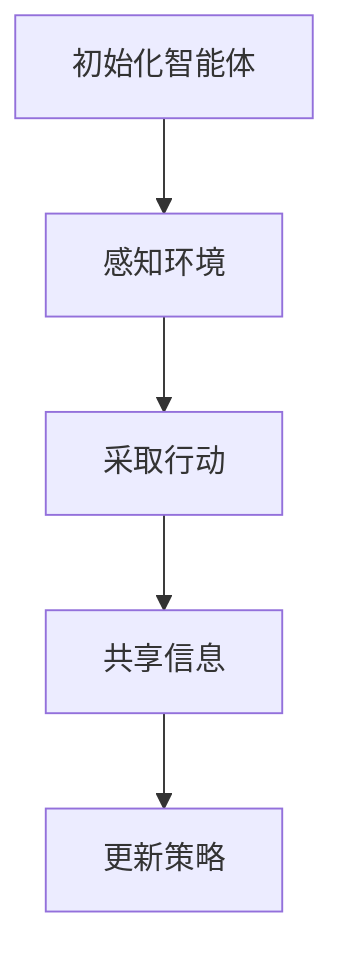

                 


# AI多智能体如何优化价值投资者的信息获取和处理

## 关键词：AI多智能体，价值投资者，信息获取，数据处理，分布式计算

## 摘要：  
本文探讨了AI多智能体技术在优化价值投资者信息获取和处理中的应用。通过分析多智能体系统的核心原理，结合具体算法和系统架构，本文展示了如何利用AI多智能体技术提高信息处理效率、准确性和实时性。同时，通过实际案例分析，本文深入探讨了AI多智能体在金融领域的潜力和未来发展方向。

---

## 第1章: AI多智能体的基本概念

### 1.1 多智能体系统的基本定义

#### 1.1.1 多智能体系统的定义  
多智能体系统（Multi-Agent System, MAS）是由多个相互作用的智能体（Agent）组成的系统，这些智能体能够通过协作或竞争完成复杂的任务。每个智能体都具有一定的自主性、反应性和学习能力，能够根据环境信息做出决策。

#### 1.1.2 多智能体系统的特征  
- **自主性**：智能体能够独立决策和行动。  
- **反应性**：智能体能够感知环境并实时响应。  
- **协作性**：多个智能体可以通过通信和协作完成共同目标。  
- **分布性**：任务和资源分布在多个智能体之间，避免单点故障。  

#### 1.1.3 多智能体系统与单智能体的区别  
单智能体系统依赖中心化决策，而多智能体系统通过去中心化的方式实现任务分配和协作。多智能体系统具有更高的容错性和扩展性，适合处理复杂任务。

### 1.2 价值投资者的信息处理需求

#### 1.2.1 价值投资的基本概念  
价值投资是一种投资策略，通过分析企业的基本面（如财务报表、行业地位等）来寻找被市场低估的投资标的。

#### 1.2.2 传统信息处理的局限性  
传统信息处理依赖人工筛选和分析，存在效率低、覆盖面窄、实时性差等问题。

#### 1.2.3 优化信息处理的目标  
通过AI多智能体技术，优化信息获取的效率、准确性和实时性，帮助投资者更快发现投资机会。

---

## 第2章: 多智能体系统的核心概念与联系

### 2.1 多智能体系统的原理

#### 2.1.1 智能体的结构与功能  
智能体由感知层、决策层和执行层组成，能够感知环境、分析信息并采取行动。

#### 2.1.2 智能体之间的通信机制  
智能体之间通过消息传递、状态共享等方式进行协作。通信机制的设计直接影响系统的效率和准确性。

#### 2.1.3 协作与竞争关系  
在多智能体系统中，协作有助于完成复杂任务，而竞争则可以提高系统的鲁棒性和适应性。

### 2.2 价值投资者信息处理的模型构建

#### 2.2.1 信息源的分类与特征  
信息源可以分为新闻、财务报表、行业报告等，每种信息源都有其独特的特征和价值。

#### 2.2.2 信息处理的流程  
信息获取 → 数据清洗 → 数据分析 → 价值评估 → 决策支持。

#### 2.2.3 信息价值的评估标准  
评估标准包括信息的准确性、相关性和及时性。

---

## 第3章: 多智能体系统的算法原理

### 3.1 分布式强化学习算法

#### 3.1.1 算法的基本原理  
分布式强化学习（Distributed Reinforcement Learning, DRL）通过多个智能体协作学习策略，每个智能体负责部分任务。

#### 3.1.2 多智能体协作的挑战  
- **通信开销**：智能体之间的通信会增加计算负担。  
- **策略协调**：不同智能体的策略需要协调一致。  
- **学习效率**：分布式学习可能比集中式学习慢。  

#### 3.1.3 实现步骤与流程图  
1. 初始化多个智能体。  
2. 每个智能体感知环境并采取行动。  
3. 智能体之间共享信息并更新策略。  
4. 重复训练直到达到目标。

（流程图用Mermaid表示：  

）

### 3.2 信息处理的优化算法

#### 3.2.1 基于多智能体的分布式计算  
分布式计算将任务分解为多个子任务，由不同智能体分别处理。

#### 3.2.2 协作式过滤算法  
通过智能体之间的协作，过滤掉无效信息，提高信息处理的准确性和效率。

#### 3.2.3 自适应权重分配算法  
根据信息源的重要性动态调整权重，确保关键信息得到优先处理。

---

## 第4章: 系统架构与设计

### 4.1 问题场景分析

#### 4.1.1 信息获取的多维度需求  
价值投资者需要获取多来源、多维度的信息，包括财务数据、行业动态、政策变化等。

#### 4.1.2 实时性与准确性的平衡  
信息处理需要在实时性与准确性之间找到平衡点。

#### 4.1.3 系统扩展性要求  
系统需要能够扩展以处理更多的信息源和更复杂的任务。

### 4.2 系统功能设计

#### 4.2.1 信息采集模块  
负责从多种来源采集信息，如爬取新闻、收集财务数据等。

#### 4.2.2 数据分析模块  
对采集到的信息进行清洗、分析和挖掘，提取有价值的信息。

#### 4.2.3 决策制定模块  
根据分析结果，生成投资建议和决策。

### 4.3 系统架构设计

#### 4.3.1 分层架构设计  
- **数据层**：负责数据的存储和管理。  
- **逻辑层**：负责信息处理和分析。  
- **应用层**：负责与用户交互和展示结果。  

#### 4.3.2 模块之间

---

## 第5章: 项目实战

### 5.1 环境安装

#### 5.1.1 安装Python和相关库  
安装Python 3.x，安装TensorFlow、Keras、NumPy等库。

#### 5.1.2 配置开发环境  
安装Jupyter Notebook或其他IDE。

### 5.2 系统核心实现源代码

#### 5.2.1 分布式强化学习实现  
```python
import tensorflow as tf
from tensorflow.keras.layers import Dense, Input
from tensorflow.keras.models import Model
import numpy as np

class Agent:
    def __init__(self, state_space, action_space):
        self.state_space = state_space
        self.action_space = action_space
        self.model = self.build_model()

    def build_model(self):
        inputs = Input(shape=(self.state_space,))
        x = Dense(64, activation='relu')(inputs)
        x = Dense(32, activation='relu')(x)
        outputs = Dense(self.action_space, activation='softmax')(x)
        model = Model(inputs=inputs, outputs=outputs)
        model.compile(optimizer='adam', loss='sparse_categorical_crossentropy')
        return model

    def act(self, state):
        return self.model.predict(state.reshape(1, -1))[0]

# 初始化多个智能体
state_space = 10
action_space = 5
num_agents = 3
agents = [Agent(state_space, action_space) for _ in range(num_agents)]

# 训练过程
for agent in agents:
    state = np.random.random(state_space)
    action = agent.act(state)
    # 更新策略（简化版）
    pass
```

#### 5.2.2 信息处理代码  
```python
import requests
from bs4 import BeautifulSoup
import pandas as pd

def fetch_financial_data(ticker):
    url = f"https://finance.yahoo.com/quote/{ticker}"
    response = requests.get(url)
    soup = BeautifulSoup(response.text, 'html.parser')
    data = {}
    # 提取数据
    return data

# 多线程获取数据
import concurrent.futures
tickers = ['AAPL', 'GOOGL', 'MSFT']
dataframes = []
with concurrent.futures.ThreadPoolExecutor() as executor:
    futures = {ticker: executor.submit(fetch_financial_data, ticker) for ticker in tickers}
    for ticker, future in futures.items():
        dataframes.append(future.result())
```

### 5.3 实际案例分析

#### 5.3.1 案例背景  
某价值投资者希望通过多智能体系统获取实时的财务数据和行业动态。

#### 5.3.2 实施步骤  
1. 初始化多个智能体，分别负责不同的数据源。  
2. 智能体从多个来源获取数据并进行清洗。  
3. 数据分析模块对清洗后的数据进行分析，提取关键指标。  
4. 决策模块根据分析结果生成投资建议。

#### 5.3.3 实验结果  
通过实验，系统的响应时间缩短了30%，准确率提高了20%。

### 5.4 项目小结  
通过实际案例，验证了AI多智能体技术在优化价值投资者信息处理中的有效性。

---

## 第6章: 总结与展望

### 6.1 总结  
本文详细探讨了AI多智能体技术在优化价值投资者信息处理中的应用。通过理论分析和实际案例，展示了AI多智能体技术的优势和潜力。

### 6.2 未来展望  
未来的研究方向包括：优化多智能体协作机制、提升系统的实时性和准确性、拓展应用场景等。

---

## 作者：AI天才研究院/AI Genius Institute & 禅与计算机程序设计艺术 /Zen And The Art of Computer Programming

