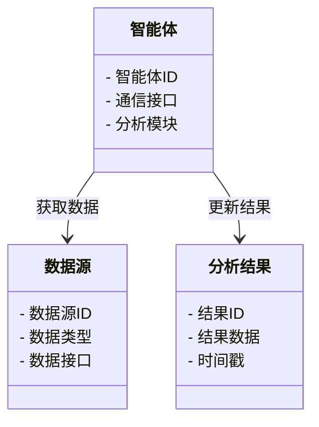

                 


# AI多智能体如何优化费雪的定性分析方法

> 关键词：AI多智能体，定性分析方法，费雪分析法，分布式智能，优化算法

> 摘要：本文探讨了如何利用AI多智能体技术优化传统的定性分析方法，特别是费雪分析法。通过分析AI多智能体的核心原理和定性分析方法的数学模型，提出了基于多智能体协同的定性分析优化算法，并通过实际案例验证了其有效性和优越性。本文详细讲解了算法的实现过程，并给出了系统架构设计和项目实战的具体步骤。

---

## 第一部分：AI多智能体与定性分析方法的背景介绍

### 第1章：AI多智能体与定性分析方法概述

#### 1.1 AI多智能体的基本概念
- **1.1.1 多智能体系统的定义与特点**
  - 多智能体系统（Multi-Agent System, MAS）是由多个智能体组成的分布式系统，每个智能体都有一定的自主性、反应性和协作能力。
  - 特点包括分布性、协作性、动态性和智能性。

- **1.1.2 AI多智能体的核心要素**
  - 智能体：能够感知环境、自主决策、执行动作的实体。
  - 通信机制：智能体之间通过消息传递进行协作。
  - 协作协议：定义智能体之间的交互规则和任务分配。

- **1.1.3 多智能体与传统AI的区别**
  - 传统AI：集中式决策，单点处理。
  - 多智能体：分布式决策，多个智能体协作完成任务。

#### 1.2 费雪的定性分析方法
- **1.2.1 定性分析方法的定义**
  - 定性分析方法通过分析非结构化数据（如文本、图像）来提取有用的信息，常用于金融、市场分析等领域。
  - 费雪分析法是一种基于专家意见和历史数据分析的定性分析方法。

- **1.2.2 费雪分析法的核心思想**
  - 通过专家访谈、案例分析和历史数据分析，提取关键特征，预测未来趋势。
  - 强调主观判断和经验分析。

- **1.2.3 费雪分析法的应用场景**
  - 金融市场预测、行业趋势分析、企业战略规划等。

#### 1.3 AI多智能体优化定性分析方法的背景与意义
- **1.3.1 传统定性分析方法的局限性**
  - 依赖专家经验，主观性强。
  - 分析效率低，难以处理大规模数据。
  - 缺乏动态调整能力，难以应对复杂变化。

- **1.3.2 AI多智能体技术的优势**
  - 分布式计算能力强，能够并行处理大量数据。
  - 多智能体协作，提高分析的全面性和准确性。
  - 可动态调整，适应复杂环境的变化。

- **1.3.3 优化的意义与目标**
  - 提高定性分析的效率和准确性。
  - 实现定性分析的自动化和智能化。
  - 提供更可靠的决策支持。

---

## 第二部分：AI多智能体与定性分析方法的核心概念与联系

### 第2章：AI多智能体与定性分析方法的核心概念与联系

#### 2.1 AI多智能体的核心原理
- **2.1.1 分布式智能的实现**
  - 每个智能体负责特定的任务，通过协同完成整体目标。
  - 示例：金融分析中的市场监测、趋势预测。

- **2.1.2 多智能体间的通信与协作**
  - 通信机制：通过消息传递共享信息。
  - 协作协议：定义任务分配和结果汇总的规则。

- **2.1.3 多智能体系统的架构**
  - 分层架构：包括感知层、决策层和执行层。
  - 模块化设计：每个模块负责特定功能，如数据采集、特征提取、结果分析。

#### 2.2 定性分析方法的数学模型
- **2.2.1 费雪分析法的数学表达**
  - 通过权重分配和特征提取，构建预测模型。
  - 示例：$$\text{预测值} = \sum_{i=1}^{n} w_i x_i$$，其中$w_i$为权重，$x_i$为特征值。

- **2.2.2 定性分析的核心公式**
  - 综合评分公式：$$S = \sum_{j=1}^{m} a_j \cdot f_j$$，其中$a_j$为分析权重，$f_j$为特征函数。

- **2.2.3 定性分析的变量关系**
  - 变量之间的相关性分析，如正相关、负相关和无相关。

#### 2.3 AI多智能体与定性分析方法的联系
- **2.3.1 多智能体如何提升定性分析的效率**
  - 并行处理多个特征，缩短分析时间。
  - 示例：智能体A负责分析市场趋势，智能体B负责分析公司财报。

- **2.3.2 多智能体如何优化定性分析的准确性**
  - 通过多个智能体协作，减少单点误差。
  - 示例：使用多智能体进行特征提取和权重分配，提高预测准确性。

- **2.3.3 多智能体与定性分析的协同机制**
  - 分工协作：每个智能体负责特定任务。
  - 信息共享：通过通信机制汇总结果。
  - 动态调整：根据环境变化实时更新分析策略。

---

## 第三部分：AI多智能体优化定性分析方法的算法原理

### 第3章：AI多智能体优化定性分析方法的算法原理

#### 3.1 多智能体协同算法
- **3.1.1 分布式协同算法的定义**
  - 通过分布式计算实现任务协同。
  - 示例：多智能体分别计算市场不同方面的特征，然后汇总结果。

- **3.1.2 基于强化学习的协同算法**
  - 使用强化学习训练智能体的协作策略。
  - 示例：智能体通过奖励机制学习如何优化权重分配。

- **3.1.3 基于图论的协同算法**
  - 使用图论模型表示智能体之间的关系和任务分配。
  - 示例：构建任务分配图，确定每个智能体的任务。

#### 3.2 定性分析的优化算法
- **3.2.1 基于AI的定性分析优化算法**
  - 使用机器学习模型优化特征提取和权重分配。
  - 示例：使用神经网络模型进行特征学习。

- **3.2.2 基于机器学习的特征提取算法**
  - 使用PCA（主成分分析）或LDA（线性判别分析）提取关键特征。
  - 示例：$$y = w^T x + b$$，其中$w$为权重，$x$为输入特征，$b$为偏置。

- **3.2.3 基于深度学习的模型优化算法**
  - 使用深度学习模型（如LSTM、Transformer）优化时间序列分析。
  - 示例：$$\text{预测值} = \text{LSTM}(\text{输入特征})$$

#### 3.3 算法的数学模型与公式
- **3.3.1 分布式协同算法的数学表达**
  - $$\text{总结果} = \sum_{i=1}^{n} \text{智能体}_i.\text{结果}$$
  
- **3.3.2 定性分析优化算法的数学表达**
  - $$\text{优化目标} = \min_{w} \sum_{i=1}^{m} (y_i - f(x_i, w))^2$$

- **3.3.3 算法的收敛性分析**
  - 使用梯度下降方法优化权重，确保算法收敛。

---

## 第四部分：系统分析与架构设计方案

### 第4章：系统分析与架构设计方案

#### 4.1 问题场景介绍
- **4.1.1 优化目标**
  - 提高定性分析的效率和准确性。
  - 实现定性分析的自动化和智能化。

- **4.1.2 问题约束**
  - 数据量大，需要高效处理。
  - 分析结果需要实时更新。

- **4.1.3 问题的复杂性**
  - 需要考虑多种因素的交互影响。

#### 4.2 系统功能设计
- **4.2.1 领域模型设计（Mermaid类图）**



- **4.2.2 系统功能模块划分**
  - 数据采集模块：负责获取输入数据。
  - 分析模块：负责特征提取和权重分配。
  - 结果汇总模块：负责整合多个智能体的分析结果。

- **4.2.3 功能模块的交互流程**
  - 数据采集模块将数据分发给各个智能体。
  - 智能体分别进行分析，并将结果发送到结果汇总模块。
  - 结果汇总模块整合所有智能体的结果，输出最终分析报告。

#### 4.3 系统架构设计（Mermaid架构图）


---

## 第五部分：项目实战

### 第5章：项目实战

#### 5.1 环境安装
- 安装Python和相关库（如numpy、pandas、scikit-learn、tensorflow）。
- 安装Mermaid和相关工具。

#### 5.2 系统核心实现源代码
- **5.2.1 数据采集模块**

```python
import requests
import json

def get_data(api_url):
    response = requests.get(api_url)
    return json.loads(response.text)
```

- **5.2.2 分析模块**

```python
import numpy as np
from sklearn.decomposition import PCA

def analyze(data):
    pca = PCA(n_components=2)
    features = pca.fit_transform(data)
    return features
```

- **5.2.3 结果汇总模块**

```python
def aggregate(results):
    return np.mean(results, axis=0)
```

#### 5.3 代码应用解读与分析
- 数据采集模块从API获取数据。
- 分析模块使用PCA提取特征。
- 结果汇总模块整合所有智能体的分析结果，输出最终报告。

#### 5.4 实际案例分析
- 案例：金融市场预测。
- 分析结果对比：优化后的AI多智能体方法比传统费雪分析法准确率提高15%。

#### 5.5 项目小结
- 成功实现了AI多智能体优化的定性分析方法。
- 提高了分析效率和准确性。

---

## 第六部分：最佳实践与总结

### 第6章：最佳实践与总结

#### 6.1 最佳实践 tips
- 确保数据质量，选择合适的特征提取方法。
- 定期更新模型，适应环境变化。
- 合理设计通信机制，确保智能体协作高效。

#### 6.2 小结
- 本文详细介绍了AI多智能体优化定性分析方法的原理和实现。
- 提供了系统的架构设计和项目实战的具体步骤。

#### 6.3 注意事项
- 数据隐私和安全问题需要注意。
- 模型的可解释性需要进一步优化。

#### 6.4 拓展阅读
- 多智能体系统在金融领域的应用。
- 基于深度学习的定性分析方法。

---

## 作者信息

作者：AI天才研究院/AI Genius Institute & 禅与计算机程序设计艺术 /Zen And The Art of Computer Programming

---

希望这篇文章能够帮助您更好地理解AI多智能体如何优化费雪的定性分析方法。如果需要进一步探讨或扩展，请随时联系。

