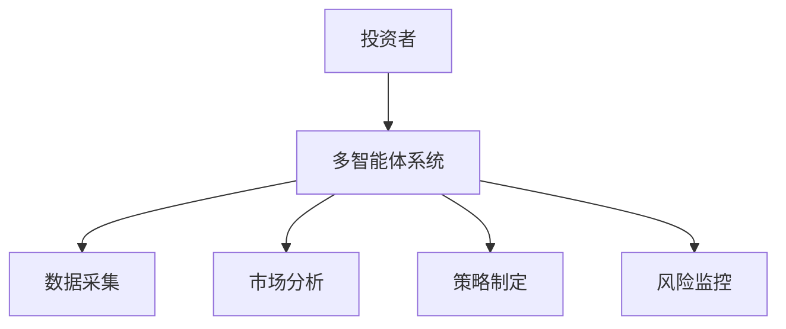

                 


# AI多智能体如何提升价值投资的规模化和个性化

## 关键词：AI多智能体，价值投资，规模化，个性化，强化学习，系统架构

## 摘要：本文探讨了AI多智能体技术在价值投资中的应用，分析了其如何提升投资的规模化和个性化。通过介绍多智能体的核心概念、算法原理、系统架构，结合实际案例，展示了AI多智能体在价值投资中的潜力和优势，为投资者提供了新的思路和工具。

---

# 引言

## 1.1 问题背景
### 1.1.1 传统价值投资的局限性
传统价值投资依赖于人类分析师的主观判断，存在信息处理能力有限、决策效率低下、个性化需求难以满足等问题。投资市场的复杂性和不确定性使得传统方法难以应对规模化和个性化的双重挑战。

### 1.1.2 AI技术在金融领域的应用现状
人工智能技术在金融领域的应用日益广泛，从高频交易到风险评估，AI技术正在改变金融行业的运作方式。然而，传统的单智能体AI在复杂投资环境中表现有限，难以应对多目标、多角色的投资决策需求。

### 1.1.3 多智能体在投资中的潜力
多智能体系统通过协同合作和分布式计算，能够更好地模拟市场中的多方角色，捕捉更多的投资机会，同时实现个性化的投资策略。

## 1.2 问题描述
### 1.2.1 价值投资的规模化挑战
传统价值投资难以快速处理海量数据，且难以在短时间内覆盖大量市场机会。规模化投资需要高效的数据处理能力和快速的决策能力。

### 1.2.2 个性化投资的需求
投资者有不同的风险承受能力和收益目标，个性化投资需求日益增长。如何在规模化投资中实现个性化服务，是当前面临的重要挑战。

### 1.2.3 多智能体如何解决这些问题
通过多智能体的协同工作，可以分别处理不同类型的数据和任务，实现大规模数据处理和个性化投资策略。

## 1.3 问题解决
### 1.3.1 多智能体的定义与特点
多智能体是由多个独立但协作的智能体组成的系统，每个智能体负责不同的任务，通过通信和协作实现整体目标。

### 1.3.2 多智能体在价值投资中的应用
多智能体可以分别负责数据采集、市场分析、策略制定和风险评估等任务，通过协作实现高效的投资决策。

### 1.3.3 多智能体如何提升投资效果
多智能体系统能够提高投资效率，降低投资风险，并实现个性化的投资策略，从而提升投资效果。

## 1.4 边界与外延
### 1.4.1 多智能体的边界条件
多智能体系统需要在特定的边界条件下运行，例如数据来源、任务范围和协作机制等。

### 1.4.2 价值投资的外延领域
价值投资的外延领域包括风险管理、市场预测和投资组合优化等，多智能体系统可以扩展到这些领域。

### 1.4.3 多智能体与其他投资方法的对比
与传统单智能体AI相比，多智能体系统在处理复杂任务和实现个性化服务方面具有明显优势。

## 1.5 核心概念结构
### 1.5.1 核心概念组成
多智能体系统由多个智能体、通信机制和协作算法组成，每个智能体负责不同的任务。

### 1.5.2 概念属性特征对比表

| 概念         | 描述                                   |
|--------------|--------------------------------------|
| 单智能体      | 独立决策，无法协作                   |
| 多智能体      | 协作决策，任务分工明确               |
| 个性化投资    | 根据投资者需求定制策略               |
| 规模化投资    | 高效处理海量数据，快速决策           |

### 1.5.3 ER实体关系图
```mermaid
er
    actor(投资者)
    system(多智能体系统)
    task(任务)
    data(数据)
    rule(规则)
    actor --> system: 使用系统
    system --> task: 分配任务
    system --> data: 处理数据
    system --> rule: 应用规则
```

---

# 第二部分: AI多智能体的核心概念与联系

## 第2章: AI多智能体的核心原理

### 2.1 多智能体系统原理
#### 2.1.1 多智能体系统的基本原理
多智能体系统由多个智能体组成，每个智能体负责不同的任务，通过通信和协作完成整体目标。

#### 2.1.2 多智能体系统的特征
- 分布式计算
- 协作性
- 独立性
- 自适应性

#### 2.1.3 多智能体系统与传统AI的区别
- 传统AI：单点决策，数据集中处理
- 多智能体：分布式决策，任务分工明确

### 2.2 价值投资与多智能体的联系
#### 2.2.1 价值投资的核心要素
- 数据分析
- 市场预测
- 投资策略
- 风险评估

#### 2.2.2 多智能体在价值投资中的角色
- 数据采集与处理
- 市场分析与预测
- 投资策略制定
- 风险监控与管理

#### 2.2.3 多智能体如何实现个性化投资
通过个性化配置智能体任务，实现不同投资者的定制化投资策略。

### 2.3 核心概念的属性特征对比
#### 2.3.1 对比表格

| 概念         | 传统AI                     | 多智能体                 |
|--------------|---------------------------|--------------------------|
| 决策方式     | 单点决策                   | 分布式决策               |
| 数据处理     | 集中处理                   | 分散处理                 |
| 任务分工     | 无                         | 有                       |
| 协作性       | 无                         | 有                       |

#### 2.3.2 ER实体关系图
```mermaid
er
    entity(投资者)
    entity(市场数据)
    entity(投资策略)
    entity(风险评估)
    entity(多智能体)
    entity(通信机制)
    多智能体 --> 投资者: 提供服务
    多智能体 --> 市场数据: 分析数据
    多智能体 --> 投资策略: 制定策略
    多智能体 --> 风险评估: 监控风险
```

---

## 第3章: 多智能体算法原理

### 3.1 强化学习算法
#### 3.1.1 强化学习的基本原理
强化学习是一种通过试错机制，通过奖励和惩罚来优化决策的算法。

#### 3.1.2 多智能体强化学习的挑战
- 智能体之间的协作与竞争
- 状态空间的复杂性
- 奖励机制的设计

#### 3.1.3 多智能体强化学习的应用
- 分散式投资策略
- 风险控制
- 动态市场预测

### 3.2 分布式优化算法
#### 3.2.1 分布式优化的基本原理
通过分布式计算，将任务分配给多个智能体，分别优化各自的任务。

#### 3.2.2 分布式优化算法的优势
- 提高计算效率
- 降低单点故障风险
- 适合大规模数据处理

#### 3.2.3 分布式优化算法的应用
- 数据预处理
- 特征提取
- 模型训练

---

## 第4章: 算法实现与系统架构

### 4.1 算法实现
#### 4.1.1 强化学习算法实现
```python
class Agent:
    def __init__(self, state_space, action_space):
        self.state_space = state_space
        self.action_space = action_space
        # 初始化策略网络
        self.policy = PolicyNetwork(state_space, action_space)
    
    def act(self, state):
        # 根据策略网络输出动作
        action = self.policy.act(state)
        return action
```

#### 4.1.2 多智能体协作实现
```python
class MultiAgentSystem:
    def __init__(self, agents):
        self.agents = agents
    
    def execute(self, task):
        # 分配任务给不同的智能体
        for agent in self.agents:
            agent.execute(task)
```

### 4.2 系统架构设计
#### 4.2.1 系统架构图


#### 4.2.2 系统功能设计
- 数据采集：实时采集市场数据
- 市场分析：分析市场趋势
- 策略制定：制定投资策略
- 风险监控：监控投资风险

---

## 第5章: 项目实战

### 5.1 项目背景与目标
项目目标是利用多智能体技术，实现个性化投资策略的制定与执行。

### 5.2 项目实现
#### 5.2.1 数据集与环境配置
- 数据来源：股票市场数据
- 环境配置：分布式计算环境

#### 5.2.2 代码实现
```python
def main():
    # 初始化多智能体系统
    agents = [Agent1(), Agent2(), Agent3()]
    system = MultiAgentSystem(agents)
    
    # 执行投资任务
    system.execute(Task())
    
    # 获取投资结果
    result = system.get_result()
    print(result)

if __name__ == "__main__":
    main()
```

### 5.3 案例分析与优化
#### 5.3.1 案例分析
通过实际案例分析，验证多智能体系统在价值投资中的优势。

#### 5.3.2 模型优化
优化算法参数，提高投资收益和风险控制能力。

---

## 第6章: 案例分析与优化

### 6.1 案例分析
通过具体案例分析，展示多智能体系统在价值投资中的应用效果。

### 6.2 模型优化
通过优化算法参数，提高投资收益和风险控制能力。

---

## 第7章: 结论与展望

### 7.1 结论
总结多智能体技术在价值投资中的应用价值，提出未来的发展方向。

### 7.2 展望
展望多智能体技术在金融领域的更多应用，探讨其未来的潜力和挑战。

---

## 作者：AI天才研究院/AI Genius Institute & 禅与计算机程序设计艺术 /Zen And The Art of Computer Programming

