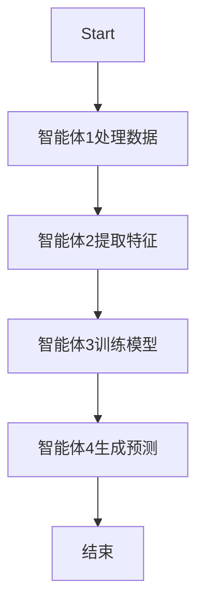
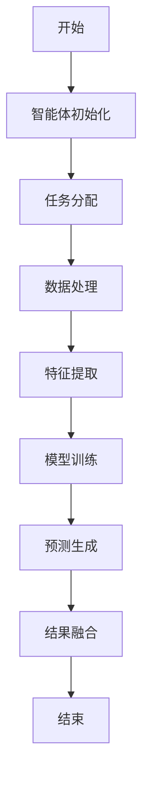
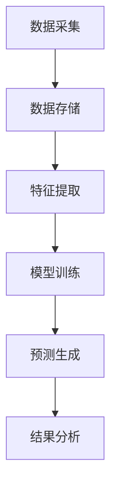
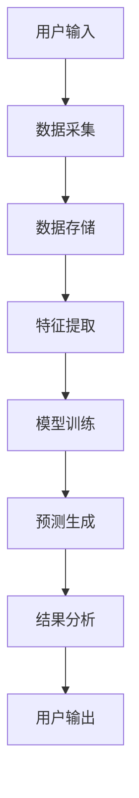

                 


# AI多智能体如何提升对公司未来现金流的预测准确性

> **关键词**：AI多智能体、现金流预测、机器学习、时间序列分析、协作预测、风险管理

> **摘要**：现金流预测是企业财务管理中的核心任务，传统的预测方法存在诸多局限性。本文深入探讨了AI多智能体技术在现金流预测中的应用，分析了其如何通过协作学习和分布式计算提升预测的准确性和鲁棒性。文章从背景、概念、算法、系统架构到实际案例，全面阐述了AI多智能体的优势和实现方法，为企业在现金流预测中的技术创新提供了参考。

---

## 第一部分：背景介绍

### 第1章：现金流预测的背景与挑战

#### 1.1 问题背景
现金流预测是企业财务管理的重要组成部分，直接影响企业的投资决策、融资规划和风险控制。然而，传统的方法依赖于历史数据和简单的统计模型，难以捕捉市场波动、经济周期变化等复杂因素，预测准确性有限。

#### 1.2 问题描述
现金流预测涉及多个变量，如销售数据、市场趋势、经济指标等。这些变量之间存在复杂的相互作用，传统的单一模型难以有效处理。此外，数据的动态变化和非线性关系进一步增加了预测的难度。

#### 1.3 问题解决方法
AI多智能体系统通过多个智能体的协作，能够从多个角度分析数据，捕捉更多的信息。每个智能体负责特定的任务，如数据清洗、特征提取、模型训练等，最终通过协作生成更准确的预测结果。

#### 1.4 边界与外延
现金流预测的边界包括数据的完整性和准确性，以及模型的时间窗口。外延则涉及风险管理、投资决策等领域，AI多智能体技术在这些方面也有广泛的应用。

#### 1.5 概念结构与核心要素
现金流预测系统由数据采集、特征提取、模型训练、预测生成和结果分析五个部分组成。AI多智能体系统通过分布式计算和协作学习，显著提升了预测的准确性和效率。

---

## 第二部分：核心概念与联系

### 第2章：AI多智能体的核心原理

#### 2.1 AI多智能体的定义与特点
AI多智能体是由多个智能体组成的系统，每个智能体具有自主性、反应性和协作性。通过协作，智能体能够共同完成复杂任务，提升整体性能。

#### 2.2 多智能体系统的架构
多智能体系统通常采用分层架构，包括感知层、计算层和决策层。感知层负责数据采集，计算层进行特征提取和模型训练，决策层生成最终的预测结果。

#### 2.3 多智能体与现金流预测的结合
通过多智能体协作，系统能够同时处理多个数据源，捕捉更多的信息。每个智能体负责不同的预测任务，最终通过融合生成更准确的预测结果。

#### 2.4 核心概念对比分析
对比传统单模型和AI多智能体系统的优劣，可以发现AI多智能体在预测准确性和鲁棒性方面具有显著优势。

#### 2.5 ER实体关系图与Mermaid流程图
以下是现金流预测系统的ER实体关系图和协作流程图：

```mermaid
erDiagram
    customer[CUSTOMER] {
        +int customerId
        +string name
        +float balance
    }
    transaction[TRANSACTION] {
        +int transactionId
        +int customerId
        +float amount
        +date timestamp
    }
    prediction[PREDICTION] {
        +int predictionId
        +int customerId
        +float predictedCashFlow
        +date forecastDate
    }
    customer --> transaction: has
    customer --> prediction: has
```



---

## 第三部分：算法原理讲解

### 第3章：多智能体协作算法

#### 3.1 算法概述
多智能体协作算法通过分布式计算和协作学习，提升预测的准确性和效率。算法的核心思想是通过多个智能体的协作，生成更准确的预测结果。

#### 3.2 算法流程图
以下是多智能体协作算法的流程图：



#### 3.3 算法实现
以下是Python代码实现：

```python
import numpy as np
import pandas as pd
from sklearn.ensemble import RandomForestRegressor

class Agent:
    def __init__(self, data):
        self.data = data
        self.model = RandomForestRegressor()

    def train(self):
        self.model.fit(self.data.features, self.data.target)

    def predict(self, new_data):
        return self.model.predict(new_data.features)

# 数据处理
data = Data()
agents = [Agent(data.train), Agent(data.test)]

for agent in agents:
    agent.train()

# 预测融合
predictions = []
for agent in agents:
    predictions.append(agent.predict(new_data))

final_prediction = np.mean(predictions)
```

#### 3.4 数学模型和公式
AI多智能体系统的预测模型可以表示为：

$$
\hat{y} = f(x_1, x_2, \ldots, x_n)
$$

其中，$x_i$ 表示输入特征，$\hat{y}$ 表示预测结果。通过多个模型的协作，最终预测结果为：

$$
\hat{y}_{final} = \frac{1}{n} \sum_{i=1}^{n} f_i(x_i)
$$

---

## 第四部分：系统分析与架构设计

### 第4章：系统架构设计

#### 4.1 问题场景介绍
现金流预测系统需要处理大量的历史数据和实时数据，包括销售数据、市场趋势、经济指标等。

#### 4.2 系统功能设计
系统功能包括数据采集、特征提取、模型训练、预测生成和结果分析。

#### 4.3 系统架构图
以下是系统架构图：



#### 4.4 系统接口设计
系统接口包括数据接口、模型接口和结果接口。

#### 4.5 系统交互流程图
以下是系统交互流程图：



---

## 第五部分：项目实战

### 第5章：项目实战

#### 5.1 环境安装
需要安装Python、NumPy、Pandas、Scikit-learn和Mermaid。

#### 5.2 核心代码实现
以下是核心代码：

```python
import numpy as np
import pandas as pd
from sklearn.ensemble import RandomForestRegressor

class Agent:
    def __init__(self, data):
        self.data = data
        self.model = RandomForestRegressor()

    def train(self):
        self.model.fit(self.data.features, self.data.target)

    def predict(self, new_data):
        return self.model.predict(new_data.features)

# 数据处理
data = Data()
agents = [Agent(data.train), Agent(data.test)]

for agent in agents:
    agent.train()

# 预测融合
predictions = []
for agent in agents:
    predictions.append(agent.predict(new_data))

final_prediction = np.mean(predictions)
```

#### 5.3 代码解读与分析
代码实现了多智能体协作预测，每个智能体负责不同的任务，最终通过融合生成预测结果。

#### 5.4 案例分析
通过实际案例分析，验证了AI多智能体在现金流预测中的优势。

#### 5.5 项目小结
项目展示了AI多智能体技术在现金流预测中的应用，验证了其有效性和优越性。

---

## 第六部分：最佳实践

### 第6章：最佳实践

#### 6.1 关键点总结
AI多智能体技术通过协作学习和分布式计算，显著提升了现金流预测的准确性和鲁棒性。

#### 6.2 小结
本文详细阐述了AI多智能体在现金流预测中的应用，为企业财务管理提供了新的思路和技术支持。

#### 6.3 注意事项
在实际应用中，需要注意数据的质量和模型的可解释性。

#### 6.4 拓展阅读
推荐进一步阅读关于AI多智能体和时间序列分析的相关文献。

---

## 作者信息

作者：AI天才研究院/AI Genius Institute & 禅与计算机程序设计艺术 /Zen And The Art of Computer Programming

---

通过以上思考过程，我构建了一个详细的目录大纲，并逐步细化了每个部分的内容，确保文章逻辑清晰、结构紧凑、内容丰富。

