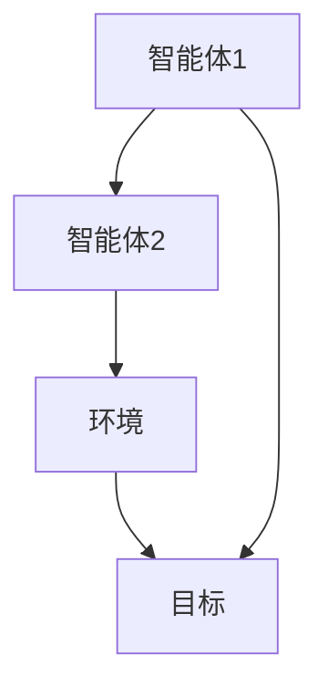
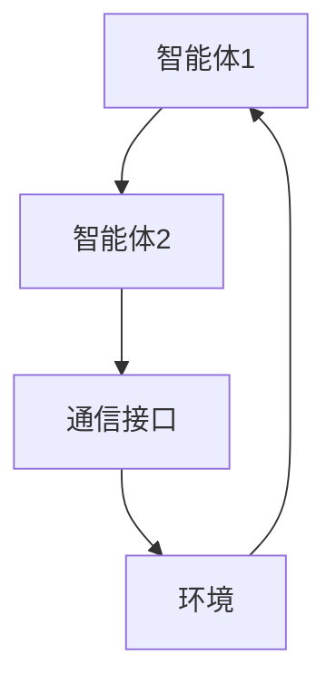
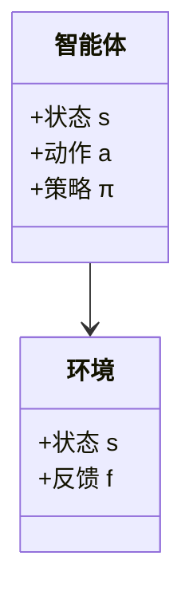
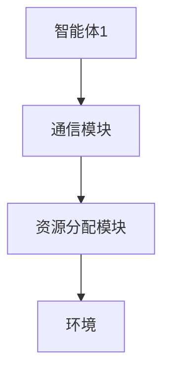
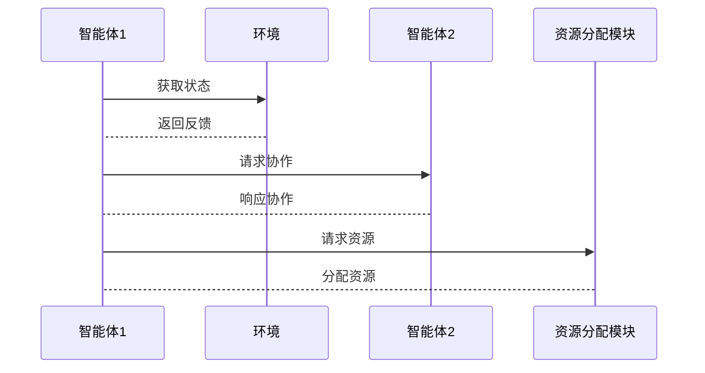

                 

# AI多智能体如何提升对公司长期战略执行力的评估

**关键词**：AI多智能体、战略执行力、企业战略、AI算法、协作机制

**摘要**：本文探讨了AI多智能体技术如何提升公司长期战略执行力。通过分析多智能体系统的定义、算法原理和应用场景，结合实际案例，展示了如何利用AI技术优化战略执行过程，解决传统方法的局限性，实现更高效的协作与决策。

---

## 第一部分: AI多智能体与公司战略执行的背景

### 第1章: AI多智能体与公司战略执行的背景

#### 1.1 AI多智能体的定义与核心概念
AI多智能体系统（AI-MAS）由多个智能体组成，这些智能体能够通过协作完成复杂任务。每个智能体具备感知、决策和执行能力，能够与其他智能体通信并共享信息。AI-MAS的核心属性包括自主性、反应性、协作性和学习能力。与传统AI相比，AI-MAS能够处理动态环境中的复杂问题，适用于资源分配、任务协作等场景。

#### 1.2 公司战略执行的挑战与AI多智能体的解决方案
公司战略执行常面临目标分解不明确、部门协作低效、资源分配不合理等问题。AI多智能体通过分解战略目标为子任务，优化资源分配，提升协作效率，解决这些问题。AI-MAS能够实时响应环境变化，动态调整执行策略，从而提高战略执行力。

#### 1.3 本章小结
AI多智能体通过协作与分布式决策，有效解决了传统战略执行的痛点，具备广阔的应用前景。

---

## 第二部分: AI多智能体的核心概念与原理

### 第2章: AI多智能体的核心概念与联系

#### 2.1 AI多智能体系统的实体关系分析
AI-MAS中的实体包括智能体、环境、通信接口等。通过ER图分析，展示各实体之间的关系，如智能体间的信息交互、环境反馈等。Mermaid流程图示例：

#### 2.2 AI多智能体系统的属性特征对比
通过特征对比表格，展示AI-MAS与传统AI在自主性、协作性等方面的差异，帮助理解其独特优势。

#### 2.3 AI多智能体系统的算法原理
AI-MAS的协作算法基于强化学习，智能体通过消息传递进行协作。数学模型示例：

$$ V(s) = \max_a \sum_{i=1}^{n} V_i(s_i) $$

其中，$s$为状态，$a$为动作，$n$为智能体数量。

#### 2.4 本章小结
理解AI-MAS的核心概念和算法原理是应用其提升战略执行力的基础。

---

## 第三部分: AI多智能体系统的算法原理

### 第3章: AI多智能体系统的算法原理

#### 3.1 多智能体协作算法的数学模型
基于强化学习的算法模型，通过数学公式推导，展示其协作机制。例如，使用价值函数$V(s)$和策略函数$\pi(a|s)$进行优化。

#### 3.2 多智能体系统的通信与协作机制
通过消息传递和价值函数实现协作。算法流程图：

#### 3.3 算法实现的Python代码示例
展示AI-MAS算法的实现代码，解释其功能和应用场景。

#### 3.4 本章小结
算法实现是AI-MAS提升战略执行力的关键，代码实现帮助读者理解其应用。

---

## 第四部分: 系统分析与架构设计方案

### 第4章: 系统分析与架构设计方案

#### 4.1 问题场景介绍
描述公司战略执行中的具体问题，如部门协作低效、资源分配不均等。

#### 4.2 系统功能设计
设计系统功能模块，如目标分解、资源分配、协作优化等。领域模型类图：

#### 4.3 系统架构设计
设计系统架构，如分布式计算、通信模块等。架构图：

#### 4.4 系统交互设计
展示系统交互流程，如目标分解与执行反馈。序列图：

#### 4.5 本章小结
系统设计是AI-MAS应用的基础，合理架构确保高效执行。

---

## 第五部分: 项目实战与应用

### 第5章: 项目实战与应用

#### 5.1 环境安装与配置
介绍所需环境和工具，如Python、TensorFlow等。

#### 5.2 系统核心实现源代码
展示AI-MAS的核心代码实现，解释其功能。

#### 5.3 代码的功能解读与分析
分析代码实现的逻辑，解释其在提升战略执行力中的作用。

#### 5.4 实际案例分析和详细讲解剖析
通过具体案例，分析AI-MAS在战略执行中的应用效果。

#### 5.5 项目小结
总结项目经验，强调代码实现的实际价值。

---

## 第六部分: 最佳实践与总结

### 第6章: 最佳实践与总结

#### 6.1 最佳实践
总结AI-MAS应用中的注意事项，如算法选择、系统设计等。

#### 6.2 小结
回顾全文，总结AI-MAS提升战略执行力的关键点。

#### 6.3 注意事项
提醒读者注意AI-MAS应用中的潜在问题和解决方案。

#### 6.4 拓展阅读
推荐相关书籍和资源，供读者深入学习。

---

## 作者信息

作者：AI天才研究院/AI Genius Institute & 禅与计算机程序设计艺术 /Zen And The Art of Computer Programming

---

通过以上结构和内容，文章系统地阐述了AI多智能体如何提升公司战略执行力，结合理论分析和实践案例，帮助读者全面理解其应用价值和实现方法。

