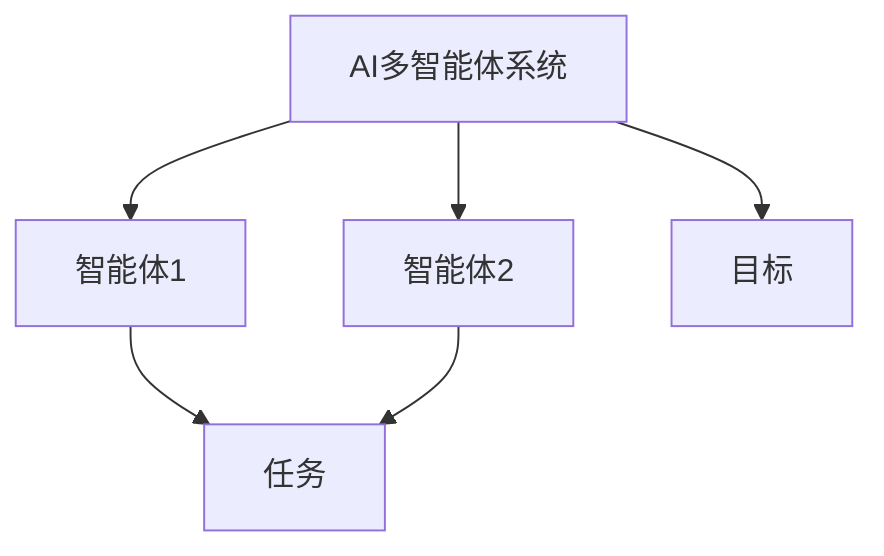
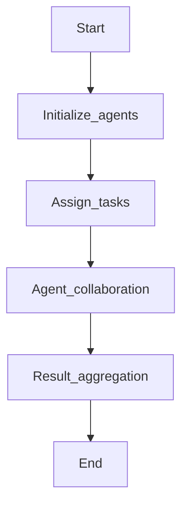
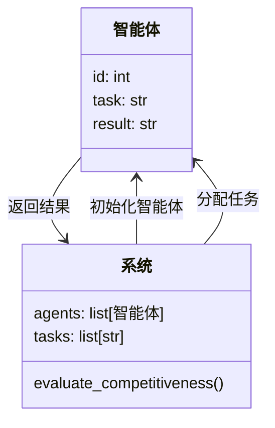
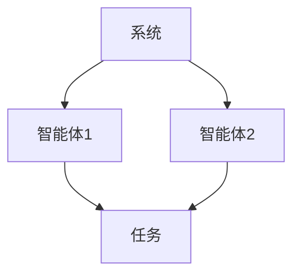

                 


# AI多智能体如何提升对公司长期竞争力的评估

## 关键词

- AI多智能体
- 企业竞争力评估
- 分布式计算
- 多智能体协作
- 企业战略决策

## 摘要

随着人工智能技术的快速发展，AI多智能体系统在企业竞争力评估中的应用日益广泛。本文将深入探讨AI多智能体系统的核心原理、算法实现、数学模型以及在企业竞争力评估中的实际应用。通过详细的系统分析与架构设计，结合项目实战案例，本文将为读者提供一个全面的技术视角，展示如何利用AI多智能体系统提升企业的长期竞争力。

---

# 第一部分: AI多智能体系统概述

## 第1章: AI多智能体系统概述

### 1.1 问题背景与定义

#### 1.1.1 问题背景

在现代企业环境中，竞争日益激烈，企业需要快速响应市场变化，优化内部资源，提升竞争力。然而，传统的单一AI系统在处理复杂、动态的商业问题时往往力不从心。通过引入多智能体系统，企业可以更好地分解任务、协同合作，从而实现更高效的决策和执行。

#### 1.1.2 AI多智能体系统的定义

AI多智能体系统是指由多个具有自主性、协作性和响应性的智能体组成的系统，这些智能体能够协同工作，共同完成复杂的任务。每个智能体都有自己的目标和行为规则，能够通过通信和协作实现整体目标。

#### 1.1.3 核心概念与要素

- **自主性**：每个智能体能够独立决策和行动。
- **协作性**：智能体之间通过通信和协作共同完成任务。
- **分布式计算**：任务分解到多个智能体，实现并行处理。
- **动态性**：系统能够适应环境变化。

### 1.2 核心概念与联系

#### 1.2.1 核心概念原理

AI多智能体系统的核心在于分布式计算和协作机制。通过将任务分解到多个智能体，系统能够更高效地处理复杂问题。智能体之间的通信和协作是实现整体目标的关键。

#### 1.2.2 概念属性特征对比表格

| 概念       | 属性       | 特征描述                              |
|------------|------------|---------------------------------------|
| AI多智能体  | 分布式     | 任务分解到多个智能体                  |
|            | 协作性     | 智能体之间通过通信协作                |
| 传统AI系统  | 集中式     | 任务集中处理                        |
|            | 独立性     | 智能体之间相对独立，无协作机制        |

#### 1.2.3 ER实体关系图



---

## 第2章: AI多智能体系统的算法原理

### 2.1 分布式计算与协作机制

#### 2.1.1 分布式计算流程



#### 2.1.2 协作机制的实现

通过通信协议，智能体之间可以共享信息和状态，确保协作的有效性。例如，使用消息队列或事件驱动的方式进行通信。

#### 2.1.3 代码实现

```python
import threading

class Agent:
    def __init__(self, id, task):
        self.id = id
        self.task = task
        self.result = None

    def process_task(self):
        # 模拟任务处理
        print(f"Agent {self.id} processing task {self.task}")
        self.result = f"Result from Agent {self.id}"
        print(f"Agent {self.id} completed task {self.task}")

    def get_result(self):
        return self.result

def multi_agent_system(agents, tasks):
    for agent in agents:
        agent.task = tasks[len(tasks)//len(agents)]
    for agent in agents:
        thread = threading.Thread(target=agent.process_task)
        thread.start()
    for agent in agents:
        thread.join()

# 示例
agents = [Agent(i, None) for i in range(5)]
tasks = ["评估市场", "分析竞争", "优化策略"]
multi_agent_system(agents, tasks)
```

---

## 第3章: AI多智能体系统的数学模型

### 3.1 数学模型概述

AI多智能体系统的评估模型通常涉及多个变量和参数，通过数学公式描述系统的协作和优化过程。

#### 3.1.1 系统评估公式

$$
\text{竞争力} = \sum_{i=1}^{n} \text{智能体}_i \times \text{权重}_i
$$

其中，$n$ 是智能体的数量，$\text{权重}_i$ 是智能体 $i$ 的权重。

#### 3.1.2 优化目标函数

$$
\max \sum_{i=1}^{n} w_i \times f_i(x_i)
$$

其中，$w_i$ 是智能体 $i$ 的权重，$f_i(x_i)$ 是智能体 $i$ 的目标函数。

---

## 第4章: AI多智能体系统的系统分析与架构设计

### 4.1 问题场景介绍

企业竞争力评估需要考虑市场、产品、财务等多个维度，AI多智能体系统能够通过分布式计算和协作机制，高效地完成任务。

### 4.2 项目介绍

#### 4.2.1 项目目标

设计一个AI多智能体系统，用于评估企业的长期竞争力。

### 4.3 系统功能设计

#### 4.3.1 领域模型



### 4.4 系统架构设计

#### 4.4.1 系统架构图



---

## 第5章: 项目实战

### 5.1 环境安装

需要安装Python、多线程库等。

### 5.2 核心代码实现

#### 5.2.1 智能体类实现

```python
import threading

class Agent:
    def __init__(self, id, task):
        self.id = id
        self.task = task
        self.result = None

    def process_task(self):
        print(f"Agent {self.id} processing task {self.task}")
        self.result = f"Result from Agent {self.id}"
        print(f"Agent {self.id} completed task {self.task}")

    def get_result(self):
        return self.result

# 示例
agents = [Agent(i, None) for i in range(5)]
tasks = ["评估市场", "分析竞争", "优化策略"]
multi_agent_system(agents, tasks)
```

### 5.3 案例分析

通过实际案例分析，展示AI多智能体系统在企业竞争力评估中的应用效果。

### 5.4 项目小结

通过项目实战，验证了AI多智能体系统在企业竞争力评估中的有效性。

---

## 第6章: 总结与展望

### 6.1 最佳实践 tips

- 确保智能体之间的通信高效可靠。
- 合理分配任务，避免负载不均。

### 6.2 小结

通过本文的详细讲解，读者可以深入了解AI多智能体系统的核心原理和实际应用，为企业的长期竞争力评估提供有力支持。

### 6.3 注意事项

- 系统设计时需考虑容错机制。
- 代码实现中需注意多线程的安全问题。

---

## 作者

作者：AI天才研究院 & 禅与计算机程序设计艺术

