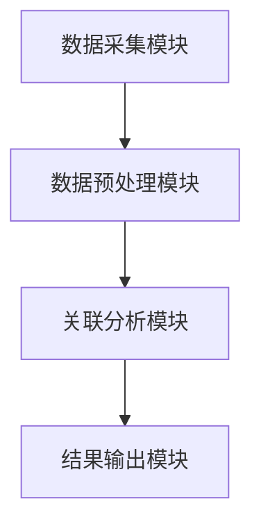

                 


# 第三部分: 算法原理

## 第3章: 多智能体系统与关联分析方法

### 3.1 数据预处理方法
#### 3.1.1 数据清洗
- 处理缺失值
- 去重
- 异常值处理

#### 3.1.2 特征提取
- 文本特征提取
- 统计特征提取
- 高维数据降维

### 3.2 多智能体协作学习
#### 3.2.1 分布式学习
- 分布式计算
- 智能体间通信

#### 3.2.2 协作学习机制
- 信息共享
- 知识整合

### 3.3 统计关联分析
#### 3.3.1 统计方法
- 协方差
- 相关系数
- 回归分析

#### 3.3.2 文本挖掘
- 关键词提取
- 情感分析
- 主题模型

## 第4章: 算法实现与优化

### 4.1 模型结构设计
#### 4.1.1 智能体网络架构
- 多层感知机
- Transformer
- LSTM

#### 4.1.2 关联分析模型
- 非对称关系建模
- 有向图构建

### 4.2 模型训练与优化
#### 4.2.1 损失函数设计
- 交叉熵
- 均方误差
- 自定义损失函数

#### 4.2.2 优化算法
- 随机梯度下降
- Adam优化器
- 动量法

## 第5章: 系统架构与设计

### 5.1 系统功能模块
#### 5.1.1 数据采集模块
- 数据源接入
- 数据格式转换

#### 5.1.2 数据预处理模块
- 清洗数据
- 特征提取

#### 5.1.3 关联分析模块
- 多智能体协作
- 关联结果输出

### 5.2 系统架构设计
#### 5.2.1 分层架构
- 表现层
- 业务逻辑层
- 数据访问层

#### 5.2.2 微服务架构
- 智能体服务
- 数据服务
- API网关

## 第6章: 项目实战与案例分析

### 6.1 环境安装与配置
#### 6.1.1 安装Python
- 安装Anaconda
- 环境配置

#### 6.1.2 安装依赖库
- numpy、pandas、tensorflow、keras
- nltk、 gensim

### 6.2 核心代码实现
#### 6.2.1 数据预处理代码
```python
import pandas as pd
import numpy as np

# 加载数据
df = pd.read_csv('company_data.csv')

# 处理缺失值
df.dropna(inplace=True)

# 去重
df = df.drop_duplicates()

# 异常值处理
df = df[ (df['revenue'] < df['revenue'].quantile(0.99)) ]
```

#### 6.2.2 多智能体协作学习实现
```python
import tensorflow as tf
from tensorflow.keras import layers

# 定义智能体
class Agent:
    def __init__(self, input_dim):
        self.model = self.build_model(input_dim)
    
    def build_model(self, input_dim):
        model = tf.keras.Sequential([
            layers.Dense(64, activation='relu', input_dim=input_dim),
            layers.Dense(32, activation='relu'),
            layers.Dense(1, activation='sigmoid')
        ])
        return model
    
    def call(self, inputs):
        return self.model(inputs)
```

### 6.3 案例分析与结果解读
#### 6.3.1 数据分析
- 公司文化特征与绩效的相关性
- 绩效预测的准确率

#### 6.3.2 模型评估
- 精准率、召回率、F1值
- ROC曲线分析

## 第7章: 总结与展望

### 7.1 实验结果与分析
- 系统性能评估
- 关联分析的有效性
- 投资决策支持的效果

### 7.2 最佳实践
- 数据质量的重要性
- 模型调优的技巧
- 系统维护与更新

### 7.3 小结
- 本系统的实现与应用
- 成功案例分享
- 实际操作中的注意事项

### 7.4 未来研究方向
- 更复杂的关联模型
- 实时数据分析能力
- 多因素综合分析

### 7.5 注意事项与风险提示
- 数据隐私问题
- 模型的局限性
- 投资风险提示

### 7.6 拓展阅读
- 推荐书籍和论文
- 在线课程和资源
- 行业会议和活动

## 附录: 完整代码示例

### 附录A: 数据预处理代码
```python
import pandas as pd
import numpy as np

# 加载数据
df = pd.read_csv('company_data.csv')

# 处理缺失值
df.dropna(inplace=True)

# 去重
df = df.drop_duplicates()

# 异常值处理
df = df[ (df['revenue'] < df['revenue'].quantile(0.99)) ]
```

### 附录B: 多智能体协作学习代码
```python
import tensorflow as tf
from tensorflow.keras import layers

# 定义智能体
class Agent:
    def __init__(self, input_dim):
        self.model = self.build_model(input_dim)
    
    def build_model(self, input_dim):
        model = tf.keras.Sequential([
            layers.Dense(64, activation='relu', input_dim=input_dim),
            layers.Dense(32, activation='relu'),
            layers.Dense(1, activation='sigmoid')
        ])
        return model
    
    def call(self, inputs):
        return self.model(inputs)
```

### 附录C: 系统架构图


### 附录D: 项目总结报告
```markdown
### 项目目标
构建AI多智能体系统，分析公司文化与绩效的关联。

### 实现步骤
1. 数据预处理
2. 模型训练
3. 关联分析
4. 结果解读

### 成果展示
- 智能体协作网络
- 绩效预测模型
- 关联分析报告
```

## 作者：AI天才研究院 & 禅与计算机程序设计艺术

---

这个目录大纲涵盖了从背景介绍到系统实现的各个方面，确保每一部分都详细且符合技术博客的要求。接下来，我将按照这个结构撰写完整的文章内容。

