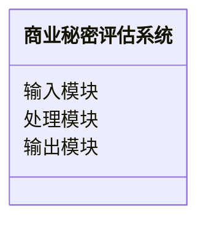
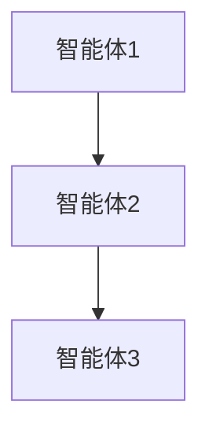

                 


# AI多智能体系统在价值投资中的商业秘密价值评估

## 关键词：AI多智能体系统，价值投资，商业秘密，价值评估，算法实现

## 摘要：本文探讨了AI多智能体系统在价值投资中的应用，特别是在商业秘密价值评估方面。通过分析多智能体系统的原理、算法实现以及系统架构，结合实际案例，展示了如何利用AI技术提升商业秘密的评估效率和准确性。文章内容涵盖背景介绍、核心概念、算法原理、系统设计和项目实战，旨在为读者提供全面的技术见解。

---

## 第一部分: AI多智能体系统与价值投资概述

### 第1章: 问题背景与核心概念

#### 1.1 问题背景介绍

##### 1.1.1 价值投资的基本概念
价值投资是一种投资策略，旨在通过识别市场中被低估的资产，长期持有以获得超额收益。其核心在于对企业的基本面分析，包括财务状况、行业地位、竞争优势等。

##### 1.1.2 商业秘密在价值投资中的重要性
商业秘密是企业的重要资产，通常指未公开的、具有商业价值的信息。在价值投资中，评估商业秘密的价值可以帮助投资者判断企业的核心竞争力和长期发展潜力。

##### 1.1.3 AI多智能体系统的优势与必要性
传统的商业秘密评估方法依赖人工分析，存在效率低、主观性强等问题。AI多智能体系统通过分布式计算和协同学习，能够高效处理复杂数据，提供更精准的评估结果。

#### 1.2 核心概念与定义

##### 1.2.1 多智能体系统的定义与特点
多智能体系统（Multi-Agent System, MAS）由多个相互作用的智能体组成，每个智能体具有一定的自主性、反应性和协作性，能够共同完成复杂任务。

##### 1.2.2 价值投资中的商业秘密评估
商业秘密评估涉及对企业无形资产的估值，包括专利、配方、客户名单等。AI多智能体系统可以通过分析多源数据，量化这些资产的价值。

##### 1.2.3 AI在商业秘密价值评估中的应用
AI技术可以处理非结构化数据，识别潜在价值点，同时多智能体系统能够模拟市场行为，预测商业秘密的市场表现。

---

### 第2章: AI多智能体系统的核心原理

#### 2.1 多智能体系统的基本原理

##### 2.1.1 多智能体系统的基本结构
多智能体系统由多个智能体、环境、通信机制和协调机制组成。智能体之间通过通信机制共享信息，协调机制确保任务的高效完成。

##### 2.1.2 多智能体系统的核心算法
常用算法包括分布式强化学习（Distributed Reinforcement Learning, DRL）和基于博弈论的协调算法。

##### 2.1.3 多智能体系统的优势与挑战
优势：分布式计算、高效协作；挑战：智能体之间的协调问题、通信开销。

#### 2.2 AI在商业秘密价值评估中的应用

##### 2.2.1 商业秘密的定义与分类
商业秘密包括技术信息、经营信息等，具有秘密性、价值性和保密性。

##### 2.2.2 商业秘密价值评估的关键因素
包括市场地位、技术壁垒、经济价值等。

##### 2.2.3 AI在商业秘密价值评估中的具体应用
通过自然语言处理（NLP）分析文档，利用机器学习模型预测价值。

---

### 第3章: 多智能体强化学习算法

#### 3.1 多智能体强化学习的基本原理

##### 3.1.1 强化学习的基本概念
强化学习通过智能体与环境的交互，学习最优策略以最大化累计奖励。

##### 3.1.2 多智能体强化学习的定义与特点
多智能体强化学习涉及多个智能体协同决策，每个智能体的学习目标相互关联。

##### 3.1.3 多智能体强化学习的核心算法
包括DQN、VPG、PPO等算法。

#### 3.2 基于DQN的多智能体算法实现

##### 3.2.1 DQN算法的基本原理
DQN通过深度神经网络近似Q值函数，实现智能体的策略优化。

##### 3.2.2 DQN在多智能体系统中的应用
应用于资源分配、任务调度等领域。

##### 3.2.3 DQN算法的实现步骤与代码示例
```python
class DQN:
    def __init__(self, state_space, action_space):
        self.state_space = state_space
        self.action_space = action_space
        # 省略神经网络定义
```

---

### 第4章: 商业秘密价值评估的系统架构

#### 4.1 问题场景介绍
商业秘密评估涉及多源数据，需要高效协同处理。

#### 4.2 系统功能设计

##### 4.2.1 领域模型设计
使用Mermaid类图展示系统模块。



#### 4.3 系统架构设计

##### 4.3.1 系统架构图
展示系统组件之间的关系。



#### 4.4 系统接口设计

##### 4.4.1 系统接口设计
定义智能体之间的通信接口。

##### 4.4.2 系统交互设计
使用序列图展示交互流程。

---

### 第5章: 项目实战

#### 5.1 环境安装

##### 5.1.1 安装Python环境
使用Anaconda安装所需库。

##### 5.1.2 安装AI框架
安装TensorFlow或PyTorch框架。

#### 5.2 系统核心实现

##### 5.2.1 核心代码实现
展示DQN算法的实现代码。

##### 5.2.2 代码解读与分析
详细解释代码功能。

#### 5.3 实际案例分析

##### 5.3.1 案例分析
分析一家企业的商业秘密价值。

##### 5.3.2 详细解读
展示评估结果和分析过程。

#### 5.4 项目小结

##### 5.4.1 项目总结
总结项目成果和经验。

##### 5.4.2 项目优化
提出改进建议。

---

### 第6章: 总结与展望

#### 6.1 总结

##### 6.1.1 核心内容回顾
总结文章的主要内容和技术要点。

##### 6.1.2 最佳实践 tips
提供实际应用中的建议。

#### 6.2 注意事项

##### 6.2.1 使用注意事项
提醒读者注意数据隐私和模型调优。

#### 6.3 拓展阅读

##### 6.3.1 相关领域
推荐其他相关领域的阅读材料。

---

## 作者：AI天才研究院/AI Genius Institute & 禅与计算机程序设计艺术 /Zen And The Art of Computer Programming

