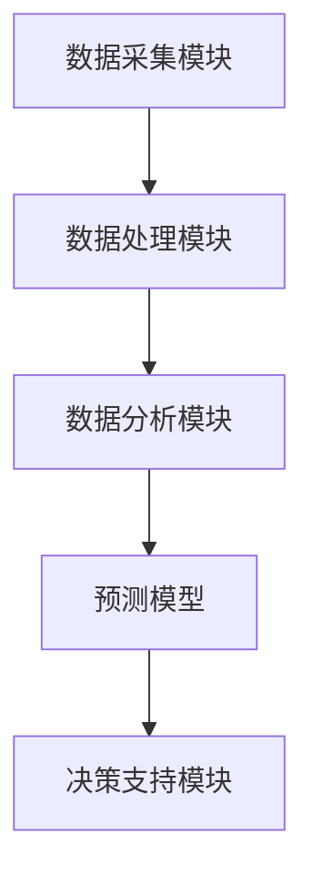

                 


# AI多智能体系统在价值投资中的宏观经济分析应用

## 关键词
AI多智能体系统, 宏观经济分析, 价值投资, 强化学习, 博弈论, 系统架构

## 摘要
本文探讨了AI多智能体系统在宏观经济分析中的应用，特别是在价值投资领域的潜力。通过分析多智能体系统的原理、算法及其在宏观经济预测和投资决策中的优势，展示了如何利用AI技术优化投资策略。

---

# 第1章: AI多智能体系统与宏观经济分析概述

## 1.1 AI多智能体系统的概念与特点
### 1.1.1 多智能体系统的定义
多智能体系统（Multi-Agent System, MAS）是由多个独立但协作的智能体组成的系统，这些智能体能够通过通信和协作共同完成复杂任务。

### 1.1.2 AI多智能体系统的核心特点
- **分布式计算**：智能体独立决策，减少单点故障。
- **协作性**：通过通信协作，共同达成目标。
- **适应性**：能根据环境变化调整行为。

### 1.1.3 多智能体系统与传统单智能体系统的区别
| 特性       | 多智能体系统          | 单智能体系统         |
|------------|-----------------------|----------------------|
| 决策中心    | 分散在多个智能体       | 集中在单一控制器     |
| 通信协作    | 需要通信和协作         | 无需通信             |
| 复杂性      | 更高                   | 更低                 |

## 1.2 宏观经济分析的基本概念
### 1.2.1 宏观经济分析的定义
宏观经济分析研究整体经济系统，包括GDP、失业率、通货膨胀等指标。

### 1.2.2 宏观经济分析的主要指标
- **GDP**：衡量经济规模。
- **失业率**：反映就业状况。
- **通货膨胀**：物价变动情况。

### 1.2.3 宏观经济分析在价值投资中的作用
通过分析宏观经济指标，投资者可以预测市场趋势，优化投资组合。

## 1.3 AI多智能体系统在宏观经济分析中的应用
### 1.3.1 宏观经济分析的复杂性与挑战
- **数据多样性**：涉及多个指标和数据源。
- **预测不确定性**：经济系统复杂，预测难度大。
- **政策影响**：宏观经济受政策影响显著。

### 1.3.2 AI多智能体系统的优势
- **分布式计算能力**：能处理大量数据。
- **协作能力**：多个智能体协作分析。
- **自适应能力**：能根据变化调整策略。

### 1.3.3 应用场景与案例
- **经济预测**：利用多智能体系统预测GDP增长。
- **政策模拟**：模拟政策效果，优化投资决策。

## 1.4 本章小结
本章介绍了AI多智能体系统的概念和特点，解释了宏观经济分析的基本概念，探讨了多智能体系统在宏观经济分析中的应用及其优势。

---

# 第2章: AI多智能体系统的原理与数学模型

## 2.1 多智能体系统的原理
### 2.1.1 多智能体系统的组成
- **智能体**：独立决策单元。
- **环境**：智能体所处的经济环境。
- **通信机制**：智能体间的信息交换方式。

### 2.1.2 多智能体系统的通信与协作机制
- **直接通信**：智能体间直接交换信息。
- **间接协作**：通过共享数据库协作。

### 2.1.3 多智能体系统的决策机制
- **基于规则的决策**：根据预设规则行动。
- **基于模型的决策**：利用模型预测行动。

## 2.2 宏观经济分析的数学模型
### 2.2.1 宏观经济指标的数学表达
- **GDP模型**：GDP = C + I + G + (X - M)
- **通货膨胀模型**：通胀率 = (P_t - P_{t-1}) / P_{t-1}

### 2.2.2 经济系统动态模型
使用差分方程描述经济变量变化，如：
$$ \Delta GDP = \alpha \cdot \Delta C + \beta \cdot \Delta I $$

### 2.2.3 多智能体系统的数学建模
- **智能体行为模型**：定义每个智能体的决策规则。
- **系统动态模型**：描述整体系统的动态变化。

## 2.3 AI多智能体系统的算法基础
### 2.3.1 常见的多智能体算法
- **分布式问题求解**：任务分解到多个智能体。
- **协作式强化学习**：智能体通过协作提高收益。

### 2.3.2 基于强化学习的多智能体协作
- **策略网络**：学习最优策略。
- **价值函数**：评估状态的价值。

### 2.3.3 基于博弈论的决策模型
- **纳什均衡**：所有智能体策略稳定状态。
- **博弈树**：分析可能的决策路径。

## 2.4 本章小结
本章详细讲解了多智能体系统的原理，分析了宏观经济分析的数学模型，并介绍了基于强化学习和博弈论的多智能体算法。

---

# 第3章: 多智能体系统在宏观经济分析中的应用

## 3.1 宏观经济分析的复杂性与挑战
### 3.1.1 宏观经济数据的多样性
涉及股票、债券、商品等多种市场数据。

### 3.1.2 宏观经济预测的不确定性
经济变量受多种因素影响，预测难度大。

### 3.1.3 宏观经济政策的多目标优化
政策制定需平衡增长、通胀、就业等多个目标。

## 3.2 AI多智能体系统在宏观经济分析中的优势
### 3.2.1 多智能体系统的分布式计算能力
能同时处理多个数据源和任务。

### 3.2.2 多智能体系统的协作能力
通过协作提高分析的准确性和效率。

### 3.2.3 多智能体系统的自适应能力
能根据市场变化快速调整分析策略。

## 3.3 典型应用场景分析
### 3.3.1 宏观经济预测
利用多智能体系统预测GDP、通胀等指标。

### 3.3.2 宏观经济政策模拟
模拟不同政策对经济的影响，优化决策。

### 3.3.3 价值投资策略优化
通过分析宏观经济指标优化投资组合。

## 3.4 本章小结
本章分析了宏观经济分析的复杂性与挑战，探讨了AI多智能体系统在宏观经济分析中的优势，并通过典型应用场景进行了说明。

---

# 第4章: AI多智能体系统的算法实现

## 4.1 多智能体系统的算法选择
### 4.1.1 基于强化学习的多智能体协作
- **策略网络**：每个智能体学习最优策略。
- **价值函数**：评估状态的价值。

### 4.1.2 基于博弈论的决策算法
- **纳什均衡**：确定稳定策略。
- **博弈树分析**：分析决策路径。

### 4.1.3 常见的多智能体算法
- **Cortes算法**：任务分配。
- **Distributed Q-Learning**：协作学习。

## 4.2 算法实现细节
### 4.2.1 强化学习算法
- **状态空间**：经济指标数据。
- **动作空间**：投资决策。
- **奖励函数**：投资收益。

### 4.2.2 博弈论算法
- **纳什均衡计算**：确定稳定策略。
- **博弈树构建**：分析决策路径。

## 4.3 本章小结
本章讨论了多智能体系统的算法选择，并详细讲解了强化学习和博弈论在算法实现中的应用。

---

# 第5章: 系统分析与架构设计

## 5.1 问题场景介绍
### 5.1.1 宏观经济分析的复杂性
涉及多个经济指标和市场数据。

### 5.1.2 系统目标
设计一个AI多智能体系统，用于宏观经济分析和价值投资。

## 5.2 系统功能设计
### 5.2.1 领域模型
- **数据采集**：收集宏观经济数据。
- **数据分析**：分析数据，生成预测模型。
- **决策支持**：提供投资建议。

### 5.2.2 系统架构
- **数据层**：存储宏观经济数据。
- **计算层**：执行数据分析和预测。
- **应用层**：提供用户界面和决策支持。

## 5.3 系统架构设计
### 5.3.1 系统架构图


### 5.3.2 系统接口设计
- **数据接口**：与其他系统的数据接口。
- **用户接口**：提供给用户的界面。

## 5.4 本章小结
本章通过系统分析和架构设计，展示了如何构建一个AI多智能体系统用于宏观经济分析和价值投资。

---

# 第6章: 项目实战

## 6.1 环境安装
### 6.1.1 安装Python
```bash
python --version
pip install --upgrade pip
```

### 6.1.2 安装依赖库
```bash
pip install numpy pandas matplotlib scikit-learn
```

## 6.2 系统核心实现源代码
### 6.2.1 数据采集模块
```python
import pandas as pd

def collect_data():
    # 示例代码，实际需要根据具体数据源调整
    data = pd.read_csv('macroeconomic.csv')
    return data
```

### 6.2.2 数据分析模块
```python
from sklearn.model_selection import train_test_split
from sklearn.linear_model import LinearRegression

def analyze_data(data):
    X = data[['GDP', 'inflation']]
    y = data['return']
    X_train, X_test, y_train, y_test = train_test_split(X, y, test_size=0.2)
    model = LinearRegression()
    model.fit(X_train, y_train)
    return model
```

### 6.2.3 预测模型
```python
def predict(model, new_data):
    prediction = model.predict(new_data)
    return prediction
```

## 6.3 案例分析
### 6.3.1 数据分析与建模
使用实际数据训练模型，评估模型性能。

### 6.3.2 投资策略优化
根据模型预测结果优化投资组合，提高收益。

## 6.4 本章小结
本章通过项目实战，展示了如何利用AI多智能体系统进行宏观经济分析和价值投资。

---

# 第7章: 总结与展望

## 7.1 项目总结
### 7.1.1 项目成果
成功构建了一个AI多智能体系统，用于宏观经济分析和价值投资。

### 7.1.2 经验总结
- **数据的重要性**：高质量数据是模型准确性的关键。
- **算法的选择**：选择合适的算法能显著提高效果。
- **系统的可扩展性**：设计时需考虑未来的扩展需求。

## 7.2 项目展望
### 7.2.1 系统优化
进一步优化算法，提高系统性能。

### 7.2.2 功能扩展
增加更多宏观经济指标，提升分析能力。

### 7.2.3 应用场景拓展
探索更多宏观经济分析和价值投资的应用场景。

## 7.3 最佳实践 tips
- **数据清洗**：确保数据质量。
- **算法调优**：优化模型参数。
- **系统测试**：进行全面测试，确保稳定性和可靠性。

## 7.4 本章小结
本章总结了项目的成果和经验，并展望了未来的发展方向。

---

# 作者
作者：AI天才研究院 & 禅与计算机程序设计艺术

---

通过以上思考过程，我整理出了这篇文章的详细大纲，确保内容全面、逻辑清晰，涵盖了从理论到实践的各个方面。

