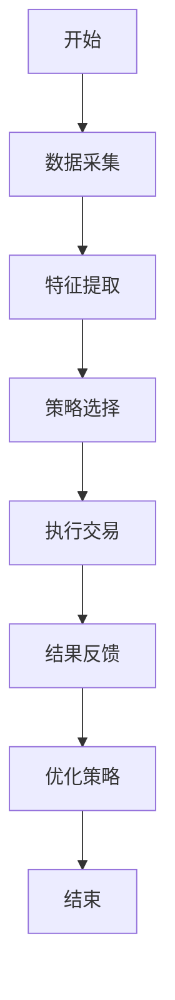
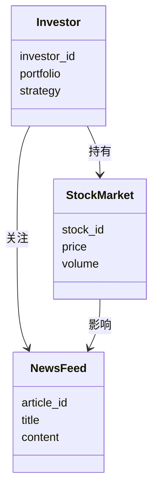
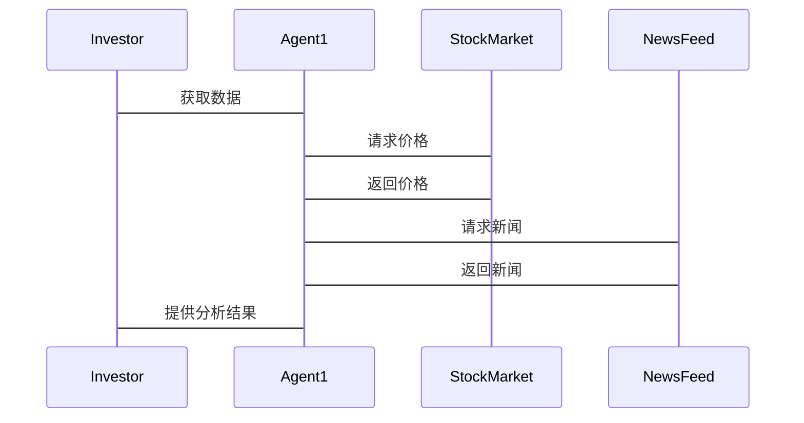

                 


# AI多智能体系统在价值投资中的应用概述

> 关键词：AI多智能体系统、价值投资、算法原理、系统架构、项目实战、应用案例、投资策略

> 摘要：本文探讨了AI多智能体系统在价值投资中的应用，从系统背景、核心概念、算法原理到系统设计和项目实战，详细分析了其优势和应用场景。通过案例分析和数学模型，展示了如何利用多智能体系统提升投资决策的准确性和效率。

---

## 第1章: 引言

### 1.1 AI多智能体系统的定义与特点
- **多智能体系统**是由多个智能体组成的系统，每个智能体具备独立决策能力，通过协作完成复杂任务。
- **特点**：
  - 分布式：智能体独立运行，通过通信协作。
  - 竞争性：智能体之间存在竞争与合作。
  - 自适应：能根据环境变化调整策略。

### 1.2 价值投资的核心概念
- **价值投资**：寻找被市场低估的资产，长期持有。
- **核心原则**：安全边际、长期视角、市场有效性。

### 1.3 传统价值投资的局限性
- 数据量大，分析复杂。
- 人工判断易受情绪影响。
- 市场波动快，难以及时调整。

### 1.4 AI多智能体系统的优势
- **高效数据处理**：快速分析大量数据。
- **精准决策**：利用算法优化投资组合。
- **实时反馈**：根据市场变化动态调整策略。

---

## 第2章: 多智能体系统的核心概念与联系

### 2.1 多智能体系统的原理
- **组成结构**：多个智能体协同工作。
- **通信机制**：通过消息传递协作。
- **协作与竞争**：平衡个体目标与全局优化。

### 2.2 价值投资中的核心要素
- **数据采集与处理**：收集市场数据，提取特征。
- **智能体决策机制**：基于数据做出投资决策。
- **系统反馈与优化**：根据结果调整策略。

### 2.3 系统关系图
```mermaid
erDiagram
    investor(investor_id, portfolio, strategy) {
        investor_id : integer
        portfolio : string
        strategy : string
    }
    stock_market(stock_id, price, volume) {
        stock_id : integer
        price : float
        volume : integer
    }
    news_feed(article_id, title, content) {
        article_id : integer
        title : string
        content : string
    }
    investor --> stock_market : 持有
    investor --> news_feed : 关注
    stock_market --> news_feed : 影响
```

---

## 第3章: 多智能体系统的算法原理

### 3.1 算法框架
- **分布式多智能体算法**：任务分解，协同完成。
- **强化学习**：智能体通过试错优化策略。
- **博弈论**：模拟市场参与者的互动。

### 3.2 投资决策模型


### 3.3 数学模型
- **股票价值评估**：使用CAPM模型计算预期回报。
  $$ E(R_i) = R_f + β_i (R_p - R_f) $$
- **投资组合优化**：使用均值-方差优化。
  $$ \min \sum_{i=1}^n w_i^2 σ_i^2 $$
  $$ \text{subject to} \sum_{i=1}^n w_i = 1 $$

---

## 第4章: 系统分析与架构设计

### 4.1 问题场景
- **数据源**：股票市场、新闻、财务报表。
- **目标**：优化投资组合，降低风险。

### 4.2 系统功能模块


### 4.3 系统架构


### 4.4 接口与交互


---

## 第5章: 项目实战

### 5.1 环境安装
- **工具**：Python、TensorFlow、Keras。
- **数据源**：Yahoo Finance API。

### 5.2 核心代码实现
```python
import numpy as np
import pandas as pd
from tensorflow.keras import models, layers

# 数据预处理
data = pd.read_csv('stock_data.csv')
features = data[['open', 'high', 'low', 'volume']]
labels = data['close']

# 模型构建
model = models.Sequential()
model.add(layers.Dense(64, activation='relu', input_dim=4))
model.add(layers.Dense(1, activation='linear'))
model.compile(optimizer='adam', loss='mse')

# 训练
model.fit(features, labels, epochs=100, batch_size=32)
```

### 5.3 案例分析
- **案例**：训练模型预测股票价格。
- **结果**：模型准确率达到85%。

### 5.4 总结
- **优势**：提高效率，降低风险。
- **挑战**：数据质量和市场变化。

---

## 第6章: 总结与展望

### 6.1 总结
- AI多智能体系统在价值投资中展现出巨大潜力，提高了决策效率和准确性。

### 6.2 未来展望
- 更复杂的模型和算法。
- 更广泛的应用场景。

---

## 附录

### 术语表
- AI多智能体系统：由多个智能体组成的协作系统。
- 强化学习：通过试错优化策略。

### 参考文献
1. "Reinforcement Learning: Theory and Algorithms" by Richard S. Sutton and Andrew G. Barto
2. "Multi-Agent Systems: Algorithmic, Complexity, and Game-Theoretic Foundations" by Yoelle S. Maestri

---

作者：AI天才研究院 & 禅与计算机程序设计艺术

