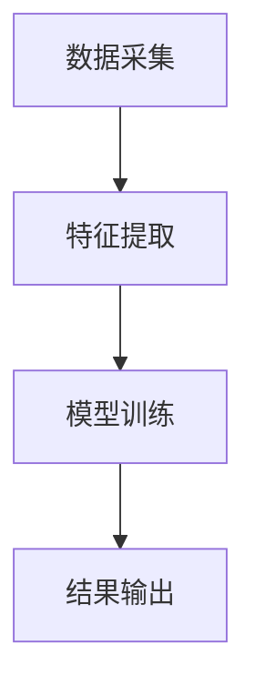
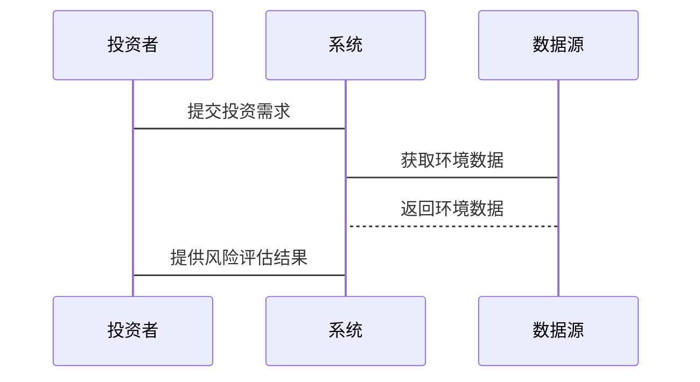
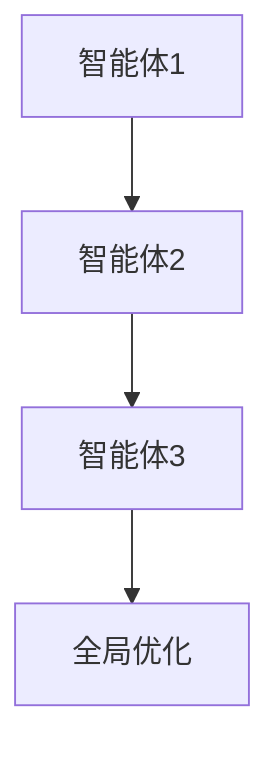
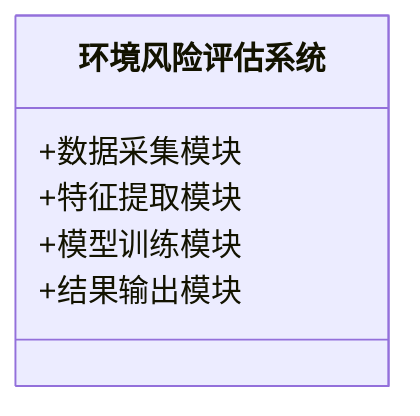

                 


# AI多智能体系统在价值投资中的环境风险评估

> 关键词：AI多智能体系统、价值投资、环境风险评估、分布式强化学习、系统架构设计、数学模型、项目实战

> 摘要：本文探讨了AI多智能体系统在价值投资中的环境风险评估的应用。通过分析环境风险评估的核心概念、算法原理、系统架构设计和实际项目案例，本文详细阐述了如何利用多智能体系统的优势来优化价值投资中的环境风险管理。文章还提供了最佳实践和小结，帮助读者更好地理解和应用相关技术。

---

## 第1章: 问题背景与核心概念

### 1.1 问题背景
#### 1.1.1 价值投资中的环境风险
价值投资的核心在于识别具有长期增长潜力的企业，而环境风险（如气候变化、资源枯竭、政策变化等）对企业价值的影响日益显著。传统的方法难以捕捉复杂环境因素对投资决策的影响。

#### 1.1.2 环境风险评估的复杂性
环境风险涉及多个维度，包括企业运营、供应链、政策法规等。单一模型难以全面覆盖这些因素，因此需要多智能体协作来提高评估的准确性和全面性。

#### 1.1.3 多智能体系统的优势
多智能体系统能够通过分布式计算和协作学习，从多个角度分析环境风险，从而提供更全面的投资决策支持。

### 1.2 核心概念
#### 1.2.1 多智能体系统定义
多智能体系统由多个具有自主决策能力的智能体组成，能够通过协作完成复杂任务。

#### 1.2.2 环境风险评估框架
环境风险评估框架包括数据收集、特征提取、模型训练和结果分析四个阶段。

#### 1.2.3 价值投资中的环境因素
价值投资中的环境因素包括企业的碳排放、资源利用效率、政策合规性等。

---

## 第2章: 核心概念与联系

### 2.1 多智能体系统与环境风险评估
#### 2.1.1 多智能体系统的核心原理
多智能体系统通过分布式计算和协作学习，能够在复杂环境中完成任务。

#### 2.1.2 环境风险评估的属性特征对比表
| 属性 | 特征 |
|------|------|
| 数据来源 | 多源异构 |
| 数据类型 | 结构化与非结构化 |
| 数据规模 | 大规模 |
| 评估维度 | 多维度 |

#### 2.1.3 ER实体关系图
```mermaid
erd
    %%{init: 'flowchart', direction: 'TB'}%%
    环境风险评估系统
        --> 环境因子
        --> 企业数据
        --> 投资决策
```

### 2.2 环境风险评估的系统架构
#### 2.2.1 系统功能模块划分
系统功能模块包括数据采集、特征提取、模型训练和结果输出。

#### 2.2.2 系统架构设计


#### 2.2.3 系统接口与交互


---

## 第3章: 算法原理与数学模型

### 3.1 多智能体协作算法
#### 3.1.1 分布式强化学习流程


#### 3.1.2 联合学习机制
多智能体通过共享模型参数进行协作学习，提升整体性能。

#### 3.1.3 聚类与分类算法
聚类算法用于发现环境风险的隐含模式，分类算法用于预测风险等级。

### 3.2 数学模型与公式
#### 3.2.1 环境风险评估模型
$$
R = f(x_1, x_2, \dots, x_n)
$$
其中，$R$ 表示环境风险，$x_i$ 表示各个环境因素。

#### 3.2.2 多智能体协作公式
$$
J = \sum_{i=1}^{n} J_i
$$
其中，$J_i$ 表示第 $i$ 个智能体的目标函数。

---

## 第4章: 系统分析与架构设计

### 4.1 问题场景分析
#### 4.1.1 投资环境风险场景
企业可能面临政策变化、供应链中断等环境风险。

#### 4.1.2 多智能体协作场景
多个智能体分别负责不同的环境因素，协同完成风险评估。

#### 4.1.3 系统功能需求
系统需要具备数据采集、模型训练和结果输出功能。

### 4.2 系统架构设计
#### 4.2.1 领域模型类图


#### 4.2.2 系统架构图


#### 4.2.3 接口与交互设计


---

## 第5章: 项目实战

### 5.1 环境安装与配置
#### 5.1.1 Python环境搭建
安装Python 3.8或更高版本，安装必要的库（如TensorFlow、Keras等）。

#### 5.1.2 第三方库安装
使用pip安装numpy、pandas、scikit-learn等库。

#### 5.1.3 数据集准备
准备企业环境数据和市场数据。

### 5.2 核心代码实现
#### 5.2.1 多智能体协作代码
```python
import numpy as np
import tensorflow as tf

# 定义智能体类
class Agent:
    def __init__(self, state_size, action_size):
        self.model = self.build_model(state_size, action_size)
    
    def build_model(self, state_size, action_size):
        model = tf.keras.Sequential([
            tf.keras.layers.Dense(64, activation='relu', input_dim=state_size),
            tf.keras.layers.Dense(action_size, activation='linear')
        ])
        model.compile(optimizer='adam', loss='mse')
        return model

# 初始化多个智能体
agents = [Agent(state_size, action_size) for _ in range(num_agents)]
```

#### 5.2.2 环境风险评估代码
```python
def evaluate_environment_risk(data):
    # 数据预处理
    features = data.drop(columns=['label'])
    labels = data['label']
    
    # 模型训练
    model = tf.keras.Sequential([
        tf.keras.layers.Dense(64, activation='relu', input_dim=features.shape[1]),
        tf.keras.layers.Dense(1, activation='sigmoid')
    ])
    model.compile(optimizer='adam', loss='binary_crossentropy')
    model.fit(features, labels, epochs=100, batch_size=32)
    
    return model.predict(features)
```

#### 5.2.3 价值投资优化代码
```python
def optimize_investment(data, model):
    # 数据预处理
    features = data.drop(columns=['label'])
    labels = data['label']
    
    # 模型优化
    optimizer = tf.keras.optimizers.Adam(learning_rate=0.01)
    loss_fn = tf.keras.losses.MeanSquaredError()
    
    for epoch in range(100):
        with tf.GradientTape() as tape:
            predictions = model(features, training=True)
            loss = loss_fn(labels, predictions)
        gradients = tape.gradient(loss, model.trainable_variables)
        optimizer.apply_gradients(zip(gradients, model.trainable_variables))
    
    return predictions
```

### 5.3 实际案例分析
#### 5.3.1 案例背景介绍
以某企业为例，分析其环境风险，包括碳排放、资源利用效率等。

#### 5.3.2 数据处理与分析
使用Python对数据进行清洗和特征提取，构建模型进行风险评估。

#### 5.3.3 系统运行与结果解读
运行系统，获取风险评估结果，并根据结果优化投资策略。

---

## 第6章: 最佳实践与小结

### 6.1 最佳实践
#### 6.1.1 系统优化建议
建议使用分布式计算优化系统性能。

#### 6.1.2 模型调优技巧
调整模型参数和优化算法，提高模型精度。

#### 6.1.3 代码优化技巧
使用并行计算和缓存机制优化代码性能。

### 6.2 小结
本文详细介绍了AI多智能体系统在价值投资中的环境风险评估的应用，通过理论分析和实际案例，展示了多智能体系统的优势和应用场景。

### 6.3 注意事项
在实际应用中，需注意数据质量和模型的可解释性。

### 6.4 拓展阅读
推荐阅读相关领域的最新研究论文和书籍。

---

作者：AI天才研究院/AI Genius Institute & 禅与计算机程序设计艺术 /Zen And The Art of Computer Programming

