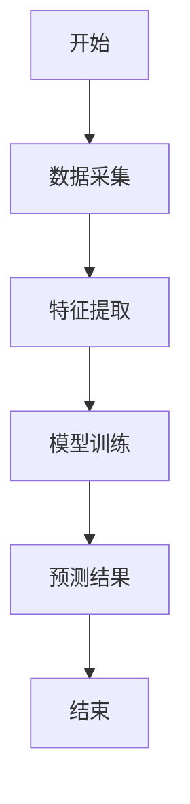

                 


# AI多智能体系统在价值投资中的竞争对手分析

## 关键词：人工智能，多智能体系统，价值投资，竞争对手分析，金融投资

## 摘要：  
本文探讨了AI多智能体系统在价值投资中的应用，特别是在竞争对手分析中的优势。通过结合多智能体系统的分布式智能和价值投资的长期视角，提出了基于强化学习和博弈论的竞争对手分析方法。文章详细介绍了系统的架构设计、算法原理和实际应用场景，为投资者提供了新的工具和思路。

---

# 第1章: AI多智能体系统的背景与概念

## 1.1 多智能体系统的基本概念

### 1.1.1 多智能体系统的定义与特点  
多智能体系统（Multi-Agent System, MAS）由多个智能体组成，这些智能体能够通过通信和协作完成复杂任务。其特点包括分布式智能、自主性、反应性和协作性。  

### 1.1.2 多智能体系统的核心要素  
- **智能体**：具备感知环境和自主决策的能力。  
- **通信机制**：智能体之间的信息交互方式。  
- **协作机制**：实现任务目标的分工与合作。  
- **环境模型**：描述系统运行的环境和约束条件。  

### 1.1.3 多智能体系统的应用场景  
- 金融投资：通过多智能体模拟市场行为，进行风险评估和收益预测。  
- 游戏AI：多智能体协作完成复杂任务。  
- 物联网：智能设备的协同工作。  

---

## 1.2 价值投资的基本原理

### 1.2.1 价值投资的定义与特点  
价值投资是一种以公司基本面分析为基础的投资策略，强调以低于公平价值的价格买入优质资产。其核心在于长期持有优质公司，而非短期价格波动。  

### 1.2.2 价值投资的核心理念  
- **安全边际**：买入价格低于内在价值。  
- **长期视角**：关注公司的持续盈利能力。  
- **逆向思维**：在市场恐慌时寻找低估资产。  

### 1.2.3 价值投资与传统投资的区别  
- **传统投资**：基于技术分析和短期价格波动。  
- **价值投资**：基于公司基本面分析和长期价值判断。  

---

## 1.3 AI多智能体系统在金融领域的应用

### 1.3.1 AI在金融分析中的作用  
AI技术在金融领域的应用包括市场预测、风险评估、投资组合优化等。  

### 1.3.2 多智能体系统在金融投资中的优势  
- **分布式决策**：多个智能体分别负责不同的分析任务。  
- **协作优化**：通过协作提高整体决策的准确性。  
- **动态适应**：能够快速响应市场变化。  

### 1.3.3 竞争对手分析在价值投资中的重要性  
竞争对手分析帮助投资者识别行业内的优势企业，从而做出更明智的投资决策。  

---

# 第2章: 多智能体系统的原理与结构

## 2.1 多智能体系统的原理

### 2.1.1 分布式智能的基本概念  
多智能体系统的智能分布于多个智能体中，每个智能体负责特定的任务。  

### 2.1.2 多智能体系统的通信机制  
- **消息传递**：智能体之间通过消息交换信息。  
- **中间件**：用于协调智能体的通信。  

### 2.1.3 多智能体系统的协作机制  
- **任务分配**：根据智能体的能力分配任务。  
- **协作协议**：定义智能体之间的协作规则。  

---

## 2.2 多智能体系统的结构设计

### 2.2.1 分层结构与功能模块  
- **感知层**：负责数据采集和环境感知。  
- **决策层**：进行策略制定和任务分配。  
- **执行层**：完成具体的执行任务。  

### 2.2.2 实体关系图的构建  
通过ER图展示多智能体系统中各实体的关系，包括智能体、环境、任务等。  

### 2.2.3 系统架构的可扩展性  
设计一个模块化的架构，便于后续的功能扩展。  

---

## 2.3 多智能体系统的数学模型

### 2.3.1 竞争对手分析的数学模型  
建立竞争对手的收益模型，考虑市场占有率、成本和价格等因素。  

### 2.3.2 竞争对手行为预测的公式推导  
通过博弈论模型推导竞争对手的最优策略。  

### 2.3.3 竞争对手策略的博弈论分析  
分析市场中的纳什均衡，确定最优竞争策略。  

---

## 2.4 本章小结

---

# 第3章: 基于多智能体系统的竞争对手分析算法

## 3.1 竞争对手分析的核心算法

### 3.1.1 强化学习在竞争对手分析中的应用  
使用强化学习算法模拟竞争对手的决策过程。  

### 3.1.2 博弈论模型的构建与应用  
构建博弈论模型，分析竞争对手的策略选择。  

### 3.1.3 聚类分析与分类算法的结合  
利用聚类分析识别市场中的竞争对手，并通过分类算法进行预测。  

---

## 3.2 竞争对手行为预测的算法实现

### 3.2.1 算法流程图的绘制（mermaid）  


### 3.2.2 算法的数学模型与公式推导  
收益预测模型：  
$$ R = \alpha \cdot P + \beta \cdot Q $$  
其中，$R$ 是收益，$P$ 是价格，$Q$ 是质量。  

### 3.2.3 算法实现的代码示例  
```python
def predict_competitor_behavior(data):
    # 数据预处理
    # 模型训练
    # 返回预测结果
    return predictions
```

---

## 3.3 竞争对手策略分析的数学模型

### 3.3.1 竞争对手收益预测模型  
$$ R = \sum_{i=1}^{n} p_i \cdot q_i $$  
其中，$p_i$ 是价格，$q_i$ 是销量。  

### 3.3.2 竞争对手风险评估模型  
$$ Risk = \sigma^2 $$  
其中，$\sigma^2$ 是收益的方差。  

### 3.3.3 竞争对手策略的博弈论分析  
分析市场中的纳什均衡，确定最优竞争策略。  

---

## 3.4 本章小结

---

# 第4章: 竞争对手分析系统的架构设计

## 4.1 系统功能需求分析

### 4.1.1 数据采集模块的功能设计  
- 数据源：市场数据、公司财报、行业报告。  

### 4.1.2 数据分析模块的功能设计  
- 数据清洗、特征提取、模型训练。  

### 4.1.3 竞争对手分析模块的功能设计  
- 竞争对手识别、行为预测、策略分析。  

---

## 4.2 系统架构设计

### 4.2.1 系统架构的分层设计  
- **数据层**：存储原始数据和处理后的数据。  
- **服务层**：提供数据处理和模型训练服务。  
- **应用层**：提供用户界面和结果展示。  

### 4.2.2 系统架构的

---

## 4.3 系统接口设计

### 4.3.1 系统接口的定义  
- 数据接口：与数据源对接。  
- 模型接口：与第三方算法对接。  

### 4.3.2 系统接口的实现  
通过RESTful API实现模块之间的通信。  

---

## 4.4 本章小结

---

# 第5章: 竞争对手分析系统的实现与案例分析

## 5.1 项目实战

### 5.1.1 环境安装  
安装必要的Python库，如NumPy、Pandas、Scikit-learn等。  

### 5.1.2 系统核心实现源代码  
```python
import numpy as np
import pandas as pd

def load_data():
    # 加载数据
    return data

def preprocess_data(data):
    # 数据预处理
    return processed_data

def train_model(data):
    # 模型训练
    return model

def analyze_competitors(model, data):
    # 竞争对手分析
    return results
```

### 5.1.3 代码应用解读与分析  
解释每部分代码的功能和实现细节。  

### 5.1.4 实际案例分析  
以具体行业为例，展示系统的实际应用。  

---

## 5.2 项目小结

---

# 第6章: 最佳实践与注意事项

## 6.1 最佳实践 tips

### 6.1.1 数据质量的重要性  
确保数据的准确性和完整性。  

### 6.1.2 模型的可解释性  
选择易于解释的模型，便于分析和调整。  

### 6.1.3 系统的可扩展性  
设计模块化的系统架构，便于后续功能扩展。  

---

## 6.2 小结

---

## 6.3 注意事项

### 6.3.1 数据隐私与安全  
确保数据的隐私和安全。  

### 6.3.2 模型的局限性  
认识到模型的局限性，避免过度依赖。  

### 6.3.3 系统的维护与更新  
定期维护和更新系统，以适应市场变化。  

---

## 6.4 拓展阅读

### 6.4.1 相关领域的最新研究  
了解多智能体系统和价值投资领域的最新研究进展。  

### 6.4.2 实际案例研究  
阅读更多实际应用案例，提高对系统的理解。  

---

# 作者：AI天才研究院 & 禅与计算机程序设计艺术

