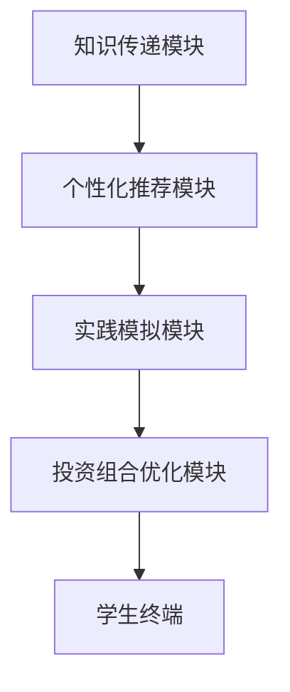
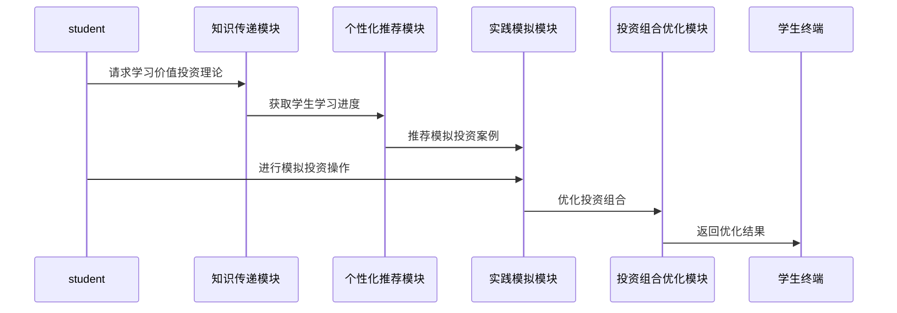

                 


# AI多智能体系统如何改进传统的价值投资师资培养模式

> 关键词：AI多智能体系统，价值投资，师资培养，教育创新，智能化教育

> 摘要：本文探讨了AI多智能体系统如何改进传统的价值投资师资培养模式。通过分析多智能体系统的原理、算法实现、系统架构设计以及实际项目案例，本文详细阐述了如何利用AI技术提升价值投资教育的效率和效果，为未来的教育创新提供了新的思路和方向。

---

# 第一部分: AI多智能体系统与价值投资概述

## 第1章: AI多智能体系统概述

### 1.1 AI多智能体系统的定义与特点

#### 1.1.1 多智能体系统的定义

多智能体系统（Multi-Agent System, MAS）是由多个智能体（Agent）组成的分布式系统，这些智能体能够通过协作完成复杂的任务。与单智能体系统相比，多智能体系统具有更高的灵活性和适应性，能够处理更复杂的环境。

#### 1.1.2 AI多智能体系统的独特优势

AI多智能体系统结合了人工智能和多智能体系统的优势，能够实现多个智能体之间的协作与竞争，从而在复杂环境中做出更优的决策。

#### 1.1.3 多智能体系统与传统单智能体系统的对比

| 对比维度 | 多智能体系统 | 单智能体系统 |
|----------|--------------|--------------|
| 系统结构 | 分布式、协作性 | 集中式、单一性 |
| 决策方式 | 多个智能体协作 | 单个智能体决策 |
| 适应性 | 更高 | 较低 |

### 1.2 价值投资的核心概念与传统师资培养模式

#### 1.2.1 价值投资的基本原理

价值投资是一种以基本面分析为基础的投资策略，旨在通过分析公司的财务状况、行业地位和未来发展前景，找到被市场低估的投资标的。

#### 1.2.2 传统价值投资师资培养模式的痛点

传统价值投资师资培养模式通常依赖于经验丰富的导师进行一对一或小班教学，这种方式存在效率低、成本高、个性化不足等问题。

#### 1.2.3 多智能体系统在价值投资教育中的潜力

多智能体系统可以通过协作学习、个性化推荐和实时反馈等方式，显著提升价值投资教育的效率和效果。

---

## 第2章: 多智能体系统在价值投资中的应用背景

### 2.1 价值投资领域的智能化需求

#### 2.1.1 数据分析与决策的复杂性

价值投资需要分析大量的财务数据和市场信息，传统的手工分析效率低下，容易出错。

#### 2.1.2 个性化投资策略的需求

每个投资者的需求和风险承受能力不同，传统的一对一教学难以满足大规模个性化需求。

#### 2.1.3 知识传递与实践的效率问题

传统教学模式难以将复杂的理论知识快速转化为实践能力，学生的学习效果有限。

### 2.2 传统师资培养模式的局限性

#### 2.2.1 知识传递的单一性

传统教学模式通常依赖于导师的个人经验，缺乏多样化的知识来源。

#### 2.2.2 实践能力培养的不足

学生在实际投资环境中缺乏实战经验，难以快速适应真实市场。

#### 2.2.3 个性化学习支持的缺失

传统教学模式难以根据学生的个性化需求提供定制化的学习方案。

### 2.3 AI多智能体系统的优势与解决方案

#### 2.3.1 多智能体系统的协作能力

通过多个智能体的协作，AI多智能体系统能够实现知识的快速传递和多样化学习。

#### 2.3.2 智能化知识传递的效率提升

AI多智能体系统能够通过数据驱动的方式，快速分析和总结大量投资案例，提升学习效率。

#### 2.3.3 个性化学习的支持能力

AI多智能体系统能够根据学生的学习进度和个性化需求，动态调整教学内容和策略。

---

# 第二部分: AI多智能体系统的原理与技术实现

## 第3章: 多智能体系统的核心原理

### 3.1 多智能体系统的架构

#### 3.1.1 分布式架构

多智能体系统采用分布式架构，每个智能体独立运行，通过通信模块实现协作。

#### 3.1.2 协作与竞争机制

智能体之间可以通过协作完成共同目标，也可以通过竞争优化决策。

#### 3.1.3 通信与信息共享

智能体之间通过通信模块共享信息，实现协作与决策。

### 3.2 AI多智能体系统的算法基础

#### 3.2.1 强化学习算法

强化学习是一种通过试错和奖励机制优化决策的算法，适用于动态环境下的投资决策。

#### 3.2.2 聚类与分类算法

聚类算法可以将相似的投资案例归类，分类算法可以预测投资标的的未来走势。

#### 3.2.3 跨主体博弈论模型

通过博弈论模型，可以模拟多个智能体之间的互动，优化整体决策。

### 3.3 多智能体系统的协作机制

#### 3.3.1 协作目标设定

智能体之间需要明确协作目标，例如共同完成一个投资组合优化任务。

#### 3.3.2 信息共享与决策

通过信息共享，智能体可以协同决策，提升整体效率。

#### 3.3.3 系统自适应调整

系统可以根据环境变化动态调整协作策略，确保最优决策。

---

## 第4章: 价值投资中的数学模型与算法实现

### 4.1 价值投资的核心数学模型

#### 4.1.1 股票估值模型

股票估值模型可以通过财务指标和市场数据，计算出股票的合理价值。

#### 4.1.2 风险评估模型

风险评估模型可以量化投资组合的风险，帮助投资者做出更明智的决策。

#### 4.1.3 投资组合优化模型

投资组合优化模型可以通过数学优化方法，找到最优的投资组合。

### 4.2 基于多智能体系统的算法实现

#### 4.2.1 强化学习在投资决策中的应用

强化学习可以通过试错和奖励机制，优化投资决策。

#### 4.2.2 聚类算法在投资组合优化中的应用

聚类算法可以将相似的投资案例归类，帮助投资者发现潜在的投资机会。

#### 4.2.3 博弈论模型在多主体协作中的应用

博弈论模型可以模拟多个智能体之间的互动，优化整体决策。

### 4.3 算法实现的数学公式与代码示例

#### 4.3.1 强化学习算法实现

```python
class Agent:
    def __init__(self, state_space, action_space):
        self.state_space = state_space
        self.action_space = action_space
        # 初始化策略网络
        self.policy = PolicyNetwork(state_space, action_space)
    
    def act(self, state):
        # 根据策略网络输出动作
        action = self.policy.act(state)
        return action
```

#### 4.3.2 投资组合优化模型

$$ \text{最大化} \quad \sum_{i=1}^{n} w_i r_i $$

$$ \text{约束} \quad \sum_{i=1}^{n} w_i = 1 $$

其中，$w_i$ 是投资组合中第 $i$ 个资产的权重，$r_i$ 是第 $i$ 个资产的预期收益。

---

## 第5章: 系统架构设计与实现

### 5.1 系统功能设计

#### 5.1.1 知识传递模块

知识传递模块负责将价值投资的理论知识传递给学生，包括基本面分析、技术分析等内容。

#### 5.1.2 实践模拟模块

实践模拟模块提供虚拟投资环境，学生可以在其中进行模拟投资操作。

#### 5.1.3 个性化推荐模块

个性化推荐模块根据学生的学习进度和兴趣，推荐适合的学习内容和投资案例。

### 5.2 系统架构设计



### 5.3 系统接口设计

#### 5.3.1 知识传递模块接口

```python
def get_theory知识(topic):
    # 返回指定主题的理论知识
    pass
```

#### 5.3.2 实践模拟模块接口

```python
def simulate_investment(initial_capital, strategy):
    # 模拟投资，返回最终收益
    pass
```

### 5.4 系统交互流程



---

## 第6章: 项目实战与案例分析

### 6.1 项目环境安装

#### 6.1.1 安装依赖

```bash
pip install numpy pandas matplotlib
```

#### 6.1.2 安装强化学习框架

```bash
pip install gym tensorflow
```

### 6.2 系统核心实现

#### 6.2.1 强化学习算法实现

```python
import gym
import tensorflow as tf

class DQN_Agent:
    def __init__(self, state_space, action_space):
        self.state_space = state_space
        self.action_space = action_space
        self.model = tf.keras.Sequential([
            tf.keras.layers.Dense(32, activation='relu'),
            tf.keras.layers.Dense(action_space, activation='linear')
        ])
    
    def act(self, state):
        q_values = self.model(tf.convert_to_tensor([state]))
        return tf.argmax(q_values, axis=1).numpy()[0]
```

#### 6.2.2 投资组合优化实现

```python
import numpy as np

def optimize_portfolio(weights, returns):
    # 定义目标函数
    def objective(weights):
        return -np.sum(weights * returns)
    
    # 约束条件
    constraints = {
        'type': 'eq',
        'fun': lambda w: np.sum(w) - 1
    }
    
    # 使用 scipy.optimize 求解
    from scipy.optimize import minimize
    result = minimize(objective, weights, constraints=constraints)
    return result.x
```

### 6.3 案例分析

#### 6.3.1 投资组合优化案例

假设我们有三个资产，其预期收益率分别为 0.1, 0.15, 0.2，协方差矩阵如下：

$$ \Sigma = \begin{bmatrix}
0.02 & 0.01 & 0.015 \\
0.01 & 0.03 & 0.02 \\
0.015 & 0.02 & 0.03
\end{bmatrix} $$

通过投资组合优化算法，我们可以找到最优权重分配。

#### 6.3.2 实践模拟案例

在虚拟投资环境中，学生可以通过模拟投资操作，学习如何根据市场变化调整投资策略。

### 6.4 项目总结

通过本项目，我们展示了AI多智能体系统在价值投资教育中的应用潜力。实践案例表明，多智能体系统能够显著提升学习效率和效果。

---

## 第7章: 最佳实践与未来展望

### 7.1 最佳实践 tips

1. 在实际应用中，建议结合实际市场数据进行模型训练。
2. 系统设计时，应注重模块化和可扩展性。
3. 在教学过程中，应注重理论与实践的结合。

### 7.2 小结

本文详细探讨了AI多智能体系统在价值投资教育中的应用，通过理论分析和实践案例，展示了其在提升教育效率和效果方面的巨大潜力。

### 7.3 注意事项

- 系统设计时，应确保数据安全和隐私保护。
- 在实际应用中，应结合具体需求进行系统调优。
- 学生在使用系统时，应遵守相关法律法规。

### 7.4 拓展阅读

- 《强化学习：理论与算法》
- 《多智能体系统：原理与应用》
- 《价值投资：从理论到实践》

---

# 作者：AI天才研究院/AI Genius Institute & 禅与计算机程序设计艺术 /Zen And The Art of Computer Programming

---

本文通过详细分析AI多智能体系统在价值投资教育中的应用，展示了其在提升教育效率和效果方面的巨大潜力。通过理论分析、算法实现和实践案例，本文为未来的教育创新提供了新的思路和方向。

