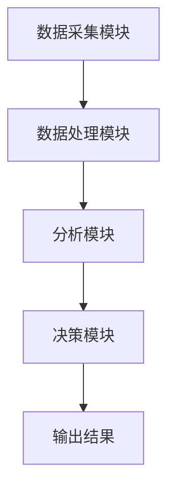
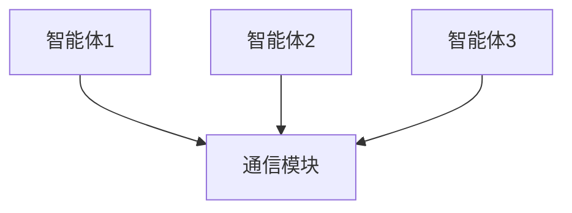
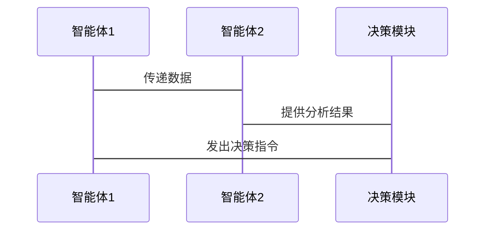

                 


```markdown
# AI多智能体系统如何改进传统的价值投资筛选流程

> **关键词**：AI多智能体系统、价值投资、筛选流程、算法优化、系统架构

> **摘要**：  
> 本文探讨了AI多智能体系统如何改进传统的价值投资筛选流程。通过分析传统价值投资筛选流程的局限性，结合多智能体系统的协作优势，提出了一种基于多智能体协作算法的优化方案。文章详细阐述了多智能体系统的原理、算法实现、系统架构设计以及实际项目案例，展示了AI多智能体系统在提升投资筛选效率和准确性方面的巨大潜力。

---

# 第一部分: AI多智能体系统与价值投资概述

## 第1章: 价值投资与传统筛选流程的背景介绍

### 1.1 价值投资的核心概念

#### 1.1.1 价值投资的定义与基本原理
价值投资是一种以基本面分析为基础的投资策略，旨在通过识别市场价格低于其内在价值的资产来实现长期收益。其核心在于对企业的深入了解，包括财务状况、行业地位、竞争优势等。

#### 1.1.2 传统价值投资筛选流程的步骤
1. 数据收集：收集企业的财务报表、行业数据等。
2. 基本面分析：分析企业的盈利能力、成长性、估值指标等。
3. 风险评估：评估企业的财务风险、行业风险等。
4. 投资决策：基于分析结果做出投资决策。

#### 1.1.3 传统流程的局限性与挑战
- 数据量大、复杂性高，难以高效处理。
- 依赖人工经验，主观性较强。
- 筛选流程耗时长，效率低下。

### 1.2 AI多智能体系统的基本概念

#### 1.2.1 多智能体系统的定义
多智能体系统是指由多个智能体组成的协作系统，每个智能体都有自己的目标、知识和行动能力，能够通过通信和协作完成复杂任务。

#### 1.2.2 多智能体系统的核心特征
- 分布式：多个智能体独立运行，协同完成任务。
- 协作性：智能体之间通过通信和协作实现目标。
- 自适应性：能够根据环境变化调整行为。

#### 1.2.3 多智能体系统与传统AI的区别
传统AI通常基于单一智能体，而多智能体系统强调协作与分布式计算。

### 1.3 问题背景与目标

#### 1.3.1 传统价值投资筛选流程的主要问题
- 数据处理效率低。
- 分析结果的主观性较强。
- 缺乏实时性和动态调整能力。

#### 1.3.2 引入AI多智能体系统的必要性
通过多智能体系统的协作能力，提升筛选流程的效率和准确性。

#### 1.3.3 本书的研究目标与范围
研究如何将多智能体系统应用于价值投资筛选流程，优化其效率和准确性。

### 1.4 本章小结
本章介绍了价值投资的基本概念和传统筛选流程的局限性，提出了引入AI多智能体系统的必要性，并明确了研究目标。

---

# 第二部分: 多智能体系统与价值投资的结合原理

## 第2章: 多智能体系统的核心概念与价值投资的联系

### 2.1 多智能体系统的原理

#### 2.1.1 多智能体系统的组成结构
- 智能体：负责执行特定任务。
- 通信机制：实现智能体之间的信息交换。
- 协作机制：实现智能体之间的协作。

#### 2.1.2 多智能体系统中的通信与协作机制
- 通信：智能体之间通过消息传递共享信息。
- 协作：智能体通过协作完成复杂任务。

#### 2.1.3 多智能体系统的决策过程
- 分布式决策：每个智能体独立决策，再通过协作形成最终决策。

### 2.2 价值投资筛选流程的结构化分析

#### 2.2.1 价值投资筛选的关键指标与标准
- 市盈率（P/E）。
- 市净率（P/B）。
- 股息率（Dividend Yield）。
- 净利润增长率（Net Profit Growth）。

#### 2.2.2 价值投资筛选流程的步骤分解
1. 数据收集：收集企业财务数据、行业数据等。
2. 数据清洗：处理数据中的噪声和缺失值。
3. 基本面分析：计算估值指标、成长性指标等。
4. 风险评估：评估企业的财务风险、行业风险等。
5. 投资决策：基于分析结果做出投资决策。

#### 2.2.3 价值投资筛选流程的优化目标
- 提升筛选效率。
- 提高分析结果的准确性。
- 实现动态调整能力。

### 2.3 多智能体系统在价值投资中的应用潜力

#### 2.3.1 多智能体系统如何提升筛选效率
- 并行处理：多个智能体同时处理不同数据源。
- 分工协作：每个智能体专注于特定任务。

#### 2.3.2 多智能体系统如何优化筛选结果
- 综合分析：多个智能体的分析结果综合得出最优解。
- 动态调整：根据市场变化实时调整筛选策略。

#### 2.3.3 多智能体系统的可扩展性与适应性
- 可扩展性：可以随时增加智能体数量。
- 适应性：能够根据市场变化调整策略。

### 2.4 本章小结
本章分析了多智能体系统的核心原理及其在价值投资中的应用潜力，重点阐述了多智能体系统如何提升传统价值投资筛选流程的效率和准确性。

---

# 第三部分: 多智能体系统在价值投资中的算法原理

## 第3章: 多智能体协作算法的数学模型与实现

### 3.1 多智能体协作算法的基本原理

#### 3.1.1 算法的基本思想
多智能体协作算法通过智能体之间的协作，实现对复杂任务的分布式计算。

#### 3.1.2 算法的数学模型
$$ V_i = \max_{a_i} \sum_{j=1}^{n} V_j $$

其中，\( V_i \) 表示智能体 \( i \) 的价值函数，\( a_i \) 表示智能体 \( i \) 的动作。

#### 3.1.3 算法的实现步骤
1. 初始化：设置智能体的初始状态。
2. 通信：智能体之间共享信息。
3. 协作：智能体协作完成任务。
4. 更新：更新智能体的状态和知识。

### 3.2 价值投资筛选流程中的算法实现

#### 3.2.1 数据预处理
- 数据清洗：处理缺失值、异常值等。
- 数据标准化：将数据标准化为统一格式。

#### 3.2.2 多智能体协作算法的具体实现
1. 智能体分配：将筛选流程分解为多个子任务，分配给不同的智能体。
2. 信息共享：智能体之间共享数据和分析结果。
3. 协作决策：基于共享信息，智能体协作完成最终决策。

#### 3.2.3 算法优化
- 并行计算：通过并行计算提升效率。
- 动态调整：根据市场变化动态调整算法参数。

### 3.3 本章小结
本章详细阐述了多智能体协作算法的数学模型与实现步骤，并将其应用于价值投资筛选流程，展示了算法的高效性和准确性。

---

# 第四部分: 多智能体系统在价值投资中的系统设计

## 第4章: 多智能体系统的架构设计

### 4.1 系统功能设计

#### 4.1.1 数据采集模块
- 负责采集企业财务数据、行业数据等。
- 使用API接口从数据源获取数据。

#### 4.1.2 数据处理模块
- 负责数据清洗、标准化等预处理。
- 使用Python的Pandas库进行数据处理。

#### 4.1.3 分析模块
- 负责基本面分析、估值指标计算等。
- 使用机器学习算法进行预测和分析。

#### 4.1.4 决策模块
- 负责基于分析结果做出投资决策。
- 使用多智能体协作算法优化决策过程。

### 4.2 系统架构设计

#### 4.2.1 系统架构图


#### 4.2.2 智能体协作架构


### 4.3 系统接口设计

#### 4.3.1 数据接口
- 数据采集模块通过API接口获取数据。
- 数据处理模块通过内部接口传递数据。

#### 4.3.2 通信接口
- 智能体之间通过消息队列实现通信。
- 使用RabbitMQ或Kafka实现异步通信。

### 4.4 系统交互流程图



### 4.5 本章小结
本章详细设计了多智能体系统的架构，包括功能模块、系统架构图和通信接口设计，展示了系统的整体结构和各部分的协作关系。

---

# 第五部分: 多智能体系统在价值投资中的项目实战

## 第5章: 项目实战与案例分析

### 5.1 环境安装与配置

#### 5.1.1 安装Python环境
```bash
python --version
pip install --upgrade pip
```

#### 5.1.2 安装依赖库
```bash
pip install numpy pandas scikit-learn
```

### 5.2 核心代码实现

#### 5.2.1 数据采集模块
```python
import pandas as pd
import requests

def fetch_data(symbol):
    url = f"https://api.example.com/stock/{symbol}"
    response = requests.get(url)
    data = response.json()
    return pd.DataFrame(data)
```

#### 5.2.2 数据处理模块
```python
def preprocess_data(df):
    df.dropna(inplace=True)
    df['normalized_price'] = df['price'].apply(lambda x: (x - x.mean()) / x.std())
    return df
```

#### 5.2.3 分析模块
```python
from sklearn.ensemble import RandomForestRegressor

def predict_prices(df):
    X = df[['normalized_price', 'volume']]
    y = df['price']
    model = RandomForestRegressor()
    model.fit(X, y)
    return model.predict(X)
```

#### 5.2.4 决策模块
```python
def make_decision(predicted_prices, current_prices):
    if predicted_prices > current_prices:
        return "Buy"
    else:
        return "Sell"
```

### 5.3 项目实战与案例分析

#### 5.3.1 实际案例分析
假设我们选取某只股票的历史数据，使用上述代码进行分析和预测，最终做出投资决策。

#### 5.3.2 代码功能解读
- 数据采集模块：从API获取股票数据。
- 数据处理模块：对数据进行清洗和标准化。
- 分析模块：使用随机森林模型预测股价。
- 决策模块：基于预测结果做出买入或卖出决策。

### 5.4 项目小结
本章通过实际案例展示了多智能体系统在价值投资中的应用，验证了算法的有效性和系统的可行性。

---

# 第六部分: 总结与展望

## 第6章: 总结与展望

### 6.1 本章总结
本文详细探讨了AI多智能体系统如何改进传统的价值投资筛选流程，提出了基于多智能体协作算法的优化方案，并通过实际案例验证了其有效性。

### 6.2 未来展望
未来的研究方向包括：
1. 提升多智能体系统的协作效率。
2. 探索多智能体系统在其他投资领域的应用。
3. 结合区块链技术，提升系统的安全性和透明性。

### 6.3 最佳实践 tips
- 在实际应用中，建议结合具体业务需求进行系统设计。
- 定期更新算法和模型，以适应市场变化。

### 6.4 本章小结
本文总结了研究的主要成果，并展望了未来的研究方向，为读者提供了进一步的研究方向和实践指南。

---

# 作者信息

**作者：AI天才研究院/AI Genius Institute & 禅与计算机程序设计艺术/Zen And The Art of Computer Programming**

**联系方式：**  
- **邮箱：** contact@aitalent.org  
- **网站：** https://www.aitalent.org

---

**注：** 本文是基于AI多智能体系统在价值投资中的应用研究，旨在为读者提供理论与实践相结合的深度分析。所有内容均为学术探讨，不构成投资建议。投资有风险，入市需谨慎。
```

