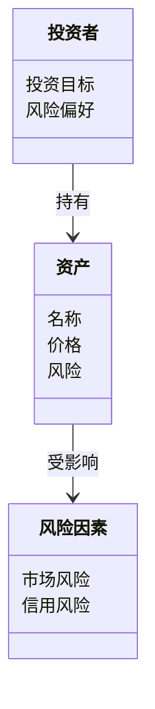
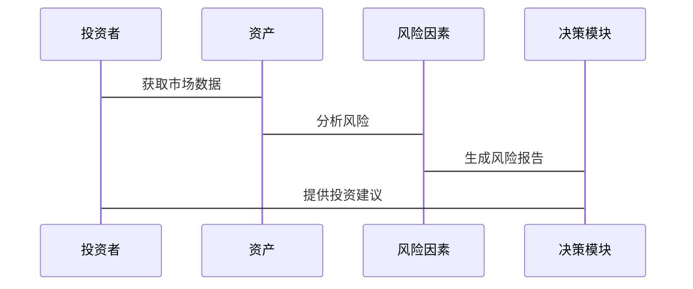

                 


# AI多智能体系统如何改进传统的价值投资风险控制方法

---

## 关键词：  
AI多智能体系统、价值投资、风险控制、金融建模、投资组合优化、风险管理

---

## 摘要：  
本文探讨了AI多智能体系统如何优化传统的价值投资风险控制方法。通过分析多智能体系统的协同机制，结合价值投资的核心要素，提出了基于AI的多智能体协同风险控制框架。该框架通过分布式计算、博弈论模型和自适应学习算法，实现了对传统风险控制方法的改进与提升，为金融投资领域提供了新的思路和解决方案。

---

# 第一部分：价值投资与风险控制的背景介绍

## 第1章：价值投资的核心概念

### 1.1 价值投资的定义与历史发展  
- 价值投资：以内在价值为核心，通过分析企业的基本面来判断其投资价值。  
- 历史发展：从格雷厄姆的“烟蒂投资”到巴菲特的“价值投资”，再到现代的量化投资方法。  

### 1.2 价值投资的核心要素与原则  
- 核心要素：企业基本面（营收、利润、负债等）、行业地位、管理层能力、竞争优势。  
- 价值投资原则：安全边际、长期持有、逆向思维。  

### 1.3 价值投资在现代金融中的地位与作用  
- 现代价值投资结合了量化分析和基本面分析，成为机构投资的重要策略。  

## 第2章：风险控制的传统方法  

### 2.1 风险控制的基本概念与目标  
- 风险控制：通过量化和管理投资组合中的风险因素，降低潜在损失。  
- 目标：在保证收益的前提下，降低投资组合的波动性和潜在损失。  

### 2.2 传统风险控制方法的优缺点  
- 优点：简单易懂，易于实施。  
- 缺点：静态、线性化，难以应对复杂多变的市场环境。  

### 2.3 传统价值投资风险控制的局限性  
- 传统方法依赖于经验判断，缺乏数据驱动的优化。  
- 无法实时捕捉市场动态，难以应对突发事件。  

## 第3章：AI多智能体系统的核心概念  

### 3.1 多智能体系统的定义与特点  
- 多智能体系统：由多个相互作用的智能体组成的分布式系统，各智能体通过协同完成复杂任务。  
- 特点：分布式计算、自主性、反应性、协同性。  

### 3.2 AI多智能体系统的组成与功能  
- 组成：智能体、通信机制、协同算法、决策模型。  
- 功能：数据采集、分析、决策、反馈。  

### 3.3 AI多智能体系统与传统AI的区别  
| 特性               | 传统AI               | AI多智能体系统         |  
|--------------------|----------------------|-----------------------|  
| 计算方式           | 中央化               | 分布式                 |  
| 决策方式           | 单点决策             | 多点协作、动态调整       |  
| 应用场景           | 单任务               | 多任务、复杂场景         |  

---

# 第二部分：AI多智能体系统在价值投资中的应用

## 第4章：AI多智能体系统与价值投资风险控制的核心概念  

### 4.1 多智能体系统在投资决策中的作用  
- 数据采集与分析：实时收集市场数据，识别潜在投资机会。  
- 智能体协同：多个智能体分别负责不同的分析任务，如基本面分析、市场情绪分析。  

### 4.2 多智能体系统的协同机制与优势  
- 协同机制：基于博弈论的分布式决策、动态任务分配、自适应学习。  
- 优势：提高决策的准确性和鲁棒性，降低单点故障风险。  

### 4.3 多智能体系统在风险控制中的具体应用  
- 投资组合优化：通过智能体协同，动态调整投资组合以降低风险。  
- 市场风险预警：实时监控市场波动，提前识别潜在风险。  

## 第5章：价值投资风险控制的系统架构  

### 5.1 价值投资风险控制的系统组成  
- 数据采集模块：收集企业财务数据、市场数据、新闻数据。  
- 分析模块：包括基本面分析、风险评估、投资组合优化。  
- 决策模块：基于多智能体协同的决策机制，生成投资策略。  

### 5.2 系统的输入、输出与目标  
- 输入：市场数据、企业基本面数据、投资者风险偏好。  
- 输出：投资组合建议、风险预警、实时调整策略。  
- 目标：在控制风险的前提下，最大化投资收益。  

## 第6章：AI多智能体系统与价值投资风险控制的联系  

### 6.1 多智能体系统如何优化风险控制  
- 通过分布式计算和协同学习，提高风险评估的准确性和实时性。  

### 6.2 多智能体系统在投资组合优化中的应用  
- 通过智能体间的协作，优化投资组合的资产配置和风险分散。  

### 6.3 多智能体系统在市场风险预警中的作用  
- 实时监控市场动态，通过多智能体协同分析，提前识别潜在风险。  

---

# 第三部分：AI多智能体系统的算法原理与数学模型  

## 第7章：多智能体系统的协同算法  

### 7.1 多智能体系统的基本算法  
- 分布式计算算法：任务分解、协同计算、结果汇总。  
- 博弈论算法：纳什均衡、Stackelberg模型。  

### 7.2 基于博弈论的多智能体协同机制  
- 竞争与合作：智能体之间通过博弈论模型实现协同决策。  
- 动态调整：根据市场变化实时调整策略。  

## 第8章：价值投资风险控制的数学模型  

### 8.1 投资组合风险的数学表达  
$$\text{风险} = \sqrt{\sum_{i=1}^{n} w_i^2 \sigma_i^2}$$  
其中，\(w_i\)为资产\(i\)的权重，\(\sigma_i^2\)为资产\(i\)的方差。  

### 8.2 风险价值（VaR）与风险调整收益（RAROC）的计算公式  
- VaR：  
$$\text{VaR} = \alpha \times \sigma$$  
其中，\(\alpha\)为分位数，\(\sigma\)为投资组合的标准差。  
- RAROC：  
$$\text{RAROC} = \frac{\text{净利润}}{\text{风险资本}}$$  

---

# 第四部分：系统分析与架构设计  

## 第9章：系统功能设计  

### 9.1 领域模型（Mermaid 类图）  


### 9.2 系统架构设计（Mermaid 架构图）  
```mermaid
container 多智能体系统 {
    投资者
    资产
    风险因素
    决策模块
}
```

### 9.3 系统接口设计与交互流程（Mermaid 序列图）  


---

# 第五部分：项目实战  

## 第10章：项目环境安装与核心实现  

### 10.1 环境安装  
- Python 3.8+  
- 网络库（如 requests）  
- 数据分析库（如 pandas、numpy）  
- 可视化库（如 matplotlib）  

### 10.2 核心代码实现  

#### 10.2.1 数据采集模块  
```python
import requests
import pandas as pd

def get_market_data(symbol):
    url = f"https://api.example.com/stock/{symbol}"
    response = requests.get(url)
    data = response.json()
    return pd.DataFrame(data)
```

#### 10.2.2 风险评估模块  
```python
def calculate_risk(portfolio):
    variance = portfolio.var()
    std_deviation = variance**0.5
    return std_deviation
```

## 第11章：案例分析与优化  

### 11.1 案例分析  
- 案例背景：假设一个价值投资者投资于科技股，希望通过多智能体系统优化投资组合。  
- 分析过程：通过多智能体协同，优化资产配置，降低投资组合的波动性。  

### 11.2 优化方案  
- 增加市场数据的实时性，提高风险预警的及时性。  
- 引入机器学习算法，提升风险评估的准确性。  

---

# 第六部分：总结与展望  

## 第12章：总结与扩展阅读  

### 12.1 本章总结  
- AI多智能体系统通过分布式计算和协同学习，显著提升了传统价值投资的风险控制能力。  
- 其优势在于实时性、准确性和鲁棒性，为金融投资提供了新的思路。  

### 12.2 未来展望  
- 结合区块链技术，提升系统的安全性和透明度。  
- 探索更多应用场景，如智能投顾、量化交易等。  

---

# 作者：AI天才研究院 & 禅与计算机程序设计艺术

