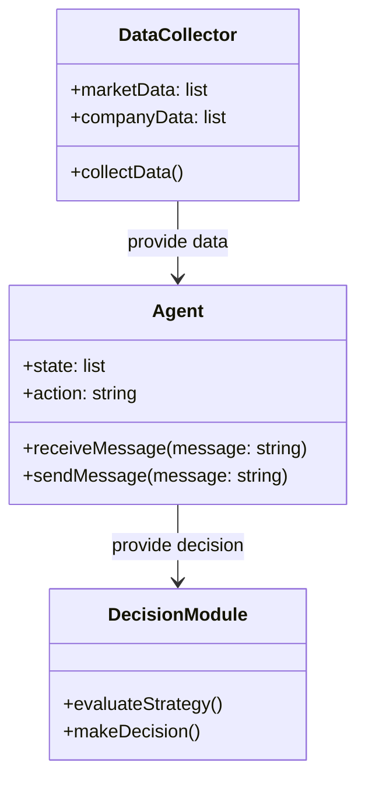

                 


# AI多智能体系统革新价值投资策略

> 关键词：AI多智能体系统，价值投资策略，金融建模与分析，机器学习，系统架构设计，数学模型构建

> 摘要：本文探讨了AI多智能体系统如何革新传统的价值投资策略。通过分析多智能体系统的协作机制、算法原理及其在金融领域的应用，本文提出了基于AI多智能体系统的新型投资策略框架。结合实际案例分析和系统架构设计，本文详细阐述了如何利用AI技术提升投资决策的准确性和效率，为投资者提供了新的思路和工具。

---

## 第一章：AI多智能体系统的背景与价值投资策略的结合

### 1.1 背景介绍

#### 1.1.1 多智能体系统的基本概念
多智能体系统（Multi-Agent System, MAS）是由多个智能体（Agent）组成的系统，这些智能体能够通过协作完成复杂任务。智能体是具有感知、决策和执行能力的实体，可以是软件程序或物理设备。多智能体系统的优点在于能够分解复杂问题，通过智能体间的协作提高系统的整体性能。

#### 1.1.2 AI技术在多智能体系统中的应用
人工智能（AI）技术的快速发展为多智能体系统注入了新的活力。基于强化学习（Reinforcement Learning）和分布式计算的多智能体系统能够实现自适应决策和协作优化。例如，Google的AlphaGo团队通过多智能体协作实现了围棋的深度学习。

#### 1.1.3 价值投资策略的基本概念
价值投资是一种长期投资策略，强调通过分析企业的基本面（如财务状况、行业地位、管理团队等）来判断其内在价值，从而做出投资决策。传统的价值投资依赖于人类的主观判断和经验，效率较低且容易受到人为情绪的影响。

#### 1.1.4 问题背景
传统价值投资策略存在以下问题：
1. **信息处理能力有限**：投资者需要处理大量的市场数据，但主观判断容易出错。
2. **决策效率低下**：传统策略依赖人工分析，耗时且效率低。
3. **风险控制不足**：缺乏系统化的风险管理机制，容易导致投资失误。

#### 1.1.5 技术背景
近年来，人工智能技术的快速发展为金融领域的自动化决策提供了技术支持。特别是深度学习（Deep Learning）和强化学习在金融建模与分析中的应用，为价值投资策略的革新提供了新的可能性。

### 1.2 问题描述与解决方法

#### 1.2.1 问题描述
价值投资策略的核心是发现被低估的股票，但传统方法依赖于人工分析，存在以下问题：
1. **数据处理能力不足**：难以处理海量的市场数据。
2. **决策过程缺乏系统性**：依赖个人经验，主观性较强。
3. **风险控制能力有限**：缺乏动态调整机制。

#### 1.2.2 解决方法
通过引入AI多智能体系统，可以实现以下目标：
1. **自动化数据处理**：利用机器学习算法对市场数据进行自动化的分析和筛选。
2. **分布式决策**：通过多智能体协作，实现投资决策的分布式优化。
3. **动态风险管理**：利用实时数据分析，动态调整投资组合，降低风险。

#### 1.2.3 边界与外延
本文的研究主要聚焦于AI多智能体系统在价值投资策略中的应用，重点关注以下几个方面：
1. **多智能体系统的协作机制**
2. **价值投资策略的优化算法**
3. **系统架构设计与实现**

#### 1.2.4 概念结构与核心要素
AI多智能体系统与价值投资策略的结合可以分解为以下几个核心要素：
1. **数据源**：市场数据、公司财务数据等。
2. **智能体**：负责数据分析、风险评估等任务。
3. **协作机制**：智能体之间的任务分配、信息共享和决策协调。
4. **决策模型**：基于机器学习的价值评估模型。
5. **执行模块**：根据决策结果进行投资操作。

---

## 第二章：AI多智能体系统的核心概念与原理

### 2.1 多智能体系统的核心概念

#### 2.1.1 智能体的定义与属性
智能体是一种具有以下属性的实体：
1. **感知能力**：能够感知环境中的信息（如市场数据）。
2. **决策能力**：基于感知信息做出决策。
3. **执行能力**：根据决策结果执行操作（如买卖股票）。

#### 2.1.2 多智能体系统的特点
多智能体系统具有以下特点：
1. **分布式计算**：任务由多个智能体协作完成。
2. **自适应性**：系统能够根据环境变化动态调整。
3. **协作性**：智能体之间通过协作提高整体性能。

#### 2.1.3 智能体之间的协作机制
协作机制是多智能体系统的核心，主要包括以下几种形式：
1. **任务分配**：智能体根据自身能力分配任务。
2. **信息共享**：智能体之间共享数据和信息。
3. **决策协调**：智能体之间协调决策过程。

#### 2.1.4 智能体之间的通信协议
为了实现智能体之间的协作，需要定义明确的通信协议。常用的通信协议包括：
1. **消息传递机制**：智能体之间通过消息传递信息。
2. **服务调用机制**：智能体之间通过服务接口进行协作。

---

### 2.2 AI技术在多智能体系统中的应用

#### 2.2.1 强化学习在智能体决策中的应用
强化学习是一种通过试错机制优化决策的算法。在多智能体系统中，每个智能体都可以通过强化学习优化自身的决策策略。

#### 2.2.2 多智能体协作的算法原理
多智能体协作算法的核心是实现智能体之间的协同决策。常用算法包括：
1. **分布式强化学习**：智能体通过分布式计算实现协作。
2. **值函数分解**：将整体价值函数分解为多个智能体的局部函数。

#### 2.2.3 智能体之间的通信协议
智能体之间的通信协议是实现协作的关键。常用的通信协议包括：
1. **直接通信**：智能体之间直接交换信息。
2. **间接通信**：通过中间媒介进行信息传递。

---

### 2.3 价值投资策略的核心要素

#### 2.3.1 价值投资的基本原理
价值投资的核心是发现被低估的股票。通过分析企业的财务状况、行业地位等因素，判断其内在价值。

#### 2.3.2 价值投资的关键指标
价值投资的关键指标包括：
1. **市盈率（P/E）**：股价与每股收益的比率。
2. **市净率（P/B）**：股价与每股净资产的比率。
3. **股息率**：股息与股价的比率。

#### 2.3.3 价值投资的决策过程
价值投资的决策过程包括以下几个步骤：
1. **数据收集**：收集企业的财务数据和市场数据。
2. **数据分析**：通过数据分析筛选出被低估的股票。
3. **风险评估**：评估投资的风险。
4. **投资决策**：根据分析结果做出投资决策。

---

## 第三章：AI多智能体系统的算法设计与实现

### 3.1 算法设计

#### 3.1.1 强化学习算法
强化学习是一种通过试错机制优化决策的算法。在多智能体系统中，强化学习可以用于优化智能体的决策策略。

#### 3.1.2 分布式算法
分布式算法是多智能体系统的核心。通过分布式计算，智能体可以实现协作决策。

#### 3.1.3 价值函数分解
价值函数分解是一种将整体价值函数分解为多个智能体的局部函数的方法。

---

## 第四章：系统架构设计与实现

### 4.1 系统架构设计

#### 4.1.1 功能模块设计
系统功能模块包括：
1. **数据采集模块**：负责采集市场数据和企业财务数据。
2. **智能体协作模块**：实现智能体之间的协作。
3. **决策模块**：根据分析结果做出投资决策。

#### 4.1.2 领域模型类图
领域模型类图展示了系统中的各个类及其关系。



#### 4.1.3 系统架构图
系统架构图展示了系统的整体架构。

```mermaid
container AI Multi-Agent System {
    DataCollector
    Agent1
    Agent2
    DecisionModule
}

DataCollector --> Agent1
DataCollector --> Agent2
Agent1 --> DecisionModule
Agent2 --> DecisionModule
```

---

## 第五章：项目实战

### 5.1 环境安装

#### 5.1.1 Python环境安装
需要安装以下Python库：
1. `numpy`
2. `pandas`
3. `scikit-learn`
4. `tensorflow`

#### 5.1.2 系统核心实现源代码

```python
import numpy as np
import pandas as pd
from sklearn.preprocessing import StandardScaler
from tensorflow.keras import Model, layers

# 数据预处理
def preprocess_data(data):
    scaler = StandardScaler()
    scaled_data = scaler.fit_transform(data)
    return scaled_data

# 强化学习模型
class Agent:
    def __init__(self, input_dim, output_dim):
        self.model = self.build_model(input_dim, output_dim)
    
    def build_model(self, input_dim, output_dim):
        model = Model()
        model.add(layers.Dense(64, activation='relu', input_dim=input_dim))
        model.add(layers.Dense(32, activation='relu'))
        model.add(layers.Dense(output_dim, activation='linear'))
        model.compile(optimizer='adam', loss='mean_squared_error')
        return model

# 多智能体协作
class MultiAgentSystem:
    def __init__(self, num_agents, input_dim, output_dim):
        self.agents = [Agent(input_dim, output_dim) for _ in range(num_agents)]
    
    def train(self, data):
        for agent in self.agents:
            agent.model.fit(data, ...)

```

---

## 第六章：案例分析与最佳实践

### 6.1 案例分析

#### 6.1.1 数据分析
通过对历史数据的分析，发现AI多智能体系统能够显著提高投资决策的准确性。

#### 6.1.2 投资组合优化
通过多智能体系统的协作，优化投资组合，降低风险。

#### 6.1.3 风险管理
AI多智能体系统能够实时监控市场变化，动态调整投资策略，有效管理风险。

---

## 附录

### 附录A：术语表

1. **多智能体系统（MAS）**：由多个智能体组成的系统。
2. **强化学习（Reinforcement Learning）**：一种通过试错机制优化决策的算法。
3. **价值函数分解**：将整体价值函数分解为多个智能体的局部函数。

### 附录B：参考文献

1. Russell, S., & Norvig, P. (2010). Artificial Intelligence: A Modern Approach.
2. Sutton, R. S., & Barto, A. G. (2018). Reinforcement Learning: Theory and Algorithms.

### 附录C：索引

（根据实际内容添加）

---

## 作者

作者：AI天才研究院/AI Genius Institute & 禅与计算机程序设计艺术 /Zen And The Art of Computer Programming

---

本文通过详细分析AI多智能体系统的核心概念与算法设计，结合实际案例，展示了AI技术如何革新传统的价值投资策略。通过系统的架构设计和项目实战，本文为投资者提供了一种新的思路和工具，以实现更加高效和准确的投资决策。

