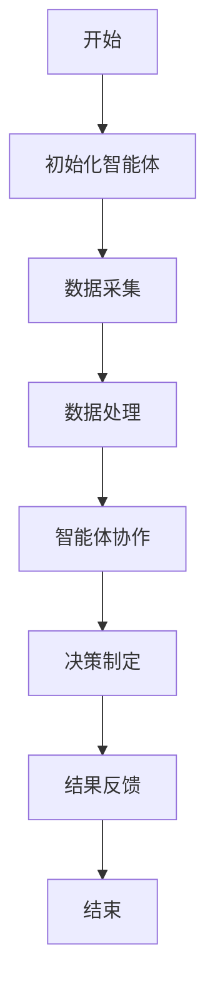
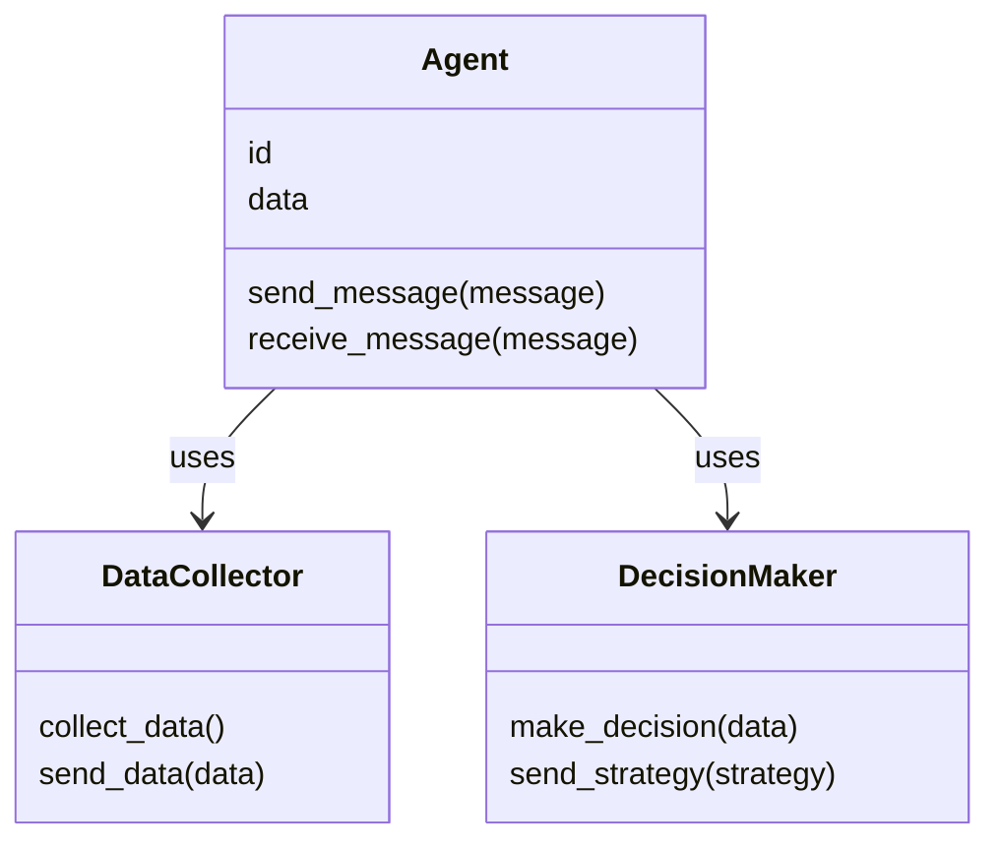
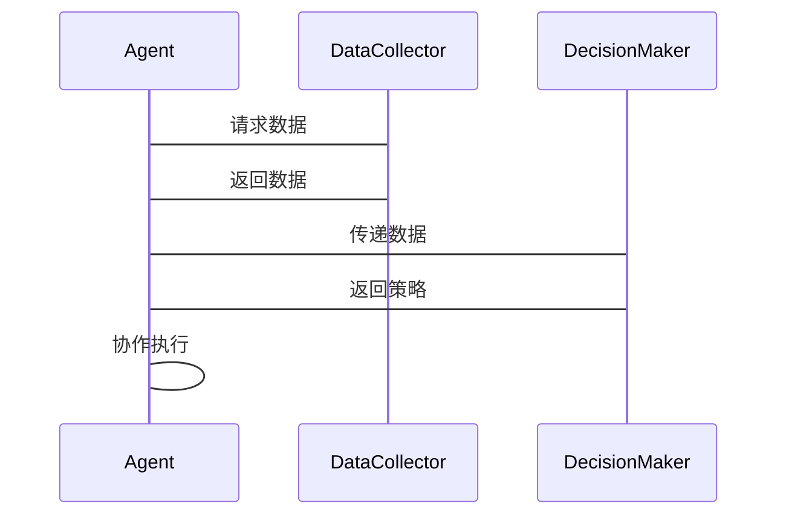

                 


# AI多智能体系统革新价值投资：传统与科技的完美融合

> 关键词：AI多智能体系统，价值投资，传统投资，科技融合，投资效率，决策准确性

> 摘要：本文探讨AI多智能体系统如何革新传统价值投资，通过分析其核心概念、算法原理、系统架构和实际案例，展示科技与传统投资的完美结合，提升投资效率和准确性。

---

## 第1章：AI多智能体系统的背景与价值投资的背景

### 1.1 AI多智能体系统的概念与发展

#### 1.1.1 多智能体系统的定义与特点

多智能体系统（Multi-Agent System, MAS）由多个智能体组成，每个智能体具备独立决策和协作能力。其特点包括分布性、协作性、反应性和动态性。

#### 1.1.2 AI技术在多智能体系统中的应用

AI技术赋予智能体学习、推理和自适应能力，使其能协作完成复杂任务。例如，在金融领域，多智能体可以实时分析市场数据，协同制定投资策略。

#### 1.1.3 多智能体系统与传统投资的结合

传统投资依赖人工分析，效率低且主观性强。多智能体系统通过自动化和数据驱动，提升投资决策的效率和准确性。

### 1.2 价值投资的背景与传统方法

#### 1.2.1 价值投资的基本概念

价值投资强调买入低于内在价值的资产，长期持有，追求安全边际。核心在于基本面分析和长期视角。

#### 1.2.2 传统价值投资的优缺点

优点：注重长期价值，风险较低。缺点：依赖人工分析，效率低，主观性强，难以应对复杂市场环境。

#### 1.2.3 价值投资的未来发展方向

技术驱动下，价值投资需结合AI和大数据，提升分析效率和准确性，实现传统与科技的融合。

### 1.3 AI多智能体系统与价值投资的结合意义

#### 1.3.1 提高投资效率的潜力

多智能体系统能快速分析海量数据，显著提升投资决策效率。

#### 1.3.2 增强投资决策的准确性

通过分布式协作和数据驱动，多智能体系统能提供更精准的投资建议。

#### 1.3.3 传统投资与科技融合的必要性

传统投资需借助科技手段，应对复杂市场，提升竞争力。

---

## 第2章：AI多智能体系统的核心概念与价值投资模型

### 2.1 多智能体系统的组成与功能

#### 2.1.1 多智能体系统的组成要素

包括智能体、环境、通信协议和协作机制。每个智能体负责特定任务，通过通信协作完成整体目标。

#### 2.1.2 各智能体之间的协作机制

采用分布式计算和通信协议，智能体间实时信息共享，协同决策。

#### 2.1.3 系统的动态适应性

系统具备自适应能力，能根据市场变化调整策略，确保持续高效运作。

### 2.2 价值投资模型的构建

#### 2.2.1 价值评估的关键指标

包括市盈率、市净率、股息率等，用于评估资产的内在价值。

#### 2.2.2 投资决策的逻辑框架

基于基本面分析，结合市场趋势，制定投资策略。

#### 2.2.3 价值投资模型的优化

通过机器学习优化模型参数，提升预测精度和稳定性。

### 2.3 多智能体系统与价值投资模型的结合

#### 2.3.1 数据流的整合与分析

多智能体系统整合市场数据、财务报表等，进行深度分析。

#### 2.3.2 多智能体协作的实现方式

采用分布式算法，智能体协同完成数据处理和投资决策。

#### 2.3.3 模型的实时更新与反馈

系统实时更新模型参数，根据市场反馈调整策略。

---

## 第3章：AI多智能体系统的算法原理与数学模型

### 3.1 多智能体协作算法

#### 3.1.1 分布式计算的基本原理

智能体独立计算，通过通信共享信息，协同完成任务。

#### 3.1.2 多智能体之间的通信机制

使用消息传递机制，确保智能体间高效通信和协作。

#### 3.1.3 协作算法的实现步骤

步骤包括初始化、信息共享、决策制定和结果反馈。

### 3.2 价值评估模型的数学公式

#### 3.2.1 基于多因子模型的价值评估

公式：$$ V = aP/E + bGrowth + cValue $$，其中V为价值，P/E为市盈率，Growth为增长率，Value为价值因子。

#### 3.2.2 时间序列分析的数学模型

使用ARIMA模型，公式：$$ y_t = \phi y_{t-1} + \theta \epsilon_{t-1} + \epsilon_t $$，用于预测市场趋势。

#### 3.2.3 风险调整后的回报计算

公式：$$ R = R_f + \beta (R_m - R_f) $$，其中R为预期回报，R_f为无风险利率，β为风险系数，R_m为市场回报。

### 3.3 算法流程图



代码示例：

```python
class Agent:
    def __init__(self, id):
        self.id = id
        self.data = {}

    def receive_message(self, message):
        # 处理消息并更新数据
        pass

    def send_message(self, message):
        # 发送消息到其他智能体
        pass

# 初始化多智能体系统
agents = [Agent(i) for i in range(5)]
```

---

## 第4章：系统架构设计与实现

### 4.1 问题场景分析

系统需处理复杂金融市场数据，实时分析并制定投资策略。

### 4.2 系统功能设计

设计包括数据采集、分析、决策制定和反馈优化等功能。

### 4.3 系统架构图



### 4.4 接口设计

API接口定义数据传输和交互规则，确保各组件协同工作。

### 4.5 系统交互流程



---

## 第5章：项目实战

### 5.1 环境安装

安装Python、TensorFlow、NumPy等工具，配置开发环境。

### 5.2 核心代码实现

```python
import numpy as np
import tensorflow as tf

class ValueModel:
    def __init__(self):
        self.model = tf.keras.Sequential([
            tf.keras.layers.Dense(64, activation='relu'),
            tf.keras.layers.Dense(1, activation='linear')
        ])
        self.model.compile(optimizer='adam', loss='mse')

    def train(self, X, y):
        self.model.fit(X, y, epochs=100, batch_size=32)

    def predict(self, X):
        return self.model.predict(X)
```

### 5.3 案例分析

使用股票数据训练模型，预测其内在价值，制定投资策略。

### 5.4 项目总结

系统实现了高效的价值评估和投资决策，展示了AI多智能体系统的优势。

---

## 作者：AI天才研究院 & 禅与计算机程序设计艺术

---

以上是《AI多智能体系统革新价值投资：传统与科技的完美融合》的技术博客文章，详细分析了AI多智能体系统在价值投资中的应用，结合理论与实践，展示了科技与传统投资的融合。

