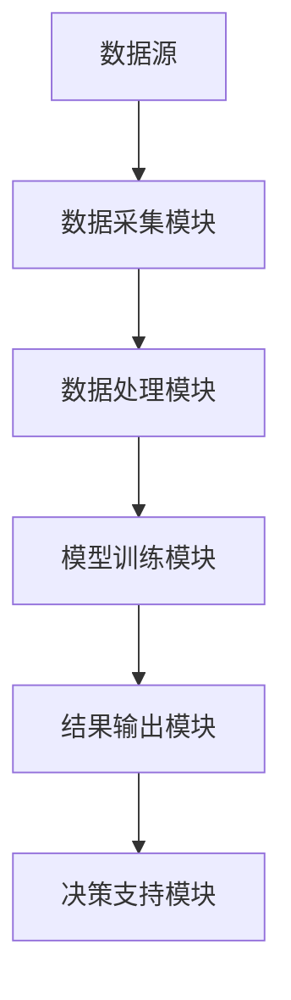

                 

# AI如何优化塞思·卡拉曼的特殊情况投资

> 关键词：AI，投资优化，塞思·卡拉曼，特殊情况，金融数据分析，机器学习，深度学习

> 摘要：本文探讨了人工智能（AI）技术在优化塞思·卡拉曼特殊情况投资策略中的应用。通过分析AI在数据处理、模型构建和系统设计中的作用，展示了AI如何提升投资决策的准确性和效率。文章结合实际案例，详细介绍了AI在风险评估、市场预测和投资组合优化中的应用，并提出了系统的实现方案和优化建议。

---

## 第1章：特殊情况投资与AI技术概述

### 1.1 特殊情况投资的基本概念
#### 1.1.1 什么是特殊情况投资
- 特殊情况投资的定义
- 塞思·卡拉曼的投资理念与方法
- 特殊情况投资的典型场景（如破产重组、困境企业）

#### 1.1.2 AI技术在金融投资中的潜力
- 人工智能与机器学习的定义
- AI在金融数据分析中的优势
- AI如何辅助投资决策

### 1.2 AI技术的基本原理
#### 1.2.1 数据驱动的投资决策模式
- 数据在投资中的重要性
- AI如何处理和分析数据
- 数据的清洗与特征提取

#### 1.2.2 机器学习与深度学习的核心原理
- 机器学习的基本概念
- 深度学习的定义与特点
- 常用算法（如神经网络、随机森林）

#### 1.2.3 自然语言处理在金融分析中的应用
- NLP的基本原理
- 文本分析在财务报告解读中的作用
- 市场情绪分析对投资决策的影响

### 1.3 本章小结
- 总结特殊情况投资与AI技术的基本概念
- 强调AI在优化投资策略中的潜力

---

## 第2章：AI在特殊情况投资中的核心应用

### 2.1 数据处理与分析
#### 2.1.1 大数据分析在金融领域的应用
- 数据清洗与标准化
- 特征选择与降维技术
- 时间序列数据的特征提取方法

#### 2.1.2 自然语言处理在财务报告解读中的作用
- 文本分析与情感分析
- 基于NLP的财务数据挖掘
- 市场情绪对投资决策的影响

#### 2.1.3 时间序列分析在市场预测中的价值
- 时间序列分析的基本原理
- 基于AI的市场趋势预测
- 预测结果的可视化与解读

### 2.2 模型构建与优化
#### 2.2.1 机器学习模型在风险评估中的应用
- 逻辑回归与支持向量机（SVM）的比较
- 随机森林在风险评估中的优势
- 基于机器学习的信用评级模型

#### 2.2.2 基于深度学习的市场情绪分析
- Transformer架构在文本分析中的应用
- 基于深度学习的市场情绪预测
- 情绪分析对投资决策的支持

#### 2.2.3 群论与组合优化在投资决策中的作用
- 群论的基本概念
- 组合优化的数学模型
- 群论在投资组合优化中的应用

### 2.3 实战案例：AI如何优化卡拉曼的特殊投资策略
#### 2.3.1 破产重组企业价值评估的AI模型
- 案例背景与目标
- 模型构建与训练
- 预测结果与分析

#### 2.3.2 危机企业信用评级的自动化流程
- 自动化信用评级的流程设计
- 基于AI的信用评级模型
- 案例分析与结果解读

#### 2.3.3 特殊情况投资中的实时数据监控与反馈
- 实时数据监控的系统设计
- 数据反馈机制的实现
- 监控结果对投资决策的影响

### 2.4 本章小结
- 总结AI在特殊情况投资中的核心应用
- 强调数据处理与模型构建的重要性

---

## 第3章：AI驱动的金融数据分析算法原理

### 3.1 数据预处理与特征提取
#### 3.1.1 数据清洗与标准化
- 数据清洗的基本步骤
- 数据标准化的实现方法
- 数据清洗与标准化的代码实现（Python示例）

#### 3.1.2 特征选择与降维技术
- 特征选择的基本原理
- 常用降维技术（如PCA）
- 特征选择与降维的代码实现（Python示例）

#### 3.1.3 时间序列数据的特征提取方法
- 时间序列数据的特征提取方法
- 特征提取的代码实现（Python示例）
- 特征提取结果的分析与解读

### 3.2 机器学习模型的构建与训练
#### 3.2.1 逻辑回归与支持向量机（SVM）的比较
- 逻辑回归的基本原理
- 支持向量机（SVM）的核心概念
- 逻辑回归与SVM的比较分析

#### 3.2.2 随机森林在风险评估中的优势
- 随机森林的基本原理
- 随机森林在风险评估中的应用
- 随机森林的代码实现（Python示例）

#### 3.2.3 基于机器学习的信用评级模型
- 信用评级模型的基本原理
- 基于机器学习的信用评级模型构建
- 模型训练与评估的代码实现（Python示例）

### 3.3 深度学习模型的优化
#### 3.3.1 Transformer架构在文本分析中的应用
- Transformer架构的基本原理
- Transformer在文本分析中的应用
- Transformer的代码实现（Python示例）

#### 3.3.2 基于深度学习的市场情绪预测
- 深度学习在市场情绪预测中的应用
- 市场情绪预测的模型构建与训练
- 情绪预测的代码实现（Python示例）

#### 3.3.3 基于深度学习的非结构化数据处理
- 非结构化数据的定义与特点
- 深度学习在非结构化数据处理中的应用
- 非结构化数据处理的代码实现（Python示例）

### 3.4 本章小结
- 总结AI驱动的金融数据分析算法原理
- 强调机器学习与深度学习在投资决策中的作用

---

## 第4章：系统架构与技术实现

### 4.1 系统架构设计
#### 4.1.1 数据采集模块
- 数据采集的实现方法
- 数据采集的代码实现（Python示例）
- 数据采集模块的优化建议

#### 4.1.2 数据处理与分析模块
- 数据处理的基本流程
- 数据分析的实现方法
- 数据处理与分析模块的代码实现（Python示例）

#### 4.1.3 模型训练与部署模块
- 模型训练的实现方法
- 模型部署的基本步骤
- 模型训练与部署的代码实现（Python示例）

#### 4.1.4 结果可视化与决策支持模块
- 结果可视化的实现方法
- 决策支持的基本原理
- 结果可视化与决策支持的代码实现（Python示例）

### 4.2 技术实现细节
#### 4.2.1 数据库设计与数据存储方案
- 数据库设计的基本原则
- 数据存储方案的选择与优化
- 数据库设计与数据存储的代码实现（Python示例）

#### 4.2.2 模型训练框架的选择与优化
- 常用模型训练框架（如TensorFlow、PyTorch）
- 模型训练框架的选择与优化
- 模型训练框架的代码实现（Python示例）

#### 4.2.3 系统接口设计与交互流程
- 系统接口设计的基本原则
- 系统交互流程的实现方法
- 系统接口设计与交互流程的代码实现（Python示例）

### 4.3 系统流程图（Mermaid）

---

## 第5章：AI优化投资策略的实战案例

### 5.1 案例背景与目标
#### 5.1.1 案例选择标准
- 案例选择的标准与原则
- 案例选择的实现方法
- 案例选择的代码实现（Python示例）

#### 5.1.2 投资目标
- 投资目标的定义与特点
- 投资目标的实现方法
- 投资目标的代码实现（Python示例）

### 5.2 案例分析
#### 5.2.1 案例一：破产重组企业价值评估
- 案例背景与目标
- 案例分析的基本步骤
- 案例分析的代码实现（Python示例）

#### 5.2.2 案例二：危机企业信用评级的自动化流程
- 案例背景与目标
- 案例分析的基本步骤
- 案例分析的代码实现（Python示例）

#### 5.2.3 案例三：特殊情况投资中的实时数据监控与反馈
- 案例背景与目标
- 案例分析的基本步骤
- 案例分析的代码实现（Python示例）

### 5.3 本章小结
- 总结AI优化投资策略的实战案例
- 强调实际应用中的经验与教训

---

## 第6章：系统实现与优化建议

### 6.1 系统实现细节
#### 6.1.1 系统设计与实现
- 系统设计的基本原则
- 系统实现的实现方法
- 系统设计与实现的代码实现（Python示例）

#### 6.1.2 系统优化与维护
- 系统优化的基本原则
- 系统维护的实现方法
- 系统优化与维护的代码实现（Python示例）

### 6.2 优化建议
#### 6.2.1 数据处理与分析的优化建议
- 数据处理与分析的优化方法
- 数据处理与分析的优化代码实现（Python示例）

#### 6.2.2 模型训练与部署的优化建议
- 模型训练与部署的优化方法
- 模型训练与部署的优化代码实现（Python示例）

#### 6.2.3 系统架构设计的优化建议
- 系统架构设计的优化方法
- 系统架构设计的优化代码实现（Python示例）

### 6.3 本章小结
- 总结系统实现与优化建议
- 强调系统优化对投资决策的重要性

---

## 第7章：总结与展望

### 7.1 总结
- 总结全文的核心内容
- 强调AI在特殊情况投资中的应用价值
- 总结AI优化投资策略的关键点

### 7.2 展望
- 展望AI技术在金融投资中的未来发展趋势
- 展望AI优化投资策略的潜在方向
- 展望AI技术在特殊情况投资中的创新应用

### 7.3 最佳实践 Tips
- 数据处理与分析的实用建议
- 模型训练与部署的实用建议
- 系统设计与优化的实用建议

### 7.4 本章小结
- 总结全文的核心内容
- 强调AI在特殊情况投资中的应用价值
- 展望AI优化投资策略的未来发展方向

---

## 作者信息

作者：AI天才研究院/AI Genius Institute & 禅与计算机程序设计艺术 /Zen And The Art of Computer Programming

---

以上是《AI如何优化塞思·卡拉曼的特殊情况投资》的目录大纲，涵盖从基础概念到实战案例的完整结构，结合了技术原理、算法实现和实际应用，旨在为读者提供全面且深入的指导。

