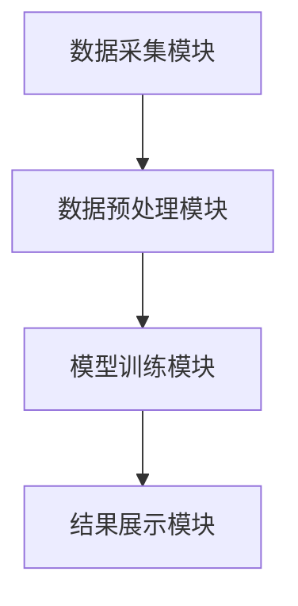
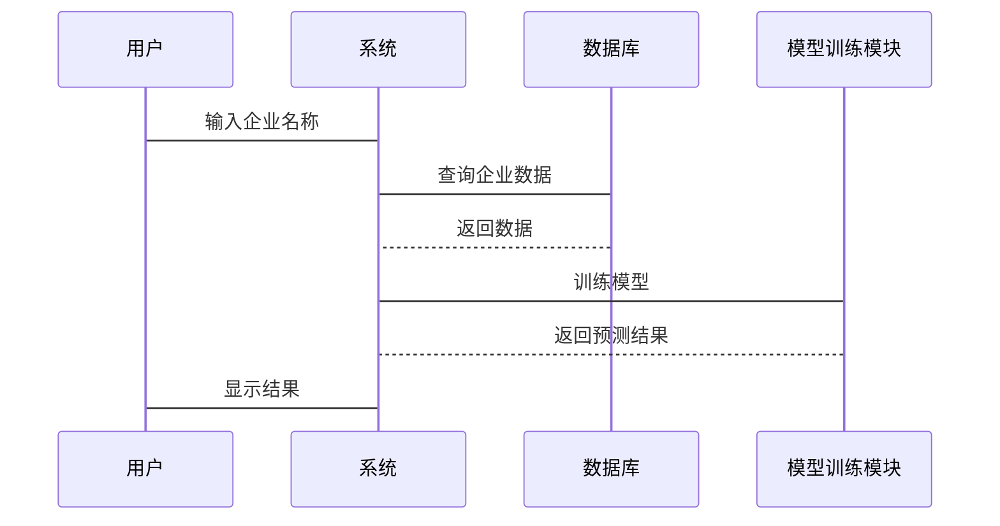

                 


# AI如何优化格雷厄姆的企业价值计算

> 关键词：AI，企业价值计算，格雷厄姆，机器学习，金融分析

> 摘要：本文探讨了如何利用人工智能技术优化格雷厄姆的企业价值计算方法，详细分析了AI在企业价值评估中的应用，包括算法原理、系统架构设计和项目实战案例。通过结合传统金融理论与现代AI技术，展示了如何提升企业价值计算的效率和准确性。

---

# 第1章: AI与企业价值计算的概述

## 1.1 企业价值计算的传统方法

### 1.1.1 格雷厄姆的企业价值理论

格雷厄姆是价值投资的鼻祖，他提出了“内在价值”的概念，认为企业的真实价值是其未来现金流的现值。格雷厄姆的价值计算方法主要基于以下几个步骤：

1. **预测未来现金流**：通过对企业财务报表的分析，预测未来的净利润。
2. **确定合适的折现率**：基于企业的风险水平，确定合理的折现率。
3. **计算现值**：将未来的现金流按照折现率折算到当前时点，得到企业的内在价值。

然而，传统的方法存在一些局限性，例如现金流预测的主观性较强，折现率的确定缺乏科学性，且难以处理大量非结构化数据。

### 1.1.2 传统企业价值计算的局限性

1. **数据依赖性**：传统方法主要依赖于财务报表数据，忽略了市场情绪、行业趋势等非财务因素。
2. **主观性**：现金流预测和折现率的选择往往依赖分析师的经验，容易受到主观因素的影响。
3. **计算复杂性**：对于大规模数据，手工计算效率低下，且容易出错。

### 1.1.3 企业价值计算的现代挑战

随着市场的复杂化和数据的爆炸式增长，传统的企业价值计算方法已经难以满足现代金融分析的需求。例如：

- 如何处理海量的非结构化数据（如新闻、社交媒体数据）？
- 如何实时更新企业价值评估结果？
- 如何在复杂的经济环境中快速做出决策？

---

## 1.2 AI技术的基本原理

### 1.2.1 人工智能的核心概念

人工智能（AI）是指模拟人类智能的计算机系统，能够执行如学习、推理、感知和决策等任务。AI的核心技术包括：

- **机器学习**：通过数据训练模型，使其能够从数据中自动学习规律。
- **深度学习**：基于人工神经网络的机器学习方法，能够处理复杂的非线性关系。
- **自然语言处理（NLP）**：处理和理解人类语言的技术，常用于文本数据分析。

### 1.2.2 机器学习与深度学习的区别

| **特征**       | **机器学习**                     | **深度学习**                     |
|----------------|----------------------------------|----------------------------------|
| 数据需求       | 数据量较小，依赖特征工程         | 数据量较大，自动提取特征         |
| 模型复杂度     | 模型简单，易于解释               | 模型复杂，难以解释               |
| 任务处理       | 适用于简单分类/回归任务         | 适用于复杂的非线性任务           |

### 1.2.3 AI在金融领域的应用潜力

AI在金融领域的应用非常广泛，包括：

- **股票预测**：通过分析历史价格和市场情绪，预测股票价格走势。
- **风险评估**：利用机器学习模型评估企业的信用风险。
- **欺诈检测**：通过异常检测技术识别 fraudulent transactions。
- **投资组合优化**：基于 AI 的组合优化算法，构建最优投资组合。

---

## 1.3 企业价值计算与AI的结合

### 1.3.1 AI如何优化企业价值计算

AI技术可以优化企业价值计算的以下几个方面：

1. **数据处理**：利用自然语言处理技术，从新闻、社交媒体等非结构化数据中提取有用信息。
2. **预测模型**：使用机器学习算法，构建更准确的现金流预测模型。
3. **自动化计算**：通过自动化工具，实时更新企业价值评估结果。

### 1.3.2 AI在企业价值评估中的优势

1. **数据处理能力**：AI能够处理海量的结构化和非结构化数据，提供更全面的分析。
2. **预测精度**：通过机器学习算法，预测未来现金流的准确性更高。
3. **实时性**：AI系统可以实时更新数据，提供最新的企业价值评估结果。

### 1.3.3 企业价值计算的未来趋势

随着AI技术的不断发展，企业价值计算将更加智能化和自动化。未来的趋势包括：

- **多模态数据融合**：将财务数据、文本数据、市场数据等多种数据源进行融合分析。
- **实时计算**：通过流数据处理技术，实现实时的企业价值评估。
- **自适应模型**：模型能够根据市场变化自动调整参数，提高适应性。

---

# 第2章: 企业价值计算的核心要素

## 2.1 企业价值的定义与计算公式

### 2.1.1 企业价值的定义

企业价值（Enterprise Value, EV）是企业整体价值的度量，包括股权价值和债权价值。其公式为：

$$
\text{EV} = \text{市场价值} - \text{债务价值} + \text{现金及等价物}
$$

### 2.1.2 传统企业价值计算的公式

格雷厄姆的企业价值计算公式为：

$$
\text{内在价值} = \frac{\text{净利润}}{\text{资本成本}}
$$

然而，这个公式过于简化，忽略了企业未来的现金流和成长性。

---

## 2.2 企业价值计算的输入数据

### 2.2.1 财务数据

- 营业收入
- 净利润
- 现金流
- 债务和资产

### 2.2.2 市场数据

- 股票价格
- 市盈率
- 市净率

### 2.2.3 其他影响因素

- 宏观经济指标
- 行业趋势
- 管理层质量

---

## 2.3 企业价值计算的输出结果

### 2.3.1 内在价值

企业的真实价值，与市场价值无关。

### 2.3.2 市场价值

基于市场交易得出的企业价值。

### 2.3.3 估值误差分析

通过比较内在价值和市场价值，分析估值误差的原因。

---

# 第3章: AI优化企业价值计算的数学模型

## 3.1 传统企业价值计算的数学模型

### 3.1.1 格雷厄姆模型的数学公式

$$
\text{内在价值} = \frac{\text{净利润}}{\text{资本成本}}
$$

### 3.1.2 该模型的局限性

- 忽略了未来现金流的增长性。
- 未考虑企业规模和行业差异。

---

## 3.2 基于机器学习的企业价值计算模型

### 3.2.1 算法选择

- 线性回归
- 支持向量回归（SVR）
- 神经网络

### 3.2.2 算法流程

1. **数据预处理**：清洗数据，处理缺失值，标准化特征。
2. **特征选择**：通过机器学习算法自动选择重要特征。
3. **模型训练**：使用训练数据训练模型。
4. **预测与评估**：对测试数据进行预测，并评估模型的准确性。

---

## 3.3 基于深度学习的企业价值计算模型

### 3.3.1 神经网络架构

- 输入层：接收企业相关的数据。
- 隐藏层：提取数据特征。
- 输出层：预测企业的内在价值。

### 3.3.2 模型训练

- 使用历史数据训练模型。
- 调整超参数（如学习率、批量大小）以优化模型性能。

---

## 3.4 模型评估与优化

### 3.4.1 评估指标

- �均方误差（MSE）
- R平方值
- 毛利率

### 3.4.2 模型优化

- 调整网络结构（如增加层数、改变节点数）。
- 使用正则化技术（如L1/L2正则化）防止过拟合。

---

# 第4章: 系统分析与架构设计

## 4.1 系统功能设计

### 4.1.1 功能模块

- 数据采集模块：从数据库中获取企业数据。
- 数据预处理模块：清洗和标准化数据。
- 模型训练模块：训练机器学习模型。
- 结果展示模块：可视化企业价值评估结果。

### 4.1.2 功能流程

1. 数据采集模块获取企业数据。
2. 数据预处理模块清洗数据。
3. 模型训练模块训练模型。
4. 结果展示模块展示结果。

---

## 4.2 系统架构设计

### 4.2.1 系统架构图



### 4.2.2 接口设计

- 数据接口：与数据库交互。
- 模型接口：与机器学习框架（如TensorFlow）交互。

---

## 4.3 系统交互设计

### 4.3.1 交互流程

1. 用户输入企业名称。
2. 系统从数据库中获取企业数据。
3. 系统训练模型，预测企业价值。
4. 系统展示结果。

### 4.3.2 交互序列图



---

# 第5章: 项目实战

## 5.1 环境安装

### 5.1.1 安装Python

```bash
python --version
pip install --upgrade pip
```

### 5.1.2 安装TensorFlow

```bash
pip install tensorflow
```

---

## 5.2 系统核心实现

### 5.2.1 数据预处理代码

```python
import pandas as pd
import numpy as np

# 读取数据
data = pd.read_csv('企业数据.csv')

# 删除缺失值
data = data.dropna()

# 标准化特征
from sklearn.preprocessing import StandardScaler
scaler = StandardScaler()
scaled_features = scaler.fit_transform(data.drop('企业价值', axis=1))
```

### 5.2.2 模型训练代码

```python
from sklearn.linear_model import LinearRegression

# 训练模型
model = LinearRegression()
model.fit(scaled_features, data['企业价值'])

# 预测结果
predictions = model.predict(scaled_features)
```

---

## 5.3 实际案例分析

### 5.3.1 数据来源

- 数据来源：公开的企业财务数据和市场数据。
- 数据清洗：处理缺失值和异常值。

### 5.3.2 模型评估

- 均方误差（MSE）：衡量预测值与真实值的差异。
- R平方值：衡量模型的拟合优度。

---

## 5.4 项目小结

通过AI技术优化企业价值计算，能够显著提高计算效率和准确性。机器学习和深度学习算法在企业价值评估中的应用，为企业投资者提供了更有力的决策支持。

---

# 第6章: 总结与展望

## 6.1 小结

本文详细探讨了AI如何优化格雷厄姆的企业价值计算方法，通过机器学习和深度学习技术，显著提高了计算的效率和准确性。

## 6.2 注意事项

在实际应用中，需要注意以下几点：

1. 数据的准确性和完整性。
2. 模型的可解释性。
3. 算法的计算效率。

## 6.3 未来展望

随着AI技术的不断发展，企业价值计算将更加智能化和自动化。未来的趋势包括：

- **多模态数据融合**：利用文本、图像等多种数据源进行分析。
- **实时计算**：通过流数据处理技术，实现实时的企业价值评估。
- **自适应模型**：模型能够根据市场变化自动调整参数，提高适应性。

---

# 作者：AI天才研究院/AI Genius Institute & 禅与计算机程序设计艺术/Zen And The Art of Computer Programming

