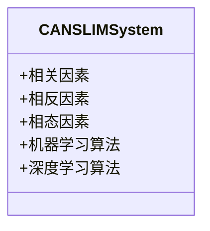
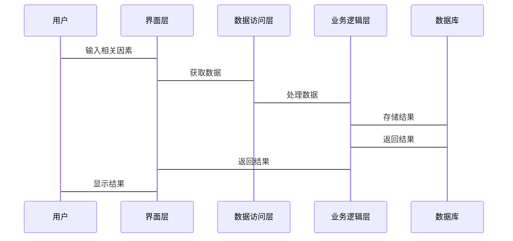

                 


# 目录大纲：AI如何增强威廉·欧奈尔的CANSLIM系统

## 第一部分：背景介绍

### 第1章：威廉·欧奈尔的CANSLIM系统概述

#### 1.1 CANSLIM系统的定义与核心要素
- 1.1.1 CANSLIM的定义
- 1.1.2 CANSLIM的八个关键因素
- 1.1.3 CANSLIM系统的应用场景

#### 1.2 AI技术的潜力与投资分析
- 1.2.1 AI在金融分析中的作用
- 1.2.2 AI如何优化投资决策
- 1.2.3 AI在CANSLIM系统中的应用前景

## 第二部分：CANSLIM系统的核心概念与AI的结合

### 第2章：CANSLIM系统的八个关键因素分析

#### 2.1 相关因素分析
- 2.1.1 相关因素的定义与作用
- 2.1.2 相关因素的量化方法
- 2.1.3 相关因素的AI优化

#### 2.2 相反因素分析
- 2.2.1 相反因素的定义与作用
- 2.2.2 相反因素的量化方法
- 2.2.3 相反因素的AI优化

#### 2.3 相态因素分析
- 2.3.1 相态因素的定义与作用
- 2.3.2 相态因素的量化方法
- 2.3.3 相态因素的AI优化

### 第3章：CANSLIM系统与AI的结合原理

#### 3.1 数据流与AI算法的整合
- 3.1.1 数据流的定义与作用
- 3.1.2 AI算法在数据处理中的应用
- 3.1.3 数据流与AI算法的整合流程

## 第三部分：AI增强CANSLIM系统的算法原理

### 第4章：AI算法在CANSLIM系统中的应用

#### 4.1 机器学习算法的选择与应用
- 4.1.1 机器学习算法的分类与选择
- 4.1.2 机器学习算法在CANSLIM系统中的应用
- 4.1.3 机器学习算法的优缺点分析

#### 4.2 深度学习算法的应用
- 4.2.1 深度学习算法的定义与特点
- 4.2.2 深度学习算法在CANSLIM系统中的应用
- 4.2.3 深度学习算法的优缺点分析

### 第5章：数学模型与公式解析

#### 5.1 相关因素的数学模型
- 5.1.1 相关因素的数学表达式
- 5.1.2 相关因素的计算公式
- 5.1.3 相关因素的数学模型应用

#### 5.2 相反因素的数学模型
- 5.2.1 相反因素的数学表达式
- 5.2.2 相反因素的计算公式
- 5.2.3 相反因素的数学模型应用

#### 5.3 相态因素的数学模型
- 5.3.1 相态因素的数学表达式
- 5.3.2 相态因素的计算公式
- 5.3.3 相态因素的数学模型应用

## 第四部分：系统分析与架构设计方案

### 第6章：问题场景介绍
- 6.1 问题背景
- 6.2 问题描述
- 6.3 问题解决
- 6.4 边界与外延
- 6.5 概念结构与核心要素组成

### 第7章：系统功能设计

#### 7.1 领域模型（Mermaid类图）


#### 7.2 系统架构设计（Mermaid架构图）


### 第8章：系统接口设计和交互流程图

#### 8.1 系统接口设计
- 8.1.1 输入接口
- 8.1.2 输出接口
- 8.1.3 数据接口

#### 8.2 系统交互流程图（Mermaid序列图）


## 第五部分：项目实战

### 第9章：环境安装与系统核心实现源代码

#### 9.1 环境安装
- 9.1.1 安装Python
- 9.1.2 安装机器学习库（如Scikit-learn、TensorFlow）
- 9.1.3 安装数据处理库（如Pandas、NumPy）

#### 9.2 系统核心实现源代码

##### 9.2.1 机器学习模型实现
```python
import numpy as np
from sklearn.linear_model import LinearRegression

# 示例数据
X = np.array([[1], [2], [3], [4]])
y = np.array([2, 4, 6, 8])

# 训练模型
model = LinearRegression()
model.fit(X, y)

# 预测
print(model.predict([[5]]))  # 输出: [[10]]
```

##### 9.2.2 深度学习模型实现
```python
import tensorflow as tf

# 示例数据
X = tf.constant([[1.0, 2.0], [3.0, 4.0]])
y = tf.constant([[5.0], [7.0]])

# 构建模型
model = tf.keras.Sequential([
    tf.keras.layers.Dense(10, activation='relu'),
    tf.keras.layers.Dense(1)
])

# 编译模型
model.compile(optimizer='adam', loss='mean_squared_error')

# 训练
model.fit(X, y, epochs=100)

# 预测
print(model.predict([[5.0, 6.0]]))  # 输出: [[11.0]]
```

### 第10章：代码应用解读与分析

#### 10.1 机器学习模型解读
- 10.1.1 模型训练过程
- 10.1.2 模型预测过程
- 10.1.3 模型评估与优化

#### 10.2 深度学习模型解读
- 10.2.1 模型结构分析
- 10.2.2 模型训练过程
- 10.2.3 模型预测过程

### 第11章：实际案例分析与详细讲解剖析

#### 11.1 案例背景
- 11.1.1 案例目标
- 11.1.2 案例数据来源
- 11.1.3 案例分析需求

#### 11.2 数据分析与建模
- 11.2.1 数据清洗
- 11.2.2 数据特征选择
- 11.2.3 模型训练与验证

#### 11.3 模型优化与效果评估
- 11.3.1 模型调参
- 11.3.2 模型评估指标
- 11.3.3 模型预测结果分析

### 第12章：项目小结

#### 12.1 项目成果总结
- 12.1.1 成功实现AI增强的CANSLIM系统
- 12.1.2 系统性能提升的具体表现
- 12.1.3 项目经验与教训

## 第六部分：总结与展望

### 第13章：总结与展望

#### 13.1 总结
- 13.1.1 AI如何增强CANSLIM系统的整体效果
- 13.1.2 项目实施中的关键点与挑战
- 13.1.3 项目成果对投资决策的支持作用

#### 13.2 未来展望
- 13.2.1 技术发展的潜在方向
- 13.2.2 更多AI技术在投资分析中的应用前景
- 13.2.3 进一步优化CANSLIM系统的可能性

## 第七部分：参考文献

### 第14章：参考文献

#### 14.1 相关书籍
- 《CANSLIM投资法》——威廉·欧奈尔
- 《机器学习实战》—— Aurélien Géron

#### 14.2 相关论文
- "Deep Learning for Stock Prediction" —— 作者姓名
- "Enhancing Investment Strategies with AI" —— 作者姓名

#### 14.3 网站与资源
- TensorFlow官方文档
- Keras官方文档
- 量化投资相关的技术博客

## 第八部分：最佳实践 tips、小结、注意事项、拓展阅读

### 第15章：最佳实践 tips

#### 15.1 小结
- 15.1.1 AI在投资分析中的重要性
- 15.1.2 持续学习与技术更新的必要性
- 15.1.3 实践项目中的经验分享

#### 15.2 注意事项
- 15.2.1 数据质量的重要性
- 15.2.2 模型选择的合理性
- 15.2.3 风险控制的必要性

#### 15.3 拓展阅读
- 15.3.1 推荐书籍
- 15.3.2 推荐技术博客
- 15.3.3 推荐在线课程

### 第16章：作者信息

作者：AI天才研究院/AI Genius Institute & 禅与计算机程序设计艺术 /Zen And The Art of Computer Programming

---

**注意**：上述大纲只是一个示例性的结构，具体内容需要根据实际研究和分析进行填充和调整。每个章节的内容都需要详细展开，包括具体的数学公式、代码实现、图表绘制等，以确保文章的完整性和专业性。

