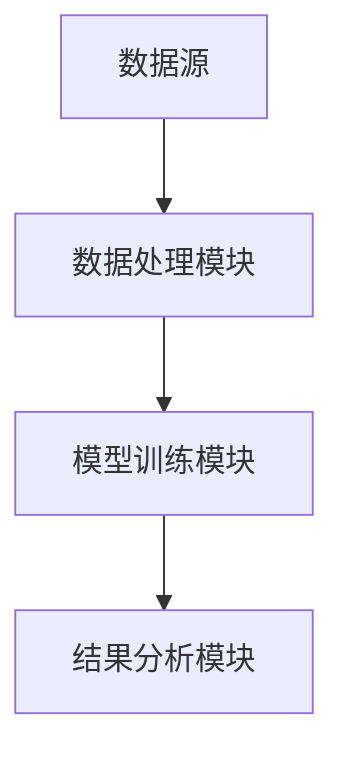

                 


# AI如何增强巴菲特的商业分析方法

> 关键词：AI，巴菲特，商业分析，机器学习，自然语言处理

> 摘要：本文探讨了如何利用人工智能技术增强巴菲特的商业分析方法。通过分析巴菲特投资策略的核心要素，结合AI算法的实现原理，提出了基于机器学习的企业价值评估系统。通过实际案例分析，展示了AI在企业护城河识别、财务数据分析和管理层评估等关键环节中的应用，为投资者提供了更精准的投资决策支持。

---

## 第1章: 引言

### 1.1 什么是巴菲特的商业分析方法
巴菲特的商业分析方法以基本面分析为核心，强调对企业护城河、财务健康状况、管理层质量等关键因素的深入研究。他的投资哲学可以总结为“以合理的价格买入一家优秀的企业”，并通过长期持有实现价值增长。

#### 1.1.1 巴菲特投资哲学的核心思想
- **长期价值投资**：关注企业的内在价值，而非市场的短期波动。
- **企业护城河**：寻找具有持续竞争优势的企业，确保其长期盈利能力。
- **安全边际**：以低于内在价值的价格买入，降低投资风险。

#### 1.1.2 巴菲特商业分析方法的五个维度
1. **企业护城河**：企业的竞争优势是否足够宽广且可持续。
2. **财务健康状况**：企业的财务状况是否稳健，是否有持续的盈利能力。
3. **企业管理层**：管理层是否诚信、有能力且以股东利益为重。
4. **管理层评估**：管理层的决策是否明智，是否具备长期战略眼光。
5. **企业长期价值**：企业的未来现金流折现值是否高于当前市场价格。

### 1.2 什么是人工智能
人工智能（AI）是模拟人类智能的计算机系统，通过机器学习、自然语言处理等技术实现对数据的自动化分析和决策。

#### 1.2.1 机器学习的基本原理
- 机器学习是一种通过数据训练模型，使其能够从数据中学习并做出预测或分类的技术。
- 监督学习：通过标注数据训练模型，使其能够预测新的数据。
- 无监督学习：通过未标注数据发现数据中的隐藏结构。
- 强化学习：通过与环境互动，学习最优策略。

#### 1.2.2 自然语言处理的简介
- 自然语言处理（NLP）是使计算机能够理解、生成和处理人类语言的技术。
- 应用场景：文本分类、情感分析、实体识别等。

### 1.3 AI如何增强商业分析
AI可以通过自动化数据处理、模式识别和预测分析，显著提升商业分析的效率和准确性。

#### 1.3.1 商业分析的数字化转型
- 数据驱动的决策取代传统经验判断。
- 自动化工具的应用降低了分析成本。
- 大数据分析能力提升了决策的深度和广度。

#### 1.3.2 AI在商业分析中的应用场景
- 财务数据预测：通过时间序列分析预测企业未来的财务表现。
- 竞争对手分析：利用NLP分析竞争对手的新闻和公告，评估其市场地位。
- 投资组合优化：基于AI算法优化投资组合，降低风险。

### 1.4 本书结构与目标
本书将从理论到实践，系统地介绍AI如何增强巴菲特的商业分析方法。

---

## 第2章: 巴菲特商业分析方法的核心要素

### 2.1 巴菲特的五个商业分析维度

#### 2.1.1 企业护城河的定义与分类
企业护城河是企业在市场上保持竞争优势的壁垒，常见的护城河类型包括：
1. **成本优势**：企业通过规模效应或流程优化降低成本。
2. **品牌优势**：强大的品牌认知度吸引更多的消费者。
3. **网络效应**：产品或服务的价值随着用户数量的增加而增加。
4. **技术壁垒**：拥有独特的专利或技术，防止竞争对手复制。

#### 2.1.2 企业竞争优势的评估标准
- 市场份额：企业在市场中的占有率。
- 产品差异化：产品是否具有独特性，能否满足特定需求。
- 进入壁垒：新进入者进入市场的难度。

#### 2.1.3 企业财务健康状况的分析方法
- 利润能力：净利润率、ROE等指标。
- 偿债能力：流动比率、速动比率等指标。
- 运营效率：存货周转率、应收账款周转率等指标。

#### 2.1.4 企业管理层的评估指标
- 经营决策的明智性：管理层是否做出正确的战略决策。
- 诚信与责任感：管理层是否以股东利益为重。
- 管理能力：管理层是否具备优秀的领导能力。

#### 2.1.5 企业长期价值的计算公式
$$ V = \sum_{t=1}^{n} \frac{CF_t}{(1 + r)^t} $$
其中，\( V \) 是企业价值，\( CF_t \) 是第 \( t \) 年的自由现金流，\( r \) 是折现率。

### 2.2 巴菲特投资策略的数学模型

#### 2.2.1 股票内在价值的计算公式
$$ V = \frac{Earnings}{ROE} \times (1 + g) $$
其中，\( Earnings \) 是企业盈利，\( ROE \) 是净资产收益率，\( g \) 是利润增长率。

#### 2.2.2 投资组合优化的数学模型
Markowitz的有效前沿模型用于优化投资组合，其目标是最小化风险或最大化收益。

#### 2.2.3 风险评估的统计方法
- 方差：衡量资产收益的波动性。
- 标准差：衡量资产收益的离散程度。

### 2.3 巴菲特方法的局限性分析

#### 2.3.1 数据依赖性问题
巴菲特的方法依赖于财务数据的准确性，而数据可能存在偏差或遗漏。

#### 2.3.2 人工判断的主观性
企业护城河的评估和管理层的判断具有主观性，不同分析师可能得出不同的结论。

#### 2.3.3 市场变化的不可预测性
市场环境的变化可能影响企业的竞争优势和财务状况，使得巴菲特方法的预测能力受限。

---

## 第3章: 人工智能的基本原理

### 3.1 机器学习的核心概念

#### 3.1.1 监督学习的原理与应用
- 监督学习：通过标注数据训练模型，使其能够预测新的数据。
- 应用场景：股票价格预测、信用评分等。

#### 3.1.2 无监督学习的原理与应用
- 无监督学习：通过未标注数据发现数据中的隐藏结构。
- 应用场景：客户分群、异常检测等。

#### 3.1.3 强化学习的原理与应用
- 强化学习：通过与环境互动，学习最优策略。
- 应用场景：游戏AI、机器人控制等。

### 3.2 自然语言处理的原理与应用

#### 3.2.1 词嵌入的原理与实现
- 词嵌入：将词语映射到高维连续向量空间。
- 实现方法：Word2Vec、GloVe等。

#### 3.2.2 文本分类的原理与实现
- 文本分类：将文本划分为预定义的类别。
- 实现方法：朴素贝叶斯、支持向量机、深度学习模型等。

#### 3.2.3 文本生成的原理与实现
- 文本生成：根据输入生成新的文本。
- 实现方法：循环神经网络（RNN）、变换器（Transformer）等。

### 3.3 深度学习的数学基础

#### 3.3.1 神经网络的数学模型
- 神经网络：由输入层、隐藏层和输出层组成的非线性模型。
- 激活函数：用于引入非线性，如sigmoid、ReLU等。

#### 3.3.2 激活函数的数学表达
- ReLU函数：
$$ f(x) = \max(0, x) $$
- Sigmoid函数：
$$ f(x) = \frac{1}{1 + e^{-x}} $$

#### 3.3.3 损失函数的数学表达
- 均方误差（MSE）：
$$ L = \frac{1}{n}\sum_{i=1}^{n}(y_i - \hat{y_i})^2 $$
- 交叉熵损失：
$$ L = -\frac{1}{n}\sum_{i=1}^{n} y_i \log(\hat{y_i}) + (1 - y_i) \log(1 - \hat{y_i}) $$

### 3.4 AI在商业分析中的优势

#### 3.4.1 数据处理能力
- AI能够处理海量数据，提取有用信息。

#### 3.4.2 模式识别能力
- AI能够发现数据中的隐藏模式，帮助分析师做出更准确的判断。

#### 3.4.3 预测准确性
- AI模型能够基于历史数据预测未来的趋势，提高决策的准确性。

---

## 第4章: AI增强巴菲特商业分析方法的实现路径

### 4.1 数据收集与预处理

#### 4.1.1 数据来源的多样性
- 公开市场数据：股票价格、财务报表等。
- 新闻数据：公司公告、行业新闻等。
- 社交媒体数据：投资者情绪分析等。

#### 4.1.2 数据清洗的必要性
- 数据清洗：处理缺失值、异常值、重复值等。

#### 4.1.3 数据特征提取
- 特征提取：从原始数据中提取有用的特征，如财务指标、文本特征等。

### 4.2 AI算法在商业分析中的应用

#### 4.2.1 财务数据预测
- 使用时间序列模型（如ARIMA、LSTM）预测企业的未来财务表现。

#### 4.2.2 企业竞争优势评估
- 使用自然语言处理技术分析企业新闻，识别企业护城河。

#### 4.2.3 管理层评估
- 使用自然语言处理技术分析管理层的讲话，评估其诚信度和能力。

### 4.3 系统架构设计

#### 4.3.1 系统功能设计
- 数据采集模块：收集企业财务数据、新闻数据等。
- 数据处理模块：清洗、转换和特征提取。
- 模型训练模块：训练机器学习模型。
- 结果分析模块：输出分析结果。

#### 4.3.2 系统架构图


---

## 第5章: 项目实战——基于AI的企业价值评估系统

### 5.1 项目背景与目标
- 项目背景：构建一个基于AI的企业价值评估系统，帮助投资者做出更准确的投资决策。
- 项目目标：实现企业护城河识别、财务数据分析和管理层评估等功能。

### 5.2 系统实现

#### 5.2.1 环境安装
- Python 3.8+
- 数据处理库：pandas、numpy
- 机器学习库：scikit-learn、Keras
- 自然语言处理库：NLTK、spaCy

#### 5.2.2 核心实现

##### 5.2.2.1 数据采集
```python
import pandas as pd
import requests

url = "https://example.com/financial_data"
response = requests.get(url)
data = pd.read_json(response.text)
```

##### 5.2.2.2 数据清洗
```python
# 删除缺失值
data.dropna(inplace=True)
# 处理异常值
data = data[(data['revenue'] > 0) & (data['profit'] > 0)]
```

##### 5.2.2.3 模型训练
```python
from sklearn.model

