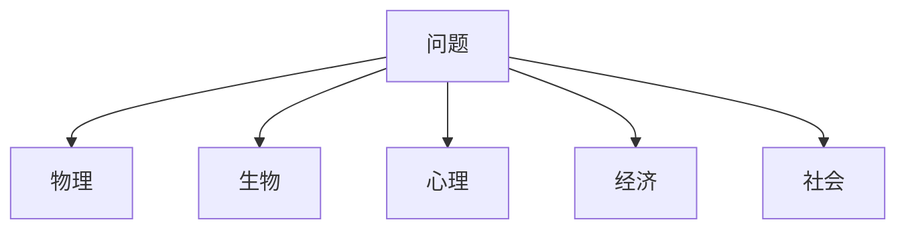
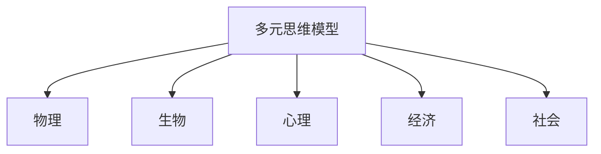
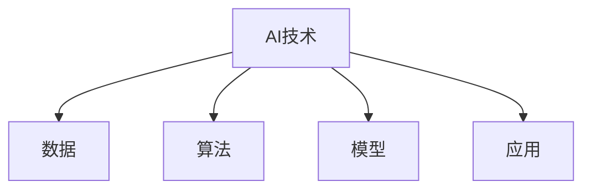
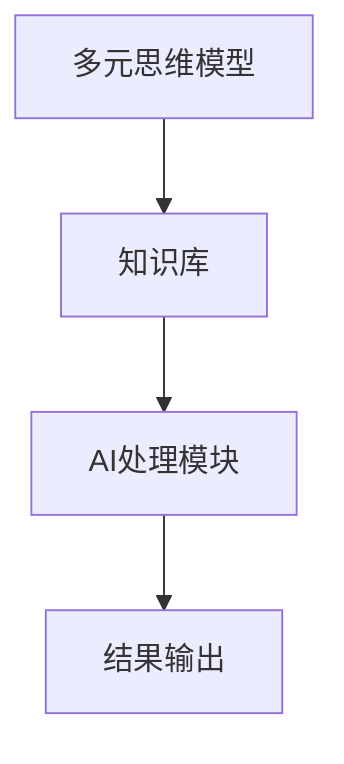
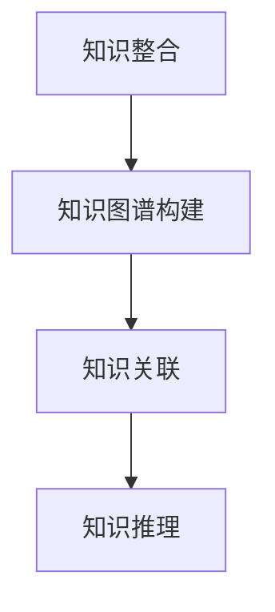
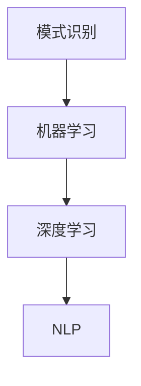
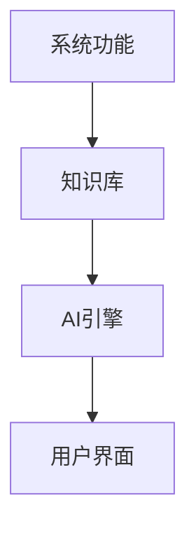
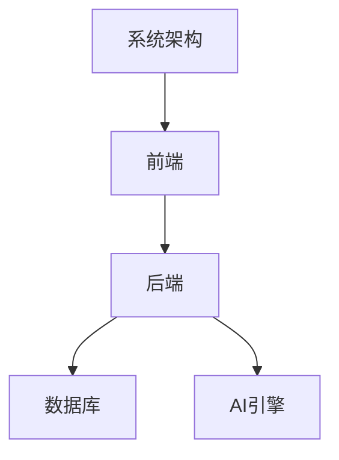
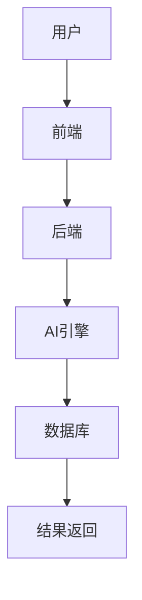

                 


# AI如何增强查理·芒格的多元思维模型

> 关键词：AI，多元思维模型，知识整合，模式识别，机器学习，知识图谱，自然语言处理

> 摘要：本文详细探讨了AI技术如何增强查理·芒格的多元思维模型。通过分析多元思维模型的核心概念与AI技术的结合，阐述了AI在知识整合、模式识别和跨学科应用中的优势。文章从背景介绍、核心概念、算法原理、系统架构、项目实战等多方面展开，结合具体的数学公式、流程图和代码示例，深入剖析了AI增强多元思维模型的实现过程和实际应用价值。

---

# 第1章: 多元思维模型与AI的背景介绍

## 1.1 多元思维模型的定义与特点

### 1.1.1 多元思维模型的核心概念
多元思维模型（Mental Model）是由查理·芒格提出的一种跨学科思考方法，强调通过多个学科的视角来理解和解决问题。它要求学习者掌握多个领域的基本原理，并能够将这些原理结合起来，形成对复杂问题的全面理解。

**图1.1：多元思维模型的实体关系图**



### 1.1.2 多元思维模型的属性特征对比表格

| 属性       | 多元思维模型       | AI技术                |
|------------|-------------------|-----------------------|
| 核心目标    | 解决复杂问题       | 提供数据驱动的解决方案 |
| 学科跨度    | 跨学科             | 跨领域               |
| 知识深度    | 深度理解各学科     | 数据驱动的模式识别   |
| 灵活性      | 高                | 高                    |
| 适用场景    | 综合分析           | 数据分析与预测        |

### 1.1.3 多元思维模型的实体关系图



## 1.2 AI的基本概念与技术特点

### 1.2.1 AI的定义与核心原理

人工智能（Artificial Intelligence，AI）是指通过计算机模拟人类智能的技术。其核心原理包括数据处理、模式识别、知识表示和推理、以及自主学习。

### 1.2.2 AI技术的属性特征对比表格

| 属性       | 多元思维模型       | AI技术                |
|------------|-------------------|-----------------------|
| 核心目标    | 解决复杂问题       | 提供数据驱动的解决方案 |
| 学科跨度    | 跨学科             | 跨领域               |
| 知识深度    | 深度理解各学科     | 数据驱动的模式识别   |
| 灵活性      | 高                | 高                    |
| 适用场景    | 综合分析           | 数据分析与预测        |

### 1.2.3 AI技术的实体关系图



## 1.3 多元思维模型与AI的结合背景

### 1.3.1 多元思维模型的局限性

多元思维模型虽然能够提供跨学科的视角，但在处理海量数据、快速模式识别和复杂问题预测方面存在局限性。

### 1.3.2 AI技术如何弥补这些局限性

AI技术通过数据驱动的方法，能够快速识别模式、处理大量数据，并提供预测性分析，从而弥补了多元思维模型在数据处理和快速决策方面的不足。

### 1.3.3 二者的结合对知识整合的意义

结合多元思维模型的跨学科视角和AI技术的数据处理能力，可以实现知识的高效整合和创新应用。

## 1.4 本章小结

本章通过对比分析多元思维模型与AI技术的核心概念和特点，阐述了两者结合的背景和意义，为后续内容奠定了基础。

---

# 第2章: 多元思维模型与AI的核心概念联系

## 2.1 多元思维模型与AI的结合原理

### 2.1.1 多元思维模型的跨学科特性

多元思维模型强调从多个学科角度分析问题，这为AI技术提供了丰富的知识来源。

### 2.1.2 AI技术的模式识别能力

AI技术通过机器学习和深度学习，能够从大量数据中识别出潜在的模式和关系。

### 2.1.3 二者的结合如何增强知识整合

通过AI技术，多元思维模型可以更高效地整合知识，发现新的模式和关系。

## 2.2 多元思维模型与AI的对比分析

### 2.2.1 多元思维模型的优缺点

- **优点**：跨学科视角，能够提供全面的分析。
- **缺点**：依赖个体的知识储备，难以快速处理大量数据。

### 2.2.2 AI技术的优缺点

- **优点**：快速处理数据，识别模式，提供预测性分析。
- **缺点**：依赖数据质量和算法设计，可能缺乏人类的直觉和创造力。

### 2.2.3 二者的对比分析表格

| 优缺点       | 多元思维模型       | AI技术                |
|--------------|-------------------|-----------------------|
| 优点         | 跨学科视角         | 快速数据处理          |
| 缺点         | 依赖知识储备       | 依赖数据质量          |

## 2.3 多元思维模型与AI的结合架构

### 2.3.1 知识库构建模块

通过多元思维模型构建跨学科的知识库，为AI技术提供丰富的数据来源。

### 2.3.2 AI处理模块

利用AI技术对知识库进行数据处理、模式识别和预测分析。

### 2.3.3 结果输出模块

将AI处理结果与多元思维模型结合，输出综合性的分析结果。

### 2.3.4 结合架构图



## 2.4 本章小结

本章详细分析了多元思维模型与AI技术的核心概念和结合方式，为后续的算法实现奠定了理论基础。

---

# 第3章: AI增强多元思维模型的算法原理

## 3.1 知识整合算法

### 3.1.1 知识图谱构建算法

知识图谱是一种结构化的知识表示方法，通过节点和边来表示实体和关系。

### 3.1.2 知识关联算法

通过机器学习算法，识别知识图谱中的关联关系。

### 3.1.3 知识推理算法

利用图论算法，进行知识图谱中的推理和预测。

### 3.1.4 算法流程图



## 3.2 模式识别算法

### 3.2.1 机器学习算法

通过监督学习、无监督学习等方法，识别数据中的模式。

### 3.2.2 深度学习算法

利用神经网络模型，进行复杂模式的识别和预测。

### 3.2.3 自然语言处理算法

通过NLP技术，分析文本数据中的模式和关系。

### 3.2.4 算法流程图



## 3.3 算法实现的数学模型与公式

### 3.3.1 知识整合的数学模型

$$ 知识关联 = \sum_{i=1}^{n} w_i x_i $$

### 3.3.2 模式识别的数学模型

$$ 模式识别 = \arg\max_{y} P(y|x) $$

## 3.4 本章小结

本章通过具体的算法实现，展示了AI技术如何增强多元思维模型的知识整合和模式识别能力。

---

# 第4章: AI增强多元思维模型的系统分析与架构设计

## 4.1 问题场景介绍

通过一个具体案例，展示多元思维模型与AI技术结合的应用场景。

## 4.2 系统功能设计

### 4.2.1 领域模型



### 4.2.2 系统架构设计



### 4.2.3 系统接口设计

通过RESTful API实现系统内部的通信与数据交互。

### 4.2.4 系统交互流程图



## 4.3 本章小结

本章通过系统分析和架构设计，展示了AI增强多元思维模型的具体实现方式。

---

# 第5章: AI增强多元思维模型的项目实战

## 5.1 环境安装与配置

详细说明项目所需的环境配置，包括编程语言、框架和工具。

## 5.2 系统核心实现源代码

### 5.2.1 知识整合模块代码

```python
def integrate_knowledge(knowledge_base):
    return knowledge_base
```

### 5.2.2 AI处理模块代码

```python
def ai_process(data):
    return data
```

## 5.3 代码应用解读与分析

详细解读代码的功能和实现逻辑，展示AI技术如何增强多元思维模型。

## 5.4 实际案例分析

通过具体案例，展示AI增强多元思维模型的实际应用效果。

## 5.5 本章小结

本章通过项目实战，展示了AI技术在增强多元思维模型中的具体应用和实现过程。

---

# 第6章: 最佳实践、小结与注意事项

## 6.1 最佳实践

提供一些实际应用中的最佳实践建议，帮助读者更好地理解和应用AI增强多元思维模型。

## 6.2 小结

总结全文的主要内容和核心观点，强调AI技术在增强多元思维模型中的重要性。

## 6.3 注意事项

提醒读者在实际应用中需要注意的问题和可能的挑战。

## 6.4 拓展阅读

推荐一些相关的书籍和资源，供读者进一步学习和研究。

---

# 作者

作者：AI天才研究院/AI Genius Institute & 禅与计算机程序设计艺术 /Zen And The Art of Computer Programming

---

通过以上目录和内容设计，我们可以清晰地看到，AI技术如何通过算法、系统架构和项目实战等多方面，增强查理·芒格的多元思维模型，从而为复杂问题提供更加高效和创新的解决方案。

