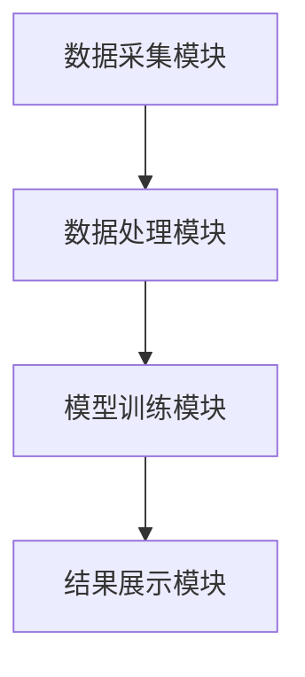

                 


# AI如何增强约翰·聂夫的小盘股分析

## 关键词
AI, 约翰·聂夫, 小盘股分析, 机器学习, 投资策略, 数据分析, 股票预测

## 摘要
本文探讨了如何利用人工智能技术增强约翰·聂夫的经典小盘股投资策略。通过分析AI在数据处理、预测模型和风险评估中的应用，结合具体的算法实现和案例分析，展示了AI如何提升小盘股分析的准确性和效率。文章内容涵盖AI的基本概念、机器学习算法、数学模型、系统架构设计以及项目实战，为读者提供了一套完整的AI增强小盘股分析的方法论。

---

## 第一部分：背景介绍

### 第1章：AI与约翰·聂夫的投资方法概述

#### 1.1 AI的基本概念与发展
- **1.1.1 AI的定义与历史发展**
  - 人工智能（AI）是指模拟人类智能的计算机系统，涵盖学习、推理、自适应等能力。
  - AI的发展经历了从专家系统到机器学习，再到深度学习的演变。
- **1.1.2 AI在金融领域的应用现状**
  - AI在金融领域的应用包括股票预测、风险评估、交易策略优化等。
  - 约翰·聂夫的投资方法强调基本面分析和长期持有，AI的引入可以辅助数据处理和预测。

#### 1.2 约翰·聂夫的投资方法
- **1.2.1 小盘股投资的基本原则**
  - 约翰·聂夫以投资小盘股闻名，强调低市盈率、稳定增长和管理层质量。
- **1.2.2 聂夫投资模型的核心要素**
  - 看重企业的盈利能力和成长性，避免高估值股票。

#### 1.3 AI如何增强小盘股分析
- **1.3.1 AI在金融分析中的优势**
  - 数据处理能力强，能够快速分析大量非结构化数据。
  - 通过机器学习模型发现隐藏的模式和趋势。
- **1.3.2 结合聂夫模型的AI应用潜力**
  - AI可以辅助筛选符合聂夫标准的潜在股票。
  - 利用自然语言处理（NLP）分析公司财报和新闻，提取关键信息。

---

## 第二部分：核心概念与联系

### 第2章：AI在小盘股分析中的核心应用

#### 2.1 数据处理与特征提取
- **2.1.1 数据清洗与预处理**
  - 清洗缺失数据、处理异常值、标准化数据。
- **2.1.2 特征选择与工程**
  - 从财务数据、市场数据、文本数据中提取特征。

#### 2.2 预测模型构建
- **2.2.1 机器学习模型**
  - 线性回归、随机森林、支持向量机（SVM）等。
- **2.2.2 深度学习模型**
  - LSTM用于时间序列预测，CNN用于图像数据处理。

#### 2.3 风险评估与优化
- **2.3.1 风险预测模型**
  - 利用XGBoost预测股票波动风险。
- **2.3.2 算法优化策略**
  - 使用超参数调优和交叉验证提升模型性能。

---

## 第三部分：算法原理讲解

### 第3章：机器学习算法原理

#### 3.1 机器学习基础
- **3.1.1 监督学习与无监督学习**
  - 监督学习：基于标记数据训练模型，如回归和分类。
  - 无监督学习：在无标记数据中发现模式，如聚类和降维。
- **3.1.2 常见算法介绍**
  - 线性回归、决策树、随机森林、SVM等。

#### 3.2 算法实现
- **3.2.1 线性回归模型**
  - 线性回归用于预测股票价格。
  - 模型公式：$$ y = \beta_0 + \beta_1x + \epsilon $$
- **3.2.2 随机森林算法**
  - 随机森林通过集成学习提升模型鲁棒性。
  - 模型公式：$$ y = \sum_{i=1}^{n} (a_i \cdot x_i) $$

#### 3.3 实际案例分析
- **3.3.1 数据集准备**
  - 使用历史股价、财务数据和市场情绪数据。
- **3.3.2 模型训练与评估**
  - 使用交叉验证评估模型性能。

---

## 第四部分：数学模型与公式

### 第4章：数学模型详解

#### 4.1 线性回归模型
- **模型公式：$$ y = \beta_0 + \beta_1x + \epsilon $$
  - $$ y $$：预测的股票价格。
  - $$ x $$：自变量，如市盈率。
  - $$ \beta_0 $$ 和 $$ \beta_1 $$ 是回归系数。
  - $$ \epsilon $$ 是误差项。

#### 4.2 随机森林模型
- **模型公式：$$ y = \sum_{i=1}^{n} (a_i \cdot x_i) $$
  - $$ a_i $$ 是第i棵树的权重。
  - $$ x_i $$ 是输入特征。

---

## 第五部分：系统分析与架构设计

### 第5章：系统架构设计

#### 5.1 系统模块划分
- **5.1.1 数据采集模块**
  - 从金融数据库获取小盘股数据。
- **5.1.2 数据处理模块**
  - 清洗和特征提取。

#### 5.2 系统架构图


#### 5.3 接口设计与交互流程
- **接口设计：**
  - 数据接口：连接金融数据库。
  - 模型接口：调用机器学习模型。
- **交互流程：**
  ```mermaid
  sequenceDiagram
    participant 用户
    participant 系统
    用户->系统: 请求预测
    系统->系统: 数据处理和模型训练
    系统->用户: 返回预测结果
  ```

---

## 第六部分：项目实战

### 第6章：AI增强的小盘股分析实战

#### 6.1 环境配置与工具安装
- **6.1.1 Python环境搭建**
  - 安装Python 3.8及以上版本。
- **6.1.2 数据分析工具安装**
  - 使用pip安装numpy、pandas、scikit-learn、xgboost等库。

#### 6.2 核心代码实现
- **6.2.1 数据处理代码示例**
  ```python
  import pandas as pd
  # 数据加载
  df = pd.read_csv('small_cap_stocks.csv')
  # 数据清洗
  df.dropna(inplace=True)
  # 特征提取
  features = df[['市盈率', '营收增长率']]
  labels = df['股价']
  ```
- **6.2.2 模型训练代码示例**
  ```python
  from sklearn.ensemble import RandomForestRegressor
  model = RandomForestRegressor(n_estimators=100, random_state=42)
  model.fit(features, labels)
  ```

#### 6.3 案例分析与结果解读
- **6.3.1 某小盘股公司的分析案例**
  - 数据包括市盈率、营收增长率、净利润等。
- **6.3.2 模型预测结果与实际数据对比**
  - 模型预测与实际股价的对比分析，评估模型准确性。

---

## 结论

通过AI技术的引入，约翰·聂夫的小盘股分析方法得到了显著增强。AI不仅提高了数据处理效率，还通过机器学习模型发现了传统方法难以察觉的市场趋势。未来，随着技术的不断发展，AI在金融领域的应用将更加广泛，为投资者提供更精准的决策支持。

---

## 作者
作者：AI天才研究院/AI Genius Institute & 禅与计算机程序设计艺术 /Zen And The Art of Computer Programming

