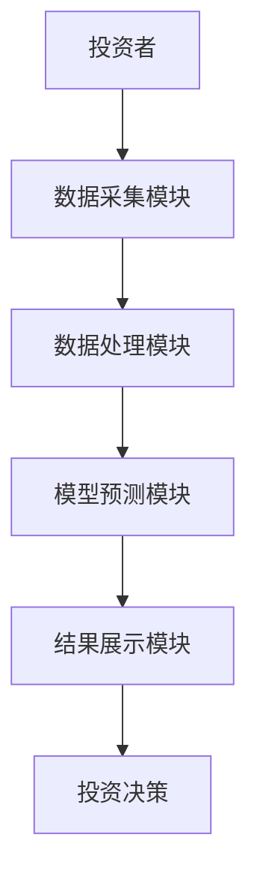

                 


# AI如何实现彼得林奇的实地调研策略

## 关键词：AI，投资策略，彼得·林奇，实地调研，机器学习，自然语言处理，数据挖掘

## 摘要：  
本文深入探讨了如何利用人工智能技术模拟彼得·林奇的投资调研策略。通过分析AI在数据收集、特征提取、模型训练与预测、系统架构设计等方面的应用，结合实际案例，展示了如何构建一个高效的AI投资调研系统。文章从理论到实践，详细阐述了每一步的实现过程，为读者提供了全面的技术指导和实践参考。

---

## 目录大纲：

### 第一部分：AI与投资策略的基础

#### 第1章：AI与投资策略概述

##### 1.1 AI的基本概念与投资学基础
- 1.1.1 人工智能的定义与核心原理
  - 人工智能的定义
  - 机器学习、深度学习、自然语言处理的核心原理
  - AI在投资领域的应用现状
- 1.1.2 投资学的基本原理与策略
  - 投资的基本概念与分类
  - 主流投资策略（价值投资、成长投资等）
  - 彼得·林奇投资策略的核心思想

##### 1.2 实地调研在投资中的重要性
- 1.2.1 实地调研的定义与作用
  - 实地调研的定义
  - 实地调研在投资决策中的重要性
- 1.2.2 彼得·林奇实地调研方法的特点
  - 调研对象的选择标准
  - 调研过程中的关键点
  - 调研结果的分析方法
- 1.2.3 AI在投资调研中的潜力与优势
  - AI在数据处理、模式识别方面的优势
  - AI如何提高调研效率和准确性

##### 1.3 AI如何模拟人类调研过程
- 1.3.1 数据收集与分析的AI实现
  - 数据来源的分类与选择
  - 数据清洗与预处理的流程
  - 数据分析的自动化方法
- 1.3.2 模型训练与预测的逻辑
  - 机器学习模型的训练流程
  - 模型预测的逻辑与规则
  - 模型结果的解释与验证
- 1.3.3 AI决策系统的构建思路
  - 决策系统的整体架构
  - 各模块的功能与交互
  - 系统的可扩展性与灵活性

##### 1.4 本章小结

---

### 第二部分：AI模拟实地调研的核心算法

#### 第2章：数据收集与特征提取

##### 2.1 数据收集的AI实现
- 2.1.1 数据源的分类与选择
  - 公开市场数据（股价、财务报表等）
  - 新闻、社交媒体数据的获取
  - 公司财报、行业报告的挖掘
- 2.1.2 自然语言处理在调研报告中的应用
  - 文本挖掘技术（关键词提取、情感分析）
  - 调研报告的自动摘要
  - 调研数据的结构化处理
- 2.1.3 数据清洗与预处理的流程
  - 数据去重、补全与标准化
  - 数据特征的提取与分类
  - 数据分组与聚合分析

##### 2.2 特征提取的算法原理
- 2.2.1 TF-IDF特征提取方法
  - TF-IDF的定义与计算公式
  - 在文本数据分析中的应用
  - 特征选择的优化策略
- 2.2.2 Word2Vec与BERT模型的对比
  - Word2Vec的基本原理与实现
  - BERT模型的优势与应用场景
  - 两种模型在投资调研中的适用场景
- 2.2.3 图结构数据的特征提取
  - 图数据的表示方法
  - 图结构在投资关系中的应用
  - 图数据特征提取的算法选择

##### 2.3 数据特征的可视化分析
- 2.3.1 数据分布的可视化方法
  - 数据分布的可视化工具与图表
  - 数据分布对投资决策的影响
- 2.3.2 特征重要性分析的可视化
  - 特征重要性排序的方法
  - 可视化工具的选择与实现
  - 特征重要性对投资策略的影响
- 2.3.3 数据关联性的网络图谱
  - 数据关联性的定义与计算
  - 网络图谱的构建与分析
  - 数据关联性对投资决策的启示

##### 2.4 本章小结

---

#### 第3章：AI模型的训练与优化

##### 3.1 模型选择与训练策略
- 3.1.1 监督学习与无监督学习的对比
  - 监督学习的定义与应用场景
  - 无监督学习的定义与应用场景
  - 两者在投资调研中的适用场景
- 3.1.2 神经网络模型的训练流程
  - 神经网络的基本结构
  - 模型训练的流程与步骤
  - 模型训练中的参数调节
- 3.1.3 超参数调优的常用方法
  - 超参数调优的定义与重要性
  - 常用的超参数调优方法（网格搜索、随机搜索）
  - 调优策略对模型性能的影响

##### 3.2 模型优化的数学原理
- 3.2.1 梯度下降的数学推导
  - 梯度下降的定义与公式
  - 梯度下降的变种（BGD、SGD、MBGD）
  - 梯度下降在模型训练中的应用
- 3.2.2 正则化的原理与应用
  - 正则化的定义与作用
  - L1正则化与L2正则化的对比
  - 正则化在模型优化中的应用
- 3.2.3 模型泛化的评估指标
  - 模型泛化的定义与重要性
  - 常用的评估指标（准确率、召回率、F1值）
  - 模型泛化能力的优化策略

##### 3.3 模型部署与实时更新
- 3.3.1 模型的序列化与部署
  - 模型序列化的定义与方法
  - 模型部署的流程与注意事项
  - 模型部署对投资决策的影响
- 3.3.2 实时数据流的处理机制
  - 实时数据流的定义与特点
  - 数据流处理的常用方法（队列、缓冲）
  - 数据流处理对模型实时更新的影响
- 3.3.3 模型的持续学习与更新
  - 模型持续学习的定义与方法
  - 模型更新的策略与频率
  - 持续学习对模型性能的提升作用

##### 3.4 本章小结

---

### 第三部分：系统架构与实现

#### 第4章：投资调研AI系统的架构设计

##### 4.1 系统功能模块划分
- 4.1.1 数据采集模块
  - 数据采集的定义与作用
  - 数据采集的实现方法（API接口、爬虫）
  - 数据采集对系统性能的影响
- 4.1.2 数据处理模块
  - 数据处理的定义与作用
  - 数据清洗、转换与结构化处理
  - 数据处理对模型训练的影响
- 4.1.3 模型预测模块
  - 模型预测的定义与实现
  - 预测结果的输出与解释
  - 预测结果对投资决策的支持
- 4.1.4 结果展示模块
  - 结果展示的定义与作用
  - 数据可视化的方法与工具
  - 结果展示对用户决策的影响

##### 4.2 系统架构的ER图设计
```mermaid
erDiagram
    customer[C投资者] {
        id : integer
        name : string
        investment_history : string
    }
    company[调研对象] {
        id : integer
        name : string
        financial_data : string
        market_position : string
    }
    report[调研报告] {
        id : integer
        content : string
        analysis_result : string
    }
    relationship1 : customer --> company
    relationship2 : company --> report
```

##### 4.3 系统功能的实现流程


##### 4.4 本章小结

---

#### 第5章：系统接口设计与交互流程

##### 5.1 系统接口设计
- 5.1.1 API接口的定义与设计
  - API接口的定义与作用
  - 接口的设计原则与注意事项
  - 接口文档的编写与管理
- 5.1.2 数据交互的协议与格式
  - HTTP协议的使用与优势
  - 数据格式的标准化（JSON、XML）
  - 数据加密与安全性保障
- 5.1.3 接口测试的实现方法
  - 接口测试的定义与作用
  - 常用的接口测试工具（Postman、JMeter）
  - 接口测试对系统性能的影响

##### 5.2 系统交互流程设计
- 5.2.1 用户操作流程
  - 用户登录与注册
  - 数据采集与提交
  - 模型预测与结果展示
  - 投资决策与反馈
- 5.2.2 系统内部交互流程
  - 数据采集模块与数据处理模块的交互
  - 数据处理模块与模型预测模块的交互
  - 模型预测模块与结果展示模块的交互
- 5.2.3 交互流程的优化策略
  - 交互流程的优化方法
  - 交互流程对系统性能的影响
  - 交互流程的可扩展性与灵活性

##### 5.3 本章小结

---

### 第四部分：项目实战

#### 第6章：AI投资调研系统项目实战

##### 6.1 项目环境的安装与配置
- 6.1.1 开发环境的选择与配置
  - Python、Jupyter Notebook的安装与配置
  - 开发工具的安装与使用（PyCharm、VS Code）
  - 开发环境的优化与调试
- 6.1.2 数据集的获取与预处理
  - 数据集的获取方法（公开数据集、爬虫）
  - 数据集的预处理流程（清洗、转换、结构化）
  - 数据集的存储与管理（数据库、文件系统）
- 6.1.3 项目依赖库的安装
  - 常用的AI库（TensorFlow、PyTorch、Scikit-learn）
  - 自然语言处理库（NLTK、spaCy、BERT）
  - 数据可视化库（Matplotlib、Seaborn、Plotly）

##### 6.2 系统核心功能的实现
- 6.2.1 数据采集模块的实现
  - 爬虫的编写与实现（BeautifulSoup、Scrapy）
  - 数据接口的调用与实现（API调用、数据获取）
  - 数据采集的优化与加速
- 6.2.2 数据处理模块的实现
  - 数据清洗的实现（去重、补全、标准化）
  - 数据转换的实现（结构化、格式化、特征提取）
  - 数据分组与聚合的实现（Pandas、SQL）
- 6.2.3 模型预测模块的实现
  - 机器学习模型的训练与部署（Scikit-learn、XGBoost）
  - 深度学习模型的训练与部署（TensorFlow、PyTorch）
  - 模型预测结果的解释与可视化
- 6.2.4 结果展示模块的实现
  - 数据可视化的实现（Matplotlib、Seaborn、Plotly）
  - 报告生成的实现（PDF、HTML、Word）
  - 结果展示的交互设计（Dash、Streamlit）

##### 6.3 项目实战的案例分析
- 6.3.1 实际案例的选择与分析
  - 案例背景与目标
  - 数据收集与处理
  - 模型训练与预测
  - 结果展示与分析
- 6.3.2 案例分析的总结与反思
  - 案例分析的成功经验
  - 实施过程中遇到的问题与解决方案
  - 对未来工作的启示与改进方向

##### 6.4 本章小结

---

### 第五部分：总结与展望

#### 第7章：总结与展望

##### 7.1 全文总结
- AI在投资调研中的应用现状与优势
- 本文提出的方法与实现思路
- 本文的创新点与局限性

##### 7.2 未来展望
- AI在投资调研中的未来发展方向
- 技术的进步对投资策略的影响
- 未来可能出现的新技术与新方法

##### 7.3 最佳实践与注意事项
- AI投资调研系统设计中的注意事项
- 系统维护与优化的建议
- 使用AI投资调研系统的用户注意事项

##### 7.4 拓展阅读
- 推荐的书籍与论文
- 推荐的学习资源与技术博客
- 未来研究方向的建议

##### 7.5 本章小结

---

## 作者：AI天才研究院/AI Genius Institute & 禅与计算机程序设计艺术/Zen And The Art of Computer Programming

