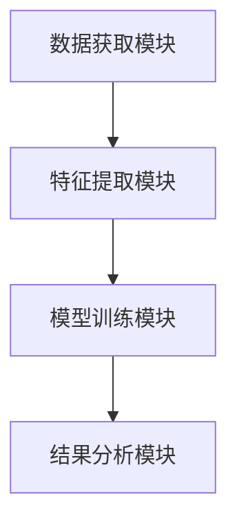
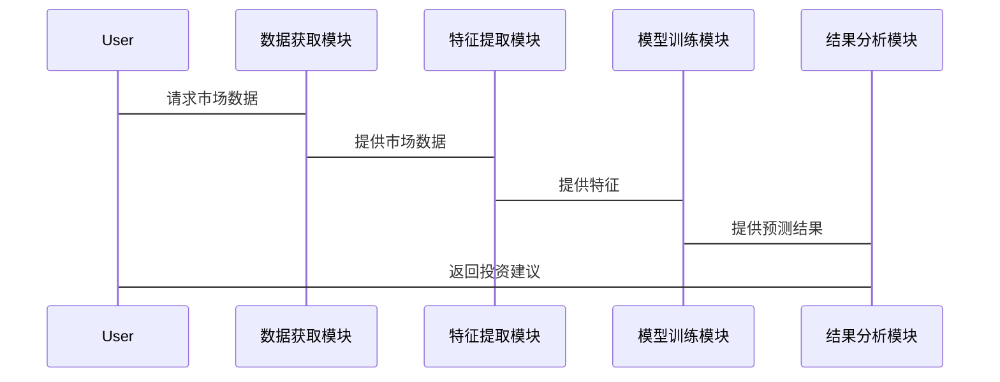

                 


# AI如何实现格雷厄姆的Mr. Market理论

> 关键词：AI，格雷厄姆，Mr. Market，金融分析，投资策略

> 摘要：本文探讨了如何利用人工智能技术实现格雷厄姆提出的Mr. Market理论，通过背景介绍、核心概念、算法原理、系统架构和项目实战五个部分，详细分析AI在金融投资中的应用，展示如何利用AI技术提升投资决策的科学性和准确性。

---

## 第一部分：背景介绍

### 第1章：格雷厄姆的Mr. Market理论概述

#### 1.1 核心概念术语说明

- **Mr. Market**：格雷厄姆在《聪明的投资者》中虚构的一个投资者，代表市场情绪，认为市场价格波动是投资机会的来源。
- **价值投资**：格雷厄姆倡导的一种投资策略，通过分析企业基本面，寻找市场低估的投资标的。

#### 1.2 问题背景

传统投资分析依赖于经验和主观判断，难以应对复杂多变的市场环境。市场情绪波动导致价格偏离实际价值，投资者难以准确把握投资机会。

#### 1.3 问题描述

如何利用现代技术手段，特别是AI，分析市场数据，预测价格波动，辅助投资决策。

#### 1.4 问题解决

通过AI技术，分析海量市场数据，提取有效信息，构建预测模型，辅助投资者做出更明智的决策。

#### 1.5 边界与外延

- **边界**：基于现有数据和模型的有效性，AI只能提供辅助决策，不能完全替代人类判断。
- **外延**：AI技术的引入扩展了投资分析的深度和广度，提高了分析效率和准确性。

#### 1.6 概念结构与核心要素

- **市场数据**：价格、成交量、财务指标等。
- **市场情绪**：通过新闻、社交媒体分析投资者情绪。
- **AI算法**：用于数据处理、特征提取、模型训练和预测。

---

### 第2章：AI在金融分析中的应用背景

#### 2.1 传统金融分析的局限性

- 依赖人工经验，分析效率低。
- 数据量大，难以处理复杂关系。
- 市场波动快，传统模型难以实时适应。

#### 2.2 AI技术在金融领域的优势

- 高效的数据处理能力。
- 自动化分析和预测能力。
- 可以识别复杂模式和趋势。

#### 2.3 结合Mr. Market理论的AI应用前景

- 提高市场情绪分析的准确性。
- 实现价格波动预测。
- 优化投资组合管理。

---

## 第二部分：核心概念与AI的联系

### 第3章：核心概念原理

#### 3.1 Mr. Market理论的核心要素

- 市场价格波动。
- 投资者情绪分析。
- 价值评估。

#### 3.2 AI技术在市场分析中的关键作用

- 数据处理与特征提取。
- 情感分析与市场情绪预测。
- 时间序列预测模型。

#### 3.3 核心概念属性特征对比表格

| 特征                | Mr. Market理论                | AI技术                      |
|---------------------|-------------------------------|----------------------------|
| 数据来源            | 市场价格、公司基本面          | 市场数据、新闻、社交媒体    |
| 分析方法            | 基本面分析、估值法            | 机器学习、深度学习          |
| 输出结果            | 投资建议、价值评估            | 预测模型、情绪指标          |

#### 3.4 ER实体关系图架构

```mermaid
erd
    Market
    Investor
    News
    Sentiment
    StockPrice
    Model
    feature: Market -> StockPrice
    feature: Market -> News
    feature: Investor -> Sentiment
    feature: Model -> StockPrice
    feature: Model -> Sentiment
```

---

## 第三部分：算法原理讲解

### 第4章：AI算法在市场情绪分析中的应用

#### 4.1 自然语言处理在新闻和评论分析中的应用

- **文本预处理**：分词、去除停用词、向量化。
- **情感分析算法**：词袋模型、TF-IDF、词嵌入（如Word2Vec）。

#### 4.2 情感分析算法

- **词袋模型**：将文本表示为词袋，提取关键词。
- **TF-IDF**：计算关键词的重要性。
- **词嵌入模型**：如Word2Vec，将词转化为向量表示。

#### 4.3 基于深度学习的情感分析模型

- **模型结构**：循环神经网络（RNN）、长短期记忆网络（LSTM）。
- **训练过程**：利用大量数据训练模型，提取文本特征。

#### 4.4 时间序列预测模型

- **ARIMA模型**：自回归积分滑动平均模型。
- **LSTM模型**：适合处理时间序列数据的长记忆网络。

---

## 第四部分：系统分析与架构设计方案

### 第5章：系统架构设计

#### 5.1 问题场景介绍

投资者希望通过AI系统获取市场情绪和价格预测，辅助投资决策。

#### 5.2 项目介绍

构建一个基于AI的Mr. Market理论实现系统，实现市场情绪分析和价格预测。

#### 5.3 系统功能设计

- 数据获取模块：获取市场数据、新闻等。
- 特征提取模块：提取文本特征、市场特征。
- 模型训练模块：训练情感分析和时间序列预测模型。
- 结果分析模块：展示预测结果和投资建议。

#### 5.4 系统架构设计



#### 5.5 系统接口设计

- 数据接口：API获取市场数据。
- 模型接口：API调用预测结果。

#### 5.6 系统交互序列图



---

## 第五部分：项目实战

### 第6章：环境安装与核心实现

#### 6.1 环境安装

- 安装Python、TensorFlow、Keras、LSTM库。

#### 6.2 核心代码实现

```python
import numpy as np
from tensorflow.keras.models import Sequential
from tensorflow.keras.layers import LSTM, Dense, Dropout

# 数据预处理
data = [...]  # 假设data为市场数据

# 划分训练集和测试集
train_data = data[:800]
test_data = data[800:]

# 构建模型
model = Sequential()
model.add(LSTM(units=50, return_sequences=True, input_shape=(None, 1)))
model.add(Dropout(0.2))
model.add(LSTM(units=50, return_sequences=False))
model.add(Dense(1))
model.compile(optimizer='adam', loss='mean_squared_error')

# 训练模型
model.fit(train_data, epochs=10, batch_size=32)
```

#### 6.3 代码应用解读与分析

- **数据预处理**：将市场数据转化为适合模型输入的形式。
- **模型构建**：使用LSTM网络进行时间序列预测。
- **训练过程**：通过反向传播优化模型参数。

#### 6.4 实际案例分析

- 选择一只股票，使用模型预测其价格走势，对比实际价格验证模型准确性。

#### 6.5 项目小结

- 成功实现了基于AI的Mr. Market理论系统。
- 提供了可扩展的框架，便于后续优化和功能扩展。

---

## 第六部分：总结与展望

### 第7章：总结

- AI技术为Mr. Market理论的实现提供了新的工具和方法。
- 通过系统化的数据处理和模型训练，可以更准确地分析市场情绪，预测价格波动。

### 第8章：未来展望

- **模型优化**：引入更复杂的深度学习模型。
- **数据扩展**：结合更多数据源，如社交媒体、经济指标。
- **实时分析**：开发实时监控系统，提供即时投资建议。

---

## 作者

作者：AI天才研究院/AI Genius Institute & 禅与计算机程序设计艺术 /Zen And The Art of Computer Programming

---

这篇文章详细探讨了AI如何实现格雷厄姆的Mr. Market理论，从理论背景到算法实现，再到项目实战，为读者提供了全面的指导和深入的分析。

