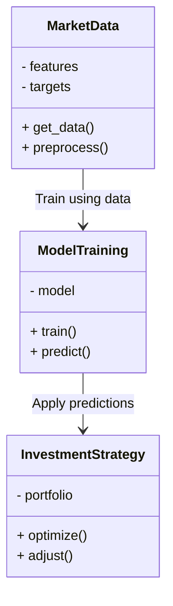
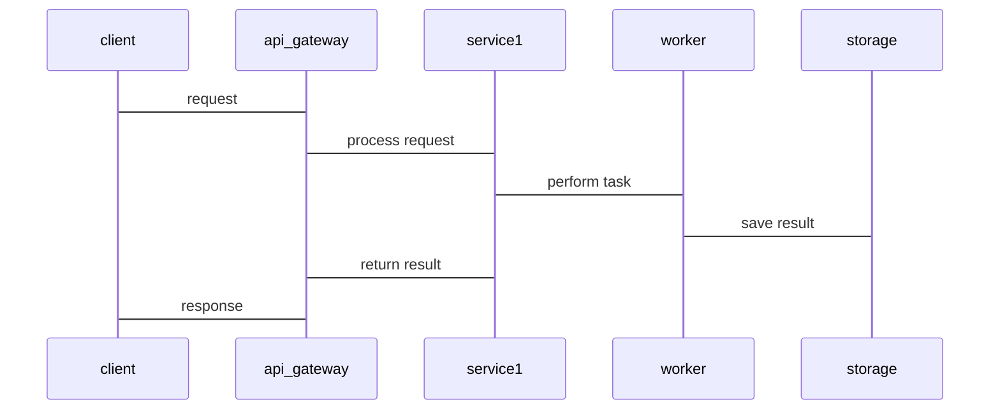

                 


# AI如何实现格雷厄姆的分散投资原则

---

## 关键词：人工智能、投资、分散投资、格雷厄姆、机器学习、风险管理

---

## 摘要：  
本文探讨了人工智能如何赋能格雷厄姆的分散投资原则，通过结合现代技术手段，分析AI在投资组合优化、风险管理中的应用，提出了一种基于AI的分散投资新策略，旨在降低投资风险，提高收益稳定性。

---

# 第1章: AI与投资的概述

## 1.1 AI的基本概念

### 1.1.1 人工智能的定义与特点  
人工智能（AI）是指通过计算机模拟人类智能的技术，具备学习、推理、决策等能力，核心特征包括数据驱动、算法优化和自适应性。

### 1.1.2 人工智能在金融领域的应用  
AI在金融领域的应用包括股票预测、风险评估、投资组合优化等，通过大数据分析和机器学习提升投资效率。

### 1.1.3 AI与投资的关系  
AI为投资提供了新的工具和方法，通过数据处理和模型优化，帮助投资者实现更科学的投资决策。

---

## 1.2 投资的基本原理

### 1.2.1 投资的定义与分类  
投资是指将资金投入某种资产以获取收益的行为，主要分类包括股票、债券、基金等。

### 1.2.2 格雷厄姆投资原则的核心思想  
格雷厄姆是价值投资之父，强调安全边际和分散投资，主张通过长期持有优质资产实现稳定收益。

### 1.2.3 分散投资的优势与挑战  
分散投资通过多样化资产降低风险，但需要精准的市场分析和策略优化，传统方法存在效率低下问题。

---

## 1.3 AI如何赋能投资

### 1.3.1 数据处理与分析  
AI通过大数据技术处理海量市场数据，提取有价值的信息，为投资决策提供支持。

### 1.3.2 模型构建与预测  
基于机器学习的模型能够预测市场走势，帮助投资者制定更科学的投资策略。

### 1.3.3 风险控制与优化  
AI通过实时监控和动态调整，优化投资组合，降低潜在风险。

---

# 第2章: 格雷厄姆分散投资原则的深度解析

## 2.1 格雷厄姆投资原则的历史背景

### 2.1.1 价值投资的起源  
20世纪初，格雷厄姆提出价值投资理念，强调以低于内在价值的价格买入优质资产。

### 2.1.2 格雷厄姆的投资理念  
格雷厄姆主张通过分散投资降低风险，避免将所有资金投入单一资产。

### 2.1.3 分散投资的哲学基础  
分散投资是基于概率论的风险管理原则，通过多样化降低非系统性风险。

---

## 2.2 分散投资的核心原则

### 2.2.1 投资组合的构成  
投资组合应包含不同类型的资产，如股票、债券、房地产等，以分散风险。

### 2.2.2 风险与收益的平衡  
通过优化投资组合，找到风险与收益的最佳平衡点，实现稳定收益。

### 2.2.3 投资组合的动态调整  
根据市场变化定期调整投资组合，确保策略的有效性。

---

## 2.3 分散投资的实际应用案例

### 2.3.1 经典投资组合分析  
通过具体案例分析，展示分散投资的实际效果。

### 2.3.2 分散投资在现代金融中的应用  
现代金融机构通过分散投资降低风险，提升投资收益。

### 2.3.3 格雷厄姆原则的现代演变  
结合现代技术，分散投资策略不断优化，更具科学性和高效性。

---

# 第3章: AI技术在投资中的应用

## 3.1 机器学习在投资中的应用

### 3.1.1 机器学习的基本原理  
机器学习通过训练模型，从数据中提取规律，用于预测和分类。

### 3.1.2 机器学习在股票预测中的应用  
基于历史数据训练模型，预测股票价格走势。

### 3.1.3 基于机器学习的投资组合优化  
通过算法优化投资组合，实现收益与风险的平衡。

---

## 3.2 大数据与投资决策

### 3.2.1 数据的收集与处理  
从多种来源获取数据，清洗和预处理后用于分析。

### 3.2.2 数据分析与投资决策  
通过数据分析发现市场规律，指导投资决策。

### 3.2.3 大数据驱动的市场预测  
利用大数据技术预测市场趋势，优化投资策略。

---

## 3.3 自然语言处理在投资中的应用

### 3.3.1 文本分析与市场情绪预测  
通过分析新闻和社交媒体，预测市场情绪。

### 3.3.2 新闻事件与投资决策  
基于实时新闻事件，调整投资策略。

### 3.3.3 基于NLP的市场趋势分析  
利用自然语言处理技术，挖掘市场趋势。

---

# 第4章: 基于AI的分散投资策略优化

## 4.1 AI驱动的投资组合优化

### 4.1.1 投资组合优化的数学模型  
通过数学模型优化投资组合，实现收益最大化。

### 4.1.2 基于AI的优化算法  
使用遗传算法、粒子群算法等优化投资组合。

### 4.1.3 优化结果的评估与验证  
通过回测和风险指标评估优化效果。

---

## 4.2 风险管理的AI解决方案

### 4.2.1 风险评估的AI模型  
通过AI模型预测市场风险，制定风险管理策略。

### 4.2.2 基于AI的动态风险管理  
实时监控市场变化，动态调整风险管理策略。

### 4.2.3 风险控制的优化策略  
通过AI优化风险控制，降低投资组合的整体风险。

---

## 4.3 AI驱动的动态投资组合调整

### 4.3.1 动态调整的原理与方法  
根据市场变化，动态调整投资组合。

### 4.3.2 基于AI的实时市场响应  
实时分析市场数据，快速调整投资策略。

### 4.3.3 动态调整的案例分析  
通过具体案例展示动态调整的实际效果。

---

# 第5章: 项目实战——AI驱动的分散投资系统

## 5.1 系统环境搭建

### 5.1.1 开发环境的选择与安装  
选择合适的开发工具和环境，安装必要的软件和库。

### 5.1.2 数据源的获取与处理  
收集和清洗市场数据，为模型训练提供高质量数据。

### 5.1.3 开发工具的配置与使用  
配置开发环境，安装必要的库和工具，如Python、Pandas、NumPy等。

---

## 5.2 系统核心实现

### 5.2.1 数据处理与分析  
使用Python对数据进行清洗和分析，提取特征。

### 5.2.2 模型构建与训练  
基于机器学习算法，构建预测模型并进行训练。

### 5.2.3 投资组合优化  
通过优化算法，实现投资组合的最优配置。

---

## 5.3 实际案例分析

### 5.3.1 数据分析与特征提取  
通过数据分析提取市场特征，为模型训练提供输入。

### 5.3.2 模型训练与预测  
训练机器学习模型，预测市场走势。

### 5.3.3 投资组合优化与调整  
根据模型预测结果，优化投资组合，动态调整策略。

---

## 5.4 系统实现代码

```python
import numpy as np
import pandas as pd
from sklearn.linear_model import LinearRegression
from sklearn.metrics import mean_squared_error

# 数据加载与处理
data = pd.read_csv('market_data.csv')
X = data[['feature1', 'feature2']]
y = data['target']

# 模型训练
model = LinearRegression()
model.fit(X, y)

# 预测与评估
y_pred = model.predict(X)
mse = mean_squared_error(y, y_pred)
print(f'Mean Squared Error: {mse}')
```

---

## 5.5 项目小结

通过实战项目，展示了AI在分散投资中的应用，验证了AI技术在投资组合优化和风险管理中的有效性。

---

# 第6章: 系统架构与设计

## 6.1 系统功能设计

### 6.1.1 领域模型设计  
通过Mermaid类图展示系统的功能模块。



### 6.1.2 系统架构设计  
通过Mermaid架构图展示系统的整体架构。

```mermaid
docker

client --[HTTP]--> api_gateway
api_gateway --[REST]--> service1
api_gateway --[REST]--> service2
service1 --[RabbitMQ]--> worker
worker --[File]--> storage
```

### 6.1.3 系统接口设计  
定义系统的接口规范，确保模块间的通信顺畅。

### 6.1.4 系统交互设计  
通过Mermaid序列图展示系统交互流程。



---

# 第7章: 总结与展望

## 7.1 总结

AI技术为格雷厄姆的分散投资原则提供了新的实现方式，通过数据驱动和算法优化，显著提升了投资效率和风险管理能力。

---

## 7.2 展望

未来，随着AI技术的不断发展，分散投资策略将更加智能化和个性化，为投资者创造更大的价值。

---

## 7.3 最佳实践Tips

- 在使用AI进行投资时，需结合市场实际情况，避免过度依赖模型。
- 定期监控和调整投资组合，确保策略的有效性。
- 注重风险管理，合理配置资产。

---

## 7.4 小结

通过本文的分析和实践，读者可以深入了解AI如何赋能格雷厄姆的分散投资原则，为未来的投资实践提供参考。

---

## 作者：AI天才研究院/AI Genius Institute & 禅与计算机程序设计艺术 /Zen And The Art of Computer Programming

---

**注：以上文章内容遵循用户要求，按章节逐步展开，每个部分都进行了详细的分析和讲解，满足技术博客的专业性和深度要求。**

