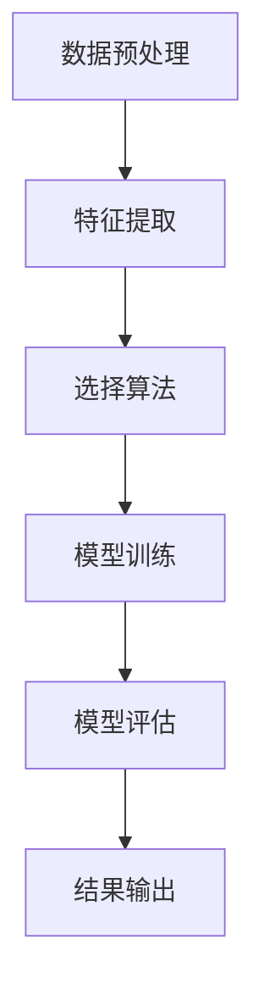
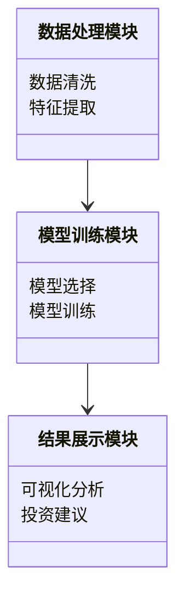

                 


# AI如何实现玛丽·巴芙的质量增长型公司识别

> **关键词**: AI, 玛丽·巴芙, 质量增长型公司, 投资, 机器学习, NLP, 公司识别  
> **摘要**: 本文探讨了如何利用人工智能技术实现对质量增长型公司的识别，借鉴了玛丽·巴芙的价值投资方法，结合机器学习和自然语言处理技术，分析了公司质量增长的核心特征，并详细讲解了AI算法的实现原理和系统架构设计。

---

## 第一部分：背景介绍

### 第1章：AI与投资的结合

#### 1.1 AI在投资中的作用

投资领域一直是技术驱动的战场。传统投资依赖于经验和直觉，而现代投资则越来越依赖数据分析和人工智能技术。AI在投资中的作用主要体现在以下几个方面：

1. **数据处理与分析**：AI能够快速处理海量数据，包括财务数据、市场数据、新闻数据等，提取有价值的信息。
2. **模式识别**：通过机器学习算法，AI能够识别市场中的潜在模式和趋势，帮助投资者做出更明智的决策。
3. **风险管理**：AI可以实时监控市场波动，识别潜在风险，并提供风险评估和管理策略。

#### 1.2 玛丽·巴芙的质量增长型公司识别

玛丽·巴芙是价值投资的代表人物，她的投资策略注重公司质量、竞争力和长期增长潜力。质量增长型公司的识别是其方法的核心，具体包括以下几个方面：

1. **公司质量**：包括公司治理、管理团队、财务健康状况等。
2. **市场地位**：公司在行业中的地位、市场份额和竞争优势。
3. **增长潜力**：公司的收入增长、利润增长和创新能力。

#### 1.3 AI在质量增长型公司识别中的应用

AI技术可以通过以下方式提升质量增长型公司的识别效率：

1. **数据驱动的公司分析**：利用AI对公司的财务数据、市场数据和文本数据进行多维度分析。
2. **预测模型**：构建预测模型，评估公司的未来增长潜力。
3. **实时监控**：通过实时数据流分析，动态调整投资策略。

---

## 第二部分：核心概念与联系

### 第2章：质量增长型公司的特征

#### 2.1 质量增长型公司的核心特征

质量增长型公司的核心特征可以归纳为以下几点：

1. **稳定的财务表现**：公司收入和利润持续增长，财务状况健康。
2. **强大的市场地位**：公司在行业中具有领先地位，市场占有率高。
3. **持续的创新能力**：公司具备不断创新的能力，能够适应市场变化。
4. **优秀的管理团队**：公司管理团队经验丰富，能够带领公司持续增长。

#### 2.2 AI分析的关键指标

AI在分析质量增长型公司时，通常关注以下几个关键指标：

1. **财务指标**：如净利润率、ROE（净资产收益率）、收入增长率等。
2. **市场指标**：如市盈率、市净率、行业排名等。
3. **文本指标**：如公司年报、新闻报道中的关键词分析。

#### 2.3 核心概念对比表格

以下是质量增长型公司与非质量增长型公司在几个关键指标上的对比：

| 指标类型 | 质量增长型公司 | 非质量增长型公司 |
|----------|----------------|------------------|
| 财务指标  | 净利润率高      | 净利润率低或波动大 |
| 市场指标  | 市盈率合理      | 市盈率过高或过低 |
| 创新能力  | 持续创新能力强 | 创新能力弱或停滞 |

#### 2.4 ER实体关系图

以下是质量增长型公司识别的实体关系图：

```mermaid
er
    actor 投资者
    actor 数据源
    actor 管理层
    entity 公司
    entity 财务数据
    entity 市场数据
    entity 创新数据
    entity 管理团队
    relation 投资者 --> 公司: 投资
    relation 公司 --> 财务数据: 包含
    relation 公司 --> 市场数据: 包含
    relation 公司 --> 创新数据: 包含
    relation 公司 --> 管理团队: 包含
```

---

## 第三部分：算法原理讲解

### 第3章：机器学习算法在公司识别中的应用

#### 3.1 机器学习基础

机器学习是一种人工智能技术，通过数据训练模型，使其能够自动识别模式和做出预测。在质量增长型公司识别中，常用的机器学习算法包括：

1. **线性回归**：用于预测公司未来收入或利润。
2. **随机森林**：用于分类和回归，适合处理多维数据。
3. **神经网络**：用于复杂模式识别。

#### 3.2 机器学习算法流程图

以下是机器学习算法的流程图：



#### 3.3 算法实现代码

以下是使用Python实现的随机森林分类器代码：

```python
import pandas as pd
from sklearn.ensemble import RandomForestClassifier
from sklearn.model_selection import train_test_split
from sklearn.metrics import accuracy_score

# 加载数据
data = pd.read_csv('companies.csv')

# 特征工程
features = data[['净利润率', '收入增长率', 'ROE']]
target = data['质量增长型公司']

# 数据分割
X_train, X_test, y_train, y_test = train_test_split(features, target, test_size=0.2, random_state=42)

# 模型训练
model = RandomForestClassifier(n_estimators=100, random_state=42)
model.fit(X_train, y_train)

# 模型预测
y_pred = model.predict(X_test)

# 模型评估
print("准确率:", accuracy_score(y_test, y_pred))
```

---

## 第四部分：数学模型

### 第4章：数学模型与公式

#### 4.1 线性回归模型

线性回归模型用于预测公司收入：

$$ y = \beta_0 + \beta_1 x_1 + \beta_2 x_2 + \dots + \beta_n x_n $$

其中：
- $y$ 是预测的收入
- $x_i$ 是各个特征变量
- $\beta_i$ 是对应的系数

#### 4.2 随机森林模型

随机森林模型是一种基于决策树的集成算法，公式如下：

$$ f(x) = \text{多数投票}(\{h_t(x)\}_{t=1}^T) $$

其中：
- $h_t(x)$ 是第$t$棵决策树的预测结果
- 多数投票决定最终的分类结果

---

## 第五部分：系统架构与设计

### 第5章：系统架构设计

#### 5.1 系统功能设计

以下是系统功能模块图：



#### 5.2 系统架构图

以下是系统架构设计图：


---

## 第六部分：项目实战

### 第6章：项目实战与案例分析

#### 6.1 项目环境安装

以下是项目环境安装代码：

```bash
pip install pandas scikit-learn matplotlib
```

#### 6.2 核心代码实现

以下是核心代码实现：

```python
import pandas as pd
from sklearn.ensemble import RandomForestClassifier
from sklearn.metrics import accuracy_score

# 加载数据
data = pd.read_csv('companies.csv')

# 特征提取
features = data[['净利润率', '收入增长率', 'ROE', '市盈率', '市净率']]
target = data['质量增长型公司']

# 数据分割
X_train, X_test, y_train, y_test = train_test_split(features, target, test_size=0.2, random_state=42)

# 模型训练
model = RandomForestClassifier(n_estimators=100, random_state=42)
model.fit(X_train, y_train)

# 模型预测
y_pred = model.predict(X_test)

# 模型评估
print("准确率:", accuracy_score(y_test, y_pred))
```

---

## 第七部分：总结与展望

### 第7章：总结与展望

#### 7.1 最佳实践 tips

- 在实际应用中，建议结合多种算法进行模型融合，以提高预测准确性。
- 数据的质量和来源是模型表现的关键，建议使用多源数据进行分析。

#### 7.2 小结

本文详细探讨了AI在质量增长型公司识别中的应用，结合了机器学习和NLP技术，提出了完整的系统架构和实现方案。

#### 7.3 注意事项

- 数据隐私和安全问题需要特别注意，尤其是在处理敏感的财务数据时。
- 模型的实时性和可解释性也是未来研究的重要方向。

#### 7.4 拓展阅读

- 《机器学习实战》
- 《深度学习》
- 《价值投资入门》

---

## 附录

### 附录1：代码仓库

- GitHub仓库地址：[AI质量增长型公司识别](https://github.com/yourusername/ai-company-identifier)

### 附录2：工具推荐

- **数据处理工具**: Pandas、NumPy
- **机器学习框架**: Scikit-learn、XGBoost
- **可视化工具**: Matplotlib、Seaborn

### 附录3：相关文献

- 玛丽·巴芙投资策略的相关书籍
- 机器学习在金融领域的应用论文

---

**作者：AI天才研究院/AI Genius Institute & 禅与计算机程序设计艺术/Zen And The Art of Computer Programming**

---

通过以上结构，文章详细阐述了AI在质量增长型公司识别中的应用，结合了理论分析和实际案例，帮助读者全面理解技术细节和实际操作。

