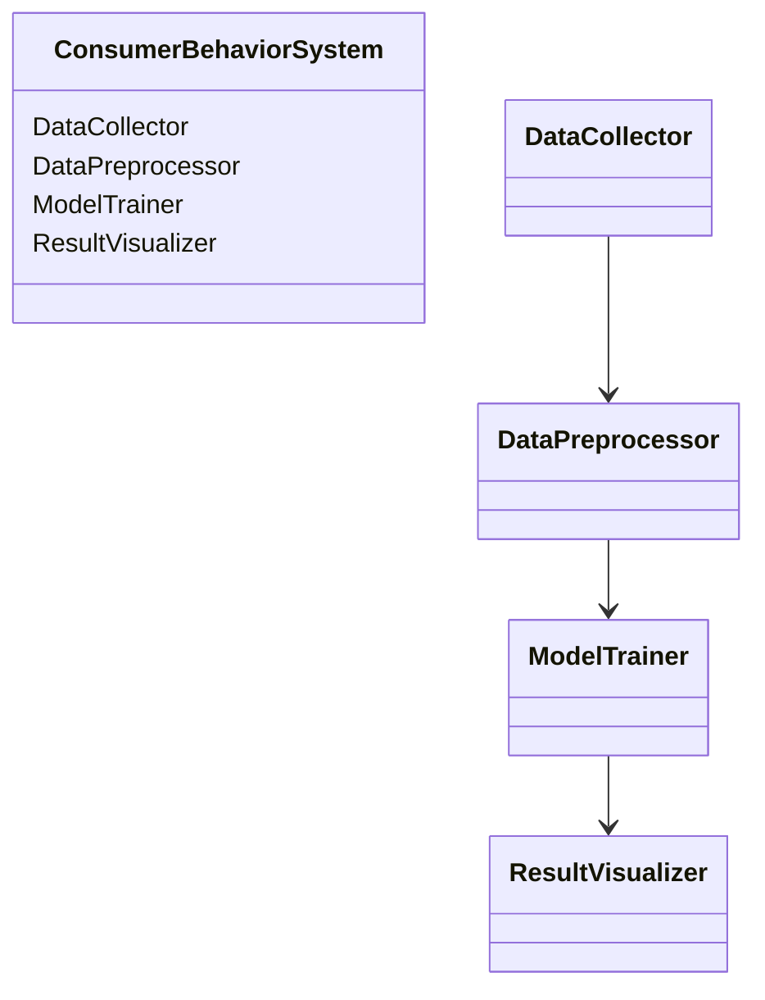
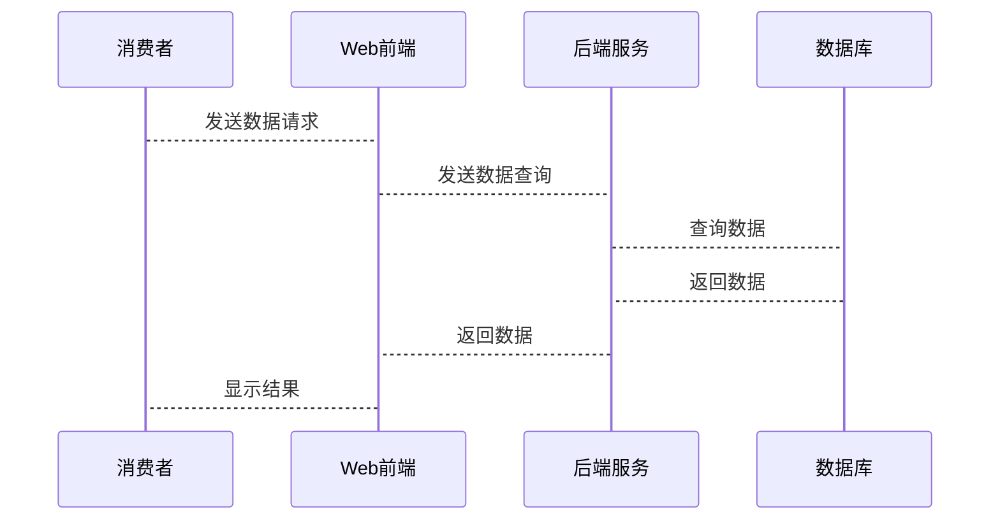

                 


# AI如何实现费雪的消费者行为研究

> 关键词：AI, 消费者行为, 费雪理论, 机器学习, 数据分析, 系统架构

> 摘要：本文探讨了如何利用人工智能技术实现费雪的消费者行为研究。通过分析费雪的消费理论，结合AI技术，构建了一个基于机器学习的消费者行为分析系统。文章详细介绍了系统的算法原理、系统架构、项目实现等，展示了AI在消费者行为研究中的巨大潜力。

---

# 第1章: 费雪的消费者行为理论与AI的结合

## 1.1 费雪的消费者行为理论概述

### 1.1.1 费雪的消费理论核心概念
费雪的消费者行为理论主要研究消费者在不同价格和收入水平下的购买决策。核心概念包括：
- **需求弹性**：价格变化对需求量的影响程度。
- **效用函数**：消费者从购买商品中获得的效用最大化。
- **预算约束**：消费者在给定收入和价格下的购买能力。

### 1.1.2 费雪需求函数的数学表达
费雪的需求函数可以表示为：
$$ Q = Q_0 \times (P/P_0)^{-e} $$
其中：
- \( Q \)：实际需求量。
- \( Q_0 \)：基准需求量。
- \( P \)：价格。
- \( P_0 \)：基准价格。
- \( e \)：需求的价格弹性。

### 1.1.3 费雪理论的现代应用
随着数据科学的发展，费雪理论被广泛应用于价格预测、市场细分和消费者画像等领域。

---

## 1.2 AI技术的基本概念与应用潜力

### 1.2.1 人工智能的核心技术
人工智能（AI）的核心技术包括：
- 机器学习：通过数据训练模型。
- 自然语言处理：理解消费者评论。
- 数据挖掘：从海量数据中提取规律。

### 1.2.2 AI在消费者行为分析中的优势
AI能够快速处理海量数据，发现隐藏的模式，帮助预测消费者行为。

### 1.2.3 AI与费雪理论结合的可行性
AI可以将费雪的需求函数与实际数据结合，构建动态需求预测模型。

---

## 1.3 费雪理论与AI结合的研究现状

### 1.3.1 当前研究的主要方向
- 利用机器学习预测消费者需求。
- 结合自然语言处理分析消费者评论。

### 1.3.2 现有研究的局限性
- 数据质量和隐私问题。
- 模型的解释性不足。

### 1.3.3 未来研究的潜力
- 结合区块链技术确保数据安全。
- 开发更复杂的深度学习模型。

---

# 第2章: 消费者行为研究的核心概念

## 2.1 消费者需求理论的数学模型

### 2.1.1 需求函数的定义与形式
需求函数描述了价格、收入和时间对需求的影响：
$$ Q_t = \beta_0 + \beta_1 P_t + \beta_2 I_t + \epsilon_t $$

### 2.1.2 需求函数的参数解释
- \( \beta_0 \)：截距项。
- \( \beta_1 \)：价格对需求的影响系数。
- \( \beta_2 \)：收入对需求的影响系数。
- \( \epsilon_t \)：误差项。

### 2.1.3 需求函数的时间序列分析
使用ARIMA模型对需求进行时间序列预测。

---

## 2.2 消费者决策模型的构建

### 2.2.1 决策树的构建
使用决策树算法对消费者决策进行建模。

### 2.2.2 决策模型的属性特征对比
| 属性 | 特征 |
|------|------|
| 数据来源 | 结构化数据 |
| 数据量 | 大规模数据 |
| 模型复杂度 | 中等复杂度 |

### 2.2.3 实体关系图（ER图）
```mermaid
erd
actor ConsumerBehaviorAnalysisSystem {
    Consumer
    Product
    Transaction
}
relationship M:N between Consumer和Transaction
relationship M:N between Product和Transaction
```

---

## 2.3 数据驱动的消费者行为分析

### 2.3.1 数据预处理步骤
1. 数据清洗：去除重复和错误数据。
2. 数据转换：标准化和归一化处理。
3. 数据增强：增加时间戳和用户特征。

### 2.3.2 数据分析的伦理问题
- 数据隐私保护。
- 避免数据滥用。

---

# 第3章: AI技术的基础与算法原理

## 3.1 机器学习的基本原理

### 3.1.1 机器学习的定义与分类
机器学习分为监督学习、无监督学习和强化学习。

### 3.1.2 监督学习与无监督学习的对比
| 特性 | 监督学习 | 无监督学习 |
|------|----------|------------|
| 数据类型 | 标签数据 | 无标签数据 |
| 目标 | 预测 | 发现模式 |

### 3.1.3 神经网络的数学模型
神经网络的前向传播公式：
$$ y = \sigma(w x + b) $$
其中：
- \( w \)：权重。
- \( b \)：偏置。
- \( \sigma \)：激活函数。

---

## 3.2 深度学习的核心算法

### 3.2.1 卷积神经网络（CNN）
CNN用于图像识别，核心是卷积层和池化层。

### 3.2.2 循环神经网络（RNN）
RNN用于时间序列数据的分析。

### 3.2.3 Transformer模型
Transformer模型在自然语言处理中应用广泛，其核心是自注意力机制。

---

## 3.3 自然语言处理技术在消费者行为分析

### 3.3.1 情感分析
使用词嵌入（如Word2Vec）和深度学习模型（如LSTM）进行情感分析。

### 3.3.2 实例分析
分析消费者评论，预测产品满意度。

---

# 第4章: 基于AI的消费者行为分析系统架构设计

## 4.1 问题场景介绍
分析消费者购买行为，预测市场需求。

## 4.2 系统功能设计
- 数据采集模块：收集消费者数据。
- 数据处理模块：清洗和预处理数据。
- 模型训练模块：训练机器学习模型。
- 结果展示模块：可视化分析结果。

### 4.2.1 领域模型（类图）


## 4.3 系统架构设计
### 4.3.1 系统架构图
```mermaid
architecturalDiagram
    component Web前端 {
        URL: 前端页面
    }
    component 后端服务 {
        URL: REST API
    }
    component 数据库 {
        URL: 数据存储
    }
    Web前端 --> 后端服务
    后端服务 --> 数据库
```

## 4.4 系统接口设计
- 前端接口：发送请求到后端。
- 后端接口：处理请求，返回结果。

## 4.5 系统交互流程


---

# 第5章: 项目实战——基于AI的消费者行为分析系统实现

## 5.1 环境配置
- 安装Python和相关库（如NumPy、Pandas、Scikit-learn）。

## 5.2 核心实现代码

### 5.2.1 数据预处理
```python
import pandas as pd
import numpy as np

# 读取数据
data = pd.read_csv('consumer_behavior.csv')

# 数据清洗
data.dropna(inplace=True)
data = pd.get_dummies(data)  # 独热编码
```

### 5.2.2 模型训练
```python
from sklearn.model import LinearRegression

# 训练模型
model = LinearRegression()
model.fit(X_train, y_train)
```

### 5.2.3 模型评估
```python
from sklearn.metrics import r2_score

# 预测结果
y_pred = model.predict(X_test)
print(r2_score(y_test, y_pred))
```

## 5.3 案例分析
以超市商品销售数据为例，预测不同价格下的销售量。

## 5.4 项目总结
- 系统实现了费雪理论的AI应用。
- 代码可以作为模板，扩展到更多场景。

---

# 第6章: 最佳实践与注意事项

## 6.1 最佳实践
- 数据预处理是关键。
- 选择合适的模型。
- 重视模型的可解释性。

## 6.2 小结
AI技术为消费者行为研究提供了新思路，但仍需解决数据质量和模型解释性问题。

## 6.3 注意事项
- 数据隐私保护。
- 模型的实时性要求。

## 6.4 拓展阅读
推荐阅读《机器学习实战》和《深度学习》。

---

# 作者：AI天才研究院 & 禅与计算机程序设计艺术

---

这篇文章详细介绍了AI在费雪消费者行为研究中的应用，从理论到实践，涵盖了数据处理、模型训练和系统设计的全过程。希望对您有所帮助！

