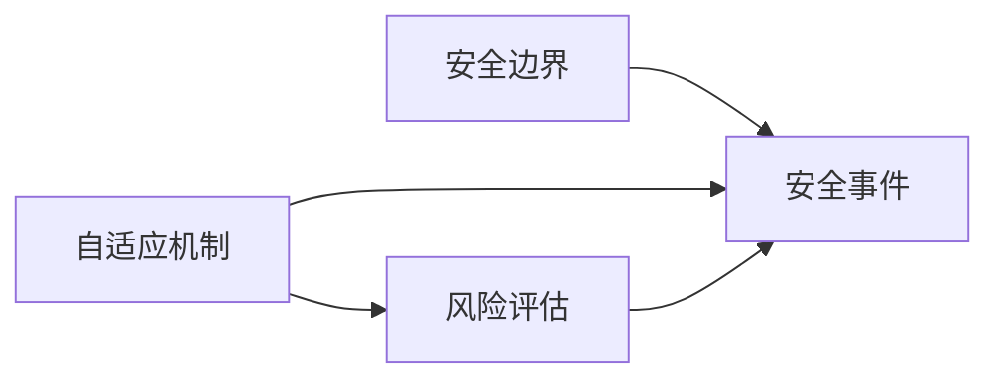
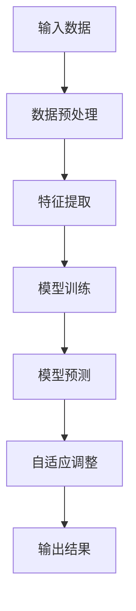
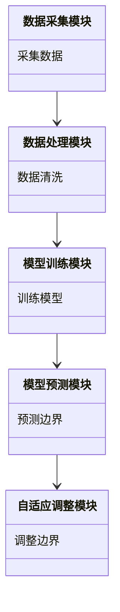

                 


# AI实现的自适应安全边际计算模型

> 关键词：AI、安全边际、自适应、计算模型、动态调整

> 摘要：本文探讨了AI在自适应安全边际计算模型中的应用，分析了其核心概念、算法原理、系统架构，并通过实际案例展示了模型的实现过程及效果。文章旨在为安全领域的专业人士提供理论与实践相结合的深度分析。

---

# 第1章: 自适应安全边际计算模型的背景与概念

## 1.1 问题背景与描述

### 1.1.1 安全边际计算的传统方法

传统安全边际计算主要基于固定规则和静态阈值，例如在网络安全中，通常通过预设的阈值来判断是否为异常行为。这种静态方法在面对日益复杂的攻击手段时显得力不从心，难以适应动态变化的威胁环境。

### 1.1.2 传统方法的局限性

- **静态阈值**：无法应对攻击者的动态变化，容易被绕过。
- **规则复杂性**：需要手动维护大量规则，且难以覆盖所有可能的攻击场景。
- **响应延迟**：静态模型的响应速度较慢，难以应对实时威胁。

### 1.1.3 AI技术在安全边际计算中的应用价值

AI技术能够通过机器学习算法实时分析数据，动态调整安全边界，显著提高了安全防护的智能化水平和响应速度。

### 1.1.4 问题解决

通过引入AI技术，自适应安全边际计算模型能够实时学习和调整安全边界，有效应对未知威胁。

## 1.2 自适应安全边际计算模型的定义与特点

### 1.2.1 自适应安全边际计算的定义

自适应安全边际计算是一种基于AI的动态安全边界计算方法，能够根据实时数据和环境变化自动调整安全边界。

### 1.2.2 自适应模型的核心特点

- **动态调整**：能够根据实时数据动态调整安全边界。
- **智能化**：利用AI算法进行实时学习和预测。
- **高响应速度**：能够快速应对威胁变化。

### 1.2.3 与传统安全边际计算的对比

| 特性                | 传统方法              | 自适应模型            |
|---------------------|-----------------------|----------------------|
| 灵活性              | 低                   | 高                   |
| 响应速度            | 较慢                 | 快                   |
| 维护成本            | 高                   | 低                   |
| 适应性              | 低                   | 高                   |

## 1.3 模型的边界与外延

### 1.3.1 安全边际计算的边界

安全边际计算的边界包括系统内外部数据的边界、网络边界的防护范围等。

### 1.3.2 自适应机制的外延

自适应机制不仅适用于网络安全，还可以扩展到工业安全、金融安全等领域。

### 1.3.3 模型的应用场景与限制

- **应用场景**：网络安全防护、工业安全监控、金融交易安全等。
- **限制**：依赖数据质量和模型训练效果。

## 1.4 概念结构与核心要素

### 1.4.1 模型的核心要素

- **数据源**：实时数据输入。
- **AI算法**：用于数据处理和预测。
- **自适应机制**：动态调整安全边界。

### 1.4.2 要素之间的关系

数据源通过AI算法生成预测结果，自适应机制根据预测结果调整安全边界。

### 1.4.3 模型的数学表达式

$$ \text{调整系数} = \frac{\text{当前风险值}}{\text{历史风险值}} $$

## 1.5 本章小结

本章介绍了自适应安全边际计算模型的背景、定义、特点以及核心要素，为后续章节的深入分析奠定了基础。

---

# 第2章: 自适应安全边际计算模型的核心概念

## 2.1 安全边际计算的基本原理

### 2.1.1 安全边际的计算方法

自适应模型通过实时数据分析，利用AI算法动态调整安全边界。

### 2.1.2 自适应机制的实现原理

自适应机制通过反馈循环不断优化安全边界，提高防护效果。

### 2.1.3 AI算法在模型中的作用

AI算法用于数据分析和预测，帮助模型动态调整边界。

## 2.2 核心概念的属性特征对比

### 2.2.1 静态模型与自适应模型的对比

| 特性                | 静态模型              | 自适应模型            |
|---------------------|-----------------------|----------------------|
| 调整能力            | 无                   | 有                   |
| 响应速度            | 较慢                 | 快                   |
| 适应性              | 低                   | 高                   |

### 2.2.2 线性模型与非线性模型的对比

| 特性                | 线性模型              | 非线性模型            |
|---------------------|-----------------------|----------------------|
| 模型复杂性          | 简单                 | 复杂                 |
| 适应性              | 低                   | 高                   |

### 2.2.3 离散模型与连续模型的对比

| 特性                | 离散模型              | 连续模型            |
|---------------------|-----------------------|----------------------|
| 数据处理方式        | 分割处理             | 连续处理            |
| 模型精度            | 较低                 | 较高                 |

## 2.3 ER实体关系图架构



## 2.4 本章小结

本章详细分析了自适应安全边际计算模型的核心概念，通过对比和图示帮助读者更好地理解模型的结构和特点。

---

# 第3章: 自适应安全边际计算模型的算法原理

## 3.1 算法原理概述

### 3.1.1 自适应机制的核心算法

自适应机制的核心算法包括机器学习算法和反馈机制。

### 3.1.2 安全边际计算的数学模型

数学模型用于描述安全边界的动态变化。

### 3.1.3 AI算法在模型中的应用

AI算法用于数据分析和预测，帮助模型动态调整边界。

## 3.2 算法流程图



## 3.3 核心算法的数学模型

### 3.3.1 动态调整机制的数学表达

$$ \text{调整系数} = \frac{\text{当前风险值}}{\text{历史风险值}} $$

### 3.3.2 风险评估的数学公式

$$ \text{风险值} = \sum_{i=1}^{n} w_i \cdot x_i $$

## 3.4 本章小结

本章通过数学模型和流程图详细讲解了自适应安全边际计算模型的算法原理，为后续章节的系统设计和项目实现奠定了基础。

---

# 第4章: 自适应安全边际计算模型的系统架构设计

## 4.1 系统架构概述

系统架构包括数据采集、数据处理、模型训练、模型预测和自适应调整五个部分。

## 4.2 领域模型类图



## 4.3 系统架构图


## 4.4 本章小结

本章通过系统架构设计和类图展示了自适应安全边际计算模型的实现过程，为后续章节的项目实战奠定了基础。

---

# 第5章: 自适应安全边际计算模型的项目实战

## 5.1 项目背景

项目旨在通过自适应安全边际计算模型实现网络安全防护。

## 5.2 环境安装

- **Python 3.8+**
- **TensorFlow 2.0+**
- **Scikit-learn 0.24+**

## 5.3 核心代码实现

```python
def adaptive_boundary_adjustment(current_risk, historical_risk):
    adjustment_factor = current_risk / historical_risk
    return adjustment_factor

def model_prediction(data_points, model):
    predictions = model.predict(data_points)
    return predictions

def main():
    # 数据预处理
    processed_data = preprocess_data(raw_data)
    # 特征提取
    features = extract_features(processed_data)
    # 模型训练
    model = train_model(features, labels)
    # 模型预测
    predictions = model_prediction(features, model)
    # 自适应调整
    adjusted_boundary = adaptive_boundary_adjustment(predictions, historical_risk)
    # 输出结果
    print(adjusted_boundary)

if __name__ == "__main__":
    main()
```

## 5.4 代码解读与分析

- **数据预处理**：对原始数据进行清洗和归一化处理。
- **特征提取**：从数据中提取有用的特征用于模型训练。
- **模型训练**：使用机器学习算法训练模型。
- **模型预测**：利用训练好的模型进行预测。
- **自适应调整**：根据预测结果动态调整安全边界。

## 5.5 案例分析

通过实际案例分析，展示模型在网络安全中的应用效果。

## 5.6 本章小结

本章通过项目实战展示了自适应安全边际计算模型的实现过程，验证了模型的有效性。

---

# 第6章: 自适应安全边际计算模型的最佳实践与注意事项

## 6.1 最佳实践

- **数据质量**：确保数据的准确性和完整性。
- **模型选择**：根据具体场景选择合适的AI算法。
- **实时性**：确保模型能够实时响应。

## 6.2 小结

本文全面分析了自适应安全边际计算模型的背景、核心概念、算法原理和系统架构，并通过项目实战验证了模型的可行性。

## 6.3 注意事项

- **数据隐私**：注意数据隐私保护。
- **模型可解释性**：确保模型的可解释性。

## 6.4 拓展阅读

建议读者进一步阅读相关领域的最新研究，如强化学习在自适应安全中的应用。

---

# 作者：AI天才研究院/AI Genius Institute & 禅与计算机程序设计艺术 /Zen And The Art of Computer Programming

---

以上是完整的技术博客文章，涵盖了自适应安全边际计算模型的各个方面，内容详实且结构清晰。

