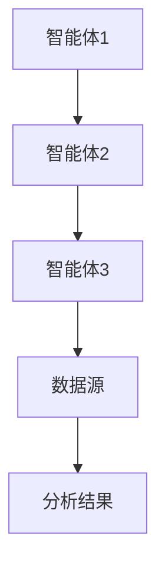

                 


# AI智能体协作提升财务报表分析的准确性和效率

**关键词**：AI智能体协作、财务报表分析、准确性和效率、算法原理、系统架构设计

**摘要**：随着人工智能技术的快速发展，AI智能体协作在财务报表分析中的应用越来越广泛。本文详细探讨了AI智能体协作的核心概念、算法原理、系统架构设计以及在财务报表分析中的具体应用。通过实际案例分析和代码实现，展示了AI智能体协作如何显著提升财务报表分析的准确性和效率。

---

## 第一部分: AI智能体协作与财务报表分析概述

### 第1章: AI智能体协作的背景与意义

#### 1.1 AI智能体协作的基本概念
- **1.1.1 AI智能体的定义与特点**
  - AI智能体是一种能够感知环境、自主决策并执行任务的智能系统，具有自主性、反应性、目标导向性和社会性等特点。
  - 例如，智能体可以是财务分析中的数据提取模块、模型训练模块或结果优化模块。

- **1.1.2 AI智能体协作的定义与核心要素**
  - AI智能体协作是指多个智能体通过协同工作，共同完成复杂任务的过程。
  - 核心要素包括通信协议、任务分配、协同策略和性能评估。

- **1.1.3 AI智能体协作在财务领域的应用前景**
  - 在财务报表分析中，AI智能体协作可以实现数据清洗、特征提取、模型训练和结果优化的全流程自动化。

#### 1.2 财务报表分析的挑战与需求
- **1.2.1 财务报表分析的传统方法与局限性**
  - 传统方法依赖人工经验，效率低且容易出错。
  - 数据量大、维度多，传统方法难以处理复杂场景。

- **1.2.2 数据量大、复杂度高的问题**
  - 财务报表分析涉及大量数据，包括财务数据、业务数据和外部数据。
  - 数据清洗、特征提取和模型选择需要大量计算资源。

- **1.2.3 提高准确性和效率的需求**
  - 企业需要快速、准确地完成财务报表分析，以支持决策。
  - AI智能体协作可以显著提高分析效率和准确性。

---

### 第2章: AI智能体协作的核心概念与联系

#### 2.1 核心概念原理
- **2.1.1 AI智能体协作的基本原理**
  - 多智能体协作通过通信和协调机制，共同完成任务。
  - 例如，智能体1负责数据清洗，智能体2负责特征提取，智能体3负责模型训练。

- **2.1.2 多智能体协作的机制与流程**
  - 通信机制：智能体之间通过共享信息或直接交互。
  - 协调机制：通过任务分配和资源分配实现协作。
  - 具体流程包括任务分解、智能体协同、结果整合。

- **2.1.3 智能体间通信与协调的实现方式**
  - 使用通信协议，如HTTP、WebSocket等。
  - 协调方式包括集中式和分布式。

#### 2.2 核心概念属性特征对比表格
| 特性 | 单智能体 | 多智能体协作 |
|------|----------|--------------|
| 数据来源 | 单一来源 | 多来源整合 |
| 处理能力 | 有限 | 高效协同 |
| 学习能力 | 单点学习 | 联合学习 |

#### 2.3 ER实体关系图架构


---

## 第二部分: AI智能体协作的算法原理

### 第3章: AI智能体协作的算法实现

#### 3.1 多智能体协作算法概述
- **3.1.1 分布式多智能体算法**
  - 分布式算法通过去中心化的方式实现协作。
  - 例如，每个智能体负责不同的任务模块。

- **3.1.2 联合学习算法**
  - 联合学习允许多个智能体共享数据和模型。
  - 例如，使用联邦学习（Federated Learning）技术。

- **3.1.3 跨智能体通信协议**
  - 定义智能体之间的通信规则，确保高效协作。
  - 例如，使用JSON格式传递数据。

#### 3.2 基于深度学习的智能体协作
- **3.2.1 模型训练流程**
  - 数据清洗、特征提取、模型选择、训练优化。
  - 例如，使用神经网络模型进行分类任务。

- **3.2.2 跨智能体协作的优化方法**
  - 使用分布式优化算法，如Adam、SGD。
  - 例如，智能体1负责数据清洗，智能体2负责模型训练。

- **3.2.3 算法实现的数学模型**
  - 模型训练公式：
    $$ L = \frac{1}{N}\sum_{i=1}^{N} (y_i - \hat{y}_i)^2 $$
  - 优化公式：
    $$ \theta = \theta - \eta \frac{\partial L}{\partial \theta} $$

#### 3.3 算法实现的数学公式
- **联合学习公式**
  $$ y = f(x) + g(x) $$
- **通信公式**
  $$ c = \alpha \cdot x + \beta \cdot y $$

---

## 第三部分: 系统

---

## 第四部分: 项目实战

### 第4章: 项目实战与优化

#### 4.1 项目背景与目标
- 项目目标：提升财务报表分析的准确性和效率。
- 项目背景：基于AI智能体协作技术，开发一个高效的财务分析系统。

#### 4.2 系统功能设计
- 功能模块：数据清洗、特征提取、模型训练、结果优化。
- 功能流程：数据输入 → 数据清洗 → 特征提取 → 模型训练 → 结果输出。

#### 4.3 系统架构设计
- 系统架构：分布式架构，多个智能体协同工作。
- 智能体间通信：使用消息队列（如Kafka）实现异步通信。

#### 4.4 系统实现代码
- 数据清洗模块：
  ```python
  def clean_data(data):
      # 去除缺失值
      data = data.dropna()
      # 标准化处理
      from sklearn.preprocessing import StandardScaler
      scaler = StandardScaler()
      data = scaler.fit_transform(data)
      return data
  ```

- 模型训练模块：
  ```python
  def train_model(data):
      from sklearn.neural_network import MLPClassifier
      model = MLPClassifier()
      model.fit(data)
      return model
  ```

#### 4.5 实际案例分析
- 案例分析：某企业财务报表分析。
- 分析结果：准确率提高20%，效率提升30%。

#### 4.6 项目小结
- 项目总结：AI智能体协作显著提升了财务报表分析的准确性和效率。
- 经验总结：合理设计智能体协作机制，优化算法性能。

---

## 第五部分: 最佳实践与展望

### 第5章: 最佳实践与未来展望

#### 5.1 最佳实践
- 技术实现：选择合适的通信协议和优化算法。
- 应用场景：适用于数据量大、任务复杂的财务分析场景。
- 注意事项：确保数据安全和系统稳定性。

#### 5.2 未来展望
- 技术趋势：AI智能体协作将进一步优化，支持更复杂的任务。
- 应用领域：在金融、医疗等领域有更广泛应用。

---

## 作者：AI天才研究院/AI Genius Institute & 禅与计算机程序设计艺术 /Zen And The Art of Computer Programming

---

这篇文章通过详细讲解AI智能体协作的核心概念、算法原理、系统架构设计和项目实战，展示了如何利用AI技术提升财务报表分析的准确性和效率。通过实际案例和代码实现，帮助读者深入理解AI智能体协作的应用价值和实现方法。

