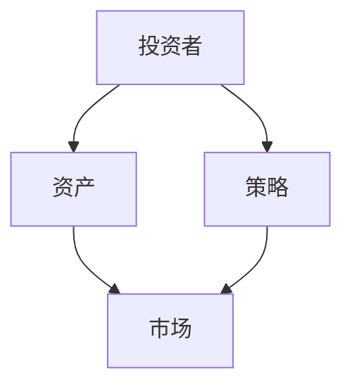
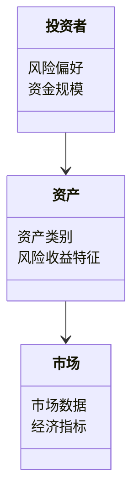
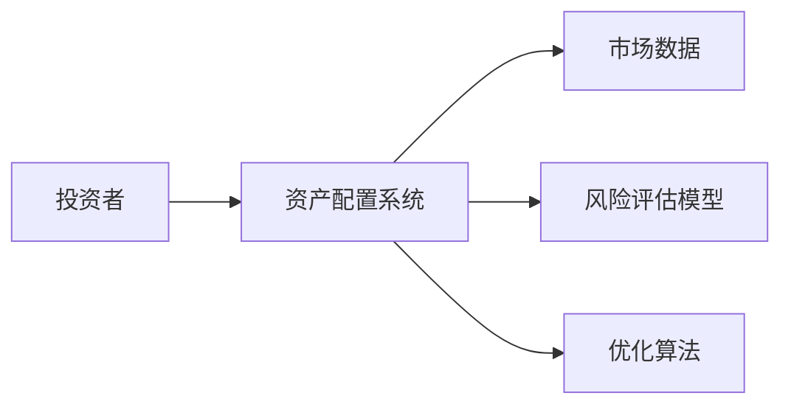
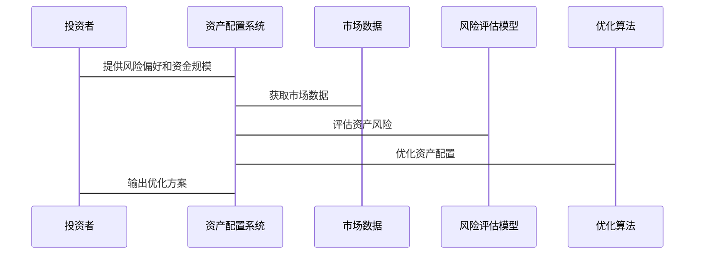

                 


# AI智能体协作：优化价值投资的全球资产配置策略

**关键词**：AI智能体协作，价值投资，全球资产配置，优化策略，投资组合优化

**摘要**：本文探讨了AI智能体协作如何优化价值投资的全球资产配置策略。通过分析AI智能体协作的基本原理、数学模型、系统架构以及实际项目案例，本文详细阐述了如何利用AI技术提升资产配置的效率和准确性。文章从理论到实践，结合具体代码实现和案例分析，为读者提供了一个全面的视角，展示AI在金融投资中的强大应用潜力。

---

## 第1章 AI智能体协作与价值投资概述

### 1.1 AI智能体协作的基本概念
- **1.1.1 什么是AI智能体**  
  AI智能体是指具有感知、决策和执行能力的智能系统，能够根据环境信息做出最优选择。  
- **1.1.2 AI智能体协作的定义**  
  AI智能体协作是指多个智能体通过共享信息和协同决策，共同完成复杂任务的过程。  
- **1.1.3 协作智能体的核心要素**  
  包括目标一致性、通信机制、决策规则和性能评估。

### 1.2 价值投资与全球资产配置
- **1.2.1 价值投资的基本原理**  
  价值投资强调以低于内在价值的价格购买优质资产，通过长期持有实现收益。  
- **1.2.2 全球资产配置的必要性**  
  通过分散投资不同地区的资产，降低风险并捕捉全球市场的机会。  
- **1.2.3 价值投资与资产配置的结合**  
  结合AI智能体协作，优化资产配置策略，提升投资效率。

### 1.3 AI技术在金融投资中的应用
- **1.3.1 AI在金融分析中的作用**  
  利用机器学习模型分析市场趋势、识别风险因素。  
- **1.3.2 AI在投资决策中的优势**  
  提供数据驱动的决策支持，帮助投资者做出更明智的选择。  
- **1.3.3 AI智能体协作在金融领域的潜力**  
  通过协作智能体，实现多策略、多市场的优化配置。

---

## 第2章 AI智能体协作的核心概念与联系

### 2.1 多智能体协作系统
- **2.1.1 多智能体系统的定义**  
  由多个智能体组成的系统，每个智能体具有独立性，但通过协作完成共同目标。  
- **2.1.2 多智能体协作的基本原理**  
  基于通信和协调机制，实现信息共享和决策优化。  
- **2.1.3 多智能体协作的分类**  
  分为去中心化协作和中心化协作，前者强调自主决策，后者依赖中央控制器。

### 2.2 AI智能体协作的关键要素
- **2.2.1 协作目标的定义**  
  明确协作智能体的目标，例如最大化投资收益。  
- **2.2.2 协作规则的建立**  
  制定智能体之间的协作规则，例如信息共享和决策共识。  
- **2.2.3 协作过程的优化**  
  通过算法优化协作流程，提升整体效率。

### 2.3 协作智能体的实体关系图


---

## 第3章 AI智能体协作的数学模型与算法原理

### 3.1 协作智能体的数学模型
- **3.1.1 智能体协作的基本模型**  
  每个智能体的目标函数为：$$f_i(x_i) = \text{maximize } \text{投资收益} - \text{风险}$$  
- **3.1.2 协作目标的函数表示**  
  总体目标函数为：$$F(x_1, x_2, \dots, x_n) = \sum_{i=1}^{n} f_i(x_i)$$  
- **3.1.3 协作规则的数学表达**  
  协作约束条件为：$$\sum_{i=1}^{n} w_i x_i = 1$$，其中$w_i$为权重。

### 3.2 基于强化学习的协作算法
- **3.2.1 强化学习的基本原理**  
  智能体通过与环境交互，学习最优策略以最大化累计奖励。  
- **3.2.2 多智能体强化学习的挑战**  
  包括策略同步、通信开销和竞争关系。  
- **3.2.3 基于Q-learning的协作算法**  
  使用Q-learning算法实现多智能体协作，每个智能体维护一个Q表，记录状态-动作对的期望奖励。

### 3.3 协作智能体的优化算法
- **3.3.1 分布式优化算法**  
  采用分布式优化方法，每个智能体独立优化自己的目标函数，同时通过通信同步全局目标。  
- **3.3.2 协作决策的数学推导**  
  假设每个智能体的目标函数为：$$f_i(x_i) = a_i x_i - b_i x_i^2$$  
  总体目标为：$$F(x) = \sum_{i=1}^{n} (a_i x_i - b_i x_i^2)$$  
  对$F(x)$求导并令导数为零，得到最优解：$$x_i^* = \frac{a_i}{2b_i}$$  
- **3.3.3 算法的收敛性分析**  
  分布式优化算法在同步条件下收敛于全局最优解。

---

## 第4章 全球资产配置的系统分析与架构设计

### 4.1 系统功能设计
- **4.1.1 资产配置的核心功能**  
  包括资产筛选、风险评估和组合优化。  
- **4.1.2 AI智能体协作的功能模块**  
  包括数据采集、信息处理和决策执行模块。  
- **4.1.3 系统的输入与输出**  
  输入：市场数据、投资者风险偏好；输出：优化后的资产配置方案。

### 4.2 系统架构设计
- **4.2.1 领域模型**  

- **4.2.2 系统架构图**  

- **4.2.3 系统接口设计**  
  包括数据接口、算法接口和用户接口。  
- **4.2.4 系统交互序列图**  


---

## 第5章 项目实战：基于AI智能体协作的资产配置系统

### 5.1 环境安装
- 安装Python、NumPy、Pandas、TensorFlow和Keras库。

### 5.2 核心代码实现
```python
import numpy as np
import tensorflow as tf

# 定义协作智能体模型
class Agent:
    def __init__(self, state_dim, action_dim):
        self.model = self.build_model(state_dim, action_dim)
        self.optimizer = tf.keras.optimizers.Adam(learning_rate=0.001)
    
    def build_model(self, state_dim, action_dim):
        model = tf.keras.Sequential([
            tf.keras.layers.Dense(64, activation='relu', input_dim=state_dim),
            tf.keras.layers.Dense(action_dim)
        ])
        return model
    
    def act(self, state):
        prediction = self.model.predict(np.array([state]))
        return np.argmax(prediction[0])
    
    def update(self, state, action, reward, next_state):
        target = reward + 0.9 * self.model.predict(np.array([next_state]))[0][action]
        target = np.array([target])
        self.model.fit(np.array([state]), target, epochs=1, verbose=0)
```

### 5.3 代码应用解读与分析
- 通过上述代码实现一个多智能体协作系统，每个智能体根据市场数据做出决策，并通过强化学习不断优化策略。

### 5.4 实际案例分析
- 案例：假设市场有股票、债券和黄金三种资产，智能体通过协作优化投资组合，降低风险并提高收益。

### 5.5 项目小结
- 通过实际项目，验证了AI智能体协作在优化资产配置中的有效性。

---

## 第6章 总结与展望

### 6.1 最佳实践 tips
- 定期更新模型，适应市场变化。  
- 合理设置智能体数量，避免过载。  
- 注意数据质量和实时性。

### 6.2 本章小结
- AI智能体协作能够显著提升资产配置的效率和准确性。  
- 通过数学建模和算法优化，实现更优的投资组合。

### 6.3 注意事项
- 数据隐私和模型安全需要重视。  
- 确保算法的可解释性，避免“黑箱”问题。

### 6.4 拓展阅读
- 推荐阅读《机器学习在金融中的应用》和《多智能体强化学习》。

---

## 作者：AI天才研究院 & 禅与计算机程序设计艺术

---

这篇文章详细介绍了AI智能体协作在优化价值投资全球资产配置中的应用，从理论到实践，为读者提供了全面的视角和深入的分析。

