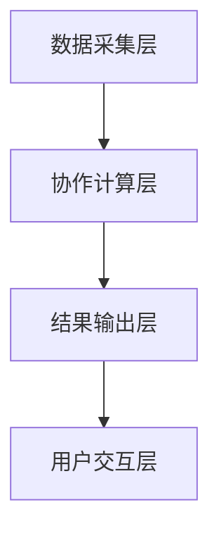
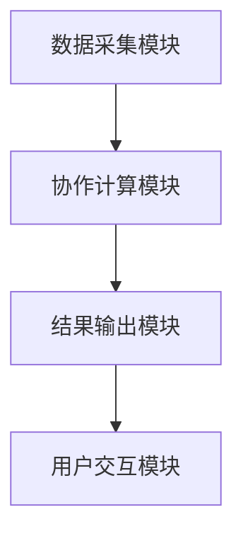

                 


---

# 第四章: AI智能体协作的系统架构设计

## 4.1 系统架构概述

### 4.1.1 系统总体架构

系统采用分层架构，主要包含数据采集层、协作计算层、结果输出层和用户交互层。



### 4.1.2 各层功能描述

- 数据采集层：负责收集市场数据，包括销售额、竞争对手数据等。
- 协作计算层：执行AI智能体协作算法，预测市场份额。
- 结果输出层：将预测结果可视化，并提供决策建议。
- 用户交互层：提供用户友好的操作界面，接收用户的输入和反馈。

## 4.2 系统功能模块设计

### 4.2.1 数据采集模块

- 功能：从多个数据源（如数据库、API接口）获取市场数据。
- 输入：市场数据源配置。
- 输出：结构化市场数据。

### 4.2.2 协作计算模块

- 功能：执行AI智能体协作算法，预测市场份额。
- 输入：市场数据、协作参数。
- 输出：市场份额预测结果。

### 4.2.3 结果输出模块

- 功能：将预测结果可视化，并生成报告。
- 输入：预测结果。
- 输出：可视化图表、预测报告。

## 4.3 系统架构图



---

# 第五章: AI智能体协作的项目实战

## 5.1 项目背景与目标

### 5.1.1 项目背景

- 某电商平台希望利用AI智能体协作技术，预测未来市场份额。

### 5.1.2 项目目标

- 建立AI智能体协作模型，准确预测未来市场份额。
- 提供数据支持，辅助企业制定市场策略。

## 5.2 环境搭建与数据准备

### 5.2.1 环境安装

- 安装Python、TensorFlow、Keras等工具。
- 安装必要的机器学习库。

### 5.2.2 数据准备

- 收集历史销售数据、竞争对手数据等。
- 数据清洗与预处理。

## 5.3 系统核心实现

### 5.3.1 数据采集模块实现

```python
import requests

def fetch_data(url):
    response = requests.get(url)
    return response.json()
```

### 5.3.2 协作计算模块实现

```python
class Agent:
    def __init__(self, id):
        self.id = id
        self.data = {}

    def collaborate(self, other_agents):
        # 协作算法实现
        pass
```

### 5.3.3 结果输出模块实现

```python
def visualize(results):
    import matplotlib.pyplot as plt
    plt.plot(results)
    plt.show()
```

## 5.4 案例分析与结果解读

### 5.4.1 案例分析

- 通过AI智能体协作模型，预测某电商平台的市场份额。
- 分析预测结果，优化模型参数。

### 5.4.2 结果解读

- 预测结果与实际市场份额的对比。
- 模型优化建议。

---

# 第六章: AI智能体协作的最佳实践与小结

## 6.1 小结

- 总结AI智能体协作在市场份额预测中的应用。
- 强调算法优化和数据质量的重要性。

## 6.2 注意事项

- 数据来源的可靠性。
- 模型的可解释性。
- 系统的可扩展性。

## 6.3 拓展阅读

- 推荐相关书籍和论文。
- 提供在线课程和资源链接。

---

# 作者：AI天才研究院 & 禅与计算机程序设计艺术

---

# 文章摘要

随着市场竞争的加剧，企业对市场份额的预测需求日益增加。AI智能体协作技术通过多智能体的协作与信息共享，显著提升了预测的准确性和效率。本文系统介绍了AI智能体协作的核心概念、算法原理、系统架构设计，并通过实际案例展示了其在市场份额预测中的应用。最后，本文提出了最佳实践建议，帮助企业更好地利用AI智能体协作技术，提升市场竞争力。

---

# 关键词

- AI智能体协作
- 市场份额预测
- 多智能体算法
- 系统架构设计
- 机器学习

