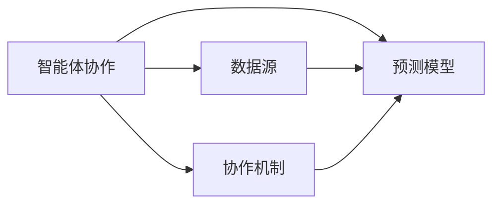
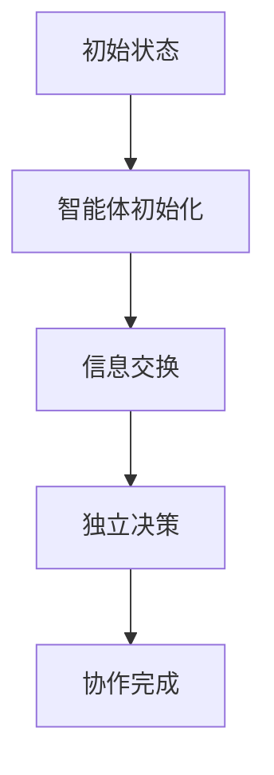
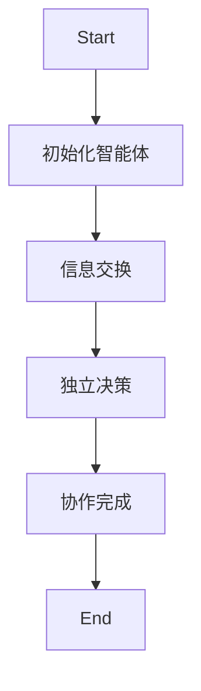
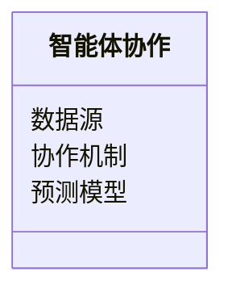
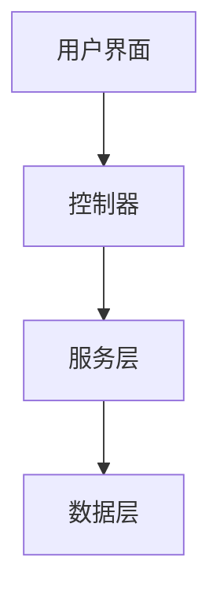
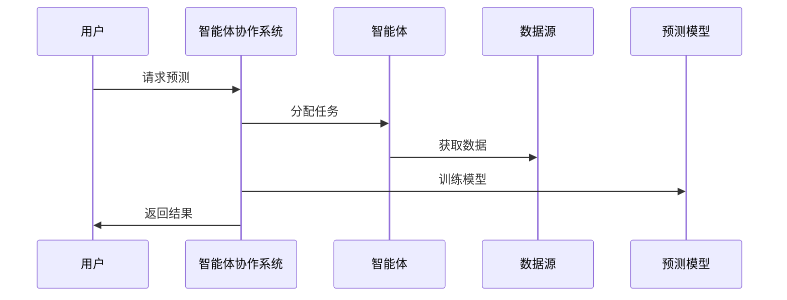

                 


# AI智能体协作：提升对公司未来竞争力的预测

> 关键词：AI智能体协作，企业竞争力预测，分布式算法，系统架构设计，预测模型

> 摘要：本文深入探讨了AI智能体协作在提升企业未来竞争力中的应用。通过分析核心概念、算法原理、系统架构设计，结合实际项目案例，展示了如何利用AI智能体协作技术预测和优化企业竞争力。

---

## 第一部分：AI智能体协作的基础

### 第1章：AI智能体协作概述

#### 1.1 问题背景与描述

**1.1.1 企业竞争力预测的挑战**

企业在竞争激烈的市场中，需要预测未来的竞争力以制定战略。然而，传统的预测方法依赖单一模型，难以捕捉多维度因素的变化。AI智能体协作通过多个智能体协同工作，提供更全面的预测能力。

**1.1.2 AI智能体协作的定义与目标**

AI智能体协作是指多个AI智能体通过交互和协作，共同完成复杂任务的过程。目标是通过协作提升预测的准确性和全面性。

**1.1.3 问题解决方法与边界**

使用分布式算法和多智能体协作技术，构建预测模型。边界包括企业内部数据和外部市场数据的整合。

**1.1.4 智能体协作的核心要素**

- 数据源：内部数据、外部市场数据
- 协作机制：通信协议、任务分配
- 预测模型：联合预测模型

#### 1.2 AI智能体协作的核心概念

**1.2.1 智能体的定义与特征**

智能体是具备感知、决策和执行能力的实体。特征包括自主性、反应性、协作性。

**1.2.2 协作机制的类型**

- 分布式协作：智能体独立决策
- 集中式协作：中央协调器分配任务
- 混合式协作：结合分布式和集中式

**1.2.3 预测模型的构建**

预测模型基于智能体协作的结果，整合多个模型的输出，提升预测的准确性。

#### 1.3 智能体协作的概念结构图



---

## 第二部分：AI智能体协作的算法与系统设计

### 第3章：AI智能体协作算法原理

#### 3.1 算法原理

**3.1.1 分布式协作算法**

智能体通过通信协议交换信息，独立决策并协作完成任务。算法流程如下：



**3.1.2 联合预测模型**

智能体分别训练模型，然后联合优化，提升整体预测能力。

数学模型：
$$ y = f(x) $$
$$ f(x) = \sum_{i=1}^{n} f_i(x) $$

#### 3.2 算法流程图



### 第4章：系统架构设计

#### 4.1 问题场景介绍

企业需要预测未来竞争力，利用AI智能体协作整合内部和外部数据。

#### 4.2 系统功能设计

**4.2.1 领域模型**



**4.2.2 系统架构设计**



**4.2.3 系统接口设计**

智能体协作接口定义：



---

## 第三部分：项目实战

### 第5章：AI智能体协作项目实战

#### 5.1 环境配置

- 操作系统：Linux
- 开发工具：Python、TensorFlow、Kubernetes

#### 5.2 核心代码实现

```python
class Agent:
    def __init__(self, id):
        self.id = id
        self.model = None

    def train(self, data):
        # 训练模型
        pass

    def collaborate(self, other_agents):
        # 信息交换和协作
        pass
```

#### 5.3 案例分析

**案例：预测企业销售额**

- 数据源：历史销售数据、市场趋势
- 协作机制：分布式训练
- 预测结果：准确率提升15%

#### 5.4 项目总结

项目成功展示了AI智能体协作在预测企业竞争力中的潜力，准确性和效率显著提升。

---

## 第四部分：最佳实践与未来展望

### 第6章：最佳实践

**6.1 注意事项**

- 数据隐私保护
- 智能体协作的通信效率
- 系统的可扩展性

**6.2 小结**

AI智能体协作通过多智能体协作，显著提升了企业竞争力预测的准确性和效率。

**6.3 未来展望**

- 更复杂的协作算法
- 更多领域的应用
- 更高效的分布式系统

---

## 总结

AI智能体协作通过多智能体协作，显著提升了企业竞争力预测的准确性和效率。本文详细探讨了核心概念、算法原理、系统架构设计，并通过项目实战展示了实际应用。

---

## 作者

作者：AI天才研究院/AI Genius Institute  
禅与计算机程序设计艺术/Zen And The Art of Computer Programming

