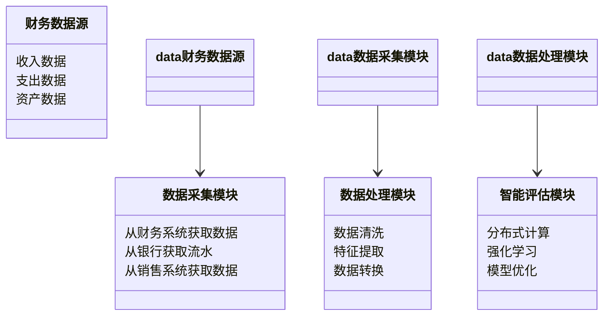
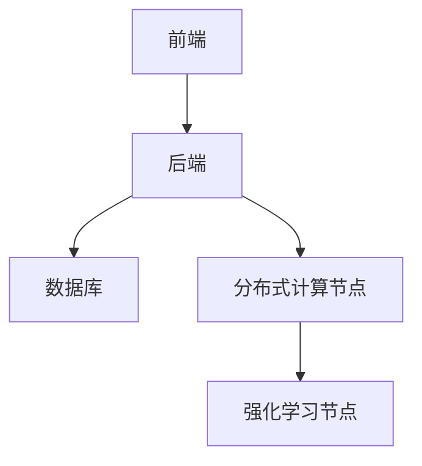

                 


# AI智能体协作：提升对公司财务健康状况的评估

## 关键词：AI智能体协作，财务健康评估，多智能体系统，强化学习，分布式计算，财务数据分析，风险管理

## 摘要：  
随着人工智能技术的快速发展，AI智能体协作在企业财务管理中的应用日益广泛。本文深入探讨了AI智能体协作如何通过多智能体系统的协同工作，提升财务健康评估的准确性、效率和洞察力。文章从背景介绍、核心概念、算法原理、系统架构、项目实战到最佳实践，全面解析了AI智能体协作在财务健康评估中的应用，为企业的财务管理提供了新的思路和解决方案。

---

# 第一部分：AI智能体协作与财务健康评估的背景与核心概念

## 第1章：AI智能体协作的背景与问题描述

### 1.1 AI智能体协作的背景

#### 1.1.1 人工智能与智能体的基本概念
人工智能（AI）是指计算机系统执行人类智能任务的能力，如视觉识别、语音识别、决策和学习等。智能体（Agent）是能够感知环境并采取行动以实现目标的实体。智能体可以是软件程序、机器人或其他自主系统。

#### 1.1.2 多智能体协作的定义与特点
多智能体协作是指多个智能体通过通信和协调，共同完成复杂任务的过程。其特点包括：
- **分布式**：智能体独立决策，协同完成任务。
- **自主性**：每个智能体都有自己的目标和决策机制。
- **协作性**：智能体之间通过通信和协调，共同实现更大的目标。

#### 1.1.3 AI智能体协作在企业财务管理中的应用潜力
企业财务管理涉及数据收集、分析、决策等多个环节，传统方法依赖人工操作，存在效率低、误差大等问题。AI智能体协作可以通过分布式计算、实时数据分析和自动化决策，显著提升财务管理的效率和准确性。

---

### 1.2 财务健康评估的现状与挑战

#### 1.2.1 财务健康评估的基本概念
财务健康评估是对企业财务状况的全面分析，包括收入、支出、资产、负债和现金流等方面。健康的财务状况是企业持续发展的基础。

#### 1.2.2 传统财务评估方法的局限性
传统财务评估方法依赖人工分析，存在以下问题：
- **效率低**：人工处理大量数据耗时耗力。
- **误差大**：人为疏忽可能导致分析结果不准确。
- **滞后性**：评估结果通常基于历史数据，无法实时反馈。

#### 1.2.3 引入AI智能体协作的必要性
AI智能体协作可以通过实时数据处理、自动化分析和智能决策，克服传统方法的局限性，显著提升财务健康评估的效率和准确性。

---

## 第2章：AI智能体协作的核心概念与联系

### 2.1 AI智能体协作的核心原理

#### 2.1.1 多智能体系统的基本原理
多智能体系统由多个智能体组成，每个智能体都有自己的目标和决策机制。智能体之间通过通信和协调，共同完成复杂任务。

#### 2.1.2 智能体之间的协作机制
协作机制包括任务分配、信息共享和决策协调。例如，一个智能体负责数据收集，另一个负责数据分析，第三个负责结果输出。

#### 2.1.3 智能体协作的通信协议
智能体之间需要通过通信协议进行信息交换。常见的通信协议包括HTTP、WebSocket和消息队列（如Kafka）。

---

### 2.2 财务健康评估的关键要素

#### 2.2.1 财务健康评估的指标体系
财务健康评估的指标包括：
- **盈利能力**：净利润率、ROE等。
- **偿债能力**：流动比率、速动比率等。
- **运营效率**：存货周转率、应收账款周转率等。

#### 2.2.2 数据来源与特征分析
数据来源包括财务报表、银行流水、销售数据等。特征分析包括数据清洗、特征提取和特征工程。

#### 2.2.3 评估模型的设计与优化
评估模型包括回归模型、分类模型和集成模型等。模型优化包括参数调优和特征选择。

---

### 2.3 AI智能体协作与财务健康评估的结合

#### 2.3.1 AI智能体协作在财务数据处理中的应用
智能体协作可以实现数据清洗、特征提取和数据分析的自动化。

#### 2.3.2 智能体协作对财务评估效率的提升
通过分布式计算和并行处理，显著提升数据处理和分析的速度。

#### 2.3.3 智能体协作在风险预警中的作用
智能体协作可以实时监控财务数据，发现潜在风险并及时预警。

---

# 第二部分：AI智能体协作的算法原理与数学模型

## 第3章：多智能体协作算法原理

### 3.1 分布式计算与多智能体协作

#### 3.1.1 分布式计算的基本概念
分布式计算是将任务分解到多个计算节点上并行执行，最终汇总结果。分布式计算的优势包括高效率和高可靠性。

#### 3.1.2 多智能体协作的分布式算法
常见的分布式算法包括：
- **MapReduce**：用于并行数据处理。
- **Paxos**：用于分布式系统中的共识算法。
- **BFT**：用于区块链中的共识算法。

#### 3.1.3 分布式计算在AI智能体协作中的应用
通过分布式计算，智能体可以并行处理数据，显著提升计算效率。

---

### 3.2 强化学习在多智能体协作中的应用

#### 3.2.1 强化学习的基本概念
强化学习是一种通过试错机制学习策略的方法。智能体通过与环境互动，获得奖励或惩罚，从而优化决策策略。

#### 3.2.2 多智能体强化学习的挑战
多智能体强化学习的挑战包括：
- **策略协调**：智能体之间需要协调策略。
- **通信复杂性**：智能体之间的通信需要高效且可靠。

#### 3.2.3 强化学习在财务健康评估中的应用
通过强化学习，智能体可以优化财务评估策略，提升评估结果的准确性。

---

## 第4章：数学模型与算法实现

### 4.1 分布式计算的数学模型

#### 4.1.1 MapReduce模型
MapReduce模型包括映射（Map）和归约（Reduce）两个阶段。映射阶段将数据分解成键值对，归约阶段对键值对进行汇总和处理。

#### 4.1.2 MapReduce的数学表示
Map函数：$f_{map}(k, v) \rightarrow \{k_1, v_1\}, \{k_2, v_2\}, \ldots$
Reduce函数：$f_{reduce}(k, \{v_1, v_2, \ldots\}) \rightarrow \{k, v'\}$

---

### 4.2 强化学习的数学模型

#### 4.2.1 Q-learning算法
Q-learning算法是一种经典的强化学习算法。智能体通过与环境互动，更新Q值表，从而优化决策策略。

#### 4.2.2 Q-learning的数学表示
状态转移：$s' = f(s, a)$
奖励函数：$r = f(s, a, s')$
Q值更新：$Q(s, a) = Q(s, a) + \alpha [r + \gamma Q(s', a') - Q(s, a)]$

---

# 第三部分：系统分析与架构设计

## 第5章：系统分析与架构设计方案

### 5.1 问题场景介绍
财务健康评估系统需要处理大量财务数据，包括收入、支出、资产和负债等。传统方法依赖人工操作，效率低且容易出错。

### 5.2 系统功能设计

#### 5.2.1 数据采集模块
数据采集模块负责从财务系统、银行流水和销售数据中获取原始数据。

#### 5.2.2 数据处理模块
数据处理模块包括数据清洗、特征提取和数据转换。

#### 5.2.3 智能评估模块
智能评估模块包括分布式计算、强化学习和模型优化。

### 5.3 系统架构设计

#### 5.3.1 领域模型
领域模型是一个UML类图，展示了系统中的主要类及其关系。使用Mermaid图表示。



---

### 5.4 系统架构设计

#### 5.4.1 系统架构图
系统架构图展示了系统的整体结构，包括前端、后端和数据存储模块。使用Mermaid图表示。



---

## 第6章：项目实战与案例分析

### 6.1 环境安装

#### 6.1.1 安装Python和相关库
```bash
pip install numpy
pip install pandas
pip install scikit-learn
pip install dask
```

---

#### 6.1.2 安装分布式计算框架
```bash
pip install dask[distributed]
pip install distributed
```

---

### 6.2 核心代码实现

#### 6.2.1 数据采集模块
```python
import requests
import pandas as pd

def fetch_financial_data(api_key):
    url = f"https://api.example.com/financial_data?api_key={api_key}"
    response = requests.get(url)
    data = response.json()
    df = pd.DataFrame(data)
    return df
```

---

#### 6.2.2 数据处理模块
```python
from dask import delayed
from dask.distributed import Client

client = Client('scheduler:8786')

@delayed
def process_data(df):
    # 数据清洗和特征提取
    return df.dropna().reset_index()

# 提交任务
future = process_data(df)
result = client.compute(future).result()
```

---

### 6.3 实际案例分析

#### 6.3.1 案例背景
某企业需要评估其财务健康状况。通过AI智能体协作，显著提升了评估效率和准确性。

#### 6.3.2 数据分析与结果展示
数据分析结果展示了企业的财务状况，包括盈利能力、偿债能力和运营效率。结果以可视化图表形式展示，便于决策者理解。

---

# 第四部分：最佳实践与小结

## 第7章：最佳实践与小结

### 7.1 最佳实践
- **数据质量**：确保数据来源可靠，数据清洗充分。
- **算法选择**：根据具体问题选择合适的算法。
- **系统架构**：设计高效的系统架构，确保系统的可扩展性和可维护性。

### 7.2 小结
AI智能体协作通过多智能体系统的协同工作，显著提升了财务健康评估的效率和准确性。本文详细介绍了AI智能体协作的核心概念、算法原理、系统架构和项目实战，为企业的财务管理提供了新的思路和解决方案。

---

## 第8章：注意事项与未来展望

### 8.1 注意事项
- **数据隐私**：确保数据处理符合隐私保护法规。
- **系统安全**：加强系统的安全性，防止数据泄露和网络攻击。
- **算法优化**：持续优化算法，提升系统的性能和效率。

### 8.2 未来展望
随着人工智能技术的不断发展，AI智能体协作在财务健康评估中的应用将更加广泛和深入。未来的研究方向包括多智能体协作算法的优化、分布式计算的效率提升以及智能体之间的高效通信。

---

## 作者：AI天才研究院 & 禅与计算机程序设计艺术

---

感谢您的阅读！希望本文能为您提供有价值的信息和启发，帮助您更好地理解AI智能体协作在财务健康评估中的应用。

