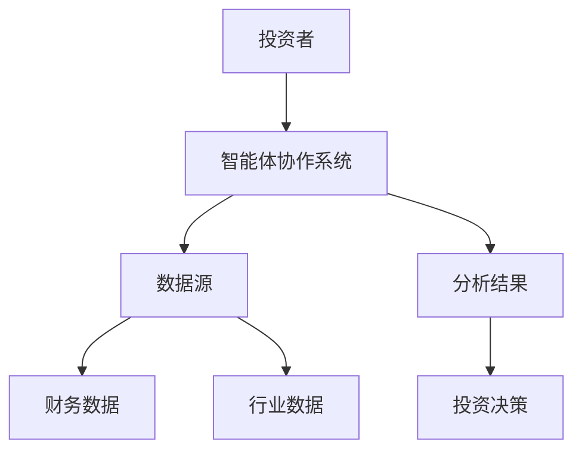
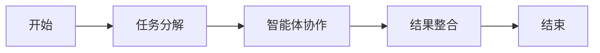
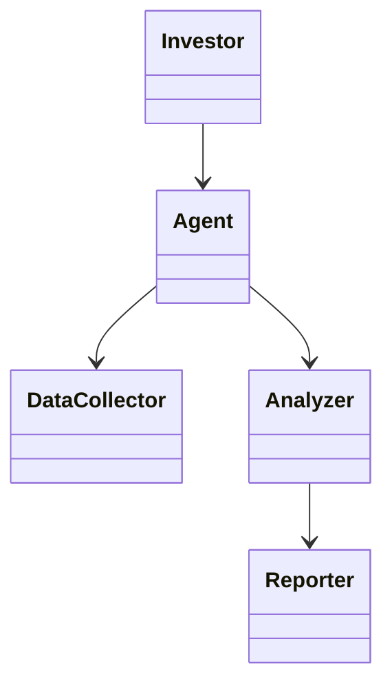
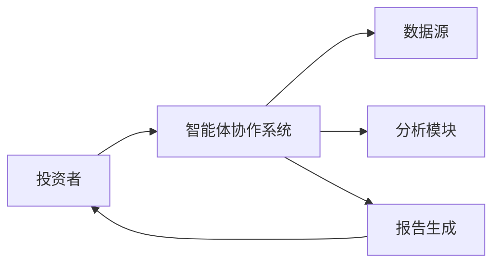
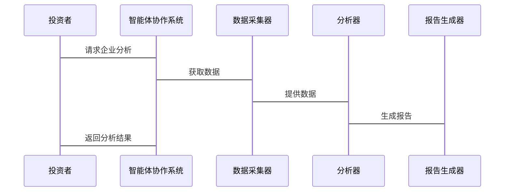

                 


# AI智能体协作：提升巴菲特的企业分析方法

> 关键词：AI智能体协作，巴菲特分析方法，企业分析，多智能体系统，强化学习，数学模型

> 摘要：本文探讨了如何利用AI智能体协作技术提升巴菲特的企业分析方法。通过分析AI智能体协作的核心原理、算法实现、系统架构以及实际案例，本文展示了如何将AI技术与传统投资分析方法结合，以提高企业分析的效率和准确性。

---

# 第1章: 背景介绍

## 1.1 AI智能体协作的定义与背景

### 1.1.1 什么是AI智能体
AI智能体（Artificial Intelligence Agent）是指能够感知环境、自主决策并执行任务的智能实体。它可以是一个软件程序、机器人或其他任何形式的智能系统，核心目标是通过智能决策和行动来实现特定目标。

### 1.1.2 AI智能体协作的概念
AI智能体协作是指多个AI智能体之间通过信息共享、任务分配和协同工作，共同完成复杂任务的过程。协作的核心在于智能体之间的通信与协调，以及对任务的分工与优化。

### 1.1.3 巴菲特分析方法的简介
巴菲特的企业分析方法以基本面分析为核心，注重企业的财务状况、竞争优势、管理层质量以及行业地位。这种方法强调对企业内在价值的深入挖掘，以识别具有长期增长潜力的投资标的。

### 1.1.4 两者的结合意义
通过将AI智能体协作技术应用于巴菲特的企业分析方法，可以显著提高分析效率和准确性。AI智能体可以通过分工协作，快速处理海量数据，提取关键信息，并生成分析报告，从而辅助投资者做出更明智的决策。

---

## 1.2 问题背景与目标

### 1.2.1 传统企业分析的局限性
传统的企业分析方法依赖人工经验，效率较低且容易受到主观因素的影响。分析师需要手动收集和处理大量数据，耗时耗力，且可能存在遗漏或错误。

### 1.2.2 AI智能体协作的优势
AI智能体协作可以通过分布式计算和并行处理，显著提高数据分析效率。多个智能体可以同时处理不同领域的数据，实现信息的全面整合和快速分析。

### 1.2.3 本书的目标与范围
本书旨在探讨如何利用AI智能体协作技术优化巴菲特的企业分析方法。通过理论分析和实际案例，展示AI技术在投资分析中的应用潜力。

---

# 第2章: 核心概念与联系

## 2.1 AI智能体协作的核心原理

### 2.1.1 多智能体系统
多智能体系统（Multi-Agent System, MAS）是由多个相互作用的智能体组成的系统。这些智能体通过通信和协作，共同完成复杂任务。

### 2.1.2 智能体协作机制
智能体协作机制包括任务分配、信息共享和结果整合。任务分配确保每个智能体专注于特定任务，信息共享促进知识的流通，结果整合则将各智能体的分析结果整合为最终结论。

### 2.1.3 与巴菲特分析方法的结合
AI智能体协作可以辅助巴菲特分析方法中的数据收集、财务分析和竞争优势评估等环节。每个智能体负责不同的分析任务，最终整合出全面的企业分析报告。

---

## 2.2 核心概念对比与ER实体关系图

### 2.2.1 AI智能体协作与传统分析方法的对比
| 对比维度 | AI智能体协作 | 传统分析方法 |
|----------|--------------|---------------|
| 效率     | 高           | 低             |
| 准确性   | 高           | 中             |
| 灵活性   | 高           | 低             |

### 2.2.2 实体关系图（Mermaid流程图）



---

# 第3章: 算法原理与数学模型

## 3.1 算法原理

### 3.1.1 分布式计算与协作算法
分布式计算是AI智能体协作的核心技术。通过将任务分解为多个子任务，分配给不同的智能体执行，最终整合结果。

### 3.1.2 强化学习在协作中的应用
强化学习可以用于优化智能体的协作策略。通过奖励机制，智能体学习如何更好地与其他智能体协作，以提高整体效率。

### 3.1.3 算法流程图（Mermaid）



## 3.2 数学模型与公式

### 3.2.1 协作效率公式
$$
效率 = \frac{任务完成量}{时间}
$$

### 3.2.2 优化模型
$$
最大化目标函数：\sum_{i=1}^{n} f(i)
$$

---

## 3.3 代码实现与举例

### 3.3.1 简单协作算法示例

```python
def collaborate_agents(tasks):
    # 分配任务
    agents = [Agent(i) for i in range(n_agents)]
    assigned_tasks = distribute_tasks(tasks, agents)
    
    # 执行任务
    results = [agent.execute(task) for agent, task in assigned_tasks.items()]
    
    # 整合结果
    return combine_results(results)
```

---

# 第4章: 系统分析与架构设计

## 4.1 问题场景介绍

### 4.1.1 企业分析的应用场景
企业分析涉及财务数据、行业趋势、竞争优势等多个方面。AI智能体协作可以用于数据收集、分析和报告生成。

### 4.1.2 系统功能设计
系统功能包括数据采集、任务分配、分析执行和结果展示。

---

## 4.2 系统架构设计

### 4.2.1 领域模型（Mermaid类图）



### 4.2.2 系统架构图（Mermaid）



### 4.2.3 接口设计
系统接口包括数据采集接口、分析结果接口和报告生成接口。

---

## 4.3 系统交互流程图（Mermaid）



---

# 第5章: 项目实战

## 5.1 环境安装与配置

### 5.1.1 安装Python与相关库
需要安装Python 3.8以上版本，并安装以下库：
- `numpy`
- `pandas`
- `scikit-learn`
- `networkx`

### 5.1.2 安装AI框架
推荐使用`TensorFlow`或`PyTorch`进行模型训练。

---

## 5.2 系统核心实现

### 5.2.1 数据采集模块

```python
import pandas as pd

def collect_data(tickers):
    data = []
    for ticker in tickers:
        # 收集财务数据
        data.append(pd.read_csv(f'{ticker}.csv'))
    return data
```

### 5.2.2 分析模块

```python
from sklearn import model_selection

def analyze(data):
    # 使用机器学习模型进行分析
    X_train, X_test, y_train, y_test = model_selection.train_test_split(data, target)
    # 模型训练与预测
    return results
```

---

## 5.3 实际案例分析

### 5.3.1 案例背景
以某科技公司为例，分析其财务状况和行业地位。

### 5.3.2 数据分析与解读
通过AI智能体协作系统，快速收集并分析公司的财务数据、行业趋势和竞争优势。

### 5.3.3 案例总结
AI智能体协作显著提高了企业分析的效率和准确性，为投资者提供了更有力的支持。

---

# 第6章: 总结与展望

## 6.1 总结

### 6.1.1 核心内容回顾
AI智能体协作技术可以显著提升巴菲特的企业分析方法，通过分工协作和并行处理，提高分析效率和准确性。

### 6.1.2 技术优势与不足
AI智能体协作的优势在于高效性和准确性，但目前仍存在协作机制复杂和数据隐私问题。

---

## 6.2 展望

### 6.2.1 技术发展趋势
未来，随着AI技术的不断发展，智能体协作将在更多领域得到应用。

### 6.2.2 应用前景
AI智能体协作技术将在金融、医疗和教育等领域发挥重要作用，推动数据分析效率的进一步提升。

---

# 作者：AI天才研究院/AI Genius Institute & 禅与计算机程序设计艺术 /Zen And The Art of Computer Programming

