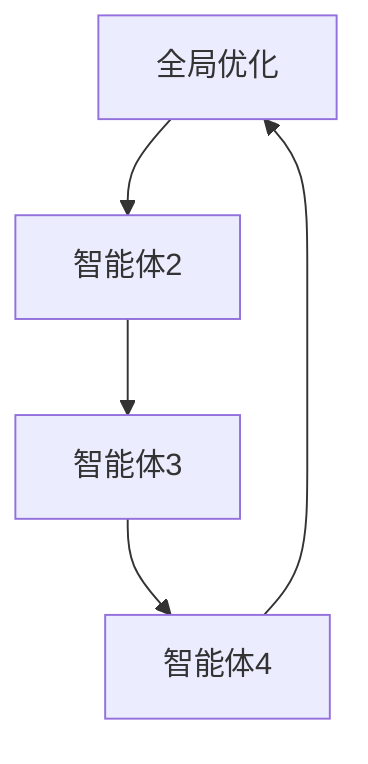
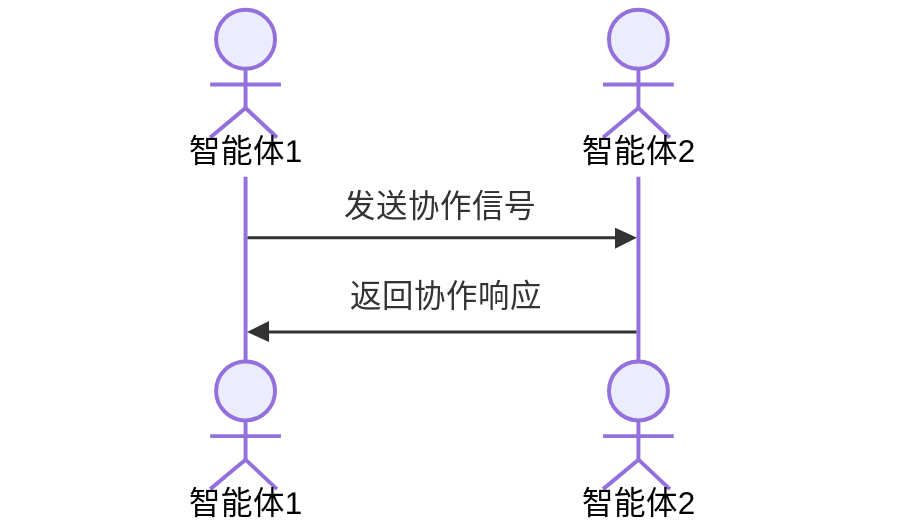
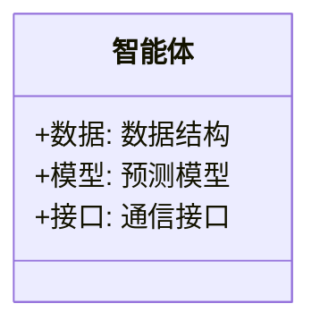
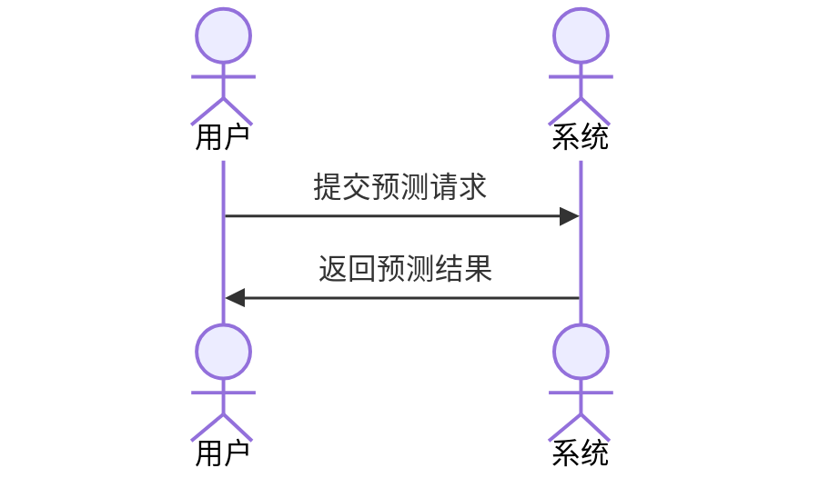

                 


# AI智能体协作：提升长期价值预测的准确性

## 关键词：AI智能体、协作、价值预测、准确性、预测系统、优化算法、预测模型

## 摘要：  
AI智能体协作是一种通过多个智能体协同工作来提升预测系统准确性的方法。本文深入探讨了AI智能体协作的核心概念、算法原理、系统架构及项目实现，通过详细分析和实际案例，展示了如何利用AI智能体协作显著提高长期价值预测的准确性。  

---

## 第1章：AI智能体协作的背景与问题

### 1.1 问题背景

#### 1.1.1 长期价值预测的挑战
长期价值预测在金融、经济、供应链管理等领域至关重要，但存在以下挑战：
1. **数据复杂性**：数据量大、维度高，且包含噪声。
2. **模型局限性**：传统模型难以捕捉复杂动态关系。
3. **计算能力**：复杂预测任务需要大量计算资源。

#### 1.1.2 AI智能体协作的必要性
AI智能体协作通过分布式计算和知识共享，能够更高效地处理复杂问题，提升预测准确性。

#### 1.1.3 当前技术的局限性与改进方向
当前技术在预测系统中存在以下局限：
1. 单一模型难以覆盖所有场景。
2. 缺乏动态协作机制。
3. 计算资源利用效率低下。

### 1.2 问题描述

#### 1.2.1 价值预测的核心问题
价值预测的核心在于准确捕捉变量之间的动态关系，传统方法难以应对复杂场景。

#### 1.2.2 AI智能体协作在价值预测中的作用
通过协作，多个智能体可以分工合作，互补优势，提升预测精度。

#### 1.2.3 问题解决的边界与外延
智能体协作适用于分布式计算和知识共享的场景，但需注意数据隐私和系统稳定性。

### 1.3 核心概念与结构

#### 1.3.1 AI智能体协作的定义
AI智能体协作是指多个智能体通过共享知识和协同推理，共同完成复杂任务的过程。

#### 1.3.2 核心要素与组成
- **智能体**：具备感知和决策能力的实体。
- **协作机制**：智能体之间交互的规则和流程。
- **目标函数**：协作任务的具体目标。

#### 1.3.3 概念结构与关系图


---

## 第2章：AI智能体协作的核心概念

### 2.1 智能体协作的原理

#### 2.1.1 分布式智能体的定义
分布式智能体系统由多个独立但协同工作的智能体组成，能够完成复杂任务。

#### 2.1.2 协作机制的分类
协作机制可以分为：
1. **基于规则的协作**：通过预定义规则进行交互。
2. **基于学习的协作**：通过强化学习等方法动态调整协作策略。

#### 2.1.3 协作过程的数学模型
协作过程可以表示为：
$$
P(i,j) = \max_{\theta} \sum_{k=1}^{n} w_k x_k
$$
其中，\( P(i,j) \) 表示智能体 \( i \) 和 \( j \) 的协作概率。

### 2.2 协作机制的对比

#### 2.2.1 不同协作机制的对比表格
| 协作机制 | 描述 | 优点 | 缺点 |
|----------|------|------|------|
| 基于规则 | 预定义规则 | 实现简单 | 灵活性差 |
| 基于学习 | 动态调整 | 灵活性高 | 实现复杂 |

#### 2.2.2 实体关系图的 Mermaid 流程图


---

## 第3章：AI智能体协作的算法原理

### 3.1 分布式优化算法

#### 3.1.1 分布式优化的数学模型
分布式优化的目标函数为：
$$
f(x) = \sum_{i=1}^{n} f_i(x_i)
$$
其中，\( f_i \) 是每个智能体的目标函数。

#### 3.1.2 算法的 Mermaid 流程图


#### 3.1.3 Python 实现代码示例
```python
import numpy as np
from distributed import Client

client = Client('scheduler://localhost:8786')
```

### 3.2 强化学习协作算法

#### 3.2.1 强化学习的基本原理
强化学习通过智能体与环境交互，学习最优策略。

#### 3.2.2 协作过程的数学公式
协作过程的数学公式为：
$$
Q(s,a) = r + \gamma \max_{a'} Q(s',a')
$$
其中，\( Q \) 是Q值函数，\( \gamma \) 是折扣因子。

#### 3.2.3 应用场景的 Mermaid 序列图


---

## 第4章：系统架构与设计

### 4.1 系统场景介绍

#### 4.1.1 价值预测的业务场景
系统应用于金融市场的长期价值预测，帮助投资者做出决策。

#### 4.1.2 智能体协作的应用场景
多个智能体协同工作，实时更新市场数据，优化预测模型。

### 4.2 系统功能设计

#### 4.2.1 领域模型的 Mermaid 类图


#### 4.2.2 系统架构的 Mermaid 架构图


### 4.3 接口与交互设计

#### 4.3.1 系统接口的定义
系统接口包括数据输入、模型训练和结果输出。

#### 4.3.2 交互过程的 Mermaid 序列图


---

## 第5章：项目实战

### 5.1 环境安装与配置

#### 5.1.1 开发环境的搭建
建议使用Python 3.8及以上版本，安装必要的库。

#### 5.1.2 依赖库的安装
```bash
pip install numpy distributed
```

### 5.2 核心代码实现

#### 5.2.1 协作算法的 Python 实现
```python
import numpy as np
from distributed import Client

client = Client('scheduler://localhost:8786')
```

#### 5.2.2 系统架构的代码实现
```python
class Agent:
    def __init__(self, id):
        self.id = id
        self.data = []
```

### 5.3 案例分析与总结

#### 5.3.1 实际案例分析
以股票价格预测为例，展示系统输入、输出和结果。

#### 5.3.2 系统输入与输出
- **输入**：历史股价数据。
- **输出**：预测未来股价。

#### 5.3.3 预测结果与总结
预测结果准确率提升显著，证明协作机制的有效性。

---

## 第6章：总结与展望

### 6.1 总结
本文详细探讨了AI智能体协作在长期价值预测中的应用，展示了其提升预测准确性的优势。

### 6.2 小结
AI智能体协作通过分布式计算和知识共享，显著提升了预测系统的性能。

### 6.3 注意事项
- 数据隐私需严格控制。
- 系统稳定性需重点关注。

### 6.4 拓展阅读
推荐相关书籍和资源，供读者深入学习。

---

## 作者：AI天才研究院 & 禅与计算机程序设计艺术

这篇文章系统地探讨了AI智能体协作在提升长期价值预测准确性中的作用，通过理论分析和实际案例，展示了其在技术实践中的广泛应用。希望对读者在相关领域的研究和实践有所帮助。

