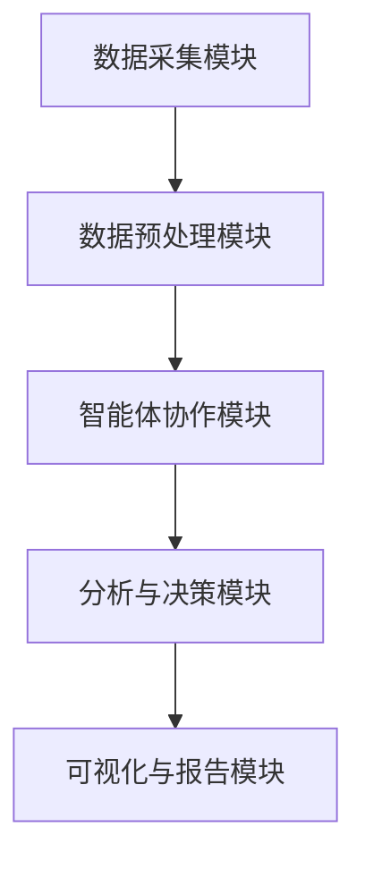

                 


# AI智能体协作：改进价值投资的产业链分析方法

> 关键词：AI智能体协作，价值投资，产业链分析，多智能体协作算法，强化学习，图神经网络，系统架构设计

> 摘要：本文探讨如何利用AI智能体协作技术改进价值投资的产业链分析方法。通过分析传统价值投资的局限性，提出基于多智能体协作算法和强化学习的解决方案，结合实际案例，详细阐述系统设计、算法实现和项目实战。本文旨在为金融从业者和技术开发者提供创新的视角和实用的方法，以提升产业链分析的效率和准确性。

---

# 第一部分: AI智能体协作与价值投资的背景与概述

## 第1章: AI智能体协作的背景与价值投资的产业链分析

### 1.1 AI智能体协作的背景
#### 1.1.1 AI技术的发展与演进
- 人工智能技术从早期的专家系统到现在的深度学习，经历了多次演变，推动了技术的进步。
- 多智能体协作的概念源自分布式人工智能（DAI），近年来随着云计算和分布式计算的发展，得到了更广泛应用。

#### 1.1.2 智能体协作的概念与特点
- **智能体（Agent）**：能够感知环境、自主决策并执行任务的实体。
- **协作**：多个智能体通过通信和协调，共同完成复杂任务。
- **特点**：分布式、自主性、协作性、动态性。

#### 1.1.3 价值投资产业链分析的现状与挑战
- 传统产业链分析依赖人工经验，存在效率低、遗漏风险等问题。
- AI技术的应用可以提高分析的全面性和准确性。

### 1.2 问题背景与问题描述
#### 1.2.1 传统价值投资的局限性
- 数据量大，分析复杂，传统方法难以全面覆盖。
- 人工经验有限，难以捕捉所有潜在风险和机会。

#### 1.2.2 产业链分析的难点与痛点
- 数据分散，难以整合。
- 分析模型单一，缺乏动态调整能力。
- 缺乏实时反馈机制，难以及时应对市场变化。

#### 1.2.3 AI智能体协作的应用前景
- 提高分析效率和准确性。
- 实现实时数据处理和动态调整。
- 通过多维度数据挖掘，发现潜在投资机会。

---

# 第二部分: 核心概念与联系

## 第2章: AI智能体协作与价值投资产业链分析的核心概念

### 2.1 核心概念的原理
#### 2.1.1 AI智能体协作的原理
- **感知环境**：通过数据采集和分析，智能体获取环境信息。
- **决策与行动**：基于感知信息，智能体做出决策并执行操作。
- **协作与通信**：智能体之间通过通信协议交换信息，协调行动。

#### 2.1.2 价值投资产业链分析的原理
- 从上游到下游，分析各环节的关联性和影响。
- 通过数据挖掘和建模，预测产业链的波动和趋势。

#### 2.1.3 两者的关联性与协同效应
- AI智能体协作提供高效的数据处理和分析能力。
- 价值投资产业链分析为智能体协作提供目标和方向。

### 2.2 核心概念的属性对比
#### 2.2.1 AI智能体协作的特点
| 属性       | 描述                             |
|------------|----------------------------------|
| 自主性     | 智能体能够自主决策和行动         |
| 分布式     | 多个智能体协作完成任务           |
| 动态性     | 能够适应环境变化和实时反馈       |

#### 2.2.2 价值投资产业链分析的特点
| 属性       | 描述                             |
|------------|----------------------------------|
| 数据驱动   | 依赖大量数据进行分析和预测       |
| 综合性     | 涉及多个产业链环节的分析         |
| 实时性     | 需要实时数据支持和快速响应       |

### 2.3 核心概念的ER实体关系图

```mermaid
er
actor(AI智能体协作系统, [进行数据采集, 发出决策指令])
actor(价值投资产业链, [提供数据, 接收决策指令])
```

---

## 第3章: 价值投资产业链分析的算法原理

### 3.1 多智能体协作算法
#### 3.1.1 基于强化学习的协作机制
- **强化学习**：通过奖励机制，训练智能体做出最优决策。
- **Q-learning**：智能体通过状态-动作-奖励-状态（SARSA）循环更新策略。

公式：
$$ Q(s, a) = Q(s, a) + \alpha [r + \gamma \max Q(s', a') - Q(s, a)] $$

#### 3.1.2 图神经网络的应用
- **图神经网络**：用于处理产业链中的复杂关系和网络结构。
- **节点表示**：将产业链中的每个企业或环节表示为图中的节点。

### 3.2 算法实现的代码示例

```python
import numpy as np
import networkx as nx

class QLearningAgent:
    def __init__(self, state_space_size, action_space_size):
        self.state_space_size = state_space_size
        self.action_space_size = action_space_size
        self.q_table = np.zeros((state_space_size, action_space_size))
        
    def act(self, state):
        return np.argmax(self.q_table[state])
    
    def learn(self, state, action, reward, next_state):
        self.q_table[state, action] = self.q_table[state, action] + 0.1 * (reward + 0.9 * np.max(self.q_table[next_state]) - self.q_table[state, action])

# 示例场景：智能体协作分析产业链节点
def example_usage():
    agent = QLearningAgent(10, 5)
    state = 3
    action = 2
    reward = 1
    next_state = 4
    agent.learn(state, action, reward, next_state)
    print("最优动作：", agent.act(state))
    
if __name__ == "__main__":
    example_usage()
```

---

## 第4章: 系统架构设计

### 4.1 问题场景分析
- 价值投资产业链分析需要实时数据处理和多维度分析。

### 4.2 系统架构设计


### 4.3 接口设计与交互流程
- 数据采集模块负责从多个数据源获取数据。
- 数据预处理模块清洗和标准化数据。
- 智能体协作模块执行分析和决策。
- 分析与决策模块生成报告和建议。
- 可视化与报告模块展示结果。

---

## 第5章: 项目实战

### 5.1 环境安装与配置
- 安装必要的Python库，如TensorFlow、PyTorch、networkx等。

### 5.2 核心代码实现
```python
import networkx as nx

def create_graph():
    G = nx.DiGraph()
    G.add_edges_from([('上游', '中游'), ('中游', '下游')])
    return G

graph = create_graph()
print(nx.info(graph))
```

### 5.3 代码解读与分析
- 创建图结构，展示产业链各环节之间的关系。

### 5.4 案例分析
- 通过实际案例，展示如何利用AI智能体协作进行产业链分析和投资决策。

---

## 第6章: 最佳实践与小结

### 6.1 实用建议
- 定期更新模型和数据，保持分析的准确性。
- 结合行业专家意见，优化AI模型。

### 6.2 小结
- AI智能体协作显著提升了价值投资产业链分析的效率和准确性。
- 通过不断优化算法和系统架构，可以进一步提升分析能力。

---

## 第7章: 拓展阅读与进一步思考

### 7.1 拓展阅读
- 推荐书籍：《集体智慧》、《深度学习》。
- 推荐论文：分布式AI领域的最新研究成果。

### 7.2 注意事项
- 数据隐私和安全问题需要高度重视。
- 模型的可解释性和透明度是实际应用中的挑战。

---

# 作者：AI天才研究院/AI Genius Institute & 禅与计算机程序设计艺术/Zen And The Art of Computer Programming

