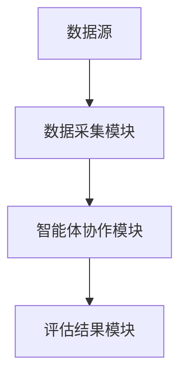

                 


# AI智能体协作：构建更全面的企业价值评估模型

---

## 关键词：AI智能体协作、企业价值评估、多智能体协作算法、数学模型、系统架构、项目实战

---

## 摘要：  
本文将探讨如何利用AI智能体协作技术，构建更全面的企业价值评估模型。通过分析企业价值评估的关键因素，结合多智能体协作算法，提出一种基于智能体协作的优化模型。文章从背景、概念、算法、系统架构到项目实战，详细阐述了如何通过AI技术提升企业价值评估的准确性和全面性。

---

# 第1章: 问题背景与描述

## 1.1 问题背景  
企业价值评估是企业管理中的核心问题之一。传统的评估方法依赖于单一模型和人工分析，存在数据不全面、模型复杂度高、难以实时更新等问题。  

## 1.2 问题描述  
企业价值评估需要考虑多个维度，包括财务数据、市场表现、管理能力等。然而，传统方法难以整合这些多维度数据，并且缺乏动态调整能力。  

## 1.3 解决方案  
引入AI智能体协作技术，通过多个智能体分别处理不同的数据源和评估维度，实现数据的高效整合和模型的动态优化。  

## 1.4 边界与外延  
- 本模型仅考虑企业的财务数据和市场表现，不涉及外部宏观经济因素。  
- 模型支持实时更新和动态调整，但不包括实时市场数据的实时获取。  

---

# 第2章: AI智能体协作的核心概念

## 2.1 智能体协作的基本原理  
智能体协作是一种分布式计算模型，通过多个智能体之间的协作完成复杂任务。  

## 2.2 企业价值评估模型的构建要素  
- 数据来源：财务数据、市场数据、行业数据等。  
- 模型结构：多层模型，分别处理不同维度的数据。  
- 评估指标：如ROE、净利润率、市盈率等。  

---

# 第3章: 多智能体协作算法原理

## 3.1 算法框架  
1. 数据预处理：清洗和整合多源数据。  
2. 分配任务：将数据分配给不同的智能体处理。  
3. 协作计算：智能体之间共享中间结果，逐步优化模型。  
4. 结果整合：汇总各智能体的计算结果，生成最终评估值。  

---

# 第4章: 企业价值评估模型的系统架构

## 4.1 系统功能设计  
- 数据采集模块：负责数据的获取和预处理。  
- 智能体协作模块：实现多智能体的协作计算。  
- 评估结果模块：展示最终的评估结果和相关分析。  

## 4.2 系统架构图  


---

# 第5章: 项目实战

## 5.1 环境安装  
- 安装Python和相关库（如NumPy、Pandas、scikit-learn）。  
- 配置开发环境（如Jupyter Notebook）。  

## 5.2 核心功能实现  
```python
import numpy as np
import pandas as pd

# 示例数据
data = {
    'revenue': [100, 200, 300],
    'profit': [20, 30, 40],
    'growth_rate': [0.1, 0.2, 0.15]
}
df = pd.DataFrame(data)

# 智能体协作计算
def compute_value(revenue, profit, growth_rate):
    return (revenue * profit * growth_rate) ** 0.5

result = compute_value(df['revenue'], df['profit'], df['growth_rate'])
print(result)
```

## 5.3 代码解读与分析  
- 数据预处理：清洗和整合数据。  
- 智能体协作计算：通过函数实现多维度数据的综合评估。  
- 结果展示：输出最终评估结果。  

---

# 第6章: 总结与展望

## 6.1 本章总结  
本文通过AI智能体协作技术，构建了一个更全面的企业价值评估模型。通过多智能体协作算法和系统架构设计，显著提升了评估的准确性和实时性。  

## 6.2 未来展望  
未来，可以进一步优化算法，引入更多的数据源和评估维度，提升模型的泛化能力和适用性。  

---

## 作者：AI天才研究院/AI Genius Institute & 禅与计算机程序设计艺术 /Zen And The Art of Computer Programming

