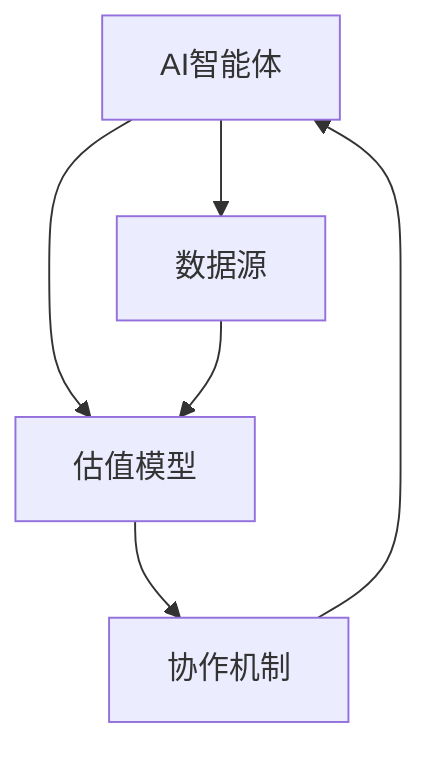
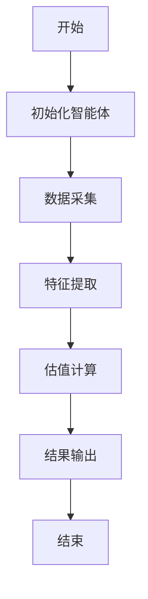
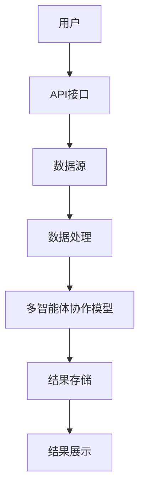
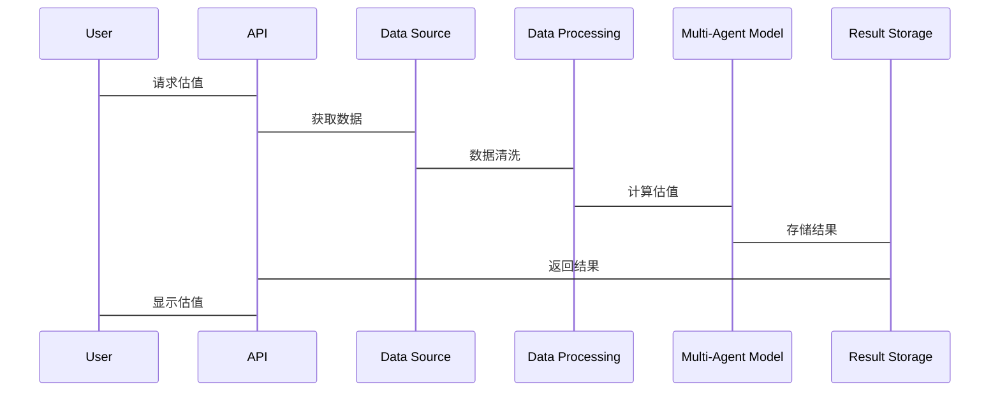

                 


# AI智能体协作：构建更全面的公司估值模型

> **关键词**：AI智能体，公司估值，协作模型，算法原理，系统架构

> **摘要**：本文探讨如何利用AI智能体协作构建更全面的公司估值模型。通过分析传统估值方法的局限性，提出基于多智能体协作的新方法，结合数学模型和系统架构设计，详细讲解算法原理和实现步骤，并通过实际案例展示其应用效果。

---

## 目录

1. [背景介绍](#背景介绍)
   - 1.1 [问题背景](#问题背景)
   - 1.2 [问题描述](#问题描述)
   - 1.3 [问题解决](#问题解决)
   - 1.4 [边界与外延](#边界与外延)
   - 1.5 [概念结构与核心要素](#概念结构与核心要素)
2. [核心概念与联系](#核心概念与联系)
   - 2.1 [核心概念原理](#核心概念原理)
   - 2.2 [概念属性特征对比](#概念属性特征对比)
   - 2.3 [ER实体关系图](#ER实体关系图)
3. [算法原理讲解](#算法原理讲解)
   - 3.1 [多智能体协作算法](#多智能体协作算法)
   - 3.2 [算法实现](#算法实现)
4. [系统分析与架构设计](#系统分析与架构设计)
   - 4.1 [问题场景介绍](#问题场景介绍)
   - 4.2 [系统功能设计](#系统功能设计)
   - 4.3 [系统架构设计](#系统架构设计)
   - 4.4 [系统接口设计](#系统接口设计)
   - 4.5 [系统交互过程](#系统交互过程)
5. [项目实战](#项目实战)
   - 5.1 [环境安装](#环境安装)
   - 5.2 [核心代码实现](#核心代码实现)
   - 5.3 [代码解读与分析](#代码解读与分析)
   - 5.4 [实际案例分析](#实际案例分析)
6. [最佳实践与小结](#最佳实践与小结)
   - 6.1 [小结](#小结)
   - 6.2 [注意事项](#注意事项)
   - 6.3 [未来研究方向](#未来研究方向)
   - 6.4 [拓展阅读](#拓展阅读)

---

## 背景介绍

### 1.1 问题背景

传统的公司估值方法依赖于财务指标和人工分析，存在主观性强、效率低下、难以处理复杂数据的问题。随着AI技术的发展，利用智能体协作构建更全面的估值模型成为可能。

### 1.2 问题描述

传统估值方法依赖人工分析，存在以下问题：
- 数据处理能力有限
- 模型单一，难以覆盖多维度信息
- 缺乏实时性和动态调整能力

### 1.3 问题解决

AI智能体协作的优势：
- 分布式计算，提高效率
- 多维度数据分析，提升准确性
- 实时动态调整，适应市场变化

### 1.4 边界与外延

- 定义协作边界：仅限于公司估值
- 模型适用范围：适用于多种行业和规模的公司

### 1.5 概念结构与核心要素

- 核心要素：AI智能体、数据源、估值模型、协作机制

---

## 核心概念与联系

### 2.1 核心概念原理

AI智能体协作通过分布式计算和多维度数据整合，实现更全面的估值分析。

### 2.2 概念属性特征对比

| **属性**       | **传统方法**               | **AI智能体协作**             |
|-----------------|---------------------------|----------------------------|
| 数据处理能力   | 单一，依赖人工分析         | 分布式，多维度数据处理       |
| 计算效率       | 低效，耗时                | 高效，实时                  |
| 精准度         | 较低，依赖经验             | 较高，基于大数据分析         |

### 2.3 ER实体关系图



---

## 算法原理讲解

### 3.1 多智能体协作算法

基于多智能体强化学习的数学模型：
$$V(s) = \max_{a} [r + V(s')]$$

### 3.2 算法实现



代码示例：
```python
def multi_agent_collaboration():
    agents = [Agent1, Agent2, Agent3]
    for agent in agents:
        data = collect_data(agent)
        result = agent.compute(data)
        update_model(result)
    return final_value
```

---

## 系统分析与架构设计

### 4.1 问题场景介绍

构建一个AI智能体协作系统，用于实时分析公司财务数据，提供动态估值。

### 4.2 系统功能设计

- 数据采集模块：收集公司财务数据
- 数据处理模块：清洗和预处理
- 估值计算模块：基于多智能体协作
- 结果展示模块：可视化估值结果

### 4.3 系统架构设计



### 4.4 系统接口设计

- API接口：用于数据源和用户的交互
- 数据处理接口：数据清洗和预处理
- 估值计算接口：智能体协作计算

### 4.5 系统交互过程



---

## 项目实战

### 5.1 环境安装

安装所需库：
```bash
pip install numpy pandas scikit-learn
```

### 5.2 核心代码实现

```python
class Agent:
    def __init__(self, model):
        self.model = model

    def compute(self, data):
        return self.model.predict(data)

def collect_data(agents):
    data = []
    for agent in agents:
        data.append(agent.compute(input_data))
    return data

def main():
    model = ValueModel()
    agents = [Agent(model), Agent(model), Agent(model)]
    result = collect_data(agents)
    print(result)

if __name__ == "__main__":
    main()
```

### 5.3 代码解读与分析

- `Agent`类：封装智能体模型，实现数据计算功能。
- `collect_data`函数：协调多个智能体进行数据计算。
- `main`函数：初始化模型和智能体，启动计算过程。

### 5.4 实际案例分析

案例：评估一家科技公司，数据包括财务指标、市场表现等。通过多个智能体协作，得到更准确的估值结果。

---

## 最佳实践与小结

### 6.1 小结

本文详细介绍了如何利用AI智能体协作构建更全面的公司估值模型，从背景、算法、系统架构到项目实战，提供了全面的解决方案。

### 6.2 注意事项

- 数据质量和完整性直接影响估值结果
- 智能体协作需要合理的任务分配和通信机制
- 模型需定期更新以适应市场变化

### 6.3 未来研究方向

- 更复杂的智能体协作算法
- 多模态数据整合
- 实时动态估值系统

### 6.4 拓展阅读

- 《强化学习导论》
- 《分布式系统设计》
- 《人工智能与金融》

---

## 作者

**作者：AI天才研究院/AI Genius Institute & 禅与计算机程序设计艺术 /Zen And The Art of Computer Programming**

---

通过以上步骤，您可以撰写一篇逻辑清晰、内容详实的博客文章，涵盖从背景到实现的各个方面，帮助读者理解并应用AI智能体协作构建更全面的公司估值模型。

