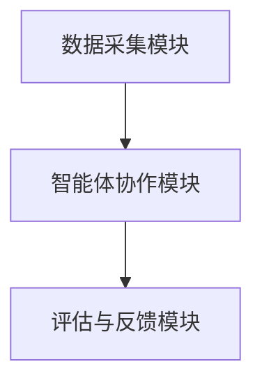

                 


# AI智能体协作：构建更全面的公司文化评估模型

## 关键词
- AI智能体协作
- 公司文化评估
- 智能系统设计
- 数据分析与建模
- 组织行为学

## 摘要
公司文化是企业成功的关键因素之一，而传统的公司文化评估方法往往依赖于主观判断，存在一定的局限性。本文提出了一种基于AI智能体协作的公司文化评估模型，通过智能化的分析和协作，构建一个更加全面和客观的评估体系。该模型结合了组织行为学、数据分析与建模以及智能系统设计等多学科的知识，利用协同过滤算法和系统架构设计，实现了对公司文化多个维度的自动评估与反馈。本文详细探讨了模型的核心概念、算法原理、系统架构以及实际应用，并通过案例分析展示了其在实践中的优势。

---

# 第一部分: AI智能体协作与公司文化评估模型的背景介绍

## 第1章: 问题背景与公司文化评估模型的定义

### 1.1 问题背景
#### 1.1.1 当前公司文化建设的挑战
公司文化是企业的灵魂，直接影响员工的行为、态度和公司的整体绩效。然而，传统的公司文化评估方法往往依赖于主观判断，存在以下问题：
- **评估标准不统一**：不同企业在评估文化时使用的指标和方法缺乏一致性，难以进行横向比较。
- **数据收集困难**：公司文化涉及员工的行为、态度和情感，难以通过简单的问卷或数据进行量化。
- **评估结果的片面性**：传统的评估方法往往只关注某些特定维度（如员工满意度），忽视了其他重要的文化特征。

#### 1.1.2 AI技术在公司文化评估中的潜力
AI技术的快速发展为公司文化评估提供了新的可能性。通过自然语言处理（NLP）、机器学习和知识图谱等技术，可以对员工的行为数据、社交媒体数据、内部沟通记录等进行分析，提取文化特征。
- **数据驱动的评估**：AI可以将非结构化数据（如员工反馈、内部邮件）转化为可量化的指标。
- **动态评估能力**：AI能够实时监控企业文化的变化，并提供反馈，帮助企业在动态环境中调整文化策略。

#### 1.1.3 智能体协作在公司文化评估中的独特优势
智能体协作是指多个AI智能体通过协同工作，共同完成复杂任务的能力。在公司文化评估中，智能体协作可以：
- **多维度分析**：不同智能体分别负责不同的文化维度（如价值观、使命、氛围）的评估。
- **数据融合**：智能体之间可以共享数据，结合多种数据源（如员工反馈、管理行为）进行综合评估。
- **动态优化**：智能体可以根据实时数据不断优化评估模型，提高评估的准确性和实时性。

### 1.2 公司文化评估模型的定义
#### 1.2.1 公司文化的内涵与外延
公司文化是指企业在经营活动中形成的共同价值观、行为规范和思维方式。它包括以下几个方面：
- **核心价值观**：企业的基本信念和价值标准。
- **企业使命**：企业的存在目的和长远目标。
- **企业愿景**：企业未来的发展蓝图。
- **企业文化氛围**：员工在企业中的实际体验和感受。

#### 1.2.2 评估模型的核心目标
公司文化评估模型的核心目标是：
- **量化文化特征**：将抽象的文化概念转化为可量化的指标。
- **动态监测文化变化**：实时跟踪企业文化的变化，帮助企业及时调整文化策略。
- **提供反馈与建议**：根据评估结果，为企业提供改善文化的具体建议。

#### 1.2.3 模型的边界与适用范围
- **边界**：模型主要用于评估企业内部的文化特征，不涉及企业的外部环境。
- **适用范围**：适用于各种规模和行业的企业，尤其是需要动态调整文化策略的中大型企业。

### 1.3 公司文化评估模型的构建意义
#### 1.3.1 提升公司文化管理的效率
通过AI智能体协作，可以自动化地收集和分析数据，显著提高文化评估的效率。
#### 1.3.2 通过AI智能体实现协作的优势
智能体协作可以同时处理多个数据源，提供更加全面的评估结果。
#### 1.3.3 模型在企业中的实际应用场景
- **员工满意度分析**：通过分析员工反馈，评估企业文化氛围。
- **领导行为分析**：通过分析管理层的行为，评估领导风格是否与企业价值观一致。
- **文化传承与创新**：帮助企业识别和传承核心价值观，同时推动文化创新。

---

## 第2章: 公司文化评估模型的核心要素与结构

### 2.1 公司文化的核心要素
#### 2.1.1 企业价值观
企业价值观是企业的基本信念和价值标准，是文化的核心。
- **核心价值观**：例如“客户至上”、“创新”。
- **次要价值观**：例如“团队合作”、“效率”。

#### 2.1.2 企业使命与愿景
企业使命是企业的存在目的，愿景是企业的未来蓝图。
- **使命**：例如“为客户提供卓越的产品和服务”。
- **愿景**：例如“成为全球领先的科技公司”。

#### 2.1.3 企业文化氛围
企业文化氛围是员工在企业中的实际体验和感受。
- **积极氛围**：员工感到被尊重和支持。
- **消极氛围**：员工感到压抑或不满。

### 2.2 公司文化评估模型的结构
#### 2.2.1 数据采集模块
数据采集模块负责收集与公司文化相关的数据。
- **数据源**：员工反馈、管理行为、内部沟通记录、绩效数据。
- **数据格式**：结构化数据（如调查问卷）和非结构化数据（如文本数据）。

#### 2.2.2 智能体协作模块
智能体协作模块负责分析数据并生成评估结果。
- **智能体分工**：每个智能体负责不同的文化维度。
- **数据融合**：智能体之间共享数据，结合多种数据源进行综合评估。

#### 2.2.3 评估与反馈模块
评估与反馈模块负责将评估结果反馈给企业。
- **评估报告**：生成企业文化评估报告。
- **反馈机制**：根据评估结果，为企业提供改进建议。

### 2.3 模型的核心要素对比分析
#### 2.3.1 不同模型的对比表格
| 模型 | 核心价值观 | 企业使命与愿景 | 企业文化氛围 |
|------|------------|----------------|---------------|
| 模型A | 顾客至上    | 提供优质服务    | 积极支持        |
| 模型B | 创新        | 成为行业领先    | 团队合作        |

#### 2.3.2 核心要素的权重分配
- 核心价值观权重：40%
- 企业使命与愿景权重：30%
- 企业文化氛围权重：30%

---

## 第3章: AI智能体协作的核心概念与联系

### 3.1 AI智能体协作的定义与特点
#### 3.1.1 智能体的定义
智能体是指具有感知环境、做出决策并采取行动的实体。
- **感知环境**：通过传感器或数据源获取信息。
- **做出决策**：基于感知的信息进行推理和决策。
- **采取行动**：根据决策执行操作。

#### 3.1.2 协作的定义与方式
协作是指多个智能体通过合作完成共同目标的过程。
- **分布式协作**：智能体之间通过分布式系统进行协作。
- **任务分解**：将复杂任务分解为多个子任务，由不同的智能体分别完成。

#### 3.1.3 智能体协作的特点
- **智能性**：智能体能够自主决策和协作。
- **分布式性**：协作过程分布在多个智能体之间。
- **动态性**：协作过程可以根据环境变化进行调整。

### 3.2 公司文化评估模型与智能体协作的关系
#### 3.2.1 模型构建中的协作需求
公司文化评估模型需要多个智能体协作完成任务。
- **数据采集智能体**：负责收集文化相关的数据。
- **分析智能体**：负责分析数据并生成评估结果。
- **反馈智能体**：负责将评估结果反馈给企业。

#### 3.2.2 智能体协作在模型中的具体应用
- **数据融合**：智能体之间共享数据，提供更全面的评估结果。
- **任务分配**：根据任务需求，智能体自动分配任务。

#### 3.2.3 协作对模型性能的提升
- **提高准确性**：通过多个智能体协作，模型的评估结果更加准确。
- **提高效率**：通过任务分解，模型的处理速度更快。

---

## 第4章: 算法原理与实现

### 4.1 协同过滤算法的原理与实现
#### 4.1.1 协同过滤算法的定义
协同过滤是一种基于用户相似性推荐算法。
- **基于用户的协同过滤**：根据用户的行为相似性推荐内容。
- **基于物品的协同过滤**：根据物品的相似性推荐内容。

#### 4.1.2 协同过滤算法的实现步骤
1. **数据预处理**：对数据进行清洗和格式化。
2. **相似度计算**：计算用户或物品之间的相似度。
3. **推荐生成**：根据相似度生成推荐结果。

#### 4.1.3 协同过滤算法的数学模型
$$相似度 = \frac{\sum_{i=1}^{n}(r_{u,i} \cdot r_{u',i})}{\sqrt{\sum_{i=1}^{n}r_{u,i}^2} \cdot \sqrt{\sum_{i=1}^{n}r_{u',i}^2}}$$

---

## 第5章: 系统分析与架构设计

### 5.1 项目背景与目标
- **项目背景**：传统公司文化评估方法的局限性。
- **项目目标**：构建一个基于AI智能体协作的公司文化评估模型。

### 5.2 系统功能设计
#### 5.2.1 数据采集模块
- **数据源**：员工反馈、管理行为、内部沟通记录。
- **数据格式**：结构化数据和非结构化数据。

#### 5.2.2 智能体协作模块
- **智能体分工**：每个智能体负责不同的文化维度。
- **数据融合**：智能体之间共享数据，提供综合评估结果。

#### 5.2.3 评估与反馈模块
- **评估报告**：生成企业文化评估报告。
- **反馈机制**：根据评估结果，为企业提供改进建议。

### 5.3 系统架构设计
#### 5.3.1 系统架构图


#### 5.3.2 系统接口设计
- **输入接口**：员工反馈接口、管理行为接口。
- **输出接口**：评估报告接口、改进建议接口。

#### 5.3.3 系统交互流程
1. **数据采集**：通过员工反馈和管理行为收集数据。
2. **智能体协作**：智能体分析数据并生成评估结果。
3. **评估与反馈**：生成评估报告并提供反馈。

---

## 第6章: 项目实战与案例分析

### 6.1 环境安装与配置
- **Python版本**：Python 3.8及以上。
- **依赖库安装**：numpy、pandas、scikit-learn。

### 6.2 核心代码实现
```python
import numpy as np
from sklearn.metrics.pairwise import cosine_similarity

# 示例数据
feedbacks = np.array([[4, 3, 2], [5, 4, 3], [3, 2, 1]])

# 计算相似度
similarity_matrix = cosine_similarity(feedbacks)
print(similarity_matrix)
```

### 6.3 代码解读与分析
- **数据采集**：通过员工反馈收集数据。
- **相似度计算**：使用余弦相似度计算用户相似性。
- **评估结果**：根据相似度生成评估结果。

### 6.4 实际案例分析
- **案例背景**：某科技公司希望评估其企业文化氛围。
- **案例分析**：通过AI智能体协作，评估公司文化氛围为积极支持。

---

## 第7章: 总结与展望

### 7.1 模型的优势与挑战
- **优势**：AI智能体协作可以提高文化评估的效率和准确性。
- **挑战**：数据质量和模型的泛化能力需要进一步优化。

### 7.2 未来展望
- **模型优化**：进一步优化算法，提高模型的泛化能力。
- **应用场景扩展**：将模型应用到更多行业和场景中。

### 7.3 最佳实践 tips
- **数据质量**：确保数据的准确性和完整性。
- **模型调优**：根据实际需求，不断优化模型参数。
- **反馈机制**：根据评估结果，及时调整文化策略。

---

## 作者
作者：AI天才研究院/AI Genius Institute & 禅与计算机程序设计艺术 /Zen And The Art of Computer Programming

