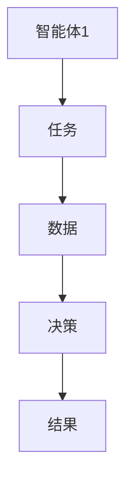
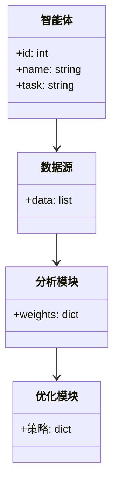
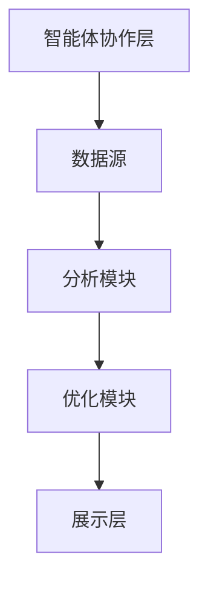
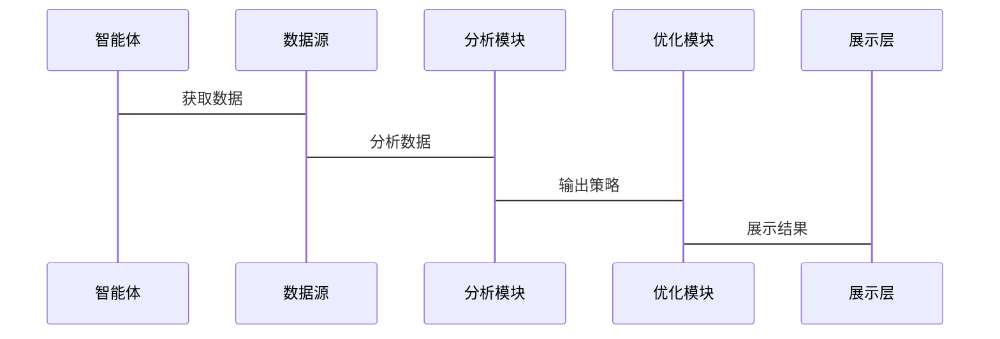

                 


# AI智能体协作：构建更全面的公司竞争优势评估模型

---

## 关键词：
AI智能体协作，竞争优势评估，分布式计算，强化学习，系统架构，项目实战

---

## 摘要：
本文探讨如何通过AI智能体协作构建更全面的公司竞争优势评估模型。传统评估方法依赖单一分析维度，难以捕捉动态市场环境下的多维竞争要素。通过分布式AI智能体协作，模型能够实时整合企业内部与外部数据，利用强化学习优化决策，从而实现对公司竞争优势的全维度、动态化评估。本文从概念、算法、系统架构到实战应用，全面阐述这一创新方法。

---

# 第一部分: AI智能体协作与竞争优势评估模型背景

## 第1章: AI智能体协作与竞争优势评估概述

### 1.1 问题背景与定义

#### 1.1.1 传统竞争优势评估的局限性
传统竞争优势评估主要依赖财务指标、市场份额和产品性能等单一维度的数据分析。然而，现代市场竞争的复杂性要求企业能够实时捕捉并整合多维度的竞争信息，包括供应链效率、客户反馈、技术创新能力和组织灵活性等。传统方法往往忽视了这些动态因素，导致评估结果滞后且片面。

#### 1.1.2 AI智能体协作的概念与定义
AI智能体协作是指多个AI智能体通过分布式计算和信息共享，共同完成特定任务的过程。这些智能体能够自主决策、协同工作，并通过持续学习优化协作效果。在竞争优势评估中，AI智能体协作能够实时整合企业内外部数据，动态分析竞争对手和市场环境的变化。

#### 1.1.3 问题解决的必要性与目标
通过AI智能体协作构建竞争优势评估模型，旨在实时整合多维度数据，优化评估维度，提高评估结果的准确性和前瞻性。目标是帮助企业识别潜在竞争优势，制定动态竞争策略，提升整体竞争力。

---

## 1.2 核心概念与模型结构

#### 1.2.1 AI智能体协作的核心要素
- **智能体**：具备感知、决策和执行能力的独立实体。
- **协作机制**：智能体之间通过信息共享和任务分配实现协同。
- **动态优化**：基于实时数据持续优化协作策略。

#### 1.2.2 竞争优势评估模型的组成
- **数据源**：整合企业内部数据（如财务、生产）和外部数据（如市场趋势、客户反馈）。
- **分析模块**：通过AI算法评估竞争优势。
- **优化模块**：基于评估结果优化企业策略。

#### 1.2.3 模型的边界与外延
- **边界**：聚焦于企业内部竞争优势的评估。
- **外延**：扩展至行业趋势、宏观环境等外部因素。

---

## 1.3 本章小结
本章介绍了AI智能体协作在竞争优势评估中的重要性，明确了其核心概念和模型结构，为后续章节的深入分析奠定了基础。

---

# 第二部分: AI智能体协作的核心概念与联系

## 第2章: AI智能体协作的原理与机制

### 2.1 智能体协作的基本原理

#### 2.1.1 分布式智能体的概念
分布式智能体是指多个智能体通过网络协同工作的系统。每个智能体负责特定任务，并通过信息共享优化整体性能。

#### 2.1.2 协作机制的数学模型
协作机制可以通过以下公式表示：
$$ C = \sum_{i=1}^{n} w_i x_i $$
其中，$w_i$ 是权重，$x_i$ 是各个智能体的贡献。

#### 2.1.3 信息传递与决策过程
信息传递是协作的关键。智能体通过共享数据和状态更新，实现协同决策。

### 2.2 智能体协作的核心属性对比

#### 2.2.1 属性特征对比表格

| 属性       | 单点决策 | 分布式协作 |
|------------|----------|------------|
| 决策效率   | 高       | 中         |
| 资源利用   | 低       | 高         |
| 灵活性     | 低       | 高         |

#### 2.2.2 实体关系图（ER图）



---

## 2.3 本章小结
本章深入探讨了AI智能体协作的原理与机制，通过对比和图表分析，明确了其在竞争优势评估中的应用潜力。

---

# 第三部分: 算法原理与数学模型

## 第3章: AI智能体协作算法原理

### 3.1 算法概述

#### 3.1.1 分布式协作算法
分布式协作算法通过任务分配和信息同步实现智能体协作。以下是算法流程图：

```mermaid
graph TD
    A[开始] --> B[初始化智能体]
    B --> C[任务分配]
    C --> D[信息共享]
    D --> E[决策制定]
    E --> F[执行操作]
    F --> G[结果反馈]
    G --> H[优化调整]
    H -->
```

#### 3.1.2 强化学习机制
强化学习通过奖励机制优化决策。以下是强化学习流程图：

```mermaid
graph TD
    A[开始] --> B[状态]
    B --> C[动作]
    C --> D[奖励]
    D --> E[策略更新]
    E -->
```

### 3.2 数学模型与公式

#### 3.2.1 收益函数
$$ R = \sum_{i=1}^{n} w_i x_i $$

#### 3.2.2 优化目标
$$ \min_{\theta} \sum_{i=1}^{m} (y_i - f(x_i))^2 $$

### 3.3 算法流程图

#### 分布式协作算法流程图
```mermaid
graph TD
    A[开始] --> B[初始化智能体]
    B --> C[任务分配]
    C --> D[信息共享]
    D --> E[决策制定]
    E --> F[执行操作]
    F --> G[结果反馈]
    G --> H[优化调整]
    H -->
```

#### 强化学习流程图
```mermaid
graph TD
    A[开始] --> B[状态]
    B --> C[动作]
    C --> D[奖励]
    D --> E[策略更新]
    E -->
```

---

## 3.4 本章小结
本章详细讲解了AI智能体协作的核心算法，包括分布式协作和强化学习，并通过数学模型和流程图展示了其工作原理。

---

# 第四部分: 系统分析与架构设计

## 第4章: 系统架构设计

### 4.1 问题场景介绍
竞争优势评估模型需要整合企业内外部数据，实时分析市场变化。系统设计需要考虑数据来源、处理流程和展示界面。

### 4.2 系统功能设计

#### 4.2.1 领域模型类图


#### 4.2.2 系统架构图


#### 4.2.3 系统接口设计
- 数据接口：智能体与数据源交互。
- 分析接口：分析模块调用AI算法。
- 优化接口：优化模块输出策略建议。

#### 4.2.4 系统交互序列图


---

## 4.3 本章小结
本章从系统架构角度，详细设计了竞争优势评估模型的实现方案，为后续开发奠定了基础。

---

# 第五部分: 项目实战

## 第5章: 项目实战

### 5.1 环境安装与配置

#### 5.1.1 安装依赖
- Python 3.8+
- TensorFlow
- Mermaid
- matplotlib

#### 5.1.2 配置开发环境
- 安装Jupyter Notebook
- 配置虚拟环境

### 5.2 核心代码实现

#### 5.2.1 数据预处理
```python
import pandas as pd
data = pd.read_csv('input.csv')
```

#### 5.2.2 模型训练
```python
import tensorflow as tf
model = tf.keras.Sequential([
    tf.keras.layers.Dense(64, activation='relu'),
    tf.keras.layers.Dense(1, activation='sigmoid')
])
model.compile(optimizer='adam', loss='binary_crossentropy')
model.fit(data, labels, epochs=10)
```

#### 5.2.3 结果展示
```python
import matplotlib.pyplot as plt
plt.plot(history.history['loss'])
plt.xlabel('Epoch')
plt.ylabel('Loss')
plt.show()
```

### 5.3 案例分析与解读
通过实际案例分析，展示模型在竞争优势评估中的应用效果，包括数据整合、模型训练和结果解读。

### 5.4 项目总结与优化
总结项目实施的经验，并提出优化建议，例如优化算法、改进数据采集方式等。

---

## 5.5 本章小结
本章通过项目实战，详细展示了AI智能体协作模型的实现过程，验证了其在竞争优势评估中的应用价值。

---

# 第六部分: 总结与最佳实践

## 第6章: 总结与最佳实践

### 6.1 关键点总结
- AI智能体协作能够显著提升竞争优势评估的全面性和实时性。
- 分布式计算和强化学习是实现协作的核心技术。

### 6.2 小结
通过本篇文章，读者可以全面理解AI智能体协作在竞争优势评估中的应用，掌握其实现方法和最佳实践。

### 6.3 注意事项
- 数据质量和实时性是模型性能的关键。
- 模型优化需要持续关注市场变化和企业需求。

### 6.4 拓展阅读
推荐相关领域的书籍和论文，帮助读者深入学习AI智能体协作和竞争优势评估的前沿知识。

---

## 作者：AI天才研究院 & 禅与计算机程序设计艺术

