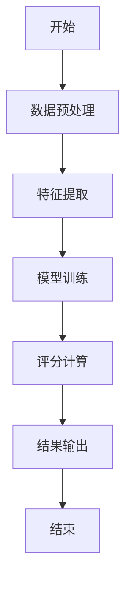
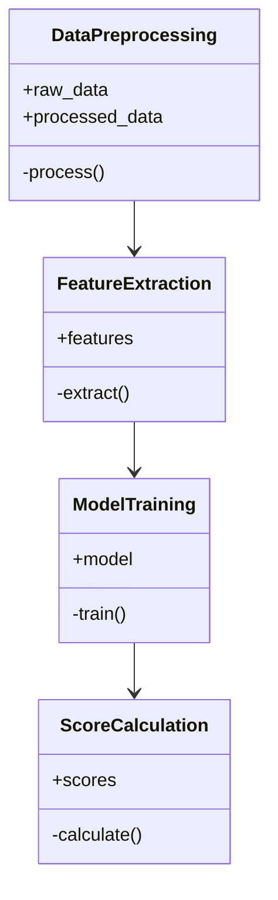
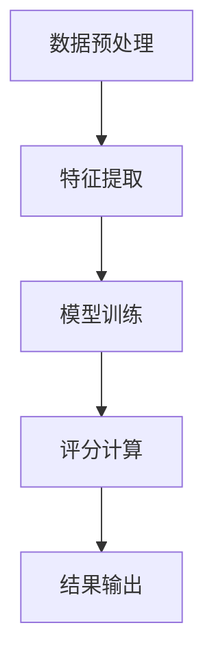
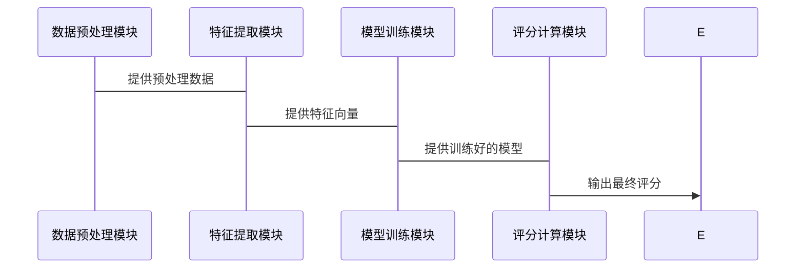

                 


# AI智能体协作：构建更全面的公司质量评分系统

> 关键词：AI智能体协作，公司质量评分系统，分布式计算，机器学习，评分模型，系统架构

> 摘要：本文详细探讨了如何利用AI智能体协作构建更全面的公司质量评分系统。通过分析传统评分系统的局限性，提出了一种基于AI智能体协作的新方法，涵盖数据处理、评分模型构建、系统架构设计等关键环节，并通过实际案例展示了系统的实现与应用。

---

# 第一部分：AI智能体协作与公司质量评分系统概述

## 第1章：问题背景与系统重要性

### 1.1 问题背景
- 传统公司质量评估的局限性：数据分散、维度单一、结果缺乏动态性
- AI智能体协作的兴起：多智能体协同的优势
- 质量评分系统的重要性：对企业决策的支持作用

### 1.2 问题描述
- 现有评分系统的不足：单一维度评估、数据孤岛、缺乏实时性
- AI智能体协作的核心问题：如何实现高效协作与数据融合
- 系统构建的目标与价值：提升评估的全面性与准确性

### 1.3 系统的边界与外延
- 数据来源：企业内部数据、外部市场数据、用户反馈
- 处理范围：数据清洗、特征提取、模型训练、评分计算
- 外部影响：行业趋势、政策变化、技术发展

### 1.4 概念结构与核心要素
- 核心要素：数据源、评分模型、协作机制、结果输出
- 关键概念：智能体协作、分布式计算、动态评分

---

# 第二部分：AI智能体协作的核心概念

## 第2章：AI智能体的协作原理

### 2.1 AI智能体的定义与特征
- 智能体的基本定义：能够感知环境并采取行动的实体
- 属性特征对比：
| 特征 | 描述 |
|------|------|
| 知识库 | 内置的数据与规则 |
| 行为模式 | 定义智能体的行为方式 |
| 通信协议 | 智能体之间的交互规则 |
| 学习能力 | 自适应优化能力 |

### 2.2 公司质量评分系统的构建要素
- 数据来源与处理：多数据源的融合与清洗
- 评分模型的设计：基于多智能体的协作模型
- 系统的可扩展性与可维护性：模块化设计

### 2.3 智能体协作的数学模型与算法
- 分布式计算与并行处理：多智能体协作的核心算法
- 质量评分的加权算法：基于特征重要性的加权计算

---

# 第三部分：AI智能体协作的算法原理

## 第3章：算法原理与实现

### 3.1 算法流程图


### 3.2 评分模型的数学公式
- 质量评分公式：
$$ Q = \sum_{i=1}^{n} w_i \cdot f_i $$
其中，$w_i$ 是第 $i$ 个特征的权重，$f_i$ 是第 $i$ 个特征的值。

### 3.3 算法实现
- 基于多智能体的协作算法：
```python
def multi_agent_collaboration(data_points):
    # 初始化智能体
    agents = initialize_agents()
    # 分配任务
    task分配 = distribute_tasks(data_points)
    # 并行处理
    results = process_parallel(agents, task分配)
    # 合并结果
    merged_result = merge_results(results)
    return merged_result
```

---

# 第四部分：系统分析与架构设计

## 第4章：系统架构与接口设计

### 4.1 系统功能设计
- 领域模型类图：


### 4.2 系统架构设计


### 4.3 接口设计与交互流程
- 接口设计：


---

# 第五部分：项目实战与案例分析

## 第5章：项目实战

### 5.1 环境安装与配置
- 安装依赖：
```bash
pip install numpy pandas scikit-learn
```

### 5.2 系统核心代码实现
```python
def main():
    # 数据预处理
    data = preprocess_data()
    # 特征提取
    features = extract_features(data)
    # 模型训练
    model = train_model(features)
    # 评分计算
    scores = calculate_scores(model, features)
    # 输出结果
    print(scores)

if __name__ == "__main__":
    main()
```

### 5.3 实际案例分析
- 案例分析：某公司质量评分系统的构建与优化
- 代码解读：各模块的功能实现与协作流程
- 案例结果：评分系统的效果对比与优化建议

---

# 第六部分：总结与展望

## 第6章：总结与最佳实践

### 6.1 小结
- 系统构建的核心要点：数据处理、模型设计、协作机制
- 成功案例的经验总结：模块化设计、动态优化

### 6.2 注意事项
- 数据质量的重要性：确保数据的完整性和准确性
- 模型优化的关键点：特征选择与权重调整
- 系统维护的要点：实时更新与动态调整

### 6.3 拓展阅读
- 推荐书籍：《分布式系统：概念与设计》
- 推荐论文：《Multi-Agent Collaboration in Distributed Systems》

---

作者：AI天才研究院/AI Genius Institute & 禅与计算机程序设计艺术 /Zen And The Art of Computer Programming

