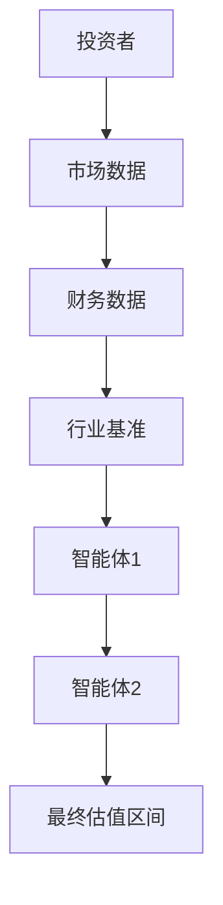
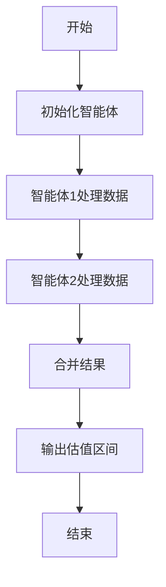
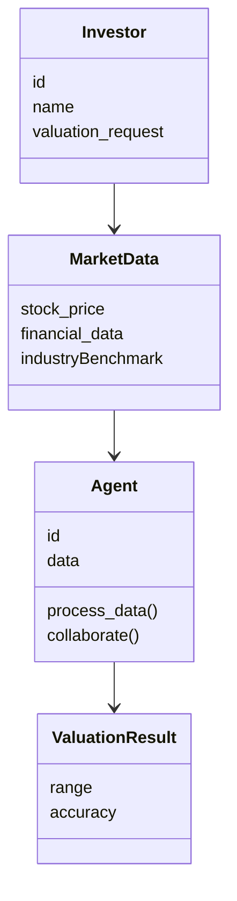
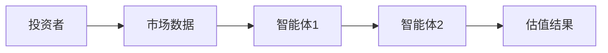
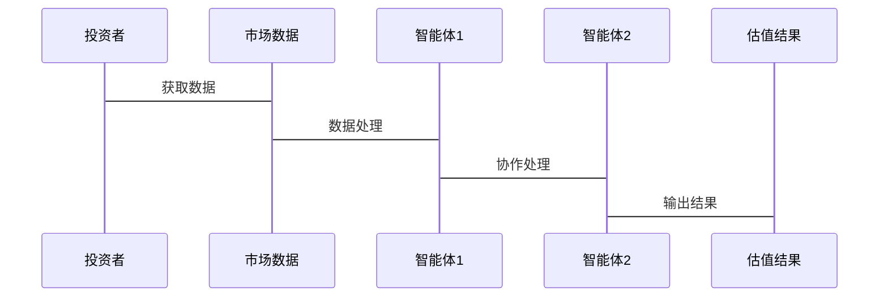

                 


# AI智能体协作：构建更精准的公司估值区间模型

> **关键词**：AI智能体，公司估值，区间模型，协作机制，算法，金融建模

> **摘要**：本文探讨了如何利用AI智能体协作技术构建更精准的公司估值区间模型。通过分析传统估值方法的局限性，提出了基于多智能体协作的创新解决方案。文章详细阐述了AI智能体协作的核心概念、算法原理、系统架构及项目实战，并通过具体案例展示了该模型的实际应用价值。

---

# 第一部分：AI智能体协作与公司估值背景

## 第1章：公司估值问题的背景与挑战

### 1.1 传统公司估值方法的局限性
公司在金融市场中的估值是投资者决策的核心依据之一。传统的估值方法主要包括DCF模型（现金流折现法）、市盈率法、市净率法等。然而，这些方法存在以下局限性：
- 数据依赖性强，难以应对市场波动和不确定性。
- 人工分析为主，效率低下且主观性强。
- 无法实时捕捉市场动态和多维数据。

### 1.2 AI智能体协作的背景
随着人工智能技术的快速发展，AI智能体在金融领域的应用逐渐成为研究热点。AI智能体是一种能够感知环境、执行任务并与其他智能体协作的实体。其核心优势在于：
- **分布式计算**：通过多个智能体协同工作，提高计算效率。
- **多源数据处理**：能够整合市场数据、财务数据、行业基准等多种信息。
- **动态调整**：能够实时适应市场变化，提供更精准的估值结果。

### 1.3 问题的提出与研究意义
传统估值方法的局限性日益凸显，尤其是在数据量激增和市场波动加剧的背景下。本文提出基于AI智能体协作的公司估值区间模型，旨在解决以下问题：
- 如何高效整合多源数据？
- 如何动态调整估值模型以适应市场变化？
- 如何实现多智能体协作以提高估值精度？

通过构建更精准的估值区间模型，本文为投资者提供了更可靠的决策依据，同时也为AI技术在金融领域的应用提供了新的思路。

---

# 第二部分：AI智能体协作的核心概念与联系

## 第2章：AI智能体协作的核心概念

### 2.1 AI智能体的定义与属性
AI智能体是一种能够感知环境、执行任务并与其他智能体协作的实体。其主要属性如下：

| 属性 | 描述 |
|------|------|
| 感知能力 | 能够从环境中获取数据（如市场数据、财务数据等）。 |
| 计算能力 | 能够对数据进行处理和分析，生成决策建议。 |
| 协作能力 | 能够与其他智能体或人类进行交互，共同完成任务。 |
| 自适应能力 | 能够根据环境变化动态调整行为策略。 |

### 2.2 智能体协作的机制与模型
智能体协作机制是实现多智能体协同工作的核心。以下是几种常见的协作模型：

1. **分布式协作**：多个智能体分别负责不同的任务，通过通信模块共享信息。
2. **集中式协作**：所有智能体向一个中心节点汇报数据，由中心节点生成最终结果。
3. **混合式协作**：结合分布式和集中式的特点，部分任务由中心节点处理，部分任务由智能体独立完成。

### 2.3 实体关系图（ER图）与协作流程
以下是AI智能体协作的实体关系图：



---

# 第三部分：AI智能体协作的算法原理

## 第3章：AI智能体协作的核心算法

### 3.1 多智能体协作算法
多智能体协作算法的核心流程如下：



以下是算法实现的Python代码示例：

```python
class Agent:
    def __init__(self, id):
        self.id = id
        self.data = None

    def process_data(self):
        # 数据处理逻辑
        pass

    def collaborate(self, other_agent):
        # 协作逻辑
        pass

# 初始化智能体
agent1 = Agent(1)
agent2 = Agent(2)

# 初始化数据
agent1.data = [1, 2, 3]
agent2.data = [4, 5, 6]

# 处理数据
agent1.process_data()
agent2.process_data()

# 协作
agent1.collaborate(agent2)

# 输出结果
print("Valuation Range:", agent1.data)
```

### 3.2 算法原理的数学模型
以下是多智能体协作算法的数学模型：

$$
\text{Valuation} = \sum_{i=1}^{n} w_i \cdot x_i
$$

其中：
- $w_i$ 是智能体i的权重。
- $x_i$ 是智能体i的输出结果。

---

# 第四部分：系统分析与架构设计方案

## 第4章：系统架构设计

### 4.1 问题场景介绍
本文设计的系统主要用于公司估值，用户包括投资者、数据分析师等。系统需要处理的数据包括市场数据、财务数据、行业基准等。

### 4.2 系统功能设计
以下是系统功能设计的领域模型：



### 4.3 系统架构设计
以下是系统架构设计的mermaid图：



### 4.4 系统接口设计
以下是系统接口设计的mermaid图：



---

# 第五部分：项目实战

## 第5章：项目实战

### 5.1 环境安装
以下是项目所需的环境配置：

```bash
pip install numpy
pip install pandas
pip install matplotlib
pip install scikit-learn
```

### 5.2 核心代码实现
以下是核心代码实现：

```python
import numpy as np
import pandas as pd

class Agent:
    def __init__(self, id):
        self.id = id
        self.data = None

    def process_data(self, data):
        # 数据处理逻辑
        self.data = data
        return self.data

    def collaborate(self, other_agent):
        # 协作逻辑
        merged_data = np.concatenate([self.data, other_agent.data])
        return merged_data

# 初始化智能体
agent1 = Agent(1)
agent2 = Agent(2)

# 初始化数据
data1 = np.array([1, 2, 3])
data2 = np.array([4, 5, 6])

# 数据处理
agent1.process_data(data1)
agent2.process_data(data2)

# 协作处理
result = agent2.collaborate(agent1)
print("协作结果：", result)
```

### 5.3 案例分析与结果解读
以下是案例分析的流程：

1. **数据获取**：从市场数据中获取公司财务数据。
2. **数据处理**：智能体1和智能体2分别处理数据。
3. **协作处理**：智能体协作生成最终估值区间。
4. **结果输出**：输出协作结果并进行解读。

---

# 第六部分：最佳实践与总结

## 第6章：最佳实践

### 6.1 小结
本文提出了基于AI智能体协作的公司估值区间模型，通过多智能体协作算法和系统架构设计，解决了传统估值方法的局限性。

### 6.2 注意事项
- 数据质量和实时性对估值结果影响重大。
- 系统设计时需考虑智能体的协作效率和通信成本。
- 模型需要定期更新以适应市场变化。

### 6.3 拓展阅读
- 《Multi-Agent Systems in Financial Modeling》
- 《Advanced AI Algorithms for Stock Valuation》

---

# 作者：AI天才研究院 & 禅与计算机程序设计艺术

通过本文的详细阐述，我们展示了AI智能体协作在公司估值中的巨大潜力。未来的研究可以进一步探索更复杂的协作机制和算法优化，以实现更精准的估值结果。

