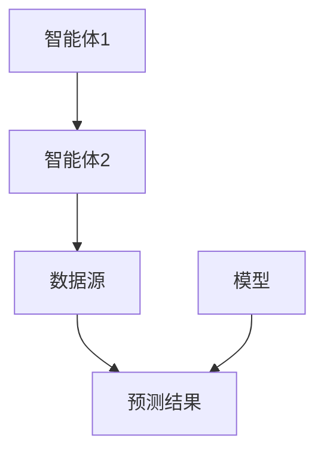
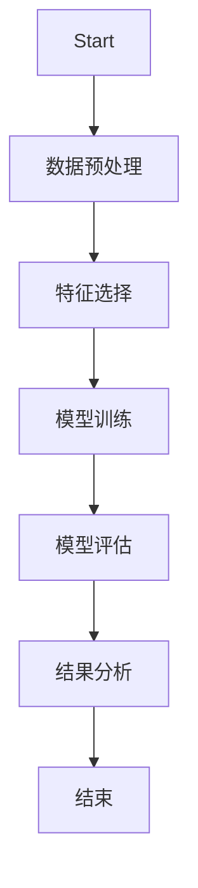
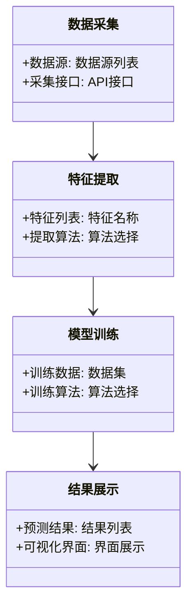
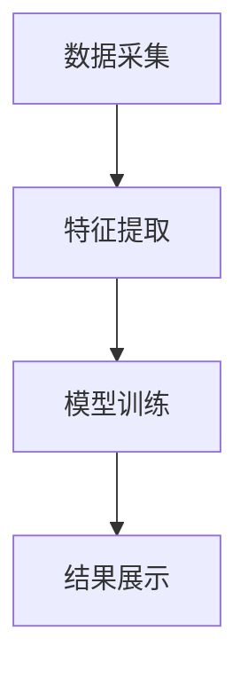
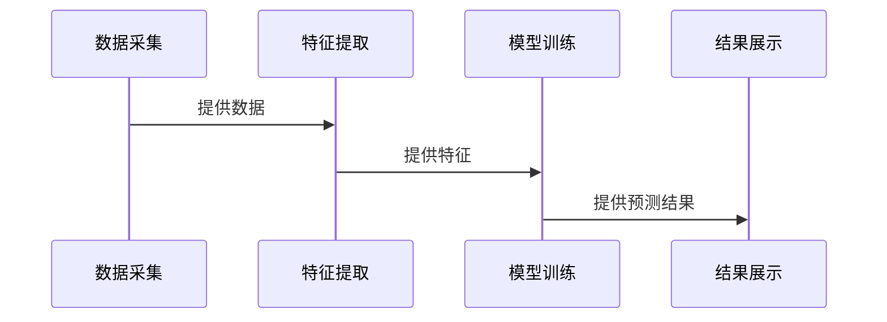

                 


# AI智能体协作：构建更精准的公司破产预测模型

> 关键词：AI智能体协作、公司破产预测、机器学习模型、集成学习、深度学习

> 摘要：本文详细探讨了利用AI智能体协作技术构建更精准的公司破产预测模型的方法。通过分析破产预测的核心问题，结合智能体协作的优势，本文提出了基于集成学习和深度学习的混合算法，并通过系统架构设计和实际案例分析，展示了该模型的高效性和准确性。文章内容涵盖背景介绍、核心概念、算法原理、系统设计、项目实战等多个方面，旨在为数据科学家、金融分析师和IT工程师提供实用的指导和深入的理论支持。

---

## 第一部分：背景介绍

### 第1章：问题背景

#### 1.1 破产预测的重要性
公司破产是企业生命周期中的一个重要转折点，往往带来巨大的经济损失和信用风险。及时准确地预测公司破产，可以帮助投资者、债权人和管理层做出更明智的决策，从而避免或减少潜在损失。破产预测不仅是金融领域的核心问题，也是企业管理中的重要工具。

#### 1.2 当前破产预测的局限性
传统的破产预测方法主要依赖财务指标分析，例如Altman Z-score模型。然而，这些方法存在以下局限性：
- **数据维度有限**：传统方法通常只考虑财务数据，忽略了市场、行业和宏观经济因素。
- **模型泛化能力不足**：单一模型在面对复杂数据时表现欠佳，难以捕捉非线性关系。
- **动态变化难应对**：市场环境和企业状况不断变化，静态模型难以实时更新和适应。

#### 1.3 AI智能体协作的优势
AI智能体协作通过多个智能体的协同工作，能够有效整合多源数据，挖掘复杂模式，并动态调整预测模型。与传统方法相比，AI智能体协作具有以下优势：
- **数据融合能力强**：能够整合财务、市场、行业等多种数据源。
- **模型泛化能力高**：通过集成学习和深度学习，可以显著提升预测精度。
- **动态适应性好**：智能体协作能够实时更新模型，适应市场变化。

### 第2章：问题描述

#### 2.1 破产预测的核心问题
破产预测的核心问题在于如何从多源异构数据中提取有效特征，并构建一个能够准确预测公司破产的模型。这需要解决以下问题：
- **数据预处理**：如何清洗和整合多源数据。
- **特征选择**：如何从大量特征中筛选出最具预测能力的特征。
- **模型选择**：如何选择合适的算法，并优化模型性能。

#### 2.2 数据特征与预测目标
破产预测模型的输入数据通常包括：
- **财务数据**：收入、利润、负债等。
- **市场数据**：股价、成交量、行业趋势等。
- **文本数据**：公司公告、新闻报道等。
预测目标是公司在未来一定时间内是否会破产。

#### 2.3 破产预测的边界与外延
破产预测的边界在于模型的时间窗口和预测精度。外延则包括对公司财务健康状况的实时监控和风险预警。

### 第3章：问题解决

#### 3.1 AI智能体协作的解决方案
通过部署多个智能体，每个智能体负责不同的数据源和任务，最终通过协作机制整合结果，构建更精准的预测模型。

#### 3.2 智能体协作的核心要素
- **任务分配**：智能体根据自身专长分配任务。
- **数据共享**：智能体之间共享数据和特征。
- **结果融合**：将多个智能体的预测结果进行融合，得到最终预测。

#### 3.3 解决方案的可行性分析
AI智能体协作方案的可行性主要体现在数据整合能力强、模型泛化性能好、动态适应性好等方面。通过多个智能体的协作，可以显著提升模型的预测精度。

---

## 第二部分：核心概念与联系

### 第4章：AI智能体协作原理

#### 4.1 智能体协作的定义
智能体协作是指多个智能体通过协同工作，共同完成某个任务的过程。在破产预测中，每个智能体负责不同的数据源和预测任务。

#### 4.2 智能体协作的机制
- **任务分配**：基于智能体的能力分配任务。
- **数据共享**：智能体之间共享数据和特征。
- **结果融合**：将多个智能体的预测结果进行融合，得到最终预测。

#### 4.3 智能体协作的数学模型
智能体协作的数学模型可以表示为：
$$
P_{final} = \sum_{i=1}^{n} w_i P_i
$$
其中，\( P_{final} \) 是最终预测结果，\( w_i \) 是智能体i的权重，\( P_i \) 是智能体i的预测结果。

### 第5章：研究对象分析

#### 5.1 破产预测模型的构成
破产预测模型通常包括数据预处理、特征选择、模型训练和结果评估等部分。

#### 5.2 模型输入与输出
输入：多源异构数据，包括财务、市场和文本数据。
输出：公司破产概率。

#### 5.3 模型的评价指标
常用的评价指标包括准确率、召回率、F1分数和AUC值。

### 第6章：核心概念对比表

#### 6.1 智能体协作与传统算法对比
| 特性         | 智能体协作 | 传统算法   |
|--------------|------------|------------|
| 数据来源     | 多源异构   | 单一数据源 |
| 泛化能力     | 高         | 中等       |
| 动态适应性   | 高         | 低         |

#### 6.2 不同智能体协作机制对比
| 机制         | 分布式协作 | 集中式协作 |
|--------------|------------|------------|
| 优点         | 去中心化   | 结构简单    |
| 缺点         | 效率较低   | 中心化风险 |

#### 6.3 不同破产预测模型对比
| 模型         | 传统逻辑回归 | 集成学习模型 | 深度学习模型 |
|--------------|--------------|--------------|--------------|
| 性能         | 中等         | 高           | 高           |
| 适用场景     | 简单问题     | 复杂问题     | 非线性问题   |

### 第7章：实体关系图



---

## 第三部分：算法原理

### 第8章：算法选择与优化

#### 8.1 集成学习算法
集成学习通过组合多个弱分类器，形成一个强分类器。常用算法包括随机森林和梯度提升树。

#### 8.2 深度学习算法
深度学习通过多层神经网络提取数据特征，常用模型包括LSTM和Transformer。

#### 8.3 算法的优缺点对比
| 特性         | 集成学习 | 深度学习   |
|--------------|----------|------------|
| 优点         | 稳定性高  | 高精度     |
| 缺点         | 计算量大  | 需要大量数据 |

### 第9章：算法流程图



### 第10章：算法实现

#### 10.1 集成学习代码示例
```python
from sklearn.ensemble import RandomForestClassifier
from sklearn.metrics import accuracy_score

# 数据预处理
X_train, y_train = preprocess_data()

# 模型训练
model = RandomForestClassifier(n_estimators=100)
model.fit(X_train, y_train)

# 模型评估
y_pred = model.predict(X_test)
print("Accuracy:", accuracy_score(y_test, y_pred))
```

#### 10.2 算法的数学模型
随机森林的数学模型可以表示为：
$$
P(y|x) = \sum_{i=1}^{n} w_i h_i(x)
$$
其中，\( w_i \) 是树的权重，\( h_i(x) \) 是树的预测函数。

---

## 第四部分：系统分析与架构设计

### 第11章：项目场景介绍

#### 11.1 系统功能设计
系统功能包括数据采集、特征提取、模型训练和结果展示。

#### 11.2 领域模型图


#### 11.3 系统架构图


### 第12章：系统接口设计

#### 12.1 接口设计
系统接口包括数据采集接口、特征提取接口和模型训练接口。

#### 12.2 接口交互序列图


---

## 第五部分：项目实战

### 第13章：环境安装

#### 13.1 安装Python和相关库
安装Python和以下库：
```bash
pip install numpy pandas scikit-learn matplotlib
```

#### 13.2 数据集获取
获取公开的公司破产数据集，例如通过Kaggle或UCI。

### 第14章：系统核心实现

#### 14.1 数据预处理代码
```python
import pandas as pd
import numpy as np

# 读取数据
data = pd.read_csv('company_data.csv')

# 数据清洗
data = data.dropna()
```

#### 14.2 特征选择代码
```python
from sklearn.feature_selection import SelectKBest

selector = SelectKBest(k=10)
selector.fit_transform(data)
```

#### 14.3 模型训练代码
```python
from sklearn.ensemble import RandomForestClassifier
from sklearn.metrics import accuracy_score

model = RandomForestClassifier(n_estimators=100)
model.fit(X_train, y_train)
y_pred = model.predict(X_test)
print("Accuracy:", accuracy_score(y_test, y_pred))
```

### 第15章：案例分析

#### 15.1 数据分析
分析数据分布，提取关键特征，例如财务指标和市场指标。

#### 15.2 模型分析
通过混淆矩阵和ROC曲线分析模型性能。

#### 15.3 结果解读
解释模型预测结果，找出影响公司破产的关键因素。

### 第16章：项目小结

#### 16.1 成功经验
智能体协作显著提升了模型的预测精度，数据融合能力强。

#### 16.2 失败教训
部分数据质量较低，需要进一步清洗和特征工程。

---

## 第六部分：总结

### 第17章：最佳实践

#### 17.1 技巧与经验
- 数据清洗和特征工程是关键。
- 模型融合和调参可以进一步提升性能。
- 实时更新模型以适应市场变化。

#### 17.2 注意事项
- 数据隐私和安全问题需要重视。
- 模型解释性需要关注，便于业务理解。
- 需要定期验证模型性能。

### 第18章：小结

本文详细介绍了利用AI智能体协作构建公司破产预测模型的方法，从背景分析到算法实现，再到系统设计和项目实战，全面覆盖了相关知识。通过智能体协作，可以显著提升模型的预测精度和泛化能力。

### 第19章：注意事项

- 数据质量直接影响模型性能。
- 模型部署需要考虑计算资源和实时性。
- 模型解释性对业务决策至关重要。

### 第20章：拓展阅读

- 集成学习的优化方法。
- 深度学习在时间序列预测中的应用。
- 多智能体协作的最新研究进展。

---

## 作者信息

作者：AI天才研究院/AI Genius Institute & 禅与计算机程序设计艺术/Zen And The Art of Computer Programming

---

以上是《AI智能体协作：构建更精准的公司破产预测模型》的技术博客文章的完整目录和内容框架。文章详细涵盖了从背景介绍到系统设计的各个部分，结合理论分析和实际案例，为读者提供了全面的知识和实用的指导。

