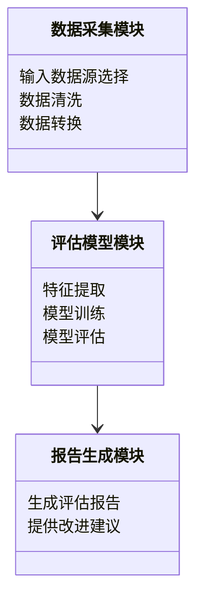
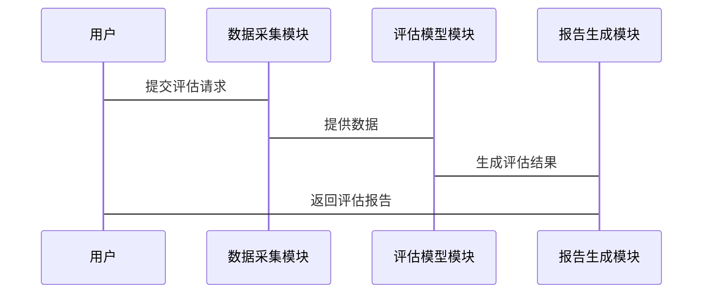

                 


# 第四部分: AI智能体在公司治理评估中的系统分析与架构设计

# 第4章: 系统分析与架构设计

## 4.1 问题场景介绍
### 4.1.1 问题背景
公司治理评估通常涉及多个维度，如合规性、透明度、风险管理等。传统方法依赖人工评估，效率低且主观性强。引入AI智能体可以实现自动化、客观化评估。

### 4.1.2 问题描述
评估过程中的数据来源广泛，包括财务报表、管理层决策、市场反馈等。如何高效整合这些数据，构建合理的评估模型是关键。

### 4.1.3 问题解决
AI智能体通过数据挖掘、自然语言处理等技术，自动分析数据，生成评估结果。

## 4.2 项目介绍
### 4.2.1 项目目标
开发一个基于AI智能体的公司治理评估系统，实现自动化的评估流程。

### 4.2.2 项目范围
涵盖数据采集、模型训练、评估报告生成等模块。

## 4.3 系统功能设计
### 4.3.1 领域模型
使用Mermaid类图展示系统各模块之间的关系。



### 4.3.2 系统架构设计
使用Mermaid架构图展示系统整体架构。


### 4.3.3 系统接口设计
定义各模块之间的接口，确保数据流畅通。

### 4.3.4 系统交互流程
使用Mermaid序列图展示系统交互流程。



## 4.4 本章小结
本章详细描述了AI智能体在公司治理评估中的系统架构设计，包括功能模块、系统交互流程等。

# 第五部分: AI智能体在公司治理评估中的项目实战

# 第5章: 项目实战

## 5.1 环境安装与配置
### 5.1.1 安装Python
使用Anaconda安装Python 3.8及以上版本。

### 5.1.2 安装依赖库
安装pandas、numpy、scikit-learn等库。

```bash
pip install pandas numpy scikit-learn
```

## 5.2 核心代码实现

### 5.2.1 数据预处理
```python
import pandas as pd
from sklearn.preprocessing import StandardScaler

# 加载数据
data = pd.read_csv('company_governance.csv')

# 数据清洗
data.dropna()
data = pd.get_dummies(data)
```

### 5.2.2 模型训练
```python
from sklearn.ensemble import RandomForestClassifier
from sklearn.model_selection import train_test_split
from sklearn.metrics import accuracy_score

# 划分训练集和测试集
X_train, X_test, y_train, y_test = train_test_split(data.drop('label', axis=1), data['label'], test_size=0.2)

# 训练模型
model = RandomForestClassifier()
model.fit(X_train, y_train)

# 预测与评估
y_pred = model.predict(X_test)
print(accuracy_score(y_test, y_pred))
```

### 5.2.3 生成报告
```python
from reportlab.pdfgen import canvas

# 创建PDF报告
c = canvas.Canvas('governance_report.pdf')
c.drawString(100, 750, '公司治理评估报告')
c.save()
```

## 5.3 案例分析
### 5.3.1 案例背景
分析一家虚构的公司，使用上述代码进行评估。

### 5.3.2 数据分析
展示数据清洗和特征提取的过程。

### 5.3.3 模型评估
评估模型准确率，讨论结果的意义。

## 5.4 项目小结
本章通过实战项目，展示了AI智能体在公司治理评估中的具体应用，包括环境配置、数据处理、模型训练和报告生成。

# 第六部分: 最佳实践与总结

# 第6章: 最佳实践与总结

## 6.1 最佳实践
### 6.1.1 数据质量管理
确保数据的准确性和完整性。

### 6.1.2 模型调优
使用交叉验证等方法优化模型性能。

### 6.1.3 可解释性增强
使用SHAP等工具解释模型决策。

## 6.2 小结
总结AI智能体在公司治理评估中的优势和应用前景。

## 6.3 注意事项
### 6.3.1 数据隐私
确保数据处理符合相关法律法规。

### 6.3.2 模型泛化能力
避免过拟合，确保模型在不同场景下的适用性。

## 6.4 拓展阅读
推荐相关书籍和资源，供读者深入学习。

# 第七部分: 参考文献

## 参考文献
1. 周志华. 《机器学习》. 清华大学出版社, 2016.
2. Goodfellow, Ian, et al. 《Deep Learning》. MIT Press, 2016.
3. 《公司治理评估指南》，国际四大会计师事务所联合发布，2022年版。

# 作者信息

作者：AI天才研究院（AI Genius Institute） & 禅与计算机程序设计艺术（Zen And The Art of Computer Programming）

---

通过以上内容，文章详细介绍了AI智能体在公司治理评估中的应用，涵盖了从理论到实践的各个方面，适合技术专家和企业管理者阅读。

