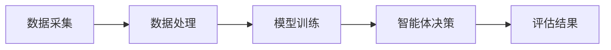

                 


# AI智能体在评估公司无形资产价值中的创新方法

## 关键词：AI智能体，无形资产评估，机器学习，知识图谱，动态评估

## 摘要：本文详细探讨了AI智能体在评估公司无形资产价值中的创新方法。通过分析无形资产评估的传统挑战，结合AI智能体的核心技术，提出了基于机器学习和知识图谱的创新评估模型。文章从背景介绍、核心概念、算法原理、系统架构到项目实战，全面阐述了AI智能体在无形资产评估中的应用场景和实现方法，为读者提供了一套完整的解决方案。

---

## 第1章: 无形资产评估的传统方法与挑战

### 1.1 无形资产评估的基本概念

- **无形资产的定义**：无形资产是指企业拥有或控制的没有实物形态的资产，包括专利权、商标权、客户关系、品牌价值等。
- **无形资产评估的难点**：
  - **动态性**：无形资产的价值会受到市场环境、企业经营状况等多种因素的影响，传统静态评估方法难以捕捉其动态变化。
  - **数据复杂性**：无形资产的评估涉及大量非结构化数据（如文本、图像、音频等），传统方法难以有效处理。
  - **主观性**：无形资产的价值评估往往依赖于评估者的主观判断，缺乏客观依据。

### 1.2 传统评估方法的局限性

- **市场法**：依赖于市场交易数据，但在缺乏交易数据的情况下难以准确评估。
- **收益法**：基于未来现金流折现，但需要假设未来收益，存在较大不确定性。
- **成本法**：基于重置成本，但忽略了无形资产的市场价值和创新性。

### 1.3 AI智能体在无形资产评估中的应用背景

- **技术进步的推动**：AI技术的快速发展为无形资产评估提供了新的工具和方法。
- **数据驱动的决策需求**：企业越来越依赖数据驱动的决策，AI智能体能够帮助企业在海量数据中提取有价值的信息。
- **动态评估的必要性**：AI智能体可以通过实时数据分析，提供动态的无形资产评估结果。

---

## 第2章: AI智能体的基本概念与技术特点

### 2.1 AI智能体的定义与类型

- **定义**：AI智能体是一种能够感知环境、自主决策并执行任务的智能系统。
- **类型**：
  - **基于规则的AI智能体**：通过预定义的规则进行决策。
  - **基于学习的AI智能体**：通过机器学习算法从数据中学习决策策略。
  - **混合型AI智能体**：结合规则和学习的混合策略。

### 2.2 AI智能体的核心技术

- **机器学习**：用于智能体的学习和决策能力。
- **自然语言处理**：用于处理和理解非结构化文本数据。
- **数据挖掘与分析**：用于从海量数据中提取有价值的信息。
- **知识图谱构建**：用于构建领域知识库，支持智能体的决策。

### 2.3 AI智能体在无形资产评估中的应用

- **数据驱动的评估模型**：利用AI智能体分析大量数据，构建动态评估模型。
- **智能体辅助的资产评估流程**：AI智能体可以辅助完成数据采集、特征提取、模型训练等环节。
- **AI智能体在无形资产定价中的应用**：通过智能体分析市场趋势和企业情况，提供精准的无形资产定价建议。

---

## 第3章: AI智能体的核心概念与原理

### 3.1 AI智能体的决策机制

- **基于规则的决策**：通过预定义的规则进行决策，适用于简单场景。
- **基于学习的决策**：通过机器学习算法从数据中学习决策策略，适用于复杂场景。
- **多智能体协作**：多个智能体协作完成复杂任务，提升整体决策能力。

### 3.2 AI智能体的评估模型

- **模型的构建与训练**：通过机器学习算法训练评估模型，提取特征并进行预测。
- **模型的可解释性与透明度**：评估模型的可解释性是用户信任的重要因素。
- **模型的鲁棒性与稳定性**：模型需要具备良好的鲁棒性，能够适应不同的数据分布。

### 3.3 AI智能体的算法原理

- **强化学习算法**：通过与环境交互，智能体通过奖励机制学习最优策略。
- **监督学习算法**：通过标注数据训练模型，预测目标变量。
- **半监督学习算法**：结合标注数据和非标注数据，提高模型的泛化能力。

---

## 第4章: AI智能体在无形资产评估中的创新方法

### 4.1 数据驱动的评估模型

- **数据的采集与处理**：通过多种渠道采集数据，进行清洗和预处理。
- **数据的特征提取与分析**：利用自然语言处理和数据挖掘技术提取特征。
- **数据的建模与预测**：通过机器学习算法构建评估模型，预测无形资产价值。

### 4.2 知识图谱构建与应用

- **知识图谱的构建方法**：通过数据抽取、实体识别、关系抽取等步骤构建知识图谱。
- **知识图谱在资产评估中的应用**：利用知识图谱分析资产之间的关联性，提升评估精度。
- **知识图谱的动态更新与维护**：定期更新知识图谱，保持其准确性和时效性。

### 4.3 AI智能体与无形资产评估的实体关系分析

- **实体关系图的构建**：通过分析无形资产、企业、市场等实体之间的关系，构建实体关系图。
- **实体关系图的动态更新**：根据市场变化和企业经营状况，动态更新实体关系图。
- **实体关系图的应用**：利用实体关系图分析资产价值的变化趋势，支持决策。

---

## 第5章: AI智能体在无形资产评估中的系统架构

### 5.1 系统功能设计

- **数据采集模块**：负责采集企业数据，包括财务数据、市场数据、文本数据等。
- **数据处理模块**：对采集的数据进行清洗、转换和预处理。
- **模型训练模块**：利用机器学习算法训练评估模型，提取特征并进行预测。
- **智能体决策模块**：基于模型输出和环境反馈，智能体进行决策并输出评估结果。

### 5.2 系统架构设计



### 5.3 系统接口设计

- **输入接口**：接收企业数据和市场数据。
- **输出接口**：输出评估结果和决策建议。

### 5.4 系统交互序列图

```mermaid
sequenceDiagram
    participant 用户
    participant 系统
    participant 智能体
    用户->系统: 提供企业数据
    系统->智能体: 请求评估
    智能体->系统: 返回评估结果
    用户<-系统: 显示评估结果
```

---

## 第6章: 项目实战

### 6.1 环境安装

```bash
pip install numpy pandas scikit-learn spacy transformers
```

### 6.2 核心代码实现

```python
import numpy as np
from sklearn.model_selection import train_test_split
from sklearn.linear_model import LinearRegression
from sklearn.metrics import mean_squared_error

# 示例数据集
X = np.array([[1], [2], [3], [4], [5]])
y = np.array([2, 4, 6, 8, 10])

# 数据分割
X_train, X_test, y_train, y_test = train_test_split(X, y, test_size=0.2)

# 模型训练
model = LinearRegression()
model.fit(X_train, y_train)

# 模型预测
y_pred = model.predict(X_test)

# 模型评估
mse = mean_squared_error(y_test, y_pred)
print("均方误差:", mse)
```

### 6.3 实际案例分析

- **案例背景**：某科技公司拥有多项专利和技术，需要评估其无形资产价值。
- **数据采集**：收集专利数量、研发投入、市场占有率等数据。
- **模型训练**：利用机器学习算法训练评估模型，预测无形资产价值。
- **结果分析**：通过模型输出结果，评估公司无形资产的实际价值。

### 6.4 项目小结

- **经验总结**：AI智能体在无形资产评估中的应用能够显著提高评估效率和准确性。
- **注意事项**：数据质量、模型选择和结果解释是应用中的关键问题。
- **优化方向**：进一步优化模型性能，提升评估结果的可解释性。

---

## 第7章: 最佳实践与总结

### 7.1 小结

- AI智能体在无形资产评估中的应用前景广阔，能够有效解决传统方法的局限性。
- 通过数据驱动和知识图谱构建，AI智能体能够提供动态、精准的评估结果。

### 7.2 注意事项

- 数据质量和完整性是评估结果准确性的关键。
- 模型选择和调优需要结合实际应用场景。
- 结果解释和透明度是用户信任的重要因素。

### 7.3 拓展阅读

- 《机器学习实战》
- 《知识图谱：概念、方法与应用》
- 《AI与企业价值评估》

---

## 作者：AI天才研究院 & 禅与计算机程序设计艺术

---

以上是《AI智能体在评估公司无形资产价值中的创新方法》的完整目录结构和文章内容。通过系统的分析和具体的案例，文章详细阐述了AI智能体在无形资产评估中的创新方法和应用，为读者提供了一套完整的解决方案。

