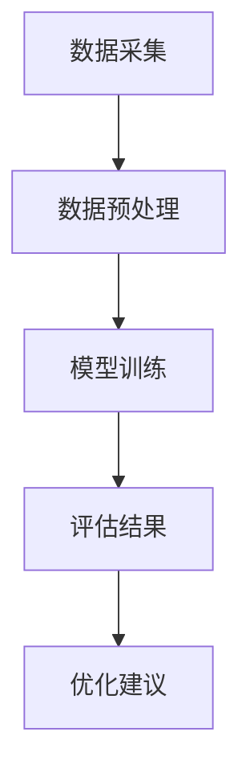
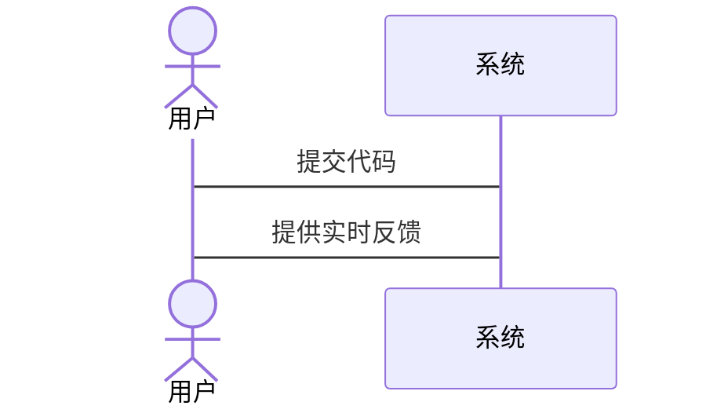

                 


# AI智能体在评估公司研发效率中的作用

> 关键词：AI智能体，研发效率，机器学习，自然语言处理，数据挖掘

> 摘要：本文探讨了AI智能体在评估公司研发效率中的作用，分析了其核心概念、算法原理、系统架构，并通过实际案例展示了其应用价值。文章详细阐述了AI智能体如何通过数据驱动的方法优化研发流程，提高效率，并提出了未来的发展方向。

---

## 第1章: AI智能体与研发效率评估的背景

### 1.1 问题背景与描述

#### 1.1.1 研发效率评估的定义与重要性
研发效率是指在一定时间内完成的研发任务量或质量的度量。它通常涉及代码提交频率、缺陷率、项目进度等指标。在现代企业中，研发效率是衡量技术团队能力的重要标准，直接影响企业的市场竞争力和创新能力。

#### 1.1.2 当前研发效率评估的痛点与挑战
传统的研发效率评估方法依赖于人工统计和经验判断，存在以下问题：
- 数据分散：研发数据分布在不同的工具和系统中，难以整合。
- 主观性高：评估结果受评估者的主观影响，缺乏客观性。
- 实时性差：评估结果滞后，无法实时指导研发过程。

#### 1.1.3 AI智能体在研发效率评估中的作用
AI智能体可以通过自动化数据收集、分析和反馈，提供实时、客观的研发效率评估。它能够识别潜在问题，预测项目风险，并提出改进建议，从而优化研发流程。

### 1.2 AI智能体的核心概念

#### 1.2.1 AI智能体的基本定义
AI智能体是一种能够感知环境、做出决策并采取行动的智能系统。它利用机器学习、自然语言处理等技术，从数据中学习并优化其行为。

#### 1.2.2 AI智能体的关键特征
- **自主性**：能够在没有人工干预的情况下运行。
- **反应性**：能够实时感知环境变化并做出反应。
- **学习能力**：能够通过数据不断优化其模型和决策。

#### 1.2.3 AI智能体与传统评估方法的对比
AI智能体相比传统评估方法，具有以下优势：
- **自动化**：能够自动收集和分析数据，减少人工干预。
- **实时性**：能够实时监控研发过程，提供即时反馈。
- **准确性**：利用机器学习模型，提高评估结果的准确性。

### 1.3 本章小结
本章介绍了AI智能体在研发效率评估中的背景，分析了传统评估方法的痛点，并探讨了AI智能体的核心概念和优势。

---

## 第2章: AI智能体的技术基础

### 2.1 AI智能体的关键技术

#### 2.1.1 机器学习基础
机器学习是AI智能体的核心技术之一。它通过训练模型从数据中学习规律，从而实现预测和分类。

##### 2.1.1.1 监督学习
监督学习是机器学习的一种常见方法，通过标签数据训练模型。例如，使用线性回归模型预测研发周期：
$$ y = \beta_0 + \beta_1x + \epsilon $$

##### 2.1.1.2 无监督学习
无监督学习用于发现数据中的隐藏模式。例如，使用聚类算法将研发项目分为不同类别。

#### 2.1.2 自然语言处理（NLP）技术
NLP技术用于处理文本数据，例如从团队聊天记录中提取情感倾向，判断团队士气。

#### 2.1.3 数据挖掘与分析
数据挖掘技术用于从大量数据中提取有用信息。例如，使用关联规则挖掘发现代码提交与缺陷之间的关系。

### 2.2 研发效率评估的关键指标

#### 2.2.1 研发周期与资源利用率
研发周期是指从需求提出到交付的时间。资源利用率是指研发过程中使用的资源与实际需求的匹配程度。

#### 2.2.2 缺陷率与修复效率
缺陷率是单位时间内发现的缺陷数量。修复效率是修复缺陷所需的时间。

#### 2.2.3 代码质量与团队生产力
代码质量包括代码复杂度、可维护性等指标。团队生产力是指团队在单位时间内完成的工作量。

### 2.3 AI智能体在研发效率评估中的应用边界

#### 2.3.1 应用场景的界定
AI智能体适用于数据驱动的场景，例如代码提交频率、缺陷预测等。

#### 2.3.2 应用范围的限制
AI智能体无法完全替代人类判断，尤其是在复杂决策中。

#### 2.3.3 外延与扩展的可能性
AI智能体可以通过集成其他技术（如区块链）进一步扩展其应用。

### 2.4 本章小结
本章介绍了AI智能体的关键技术，分析了研发效率评估的关键指标，并探讨了AI智能体的应用边界。

---

## 第3章: AI智能体的核心概念与联系

### 3.1 核心概念的原理

#### 3.1.1 AI智能体的感知与决策机制
AI智能体会通过传感器或数据源感知环境，并基于感知的信息做出决策。例如，使用监督学习模型预测项目进度。

#### 3.1.2 数据驱动的评估模型
数据驱动的评估模型通过大量数据训练，能够准确预测研发效率。例如，使用决策树模型分类项目状态。

#### 3.1.3 智能体的自适应能力
智能体能够根据环境变化自适应调整其行为。例如，动态调整模型参数以应对数据分布的变化。

### 3.2 核心概念的属性特征对比

| 特性       | 传统评估方法 | AI智能体评估方法 |
|------------|---------------|------------------|
| 数据来源   | 单一数据源    | 多数据源         |
| 处理方式   | 人工分析       | 自动化分析        |
| 反应时间   | 滞后          | 实时             |
| 准确性     | 低            | 高               |

### 3.3 ER实体关系图架构

```mermaid
erDiagram
    actor 评估者 {
        code_id INT
        project_id INT
        time_stamp TIMESTAMP
    }
    entity 项目 {
        project_id INT
        start_time DATETIME
        end_time DATETIME
        status VARCHAR
    }
    entity 缺陷 {
        defect_id INT
        project_id INT
        severity INT
        resolved_time DATETIME
    }
    entity 资源 {
        resource_id INT
        type VARCHAR
        usage INT
    }
    relationship 评估者 -> 项目 : 评估
    relationship 评估者 -> 缺陷 : 监测
    relationship 评估者 -> 资源 : 调度
```

---

## 第4章: AI智能体的算法原理

### 4.1 监督学习算法

#### 4.1.1 线性回归
线性回归用于预测连续型变量，例如研发周期。

$$ y = \beta_0 + \beta_1x + \epsilon $$

#### 4.1.2 决策树
决策树用于分类问题，例如项目状态分类。

### 4.2 强化学习算法

#### 4.2.1 Q-Learning
Q-Learning是一种经典的强化学习算法，适用于离线学习。

$$ Q(s, a) = r + \gamma \max Q(s', a') $$

### 4.3 无监督学习算法

#### 4.3.1 K-Means聚类
K-Means聚类用于将项目分为不同的类别。

---

## 第5章: 系统架构设计

### 5.1 问题场景介绍
我们设计了一个AI智能体系统，用于实时监控研发过程并提供优化建议。

### 5.2 系统功能设计

#### 5.2.1 数据采集模块
数据采集模块负责收集研发数据，例如代码提交记录、缺陷报告等。

### 5.2.2 系统架构图



### 5.3 系统交互设计



---

## 第6章: 项目实战

### 6.1 环境安装
需要安装以下工具：
- Python 3.8+
- Scikit-learn
- Pandas

### 6.2 核心代码实现

#### 6.2.1 数据预处理
```python
import pandas as pd
data = pd.read_csv('研发数据.csv')
```

#### 6.2.2 模型训练
```python
from sklearn.tree import DecisionTreeClassifier
model = DecisionTreeClassifier()
model.fit(X_train, y_train)
```

#### 6.2.3 结果可视化
```python
import matplotlib.pyplot as plt
plt.scatter(X_test, y_test, c='r')
plt.scatter(X_test, model.predict(X_test), c='b')
plt.show()
```

### 6.3 案例分析
通过实际项目案例，展示AI智能体如何优化研发效率。

### 6.4 项目小结
总结项目实现过程中的经验教训，并提出改进建议。

---

## 第7章: 总结与展望

### 7.1 总结
本文详细探讨了AI智能体在评估公司研发效率中的作用，分析了其核心概念、算法原理和系统架构，并通过实际案例展示了其应用价值。

### 7.2 未来展望
未来，AI智能体将更加智能化，可能结合边缘计算和区块链技术，进一步提升研发效率评估的准确性和实时性。

---

## 作者信息

作者：AI天才研究院 & 禅与计算机程序设计艺术

