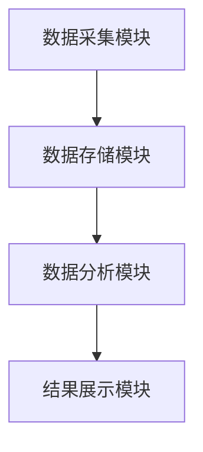

                 


# AI智能体在评估公司管理层决策质量中的应用

## 关键词：AI智能体、决策质量、数据分析、人工智能、管理层决策

## 摘要：本文探讨了AI智能体在评估公司管理层决策质量中的应用。通过分析决策过程中的关键因素，结合数据驱动的方法，本文详细阐述了如何利用AI技术优化决策评估流程。从算法原理到系统架构设计，再到实际案例分析，本文为读者提供了全面的视角，展示了AI智能体在提升企业管理决策质量中的巨大潜力。

---

## 第1章: AI智能体与公司管理层决策质量概述

### 1.1 AI智能体的定义与核心概念

#### 1.1.1 AI智能体的基本定义
AI智能体（Artificial Intelligence Agent）是指具备感知环境、理解问题、自主决策并执行任务的智能系统。在企业决策场景中，AI智能体能够通过分析数据、识别模式和提供决策建议，辅助管理层做出更明智的选择。

#### 1.1.2 AI智能体的核心特征
- **自主性**：AI智能体能够独立执行任务，无需人工干预。
- **反应性**：能够实时感知环境变化并做出响应。
- **学习能力**：通过机器学习算法不断优化决策模型。
- **协作性**：能够与其他系统或人员协同工作，提供决策支持。

#### 1.1.3 AI智能体与传统决策支持系统的区别
| 特性                | AI智能体                        | 传统决策支持系统                  |
|---------------------|---------------------------------|------------------------------------|
| 数据处理能力        | 强大，支持复杂数据分析          | 较弱，依赖人工输入和处理          |
| 自适应能力          | 高，能够根据反馈调整决策策略    | 低，决策模型固定，难以动态调整    |
| 决策速度            | 快，能够在短时间内处理大量数据  | 较慢，依赖人工分析和判断          |
| 可扩展性            | 高，能够适应不同规模的企业需求  | 低，难以快速扩展和适应变化        |

### 1.2 公司管理层决策质量评估的背景

#### 1.2.1 企业决策质量的重要性
企业决策的质量直接关系到企业的生存和发展。一个高质量的决策能够有效降低风险，提高企业效率和竞争力。然而，传统决策评估方法往往依赖于主观判断和经验，存在较大的不确定性。

#### 1.2.2 传统决策评估方法的局限性
- **主观性**：决策评估结果往往受到评估者主观因素的影响。
- **数据利用率低**：传统方法难以充分利用企业内部的海量数据。
- **效率低下**：手工评估过程耗时长，难以满足现代企业的快速决策需求。

#### 1.2.3 AI智能体在决策评估中的优势
- **数据驱动**：AI智能体能够利用企业内外部数据，提供客观、全面的评估结果。
- **高效性**：通过自动化处理和机器学习算法，AI智能体能够快速生成评估报告。
- **动态调整**：AI智能体能够根据市场变化和企业内部数据实时调整评估模型。

### 1.3 AI智能体在公司管理中的应用场景

#### 1.3.1 企业战略决策支持
AI智能体可以通过分析市场趋势、竞争对手数据和内部资源，为企业的战略决策提供支持。

#### 1.3.2 运营决策优化
在日常运营中，AI智能体可以优化资源配置、预测需求和提高效率，帮助管理层做出更优化的决策。

#### 1.3.3 风险评估与管理
AI智能体能够实时监控企业风险因素，评估潜在风险，并提供应对策略，帮助管理层降低风险损失。

---

## 第2章: AI智能体的算法原理与实现

### 2.1 AI智能体的核心算法

#### 2.1.1 机器学习算法
AI智能体的核心算法包括监督学习、无监督学习和强化学习等。

##### 监督学习
- **定义**：通过已标注的数据训练模型，预测新的数据标签。
- **应用**：用于分类和回归问题，如预测销售额或客户 churn。
- **数学模型**：线性回归模型可以用以下公式表示：
  $$ y = \beta_0 + \beta_1 x + \epsilon $$
  其中，$y$ 是目标变量，$x$ 是自变量，$\beta_0$ 和 $\beta_1$ 是模型参数，$\epsilon$ 是误差项。

##### 无监督学习
- **定义**：通过未标注的数据发现数据中的潜在结构。
- **应用**：用于聚类分析，如客户分群或异常检测。
- **数学模型**：K-means聚类算法的目标是最小化以下损失函数：
  $$ \sum_{i=1}^k \sum_{j=1}^n (y_{ij})^2 $$
  其中，$k$ 是聚类数，$n$ 是数据点数，$y_{ij}$ 是第 i 个聚类中心与第 j 个数据点的距离。

##### 强化学习
- **定义**：通过试错法学习策略，最大化累积奖励。
- **应用**：用于动态决策问题，如游戏AI或机器人控制。
- **数学模型**：Q-learning算法的目标是找到最优策略，使得以下方程成立：
  $$ Q(s, a) = r + \gamma \max_{a'} Q(s', a') $$
  其中，$s$ 是当前状态，$a$ 是当前动作，$r$ 是奖励，$\gamma$ 是折扣因子，$s'$ 是下一个状态。

#### 2.1.2 自然语言处理（NLP）
AI智能体可以通过NLP技术分析文本数据，提取有用信息。例如，使用BERT模型对管理层的会议记录进行情感分析，识别决策中的潜在问题。

---

## 第3章: AI智能体的系统架构与设计

### 3.1 系统功能设计

#### 3.1.1 数据采集模块
- **功能**：从企业内部系统（如ERP、CRM）和外部数据源（如新闻、社交媒体）获取数据。
- **工具**：使用Python的Pandas库进行数据清洗和预处理。

#### 3.1.2 数据分析模块
- **功能**：利用机器学习算法对数据进行分析，生成评估结果。
- **工具**：使用Scikit-learn库进行模型训练和预测。

#### 3.1.3 可视化模块
- **功能**：将评估结果以图表形式展示，帮助管理层直观理解。
- **工具**：使用Matplotlib或Tableau进行数据可视化。

### 3.2 系统架构设计

#### 3.2.1 系统模块划分
- **数据采集模块**：负责数据的收集和预处理。
- **数据分析模块**：负责数据的分析和模型训练。
- **结果展示模块**：负责评估结果的可视化和报告生成。

#### 3.2.2 系统架构图


#### 3.2.3 接口设计
- **输入接口**：接收原始数据和用户输入。
- **输出接口**：生成评估报告和决策建议。

---

## 第4章: AI智能体在企业管理中的应用案例

### 4.1 案例背景
某跨国公司希望利用AI智能体评估其销售部门的决策质量。通过分析销售数据和市场趋势，AI智能体能够帮助公司识别潜在问题并优化销售策略。

### 4.2 数据准备与模型训练
#### 4.2.1 数据采集
从ERP系统中获取过去三年的销售数据，包括销售额、客户数量、销售区域等。

#### 4.2.2 数据清洗
使用Pandas库对数据进行清洗，处理缺失值和异常值：
```python
import pandas as pd
data = pd.read_csv('sales.csv')
data = data.dropna()
data = data[data['销售额'] > 0]
```

#### 4.2.3 模型训练
使用随机森林算法对数据进行分类，预测销售额的高低：
```python
from sklearn.ensemble import RandomForestClassifier
model = RandomForestClassifier(n_estimators=100)
model.fit(X_train, y_train)
```

### 4.3 结果分析
通过混淆矩阵和ROC曲线评估模型的性能，最终得出销售部门的决策质量评估结果。

---

## 第5章: 总结与展望

### 5.1 总结
AI智能体在评估公司管理层决策质量中具有巨大潜力。通过数据驱动的方法和先进的机器学习算法，AI智能体能够帮助企业做出更明智的决策，提高企业的竞争力。

### 5.2 展望
随着AI技术的不断发展，未来AI智能体在企业管理中的应用将更加广泛和深入。例如，通过结合区块链技术和物联网数据，AI智能体能够实现更实时、更精准的决策支持。

---

## 作者：AI天才研究院（AI Genius Institute） & 禅与计算机程序设计艺术（Zen And The Art of Computer Programming）

---

**注**：以上内容为示例，实际写作时需要根据具体情况进行补充和调整。

