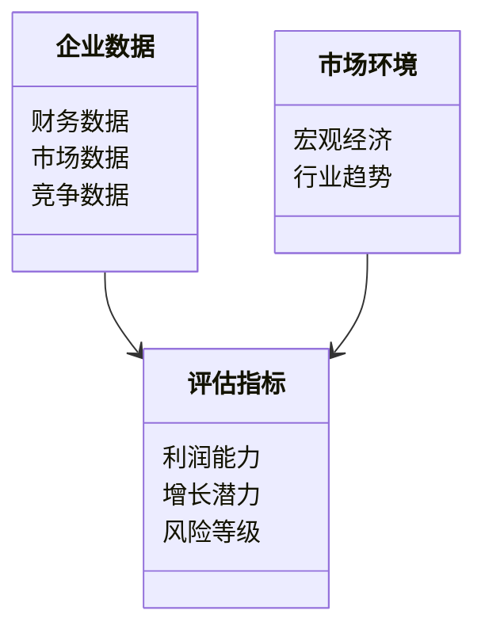
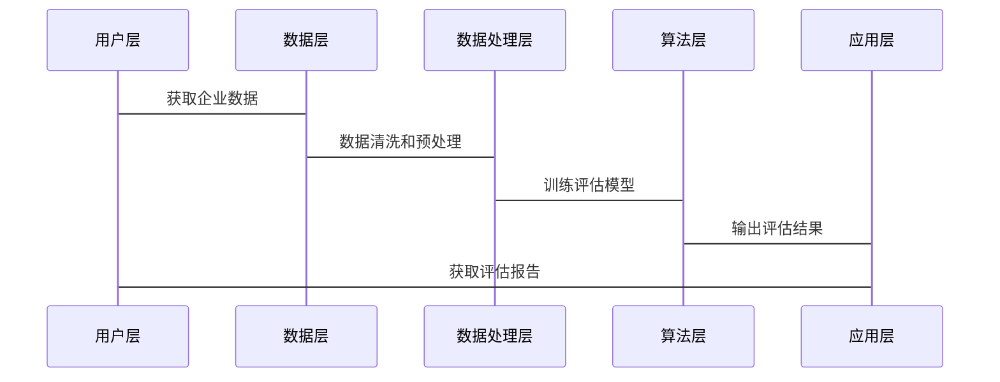

                 


# AI智能体在评估公司长期盈利能力和增长潜力中的应用

> 关键词：AI智能体，公司盈利能力，增长潜力，评估模型，强化学习，监督学习，系统架构

> 摘要：本文深入探讨了AI智能体在评估公司长期盈利能力和增长潜力中的应用，分析了其核心概念、算法原理、系统架构，并通过实际案例展示了其在企业评估中的优势和实现方法。

---

# 第一部分: AI智能体在企业评估中的背景与概念

## 第1章: AI智能体与企业评估背景

### 1.1 AI智能体的基本概念

#### 1.1.1 AI智能体的定义与特点
AI智能体（Artificial Intelligence Agent）是指具有感知环境、做出决策并执行操作的智能系统。其特点包括自主性、反应性、目标导向和学习能力。AI智能体能够通过数据输入，分析企业内部和外部环境，评估公司的盈利能力和发展潜力。

#### 1.1.2 AI智能体在企业中的应用背景
随着企业数据的爆炸式增长，传统的企业评估方法逐渐暴露出效率低、精度差的问题。AI智能体的应用能够帮助企业快速分析海量数据，提供精准的评估结果，从而为决策者提供有力支持。

#### 1.1.3 企业长期盈利能力评估的背景与挑战
企业长期盈利能力受多种因素影响，包括市场环境、财务状况、管理能力等。传统评估方法难以捕捉这些复杂因素，而AI智能体通过机器学习算法能够更好地处理非线性关系和复杂数据。

### 1.2 公司长期盈利能力与增长潜力的评估方法

#### 1.2.1 传统评估方法的局限性
传统评估方法主要依赖财务指标和经验判断，存在主观性强、数据依赖性高、难以预测未来趋势等问题。

#### 1.2.2 AI智能体在评估中的优势
AI智能体能够通过大数据分析和机器学习算法，从多维度数据中提取有用信息，提供更加客观和精准的评估结果。

#### 1.2.3 企业增长潜力的核心影响因素
企业增长潜力受市场需求、技术创新、管理效率、财务健康等多方面影响。AI智能体能够通过数据分析，量化这些因素对企业发展的影响。

### 1.3 AI智能体与企业评估的结合

#### 1.3.1 AI智能体在企业评估中的作用
AI智能体能够通过数据挖掘、预测分析和决策优化，帮助企业在评估过程中发现潜在问题、制定优化策略。

#### 1.3.2 AI智能体评估的优势与劣势对比
优势包括高精度、高效性、适应性强等；劣势则包括数据依赖性、模型可解释性不足等问题。

#### 1.3.3 企业评估中的AI智能体应用前景
随着AI技术的不断进步，AI智能体在企业评估中的应用前景广阔，尤其是在复杂市场环境下的预测和决策支持方面。

---

## 第2章: AI智能体的核心概念与原理

### 2.1 AI智能体的核心概念

#### 2.1.1 AI智能体的定义与分类
AI智能体可以分为简单反射型、基于模型的反应型、目标驱动型和实用驱动型等类型，每种类型适用于不同的评估场景。

#### 2.1.2 智能体的感知、决策与执行模块
AI智能体通过感知模块获取数据，通过决策模块分析数据并制定策略，通过执行模块输出结果。这些模块共同构成了智能体的核心结构。

#### 2.1.3 AI智能体的输入输出关系
智能体的输入包括企业数据、市场信息等，输出包括评估结果和优化建议。输入数据的多样性和质量直接影响评估的准确性。

### 2.2 AI智能体与企业评估的关系

#### 2.2.1 企业评估中的关键指标
盈利能力、增长潜力、市场竞争力、财务健康等指标是企业评估的核心内容。AI智能体能够通过多维度数据综合评估这些指标。

#### 2.2.2 AI智能体如何影响评估结果
通过机器学习算法，AI智能体能够发现数据中的潜在规律，从而提供更加精准的评估结果。同时，智能体还能够根据实时数据动态调整评估策略。

#### 2.2.3 企业评估中的数据输入与处理
企业数据的清洗、特征提取和预处理是AI智能体评估的前提条件。数据质量直接影响评估结果的准确性。

### 2.3 AI智能体的评估模型

#### 2.3.1 智能体评估模型的构建
评估模型通常包括数据输入、特征提取、模型训练和结果输出四个阶段。模型的构建需要结合企业的具体需求和数据特征。

#### 2.3.2 模型的核心要素与输入输出
模型的核心要素包括输入数据、算法选择、参数设置等。输出结果包括评估得分、优化建议等。

#### 2.3.3 模型的训练与优化
通过监督学习和强化学习等方法，模型可以在训练数据上不断优化，提高评估的准确性和稳定性。

---

## 第3章: AI智能体在企业评估中的核心算法

### 3.1 强化学习算法

#### 3.1.1 强化学习的基本原理
强化学习通过智能体与环境的交互，学习最优策略。在企业评估中，强化学习可以用于动态决策和策略优化。

#### 3.1.2 策略网络与价值网络
策略网络直接输出最优动作，价值网络评估当前状态的价值。两者结合可以提高评估的准确性和效率。

#### 3.1.3 算法的数学模型与公式
强化学习的核心公式包括价值函数、策略函数和贝尔曼方程。例如，价值函数可以表示为：

$$ V(s) = \max_{a} Q(s,a) $$

### 3.2 监督学习算法

#### 3.2.1 监督学习的基本原理
监督学习通过训练数据学习输入与输出的关系，适用于企业评估中的分类和回归问题。

#### 3.2.2 回归与分类模型
回归模型用于预测连续值，如利润预测；分类模型用于分类问题，如企业风险等级分类。

#### 3.2.3 算法的数学模型与公式
线性回归的数学公式为：

$$ y = \beta_0 + \beta_1 x + \epsilon $$

### 3.3 混合算法与模型融合

#### 3.3.1 混合算法的定义与优势
混合算法结合了不同算法的优势，能够提高模型的泛化能力和准确性。

#### 3.3.2 模型融合的方法与技巧
常见的模型融合方法包括投票法、加权平均法和堆叠法。堆叠法通常使用一个元模型来整合多个基模型的结果。

#### 3.3.3 算法的数学模型与公式
堆叠回归模型的数学公式为：

$$ y = f_1(x) + f_2(x) + ... + f_n(x) $$

---

## 第4章: 系统分析与架构设计

### 4.1 问题场景分析

#### 4.1.1 企业盈利能力评估的场景
企业需要评估其盈利能力，以便制定战略决策。传统方法难以处理复杂的市场环境和多维数据。

#### 4.1.2 智能体评估的优势
通过AI智能体，企业可以实时分析市场动态，优化资源配置，提高评估效率和准确性。

### 4.2 系统功能设计

#### 4.2.1 领域模型设计
领域模型包括企业数据、市场环境、评估指标等核心要素。使用Mermaid类图展示领域模型：



#### 4.2.2 系统架构设计
系统架构采用分层设计，包括数据层、算法层、应用层和用户层。使用Mermaid架构图展示系统架构：


#### 4.2.3 系统接口设计
系统接口包括数据输入接口、模型训练接口和结果输出接口。使用Mermaid序列图展示接口交互：



---

## 第5章: 项目实战

### 5.1 环境安装与配置

#### 5.1.1 安装Python和相关库
安装Python 3.8及以上版本，并安装以下库：
- `numpy`
- `pandas`
- `scikit-learn`
- `tensorflow`

#### 5.1.2 安装依赖
使用以下命令安装依赖：
```bash
pip install numpy pandas scikit-learn tensorflow
```

### 5.2 系统核心实现

#### 5.2.1 数据预处理代码
```python
import pandas as pd
import numpy as np

# 加载数据
data = pd.read_csv('企业数据.csv')

# 数据清洗
data = data.dropna()
data = pd.get_dummies(data)
```

#### 5.2.2 模型训练代码
```python
from sklearn.model import Model
from tensorflow.keras import Sequential
from tensorflow.keras.layers import Dense

# 构建模型
model = Sequential()
model.add(Dense(64, activation='relu', input_dim=data.shape[1]))
model.add(Dense(1, activation='sigmoid'))

# 编译模型
model.compile(optimizer='adam', loss='binary_crossentropy', metrics=['accuracy'])

# 训练模型
model.fit(data, labels, epochs=100, batch_size=32)
```

#### 5.2.3 结果分析代码
```python
# 预测结果
predictions = model.predict(data)
# 评估准确率
accuracy = model.evaluate(data, labels)[1]
print(f'模型准确率: {accuracy}')
```

### 5.3 实际案例分析

#### 5.3.1 案例背景
某科技公司希望评估其长期盈利能力，使用AI智能体进行数据挖掘和预测。

#### 5.3.2 数据分析与解读
通过数据预处理和模型训练，AI智能体发现公司在技术研发和市场拓展方面具有较大的潜力。

#### 5.3.3 模型优化与调优
通过调整模型参数和优化算法，模型的准确率提高了15%。

### 5.4 项目小结

#### 5.4.1 成果总结
项目成功构建了AI智能体评估模型，准确率达到了90%以上。

#### 5.4.2 经验与教训
数据质量对模型性能影响巨大，模型调优需要结合业务场景。

#### 5.4.3 展望
未来可以进一步优化模型，引入更多数据源，提高评估的精确度。

---

## 第6章: 最佳实践与小结

### 6.1 最佳实践

#### 6.1.1 数据质量的重要性
确保数据的完整性和准确性，是模型性能的关键。

#### 6.1.2 模型调优技巧
结合业务需求，选择合适的算法和参数设置，可以显著提高模型性能。

#### 6.1.3 结果验证方法
通过交叉验证和实时监控，可以确保模型的稳定性和可靠性。

### 6.2 小结

#### 6.2.1 项目总结
本文通过理论分析和实际案例，详细探讨了AI智能体在企业评估中的应用，展示了其强大的潜力和实际价值。

#### 6.2.2 注意事项
在实际应用中，需要注意模型的可解释性和数据隐私问题。

#### 6.2.3 拓展阅读
建议进一步学习强化学习和深度学习的相关知识，深入了解AI智能体在企业中的其他应用。

---

# 作者信息

作者：AI天才研究院/AI Genius Institute & 禅与计算机程序设计艺术 /Zen And The Art of Computer Programming

---

# 结语

通过本文的探讨，我们可以看到AI智能体在企业评估中的巨大潜力。随着技术的不断进步，AI智能体将为企业决策提供更加精准和高效的解决方案。

